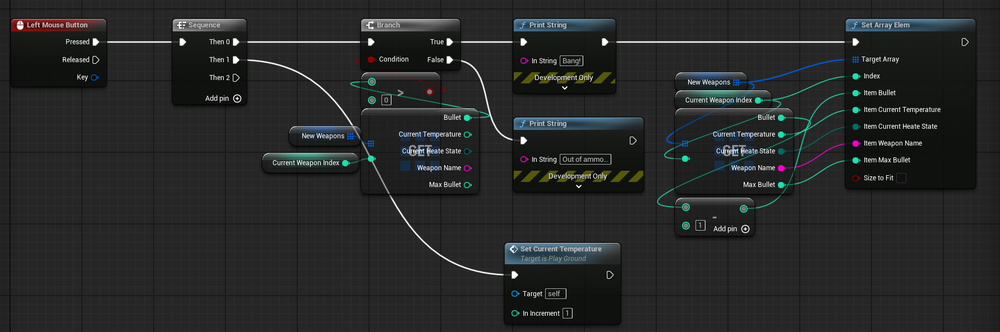
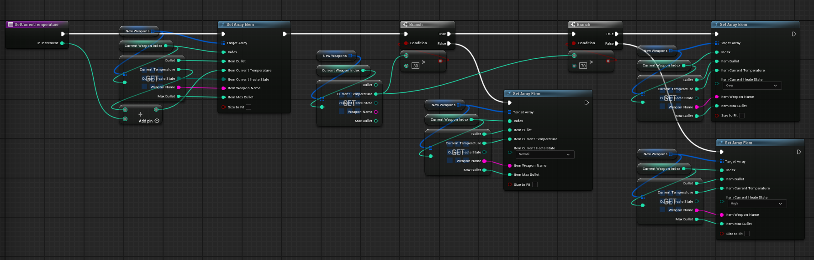
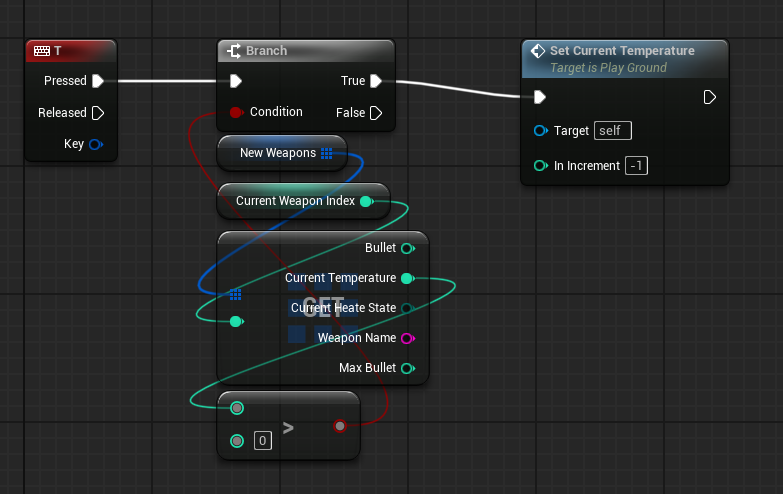
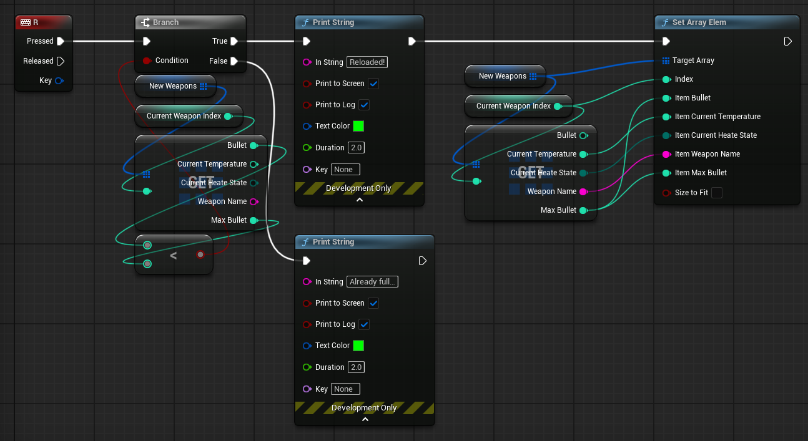
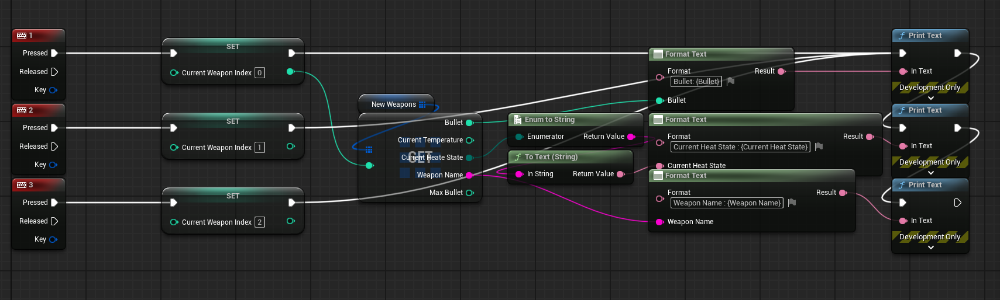

# 📅 2026-02-25 TIL

## 1. 오늘 학습 요약

* **학습 목표**: 강의를 통한 **블루프린트** 학습 및 실습, 공식 문서의 [1인칭 어드벤처 게임 코딩하기](https://dev.epicgames.com/documentation/ko-kr/unreal-engine/code-a-firstperson-adventure-game-in-unreal-engine)의 [아이템 및 데이터 관리](https://dev.epicgames.com/documentation/ko-kr/unreal-engine/coder-05-manage-item-and-data-in-an-unreal-engine-game), [리스폰 픽업 아이템 생성하기](https://dev.epicgames.com/documentation/ko-kr/unreal-engine/coder-06-create-a-respawning-pickup-item-in-unreal-engine) 실습
* **학습 도구**: `Unreal Engine 5.5.4`, `Unreal Engine 5.7.3`
* **활동 내용**: 블루프린트를 활용한 **스크립팅** 방식의 개발 학습 및 실습, 
**데이터 기반 게임플레이**의 데이터 처리 방식 학습, 
픽업 아이템 생성 및 리스폰 로직 구현

---

## 2. 블루프린트 실습

### C++과 유사한 블루프린트 기능
* **Get, Set:** 변수 참조 및 할당
* **연산 노드:** 산술 연산, 비교 연산, 논리 연산을 노드로 실행
* **Array:** 동일한 타입의 여러개의 데이터 관리
* **Switch:** 특정 값에 따라 실행 흐름을 여러 갈래로 분기
* **While, For, ForEach:** 반복 작업 수행
* **Enum, Struct:** 데이터를 사용자가 정의해서 사용

### Branch와 Sequence

* **Branch:** Condition 매개변수가 True냐 False냐에 따라
실행 흐름을 나눌 수 있는 노드. if-else 조건문과 동일
* **Sequence:** 실행 흐름을 순차적으로 실행시켜주는 노드. 길게 늘어진 노드들을 정리할 수 있음

### 텍스트 슈팅 게임

실습 내용을 바탕으로 간단한 텍스트 슈팅게임을 구현하는 과제를 진행함.
발사, 온도, 냉각, 장전, 과열, 무기 교체의 기능을 구현함

<details>
  <summary>발사</summary>

  

</details>

<details>
  <summary>온도 및 상태 관리</summary>



</details>

<details>
  <summary>냉각</summary>



</details>

<details>
  <summary>장전</summary>



</details>

<details>
  <summary>무기 교체</summary>



</details>

---

## 3. 아이템 및 데이터 관리

해당 튜토리얼 에서는 **데이터 기반 게임플레이(Data-Driven Gameplay)** 설계 방식으로 데이터를 관리하며 전체적인 데이터 흐름은 아래의 다이어그램과 같음


| 구성 요소 | 핵심 특징 |
| --- | --- |
| **ItemData Struct**  | 아이템이 가져야할 속성을 정의하는 C++ 구조체 |
| **Data Table** | 구조체에서 정의한 형식에 맞춰 아이템의 데이터를 저장하는 테이블 |
| **Item Definition** (`UDataAsset`) | 에디터에서 아이템 데이터를 사용할 수 있도록 저장하는 클래스 |
| **Data Asset Instance** | 프로젝트에 사용되는 실제 데이터 에셋 |

---

## 4. 리스폰 픽업 아이템 생성

### 테이블 데이터 가져오기
* 프로퍼티를 통해 에디터로부터 아이템의 ID를 받아 테이블의 데이터를 가져옴
* 데이터가 유효하면 `TObjectPtr<UItemDefinition> ReferenceItem`에 저장

### Mesh Component 추가
* 아이템에 Mesh를 추가하기 위해 `UStaticMeshComponent`를 추가
* `ReferenceItem`의 `WorldMesh`를 할당
### Collision Shape 추가
* 충돌 처리를 위한 `USphereComponent`를 추가
* 추가한 구체 컴포넌트에 Mesh를 부착

### Collision 구현
* 충돌 처리를 위하여 아래 함수를 추가하였으며, 해당 함수는 캐릭터와 아이템의 충돌이 발생하면 아이템의 `Mesh`와 `SphereComponent`를 비활성화한 후 일정 시간이 지난 후 재활성화 하는 타이머를 실행함

    ```cpp
    void OnSphereBeginOverlap(UPrimitiveComponent* OverlappedComponent, AActor* OtherActor, UPrimitiveComponent* OtherComp, int32 OtherBodyIndex, bool bFromSweep, const FHitResult& SweepResult)
    ```

* `SphereComponent`의 `OnComponentBeginOverlap` 델리게이트에 이벤트를 등록하여 충돌이 발생할경우 이 함수를 실행함

    ```cpp
    SphereComponent->OnComponentBeginOverlap.AddDynamic(this, &APickupBase::OnSphereBeginOverlap);
    ```

### 픽업 아이템 리스폰 과정 중 트러블슈팅
* **현상:** 충돌이 발생한 후 픽업 아이템이 비활성화되자마자 설정한 지연시간을 무시하고 바로 재생성되는 문제가 발생
* **원인:** 공식 문서에서 리스폰을 위해 `SetTimer()` 함수를 사용하였고 `SetTimer()` 함수의 파라미터는 아래의 표와 같음

    ```cpp
    SetTimer(InOutHandle, Object, InFuncName, InRate, bLoop, InFirstDelay);
    ```

    | 매개변수 | 설명 |
    | --- |  --- | 
    | **`InOutHandle`** |  타이머를 제어하는 **핸들** | 
    | **`InObj`** | 호출할 함수를 소유한 **객체** | 
    | **`InTimerMethod`** | **호출할 함수**의 포인터 |
    | **`InRate`** | 함수 호출 **대기 시간(초)** | 
    | **`bLoop`** | **반복 여부** 설정 | 
    | **`InFirstDelay`** | 초기 실행 **딜레이** |

    공식 문서의 예제에서는 `InFirstDelay`를 `0`으로 설정하여 충돌이 발생할 경우 타이머를 실행하고 `InRate`의 값에 관계 없이 즉시 리스폰을 실행함

* **해결:** `InFirstDelay`의 Argument를 제거해 처음 실행에서도 `InRate` 값을 사용하도록 수정

---

## 5. 내일 할일
* 캐릭터에게 아이템 장착
* 발사체 구현하기
