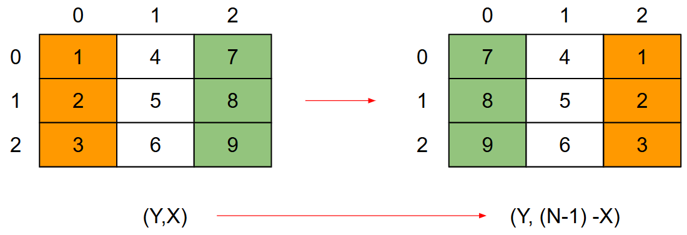
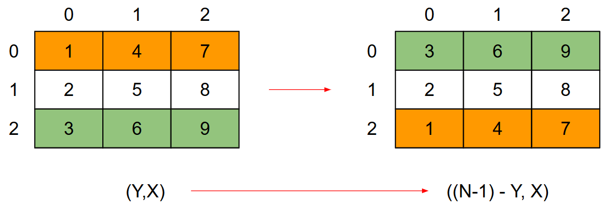
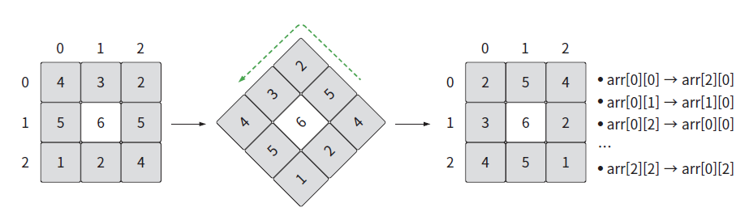

# 📅 2026-03-16 TIL

## 1. 오늘 학습 요약

* **학습 목표**: 
  * **코딩테스트** 문제 풀이
  * **C++ 코딩테스트 완전 정복** 챕터 3 수강
  * 공식문서의 **[퍼즐 어드벤처 게임을 위한 아트 패스](https://dev.epicgames.com/documentation/ko-kr/unreal-engine/art-pass-for-a-puzzle-adventure-game)** 실습

* **학습 도구**: `Unreal Engine 5.7.3`, `Visual Studio 2022`

* **활동 내용**: 
  * 프로그래머스 [행렬 테두리 회전하기](https://school.programmers.co.kr/learn/courses/30/lessons/77485), [최적의 행렬 곱셈](https://school.programmers.co.kr/learn/courses/30/lessons/12942), [다단계 칫솔 판매](https://school.programmers.co.kr/learn/courses/30/lessons/77486) 문제 풀이
  * C++ 코딩테스트 완전 정복 수강을 통한 시뮬레이션, 스택 학습
  * 공식 문서의 [머티리얼 및 머티리얼 인스턴스 생성](https://dev.epicgames.com/documentation/ko-kr/unreal-engine/artist-03-create-materials-and-material-instances) 실습

---
## 2. 프로그래머스 문제 풀이

### [행렬 테두리 회전하기](https://school.programmers.co.kr/learn/courses/30/lessons/77485)
```cpp
#include <string>
#include <vector>

using namespace std;

vector<int> solution(int rows, int columns, vector<vector<int>> queries) {
    vector<int> answer;
    vector<vector<int>> matrix(rows, vector<int>(columns, 0));
    
    // 행렬 생성
    for(int i=0; i<rows; i++){
        for(int j=0; j<columns; j++){
            matrix[i][j] = columns * i + j + 1;
        }
    }
     
   for(const vector<int>& querie : queries){
        int y1 = querie[0]-1, x1 = querie[1]-1;
        int y2 = querie[2]-1, x2 = querie[3]-1;
        
        int start = matrix[y1][x1]; // 시작점
        int min = start;            // 최솟값
        
        // 좌측 변, 위로
        for(int i=y1; i<y2; i++) {
            matrix[i][x1] = matrix[i+1][x1];
            min = min < matrix[i][x1] ? min : matrix[i][x1];
        }
        
        // 하단 변, 왼쪽으로
        for(int i=x1; i<x2; i++) {
            matrix[y2][i] = matrix[y2][i+1];
            min = min < matrix[y2][i] ? min : matrix[y2][i];
        }
        
        // 우측 변, 아래로
        for(int i=y2; i>y1; i--) {
            matrix[i][x2] = matrix[i-1][x2];
            min = min < matrix[i][x2] ? min : matrix[i][x2];
        }
        
        // 상단 변, 오른쪽으로
        for(int i=x2; i>x1; i--) {
            matrix[y1][i] = matrix[y1][i-1];
            min = min < matrix[y1][i] ? min : matrix[y1][i];
        }
        
        matrix[y1][x1+1] = start;   // 시작점의 값을 시작점 오른쪽에 저장
        
        answer.push_back(min);      // 회전 후 최솟값을 저장
    }
    
    return answer;
}
```

* 특별한 알고리즘이나 간단히 해결할 방법이 있는지 오래 고민해 봤지만 특별히 떠오르지 않음
* 단순히 네 방향의 수를 옮기면서 최솟값을 저장하게 구현하여 해결

---

### [최적의 행렬 곱셈](https://school.programmers.co.kr/learn/courses/30/lessons/12942)
```cpp
#include <string>
#include <vector>
#include <climits>

using namespace std;

int dp[200][200] = {0,};    // start 부터 end 까지의 연산 횟수

int dfs(const vector<vector<int>>& matrix_sizes, const int& start, const int& end){
    if(dp[start][end] != 0) return dp[start][end];  // 이미 연산결과가 있으면 리턴
    if(start == end) return 0;                      // 행렬이 하나밖에 없으면 연산 X
    int min = INT_MAX;

    // i를 기준으로 행렬을 두 개로 나눔
    for(int i=start; i<end; i++){
        int count = 0;
        
        // 왼쪽 행렬, 오른쪽 행렬을 만드는데 필요한 연산 횟수
        count += dfs(matrix_sizes, start, i) + dfs(matrix_sizes, i+1, end);
        
        // 두 행렬을 곱하는데 필요한 연산 횟수
        count += matrix_sizes[start][0] * matrix_sizes[i][1] * matrix_sizes[end][1];
        
        min = min < count ? min : count;    // 최솟값 저장
    }
    
    dp[start][end] = min;   // dp에 최솟값 저장
    return min;
}

int solution(vector<vector<int>> matrix_sizes) {
    int answer = 0;
    answer = dfs(matrix_sizes, 0, matrix_sizes.size()-1);
    return answer;
}
```

* DFS와 DP를 같이 활용하는 문제
* 처음에는 DFS만 사용했다가 당연하게도 시간초과가 났고 이후 DP를 추가하여 연산을 줄임

---

### [다단계 칫솔 판매](https://school.programmers.co.kr/learn/courses/30/lessons/77486)
```cpp
#include <string>
#include <vector>
#include <unordered_map>

using namespace std;

vector<int> solution(vector<string> enroll, vector<string> referral, vector<string> seller, vector<int> amount) {
    vector<int> answer(enroll.size(), 0);
    unordered_map<string, string> parents;    // 각 노드의 부모 저장
    unordered_map<string, int> sum;           // 각 노드의 수익

    // 부모 및 수익 초기화
    for(int i=0; i<enroll.size(); i++){
        parents[enroll[i]] = referral[i];
        sum[enroll[i]] = 0;
    }
    
    for(int i=0; i<seller.size(); i++){
        sum[seller[i]] += amount[i] * 90;   // 판매한 노드가 벌은 수익
        string parent = parents[seller[i]]; // 판매한 노드의 부모
        
        int money = amount[i] * 10;         // 판매한 노드가 분배할 수익
        
        while(parent != "-" && money > 0){
            sum[parent] += money - money / 10;  // 부모 노드에 분배
            money /= 10;                        // 분배한 금액 재분배
            parent = parents[parent];           // 다음 부모 지정
        }
    }
    
    for(int i=0; i<enroll.size(); i++){
        answer[i] = sum[enroll[i]];
    }
    
    return answer;
}
```

* 그림을 보고 트리를 구현해야 하나 했지만, 탑-다운이 아닌 바텀-업 방식이기에 필요 없다고 생각
* 각자의 부모 노드를 맵으로 저장하고 부모에게 분배하게 구현

---

## 3. 행렬 연산

### 좌우 대칭
* `배열 크기가 N이라면,  특정 원소의 X좌표는 (N - 1) - X`

    

### 상하 대칭
* `배열 크기가 N이라면,  특정 원소의 Y좌표는 (N - 1) - Y`

    

### 90도 회전
* `기존 좌표가 (Y, X)이고 배열의 크기가 N이라면 회전 후에는 ((N - 1) - X, Y)`
    
    

## 4. 비트셋(bitset)
* **고정된 크기**의 비트열을 관리하기 위해 STL에서 지원하는 클래스
* 평상시 비트 연산이 필요한 문제를 풀 때는 `vector<bool>`, `char`로 풀었었는데 이에 비해 장점이 많다고 생각됨 

### 특징
* `&`, `|`, `^`, `<<`, `>>` 등 비트 연산 사용 가능
* **가장 오른쪽 비트**가 `0`의 인덱스를 가짐
* 1비트당 1비트의 공간만 사용
* 고정된 크기만 할당이 가능하기에, 가변 크기가 필요하면 `vector<bool>`, `boost::dynamic_bitset`을 활용

### 주요 멤버 함수
| 함수 | 설명 |
| --- |--- |
| **`set()`**  | 모든 비트를 **1**로 설정 |
| **`set(pos)`**  | `pos` 위치의 비트를 **1**로 설정 |
| **`reset()`** | 모든 비트를 **0**으로 설정 |
| **`reset(pos)`**| `pos` 위치의 비트를 **0**으로 설정 |
| **`flip()`**  | 모든 비트를 반전 (0→1, 1→0) |
| **`flip(pos)`** | `pos` 위치의 비트를 반전|
| **`test(pos)`** |  `pos` 위치의 비트가 1이면 `true`, 0이면 `false`를 반환 (범위 검사 포함) |
| **`all()`** | **모든** 비트가 1이면 `true`를 반환 |
| **`any()`** | **하나라도** 1인 비트가 있으면 `true`를 반환 |
| **`none()`** | **모든** 비트가 0이면 `true`를 반환 |
| **`count()`** |  값이 **1인 비트의 총 개수**를 반환 |
| **`size()`** | 비트셋의 **전체 크기**(비트 수)를 반환 |
| **`to_ulong()`** | 비트셋을 `unsigned long`으로 변환 |
| **`to_ullong()`** | 비트셋을 `unsigned long long`으로 변환|
| **`to_string()`**  | 비트셋을 `string`으로 변환|

### 예제 코드
```cpp
#include <iostream>
#include <bitset>
#include <string>

using namespace std;

int main() {
    bitset<8> b("00001100");

    cout << b << endl; // Output: 00001100

    b.set(0);          // 0번 비트를 1로 (00001101)
    b.set(7, 1);       // 7번 비트를 1로 (10001101)
    b.reset(2);        // 2번 비트를 0으로 (10001001)

    cout << b << " / count: " << b.count() << endl; // Output: 10001001 / count: 3

    b.flip();                                       // 전체 반전 (01110110)
    cout << "flip: " << b << endl;                  // Output: flip: 01110110

    b.reset();                                      // 전체 초기화 (00000000)
    if (b.none()) {
        cout << "b.none() is true" << endl;         // Output: b.none() is true
    }

    return 0;
}
```
---

## 5. Material Node

* 제작한 레벨에 마테리얼을 생성하여 적용
* **부모 마테리얼** 생성 후 **파라미터화**를 통해 외부에서 실시간으로 수정할 수 있게 구현
* 머티리얼 인스턴스에서 노출된 파라미터를 수정하여 **개별 오브젝트**의 속성을 수정함
* Material Node는 **HLSL(High-Level Shading Language)** 코드로 변환 되어 실행됨
* 머티리얼 에디터의 **Details(디테일)** 패널 설정에 따라 각 파라미터의 활성화 여부, 역할이 변경됨

 파라미터명 | 데이터 타입 | 설명 |
| --- | --- | --- |
| **Base Color** | Float3 (RGB) | 물체 고유의 색상 |
| **Metallic** | Float (0~1) | 금속성 여부, 보통 0(비금속) 또는 1(금속)로 설정 |
| **Specular** | Float (0~1) | 비금속의 반사율 조정 (기본값 0.5) |
| **Roughness** | Float (0~1) | 표면의 거친 정도, 0은 매끄러움, 1은 아주 거침 |
| **Anisotropy** | Float (-1~1) | 방향성에 따른 반사 왜곡 효과 |
| **Emissive Color** | Float3 (RGB) | 물체가 스스로 내뿜는 빛의 색과 강도 |
| **Opacity** | Float (0~1) | 투명도 |
| **Opacity Mask** | Float (0~1) | 투명도 마스크 |
| **Normal** | Float3 (Vector) | 표면의 미세한 굴곡을 표현해 입체감을 줌 |
| **Tangent** | Float3 (Vector) | 노멀과 수직인 축, 주로 Anisotropy의 방향 결정 |
| **Ambient Occlusion** | Float (0~1) | 구석진 곳의 미세 음영 처리 |
| **World Position Offset** | Float3 (Offset) | 정점(Vertex) 월드 위치 변형 |
| **Displacement** | Float/Vector | 실제 메시 변형을 통한 물리적 돌출 및 지형 표현 |
| **Pixel Depth Offset** | Float | 픽셀의 깊이 값을 조절해 물체 간 경계 블렌딩 |
| **Subsurface Color** | Float3 (RGB) | 투과되는 빛의 내부 색 |
| **Surface Thickness** | Float | 빛이 물체를 통과하는 두께 조절 |
| **Refraction** | Float (IOR) | 투명체의 빛 굴절률 |
| **Front Material** | Substrate 데이터 | 병합된 여러 레이어 중 표면 레이어 데이터 |

---

## 6. 내일 할 일
* 코딩테스트 문제 풀이
* C++ 코딩테스트 완전 정복 챕터 3 수강
* 공식문서의 [퍼즐 어드벤처 게임을 위한 아트 패스](https://dev.epicgames.com/documentation/ko-kr/unreal-engine/art-pass-for-a-puzzle-adventure-game) 실습을 통한 에디터 학습