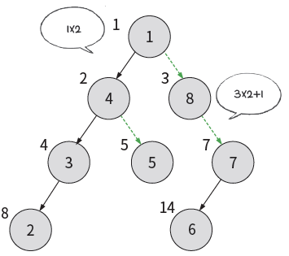
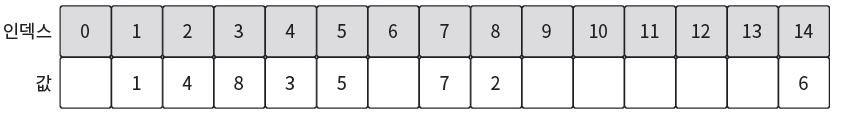
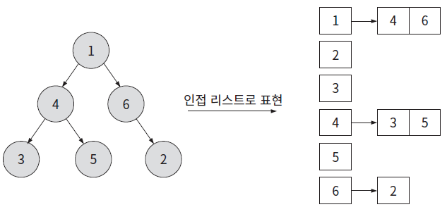

# 📅 2026-03-17 TIL

## 1. 오늘 학습 요약

* **학습 목표**: 
  * **코딩테스트** 문제 풀이
  * **C++ 코딩테스트 완전 정복** 챕터 3 수강
  * 공식문서의 **[퍼즐 어드벤처 게임을 위한 아트 패스](https://dev.epicgames.com/documentation/ko-kr/unreal-engine/art-pass-for-a-puzzle-adventure-game)** 실습

* **학습 도구**: `Unreal Engine 5.7.3`, `Visual Studio 2022`

* **활동 내용**: 
  * 프로그래머스 **[무인도 여행](https://school.programmers.co.kr/learn/courses/30/lessons/154540)**, **[숫자 게임](https://school.programmers.co.kr/learn/courses/30/lessons/12987)**, **[바이러스 파이프](https://school.programmers.co.kr/learn/courses/30/lessons/468373)** 문제 풀이
  * C++ 코딩테스트 완전 정복 수강을 통한 **큐**, **트리**, **그래프**, **백트래킹** 학습
  * 공식 문서의 **[확장된 머티리얼 인스턴스](https://dev.epicgames.com/documentation/ko-kr/unreal-engine/artist-04-expanded-material-instances)**,  **[포스트 프로세스 볼륨 추가](https://dev.epicgames.com/documentation/ko-kr/unreal-engine/add-post-process-volumes)** 실습

---
## 2. 프로그래머스 문제 풀이

### [무인도 여행](https://school.programmers.co.kr/learn/courses/30/lessons/154540)
```cpp
#include <string>
#include <vector>
#include <queue>
#include <algorithm>

using namespace std;

vector<int> solution(vector<string> maps) {
    vector<int> answer;
    vector<vector<int>> island(maps.size(), vector<int>(maps[0].length()));
    
    // 지도를 배열로 변경
    for(int i=0; i<maps.size(); i++){
        for(int j=0; j<maps[i].length(); j++){
            if(maps[i][j] != 'X'){
                island[i][j] += maps[i][j] - '0';
            } 
        }
    }
    
    queue<pair<int, int>> q;
    int dx[4] = {-1, 1, 0, 0};
    int dy[4] = {0, 0, -1, 1};
    
    // 모든 땅에 대해서 BFS
    for(int i=0; i<island.size(); i++){
        for(int j=0; j<island[i].size(); j++){
            if(!island[i][j]) continue; // 이미 방문한 땅이면 넘어감
            int food = 0;
            q.push({i, j});
            food += island[i][j];
            island[i][j] = 0;
            
            while(!q.empty()){
                pair<int, int> current = q.front();
                q.pop();
                
                for(int k=0; k<4; k++){
                    int x = current.first + dx[k];
                    int y = current.second + dy[k];
                    
                    if(x>=0 && x<island.size() && y>=0 && y<island[i].size() && island[x][y]){
                        q.push({x, y});
                        food += island[x][y];
                        island[x][y] = 0;
                    }
                }
            }
            
            if(food > 0)
                answer.push_back(food);
        }
    }
    
    sort(answer.begin(), answer.end());             // 오름차순 정렬
    if(answer.size() == 0) answer.push_back(-1);    // 섬이 없으면 -1 추가
    
    return answer;
}
```

* 모든 땅에서 **BFS**를 실행한 후 각 결과를 **answer**에 넣어서 해결
* 방문한 모든 땅에서 BFS를 실행하면 연산횟수도 많아지며, 결과 또한 중복으로 들어감 
* 따라서 **방문한 땅은 0**으로 변경하여 중복 연산이 실행되지 않게 구현
---

### [숫자 게임](https://school.programmers.co.kr/learn/courses/30/lessons/12987)
```cpp
#include <string>
#include <vector>
#include <algorithm>

using namespace std;

int solution(vector<int> A, vector<int> B) {
    int answer = 0;
    
    // 투포인터 비교를 위해 오름차순 정렬
    sort(A.begin(), A.end());
    sort(B.begin(), B.end());
    
    int cur = 0;                // 현재 B의 위치
    for(const int& a : A){      
        while(cur < B.size()){
            if(B[cur] > a){     // B가 A를 이길 수 있는 최솟값
                answer++;       // 승점 증가
                cur++;          
                break;
            }
            cur++;
        }
    }
    return answer;
}
```

* 최대 승점을 얻기 위해서는 A를 이기는 수 중 **가장 낮은 수**를 사용해야 함
* A, B를 오름차순으로 정렬한 후 **투 포인터**로 비교
* 레벨 3치고는 너무 간단하게 풀리는 듯

---

### [바이러스 파이프](https://school.programmers.co.kr/learn/courses/30/lessons/468373)
```cpp
#include <string>
#include <vector>
#include <set>
#include <queue>

using namespace std;

// 감염되는 배양체를 백트래킹으로 추적
int Backtracking(const set<int>& infections, const vector<vector<pair<int, int>>>& graph, const int& k){
    int max = 0;
    if(k==0) return infections.size(); // 더 이상 감염시킬 횟수가 안되면 현재 감염된 배양체의 갯수를 반환
    
    // A, B, C 파이프 각각 실행
    for(int i=1; i<=3; i++){
        set<int> newInfections = infections;
        queue<int> q;
            
        // 현재 감염된 배양체들이 감염시키는 배양체
        for(const auto& infection : infections){
            for(const pair<int, int>& edge : graph[infection]){
                if(edge.first == i) {
                    q.push(edge.second);
                    newInfections.insert(edge.second);
                } 
            }
        }
        
        // 감염된 배양체들이 추가로 감염시키는 배양체
        while(!q.empty()){
            int infection = q.front();
            q.pop();
            
            for(const pair<int, int>& edge : graph[infection]){
                if(edge.first == i && newInfections.find(edge.second) == newInfections.end()) {
                    q.push(edge.second);
                    newInfections.insert(edge.second);
                } 
            }
        }
        
        // 새롭게 감염된 배양체들로 백트래킹 실행
        int result = Backtracking(newInfections, graph, k-1);
        if(result > max) max = result;   
    }
    
    return max;
}
    
int solution(int n, int infection, vector<vector<int>> edges, int k) {
    int answer = 0;
    vector<vector<pair<int, int>>> graph(n);    // 그래프
    set<int> infections;                        // 감염된 배양체 셋
    infections.insert(infection-1);             // 처음에 감염된 배양체를 추가
    
    // 그래프 생성 graph[배양체] = {파이프 종류, 이어진 배양체}
    for(const vector<int>& edge : edges){
        graph[edge[0]-1].push_back({edge[2], edge[1]-1});
        graph[edge[1]-1].push_back({edge[2], edge[0]-1});
    }
    
    answer = Backtracking(infections, graph, k);
    
    return answer;
}
```

* **백트래킹**과 **BFS**를 이용한 탐색문제
* 문제 구현 자체는 어렵지 않았지만 문제 조건을 제대로 읽지 않아 파이프를 한번 열었을 때 여러 노드가 연쇄로 감염된다는 것을 알아차리지 못해 오래 걸림


---

## 3. 트리(Tree)
* 일반적으로 코딩테스트 문제를 해결할 때 트리를 구현하면 주로 **인접 리스트** 방식으로 구현함
* 배열로 구현하는 방식은 완전히 잊고 있었고, **배열**이 더 유리한 문제가 분명히 있기에 두 방식을 비교해 봄

### 배열 구현
* 트리의 **루트 노드는 인덱스 1**에 위치함
* **왼쪽 자식 노드:** 부모 인덱스 × 2
* **오른쪽 자식 노드:** 부모 인덱스 × 2 + 1

    

    

```cpp
#include <iostream>
#include <vector>

using namespace std;

int main() {
    // 트리 선언
    vector<int> tree(16, 0);

    // 트리 데이터 구성
    tree[1] = 1;  // Root
    tree[2] = 4; tree[3] = 8;
    tree[4] = 3; tree[5] = 5; tree[7] = 7; 
    tree[8] = 2; tree[14] = 6;

    // 부모-자식 관계 출력
    for (int i=1; i<tree.size(); i++) {
        if (tree[i] != 0) {
            int left = i * 2;
            int right = i * 2 + 1;

            cout << "Parent (" << tree[i] << "): ";

            // 왼쪽 자식 확인
            if (left < tree.size() && tree[left] != 0) {
                cout << "Left -> " << tree[left] << " ";
            }

            // 오른쪽 자식 확인
            if (right < tree.size() && tree[right] != 0) {
                cout << "Right -> " << tree[right];
            }
            
            cout << endl;
        }
    }

    return 0;
}

/* Output:
Parent (1): Left -> 4 Right -> 8
Parent (4): Left -> 3 Right -> 5
Parent (8): Right -> 7
Parent (3): Left -> 2 
Parent (5): 
Parent (7): Left -> 6 
Parent (2): 
Parent (6): 
*/
```

* **장점**
    * 인덱스 계산만으로 `O(1)` 시간 만에 노드에 직접 접근할 수 있음
    * 구현이 비교적 간단함

* **단점**
    * **편향 트리**일 경우 **메모리 낭비**가 심함
    * 정적 배열을 사용할 시, **크기가 제한**되며 벡터를 사용해도 재할당이 필요
    

### 인접 리스트 구현

* 각 노드가 자신의 자식 노드와 리스트 방식으로 연결

    

```cpp
#include <iostream>
#include <vector>

using namespace std;

int main() {
    int n = 6; // 노드 개수
    vector<vector<int>> tree(n);

    // 트리 간선 정보
    tree[0].push_back(3);
    tree[0].push_back(5);
    tree[3].push_back(2);
    tree[3].push_back(4);
    tree[5].push_back(1);

    // 트리 출력
    for (int i = 0; i < n; ++i) {
        cout << "Parent (" << i << "): -> ";
        for (int child : tree[i]) {
            cout << child << " ";
        }
        cout << endl;
    }

    return 0;
}

/* Output:
Parent (0): -> 3 5 
Parent (1): -> 
Parent (2): -> 
Parent (3): -> 2 4 
Parent (4): -> 
Parent (5): -> 1
*/

```

* **장점**
    * 존재하는 간선만 관리하므로 메모리 관리가 효율적 `O(N+E)`
    * 이진 트리 뿐만 아니라 노드의 개수가 가변적인 트리 구현에 적합

* **단점**
    * 특정 노드에 접근하기 위해선 트리를 타고 내려가야 하기에 더 느림 `O(degree(A))`

---

## 4. Post Process Volume
* **포스트 프로세스 볼륨**은 월드의 특정 영역에 카메라가 들어왔을 때 적용되는 **시각적 효과**를 정의
* 카메라에 필터를 적용하거나 렌즈 앞에 컬러 젤을 대는 것과 유사하게 생각할 수 있음
* 포스트 프로세스 이펙트는 레벨 내에서 **에셋을 변경하지 않고**도 실시간으로 적용 가능

### Settings

| 속성 명칭 | 설명 | 비고 |
| :--- | :--- | :--- |
| **Priority** | 여러 볼륨이 겹쳤을 때 적용 순서를 결정 | 값이 클수록 우선순위가 높음 |
| **Blend Radius** | 볼륨의 경계에서 효과가 서서히 나타나기 시작하는 전환 영역 | 부드러운 전환 효과|
| **Blend Weight** | 볼륨 설정값이 최종 결과에 반영되는 비율 | 0.0(무효) ~ 1.0(전체 적용) |
| **Enabled** | 해당 볼륨의 활성화 여부 | 런타임 중 On/Off 제어 가능 |
| **Infinite Extent (Unbound)** | 체크 시 볼륨의 크기와 무관하게 **월드 전체**에 적용 | 글로벌 환경 설정 |

### Exposure (노출)
* 카메라 센서에 도달하는 **빛의 양을 제어**하여 화면의 밝기를 결정
* 밝기의 **상한**과 **하한**을 제어 함
* 카메라의 조리개가 받아들이는 빛의 양을 조절하는 것과 유사

    

### Bloom (블룸)
* 밝은 광원 주변에 **빛이 번지는** 현상을 구현

    

### Lens Flare (렌즈 플레어)
*  밝은 물체를 볼 때 카메라 렌즈의 결함 때문에 발생하는 **빛의 산란**을 시뮬레이션

    

---

## 5. 내일 할 일
* 코딩테스트 문제 풀이
* C++ 코딩테스트 완전 정복 챕터 4 수강
* 공식문서의 [퍼즐 어드벤처 게임을 위한 아트 패스](https://dev.epicgames.com/documentation/ko-kr/unreal-engine/art-pass-for-a-puzzle-adventure-game) 실습을 통한 에디터 학습