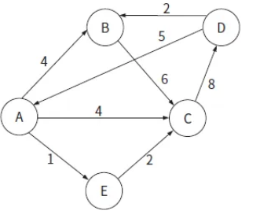
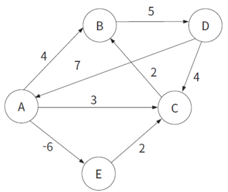
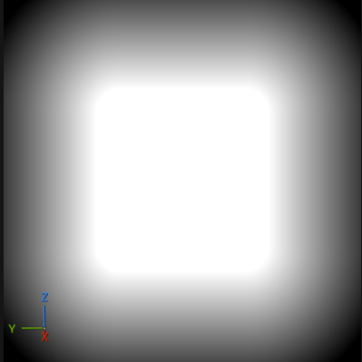
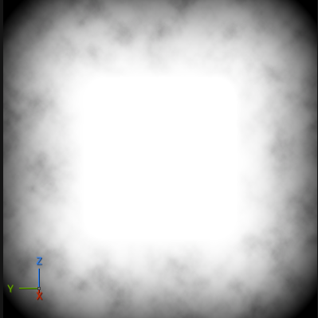
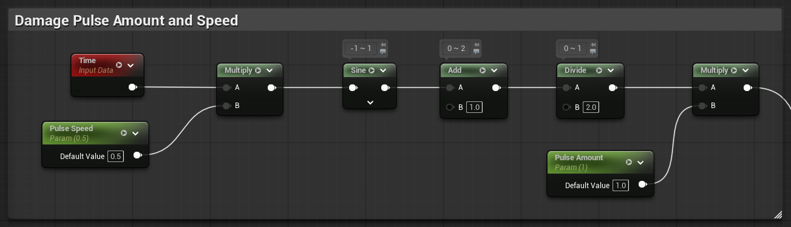
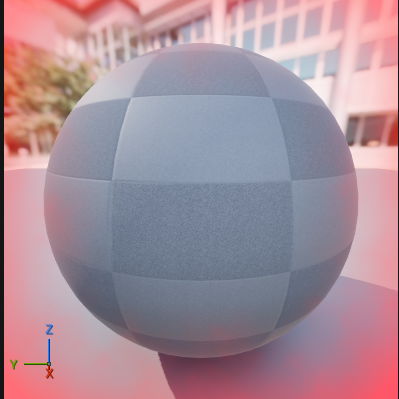
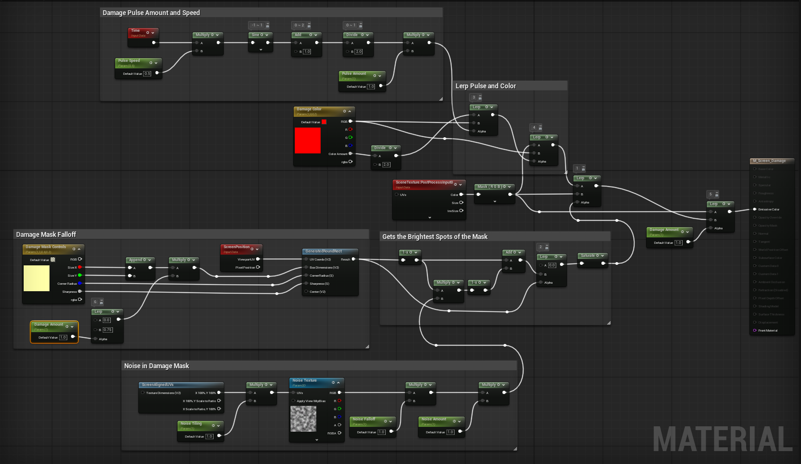

# 📅 2026-03-18 TIL

## 1. 오늘 학습 요약

* **학습 목표**: 
  * **코딩테스트** 문제 풀이
  * **C++ 코딩테스트 완전 정복** 챕터 4 수강
  * **알고리즘 기초 라이브 세션** 수강
  * 공식문서의 **[퍼즐 어드벤처 게임을 위한 아트 패스](https://dev.epicgames.com/documentation/ko-kr/unreal-engine/art-pass-for-a-puzzle-adventure-game)** 실습

* **학습 도구**: `Unreal Engine 5.7.3`, `Visual Studio 2022`

* **활동 내용**: 
  * 프로그래머스 **[두 큐 합 같게 만들기](https://school.programmers.co.kr/learn/courses/30/lessons/118667)**, **[섬 연결하기](https://school.programmers.co.kr/learn/courses/30/lessons/42861)**, **[두 원 사이의 정수 쌍](https://school.programmers.co.kr/learn/courses/30/lessons/181187)** 문제 풀이
  * C++ 코딩테스트 완전 정복 수강을 통한 **다익스트라**, **벨만 포드** 알고리즘 학습
  * 공식 문서의 **[UI의 포스트 프로세스 머티리얼](https://dev.epicgames.com/documentation/ko-kr/unreal-engine/artist-06-post-process-materials-on-the-ui-in-unreal-engine#maximumhealth%EB%B3%80%EC%88%98%EC%83%9D%EC%84%B1)** 실습

---
## 2. 프로그래머스 문제 풀이

### [두 큐 합 같게 만들기](https://school.programmers.co.kr/learn/courses/30/lessons/118667)
```cpp
#include <string>
#include <vector>
#include <queue>

using namespace std;

int solution(vector<int> queue1, vector<int> queue2) {
    int answer = 0;
    queue<long long> q1, q2;
    long long sum1 = 0, sum2 = 0;
    
    for(int i=0; i<queue1.size(); i++){
        q1.push(queue1[i]);
        q2.push(queue2[i]);
        sum1 += queue1[i];
        sum2 += queue2[i];
    }
    
    if((sum1 + sum2) % 2 != 0) return -1;   // 두 개로 나눌 수 없는 경우
    
    while(sum1 != sum2){
        if(answer > queue1.size() * 4)      // 두 큐가 원상태로 돌아온 경우
            return -1;
        
        answer++;
        if(sum1 > sum2){                    // 더 높은 큐의 원소를 반대편 큐로 넘겨줌
            long long number = q1.front();
            q1.pop();
            sum1 -= number;
            sum2 += number;
            q2.push(number);
        }
        else{
            long long number = q2.front();
            q2.pop();
            sum2 -= number;
            sum1 += number;
            q1.push(number);
        }
    }
    
    return answer;
}
```

* **Queue1**, **Queue2**를 비교하며 합이 더 큰 쪽의 원소를 반대편 큐로 넘겨주는 방식으로 구현
* 큐의 길이의 **4배 이상** 작업을 수행하면 각 큐가 원상태로 돌아온 것이니 불가능하다는 것을 의미함

---

### [섬 연결하기](https://school.programmers.co.kr/learn/courses/30/lessons/42861)
```cpp
#include <string>
#include <vector>
#include <queue>

using namespace std;
// 프림 알고리즘
int Prim(const vector<vector<pair<int,int>>>& graph, int start, int n){
    int sum = 0;
    vector<bool> visit(n, false);
    priority_queue<pair<int,int>, vector<pair<int, int>>, greater<pair<int,int>>> pq;
    
    pq.push({0, start});
    
    while(!pq.empty()){
        pair<int,int> currentEdge = pq.top();
        pq.pop();
        
        if(visit[currentEdge.second]) continue;
        visit[currentEdge.second] = true;
        sum += currentEdge.first;
        
        for(const pair<int,int>& edge : graph[currentEdge.second]){
            if(!visit[edge.second])
                pq.push(edge);
        }
    }
    
    return sum;
}

int solution(int n, vector<vector<int>> costs) {
    int answer = 0;
    vector<vector<pair<int,int>>> graph(n);
    
    // 양방향 그래프 생성
    for(const vector<int>& cost : costs){
        graph[cost[0]].push_back({cost[2], cost[1]});
        graph[cost[1]].push_back({cost[2], cost[0]});
    }

    // 프림 알고리즘 실행
    return Prim(graph, 0, n);
}
```

* **최소 신장 트리**를 구하는 문제
* **프림 알고리즘**을 활용하여 해결

---

### [두 원 사이의 정수 쌍](https://school.programmers.co.kr/learn/courses/30/lessons/181187)

```cpp
#include <string>
#include <vector>
#include <cmath>

using namespace std;

long long solution(int r1, int r2) {
    long long answer = 0;
    
    // 제1사분면만 계산
    for(int i=1; i<r2; i++){
        long long max = sqrt(pow(r2, 2) - pow(i, 2));                       // 최대 y 좌표
        long long min = i >= r1 ? 1 : ceil(sqrt(pow(r1, 2) - pow(i, 2)));   // 최소 y 좌표
        answer += max - min + 1;                                            // 가능한 점의 개수
    }
    
    answer += r2 - r1 + 1;  // 축 위에 있는 점의 개수
    answer *= 4;            // 사분면 전체의 개수로 곱해줌
    return answer;
}
```
* 피타고라스 수식으로 각 x 좌표에서 **최대, 최소 y 좌표**를 구함
* 한 축 위에 있는 점의 개수는 `r2 - r1 + 1`개 이므로 마지막에 더해줌
* 반복문으로 구한 제1사분면의 점 개수와 한 사분면에 접하는 하나의 축 위의 점 개수를 합한 후 `4`를 곱해 전체 개수를 구함

---

## 3. 최단 거리 알고리즘
* **다익스트라 (Dijkstra):** 매 순간 **비용이 가장 적은 노드**를 선택하여 최단 거리를 점진적으로 계산하는 **그리디** 기반 알고리즘
* **벨만-포드 (Bellman-Ford):** **모든 간선**을 반복적으로 확인하여 최단 거리를 갱신하는 **DP** 기반 알고리즘

### 다익스트라
* 방문하지 않은 노드 중 최단 거리가 가장 짧은 노드를 선택하기 위해 주로 **우선순위 큐(Priority Queue)** 를 사용
* 우선순위 큐 사용 시 `O(ElogV)`의 시간 복잡도를 가짐 (V: 정점 수, E: 간선 수)
* 벨만-포드에 비해 속도가 빠름
* 음수 가중치가 존재하면 사용 불가

```cpp
#include <iostream>
#include <queue>
#include <vector>
#include <climits>

using namespace std;

vector<int> Dijkstra(const vector<vector<pair<int, int>>>& graph, int start, int n){
    vector<int> result(n, INT_MAX);
    priority_queue<pair<int, int>, vector<pair<int,int>>, greater<pair<int, int>>> pq;
    pq.push({0, start});    // 시작 노드를 우선순위 큐에 삽입
    result[start] = 0;      // 시작 위치를 비용 0으로 설정

    while(!pq.empty()){
        int currentNode = pq.top().second;
        int currentWeight = pq.top().first;
        pq.pop();

        // 최소 비용 보다 크면 넘어감
        if(currentWeight > result[currentNode]) continue;      

        for(const pair<int,int>& edge : graph[currentNode]){
            int nextNode = edge.second;
            int nextWeight = currentWeight + edge.first;
            
            // 최소 비용 업데이트
            if(nextWeight < result[nextNode]){                  
                result[nextNode] = nextWeight;
                pq.push({nextWeight, nextNode});  
            }
        }
    }
    
    return result;
}

int main() {
    const int numNodes = 5;
    vector<vector<pair<int, int>>> graph(numNodes);

    // 그래프 생성
    graph[0].push_back({4,1});
    graph[0].push_back({4,2});
    graph[0].push_back({1,4});
    graph[1].push_back({6,2});
    graph[2].push_back({8,3});
    graph[3].push_back({5,0});
    graph[3].push_back({2,1});
    graph[4].push_back({2,2});

    vector<int> result = Dijkstra(graph, 0, numNodes);

    // 결과 출력
    for (int i = 0; i < numNodes; i++) {
        if (result[i] == INT_MAX) cout << "Node " << i << ": Unreachable" << endl;
        else cout << "Node " << i << ": " << result[i] << endl;
    }
    
    /* Output:
    Node 0: 0
    Node 1: 4
    Node 2: 3
    Node 3: 11
    Node 4: 1
    */

    return 0;
}
```


### 벨만 포드
* 매 반복마다 **모든 간선**을 확인하여 거리를 갱신
* V-1 번 모든 간선을 확인하여 갱신한 후 V 번째 확인에도 갱신이 발생하면 음수 순환이 존재하는 것 
* `O(V*E)`의 시간 복잡도를 가짐
* 음수 가중치가 존재하는 경우에도 사용 가능
* 다익스트라보다 느림

```cpp
#include <iostream>
#include <vector>
#include <climits>

using namespace std;

bool BellmanFord(const vector<vector<pair<int, int>>>& graph, vector<int>& result, int start, int n){
    result[start] = 0;

    for(int i=0; i<n; i++){
        for(int j=0; j<n; j++){
            if (result[j] == INT_MAX) continue; // 도달하지 못한 노드는 넘어감
            
            for(const pair<int, int>& edge : graph[j]){
                int nextNode = edge.second;
                int nextWeight = result[j] + edge.first;

                if(nextWeight < result[nextNode]){
                    result[nextNode] = nextWeight;

                    // 음수 순환 체크
                    if(i==n-1) return false;
                }
            }
        }
    }
    return true;
}

int main() {
    const int numNodes = 5;
    vector<vector<pair<int, int>>> graph(numNodes);

    // 그래프 생성
    graph[0].push_back({4,1});
    graph[0].push_back({3,2});
    graph[0].push_back({-6,4});
    graph[1].push_back({5,3});
    graph[2].push_back({2,1});
    graph[3].push_back({7,0});
    graph[3].push_back({4,2});
    graph[4].push_back({2,2});

    vector<int> result(numNodes, INT_MAX);

    // 음수 순환 존재
    if(!BellmanFord(graph, result, 0, numNodes)){
        cout << "Negative Cycle" << endl;
        return 0;
    }
        
    for (int i = 0; i < numNodes; i++) {
        if (result[i] == INT_MAX) cout << "Node " << i << ": Unreachable" << endl;
        else cout << "Node " << i << ": " << result[i] << endl;
    }
    
    /* Output:
    Node 0: 0
    Node 1: -2
    Node 2: -4
    Node 3: 3
    Node 4: -6
    */

    return 0;
}
```


---

## 4. 포스트 프로세스 머티리얼 생성

### 마스크 생성
1. `ScreenPosition` 노드의 **ViewportUV** 파라미터를 `GeneratedRoundRect`노드의 인풋으로 사용하여 플레이어 화면에 사각형 마스크를 생성함
2. `Constant4Vector`노드를 파라미터로 변경하여, `GeneratedRoundRect`의 인풋으로 설정해 사용자가 마스크를 제어하게 구현



### 노이즈 추가
1. `ScreenAlignedUVs` 노드를 통해 현재 화면의 해상도에 맞는 UV를 얻음
2. 해당 UV에 **노이즈 텍스쳐**`(TextureSample)`를 부여
3. 마스크에 노이즈를 곱하여 효과가 더 자연스럽게 보이게 합성



### 맥박 이펙트 추가
1. `Time` 노드를 활용해 숨 쉬는 효과를 부여
2. `Sine`, `Add`, `Divide` 노드를 통해 Time의 결과 값이 `0 ~ 1` 을 갖게 수정



### 최종 병합
1. `SceneTexture`(PostProcessInput0) 노드로 현재 렌더링된 화면을 가져옴
2. 원본 화면과 색상, 노이즈가 적용된 마스크, 맥박 이펙트 값들을 보간하여 화면에 효과를 적용함
3. 최종 결과를 **Emissive Color**에 연결





---

## 5. 캐릭터에 포스트 프로세스 머터리얼 연결

### 포스트 프로세싱 추가
1. `Create Dynamic Material Instance` 노드를 통해 생성한 **다이나믹 머티리얼 인스턴스**를 플레이어에 추가
2. `Set Post Process Settings` 노드로 생성된 **MID**를 플레이어의 `First Person Camera` 컴프넌트에 등록
3. 플레이어의 현재 체력, 최대 체력을 기반으로 **MID**의 **파라미터 값을 수정**해 효과를 적용

### 체력 회복
1. 피격 발생 시 `Retriggerable Delay`(딜레이 중 재실행 시 타이머를 초기화) 노드를 통해 일정 시간 후 체력 회복 로직을 실행
2. `Timeline`을 활용해 체력이 점차 회복되게 구현
3. 체력 회복 중, 피격 시 **HUD**의 **HP**를 업데이트해 실시간으로 화면에 출력

---

## 6. 내일 할 일
* 코딩테스트 문제 풀이
* C++ 코딩테스트 완전 정복 챕터 4 수강
* 공식문서의 [퍼즐 어드벤처 게임을 위한 아트 패스](https://dev.epicgames.com/documentation/ko-kr/unreal-engine/art-pass-for-a-puzzle-adventure-game) 실습을 통한 에디터 학습