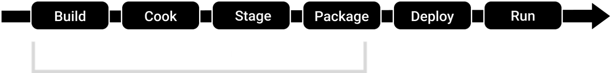

# 📅 2026-03-24 TIL

## 1. 오늘 학습 요약

* **학습 목표**: 
  * **코딩테스트** 문제 풀이
  * 공식 문서의 **[언리얼 엔진 프로젝트 패키징](https://dev.epicgames.com/documentation/ko-kr/unreal-engine/packaging-your-project)** 실습

* **학습 도구**: `Unreal Engine 5.7.3`, `Visual Studio 2022`

* **활동 내용**: 
  * 프로그래머스 **[소수 찾기](https://school.programmers.co.kr/learn/courses/30/lessons/42839)**, **[도둑질](https://school.programmers.co.kr/learn/courses/30/lessons/42897)**, **[힌트 스테이지](https://school.programmers.co.kr/learn/courses/30/lessons/468377)** 풀이
  * 공식 문서의 **[언리얼 엔진 프로젝트 패키징](https://dev.epicgames.com/documentation/ko-kr/unreal-engine/packaging-your-project)** 실습

---
## 2. 프로그래머스 문제 풀이

### [소수 찾기](https://school.programmers.co.kr/learn/courses/30/lessons/42839)

```cpp
#include <string>
#include <vector>
#include <algorithm>
#include <set>
#include <cmath>

using namespace std;

// 조합
set<string> combination(string numbers, int n){
    set<string> s;
    vector<int> vec(numbers.length(), 1);
    for(int i=0; i<n; i++)  vec[i] = 0; 
    do{
        string temp = "";
        for(int i=0; i<numbers.length(); i++)
            if(vec[i] == 0) temp += numbers[i];
        s.insert(temp);
    }while(next_permutation(vec.begin(), vec.end()));
    return s;
}

// 순열
set<int> permutation(string numbers){
    set<int> s;
    sort(numbers.begin(), numbers.end());
    do{
        s.insert(stoi(numbers));
    }while(next_permutation(numbers.begin(), numbers.end()));
    return s;
}

// 소수 판별
bool isPrime(int number){
    if(number <= 1) return false;
    for(int i=2; i<=sqrt(number); i++)
        if(number % i == 0)
            return false;
    return true;
}

int solution(string numbers) {
    int answer = 0;
    set<string> combinations;
    set<int> permutations;
    
    // 숫자를 고르는 모든 경우
    for(int i=1; i<=numbers.size(); i++)
        combinations.merge(combination(numbers, i));

    // 고른 숫자로 만들 수 있는 모든 수
    for(const string number : combinations)
        permutations.merge(permutation(number));
    
    // 만든 수에 대해서 소수 판별
    for(const int number : permutations)
        if(isPrime(number)) answer++;
    
    return answer;
}
```

* `next_permutation`을 활용해 숫자를 뽑는 조합을 구한 후, 그 조합으로 만들 수 있는 순열을 `set`에 저장
* `set`의 모든 수에 대하여 소수를 판별

--- 

### [도둑질](https://school.programmers.co.kr/learn/courses/30/lessons/42897)

```cpp
#include <string>
#include <vector>
#include <algorithm>

using namespace std;

int solution(vector<int> money) {
    int answer = 0;
    
    vector<int> dp_steal(money.size(), 0);  // i번째 집을 털었을 때
    vector<int> dp_skip(money.size(), 0);   // i번째 집을 안털었을 때
    
    dp_steal[0] = money[0]; dp_steal[1] = money[1];
    dp_skip[1] = money[0]; 
    
    // 마지막 집은 제외
    for(int i=2; i<money.size()-1; i++){
        dp_steal[i] = max(dp_steal[i-2], dp_skip[i-1]) + money[i];
        dp_skip[i] = max(dp_steal[i-1], dp_skip[i-1]);
        
        if(max(dp_steal[i], dp_skip[i]) > answer)
            answer = max(dp_steal[i], dp_skip[i]);
    }
    
    // 반대로 뒤집은 후 다시 DP
    fill(dp_steal.begin(), dp_steal.end(), 0);      // i번째 집을 털었을 때
    fill(dp_skip.begin(), dp_skip.end(), 0);        // i번째 집을 안털었을 때
    
    reverse(money.begin(), money.end());
    dp_steal[0] = money[0]; dp_steal[1] = money[1];
    dp_skip[1] = money[0]; 
    
    // 마지막 집(뒤집기 전 첫번째 집)은 제외
    for(int i=2; i<money.size()-1; i++){
        dp_steal[i] = max(dp_steal[i-2], dp_skip[i-1]) + money[i];
        dp_skip[i] = max(dp_steal[i-1], dp_skip[i-1]);
        
        if(max(dp_steal[i], dp_skip[i]) > answer)
            answer = max(dp_steal[i], dp_skip[i]);
    }
    
    return answer;
}
```

* 집이 원형이라는 것만 빼면 간단한 DP 문제
* 집이 원형으로 연결되어 있으니 첫 번째 집을 털면, 마지막 집을 털지 못한다는 것을 유의해야 함
* 마지막 집을 빼고 DP를 하면 평범한 일자 DP 문제를 푸는 것과 같음
* 따라서 마지막 집을 뺀 양방향으로 DP를 돌리고 그 중 최댓값이 원형 집에서의 최댓값

---
### [힌트 스테이지](https://school.programmers.co.kr/learn/courses/30/lessons/468377)

```cpp
#include <string>
#include <vector>

using namespace std;
int getResult(const vector<vector<int>>& cost, const vector<vector<int>>& hint, 
              vector<int> hasHint, int stage, int sum){
    if(stage == cost.size()) return sum;
    int hintCount = hasHint[stage] < cost.size() ? hasHint[stage] : cost.size()-1;
    int price = cost[stage][hintCount];
    
    // 힌트권을 안사는 경우
    int result = getResult(cost, hint, hasHint, stage + 1, sum + price);
    
    // 힌트권을 사는 경우
    if(stage < hint.size()){
        int hintPrice = hint[stage][0];
        for(int i=1; i<hint[stage].size(); i++){
            int hintStage = hint[stage][i] - 1;
            hasHint[hintStage]++;
        }
        result = min(result, getResult(cost, hint, hasHint, stage + 1, sum + price + hintPrice));
    } 
    return result;
}

int solution(vector<vector<int>> cost, vector<vector<int>> hint) {
    int answer = 0;
    vector<int> hasHint(cost.size(), 0);
    answer = getResult(cost, hint, hasHint, 0, 0);
    return answer;
}
```

* 각 스테이지에서 힌트권을 구매하는 경우, 구매하지 않는 경우로 나뉘는 **완전 탐색** 문제

---

## 3. 패키징(Packaging)
* 개발 중인 언리얼 엔진 프로젝트를 **독립형 실행파일**(.exe) 또는 **애플리케이션**으로 변환하는 프로세스
* 패키징은 아래 그림과 같은 **파이프라인**을 가지고 있음



### 빌드(Build)
* 프로젝트의 소스 코드, 플러그인 및 바이너리를 타깃 플랫폼에 맞게 **컴파일 및 링킹**

* **빌드 환경설정(build configuration):** 개발의 단계에 맞춰 프로젝트 컴파일 방법 및 사용할 수 있는 코드와 콘텐츠를 결정하는 **프리셋**
    * 디버그(Debug): 엔진과 프로젝트 소스 코드를 모두 빌드하고 최적화를 비활성화, 디버깅에 유리하지만 매우 느림
    * 디버그게임(DebugGame): 프로젝트 소스 코드만 빌드하고 최적화를 비활성화해 엔진의 성능을 유지한 채로 디버깅, 코드를 디버그할 때 유리
    * 개발(Development): 오래 걸리는 최적화를 제외한 모든 최적화를 활성화, 대부분의 개발 환경에 적합
    * 테스트(Test): 모든 최적화를 활성화하지만 콘솔 및 디버깅 툴을 포함, QA 테스트 환경에 적합
    * 출시(Shipping): 모든 최적화를 활성화하며 모든 디버깅 툴을 비활성화

### 쿠킹(Cooking)

* 언리얼 엔진에서는 콘텐츠 애셋을 내부적으로 사용되는 특정 포맷으로 저장하며 이러한 콘텐츠들은 다양한 플랫폼에 맞는 여러 가지 포맷으로 변환해 줘야 함
* 내부 포맷에서 **플랫폼 전용 포맷으로 콘텐츠를 변환**하는 프로세스
* **플랫폼별 데이터 변환**, **셰이더 컴파일**, **에셋 최적화**의 작업을 실시함

### 스테이징(Staging)

*  컴파일된 코드와 쿠킹된 콘텐츠가 실제 배포용 폴더 구조인 **스테이징 디렉터리**에 복사됨

### 패키징(Packaging)

* 스테이징 단계에서 생성된 파일들을 배포 가능한 `.pak` 파일로 번들화
* 이를 통해 **데이터 압축**, **암호화**, **파일 정리**, **로딩 속도 향상**의 이점을 가져옴

### 디플로이(Deploy)

* 패키징이 완료된 최종 결과물을 실제로 실행될 **타겟 플랫폼**으로 설치하는 과정
* 패키징 내부의 단계가 아닌 배포 단계

### 실행(Run)

* 디플로이된 결과물을 **타겟 플랫폼** 위에서 실제로 프로세스로 구동하는 최종 단계
* **실성능 검증**, **에디터 코드 확인** 등의 개발 환경과의 차이를 확인

---

## 4. 내일 할 일
* 코딩테스트 문제 풀이
* 라이라 샘플 게임 분석