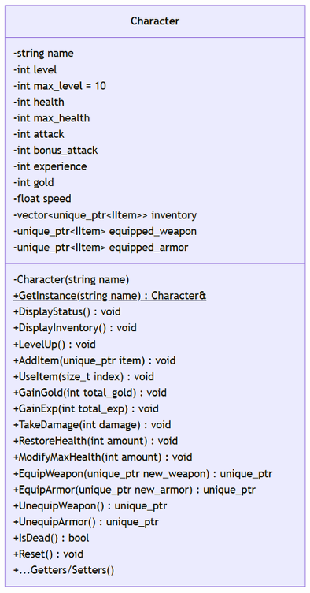
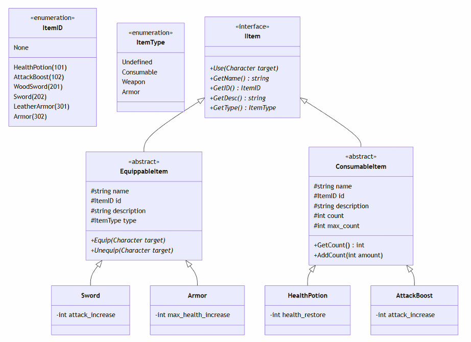

# 📅 2026-04-01 TIL

## 1. 오늘 학습 요약

* **학습 목표**: 
  * **코딩테스트** 문제 풀이
  * **CH2** 팀 프로젝트 마무리

* **학습 도구**: `Visual Studio 2022`

* **활동 내용**: 
  * 프로그래머스 **[뒤에 있는 큰 수 찾기](https://school.programmers.co.kr/learn/courses/30/lessons/154539)**, **[등대](https://school.programmers.co.kr/learn/courses/30/lessons/133500)** 풀이
  * **CH2** 팀 프로젝트 마무리

---
## 2. 프로그래머스 문제 풀이

### [뒤에 있는 큰 수 찾기](https://school.programmers.co.kr/learn/courses/30/lessons/154539)

```cpp
#include <string>
#include <vector>
#include <stack>

using namespace std;

vector<int> solution(vector<int> numbers) {
    vector<int> answer(numbers.size(), -1);
    stack<pair<int, int>> s;
    s.push({numbers[0], 0});
    
    for(int i=1; i<numbers.size(); i++){
        while(!s.empty() && s.top().first < numbers[i]){
            answer[s.top().second] = numbers[i];
            s.pop();
        }
        s.push({numbers[i], i});
    }
    
    return answer;
}
```

* `스택` 기반으로 해결
* 숫자를 만나면 스택을 검사해, 만난 숫자보다 낮으면 스택에서 빼고 `answer`를 업데이트
* 스택은 무조건 정렬된 상태이므로 가장 위의 원소만 보면 됨

--- 

### [등대](https://school.programmers.co.kr/learn/courses/30/lessons/133500)

```cpp
#include <string>
#include <vector>
#include <queue>
#include <set>

using namespace std;

int solution(int n, vector<vector<int>> lighthouse) {
    int answer = 0;
    vector<set<int>> graph(n);
    vector<bool> isOn(n, false);
    queue<int> leaf;
    
    // 그래프 저장
    for(const vector<int>& edge : lighthouse){
        graph[edge[0]-1].insert(edge[1]-1);
        graph[edge[1]-1].insert(edge[0]-1);
    }
    
    // 리프 노드들을 큐에 삽입
    for(int i=0; i<graph.size(); i++){
        if(graph[i].size() == 1) leaf.push(i);
    }

    while(!leaf.empty()){
        int current = leaf.front();
        leaf.pop();
        if(graph[current].size() == 0) continue; // 다른 리프 노드에 의해 처리 된 경우 넘어감
        int parent = *graph[current].begin();

        // 부모와 자식이 둘 다 안켜져 있으면 부모를 킴
        if(!isOn[current] && !isOn[parent]){
            answer++;  
            isOn[parent] = true;
        }
        
        // 간선 정보 삭제
        graph[current].erase(parent);
        graph[parent].erase(current);
        
        // 부모 노드가 리프 노드가 되었으면 큐에 추가
        if(graph[parent].size() == 1)   
            leaf.push(parent);
    }
    
    return answer;
}
```

* `트리` 구조를 활용하여 해결
* 문제의 조건이 노드의 개수가 `n` 개, 간선의 개수가 `n-1` 개이고 모든 노드가 연결되어 있으므로 문제의 그래프는 `트리`임
* 문제의 핵심은 **리프 노드와 부모 노드가 둘 다 불이 꺼져있으면, 무조건 부모 노드를 키는게 최선**이라는 것
* 그래프를 검사한 후 리프 노드를 queue에 넣고, 리프 노드들을 점차 삭제하며 불을 켜야 하는 노드의 개수를 셈

---

## 3. CH2 팀 프로젝트 마무리

### Character

* **싱글톤** 기반 캐릭터 클래스 구현해 게임 내에 단 하나의 플레이어만 존재하도록 제한
* **다형성** 기반의 인벤토리, 아이템 추가, 사용, 삭제 로직 구현
* 장비 아이템 장착(Equip) 및 해제(UnEquip) 로직 구현

* **Character UML**

    

### Item

* `IItem` 모든 아이템이 가져야 할 필수 기능을 정의한 인터페이스 설계
* `ItemID`, `ItemType` Enum class 를 통해 아이템 분류
* `IItem`을 상속받는 `ConsumableItem`, `EquippableItem` 추상 클래스 설계
* `ConsumableItem` 상속 받는 `HealthPotion`, `AttackBoost` 구현
* 소모품 아이템은 `Count` 멤버 변수를 갖고 있어 동일한 아이템은 인벤토리에 겹쳐서 저장
* **팩토리 패턴**을 이용한 객체 생성을 담당하는 `ItemFactory` 설계 및 구현

* **Item UML**
    

### 트러블 슈팅

**문제**

* 장비 아이템의 `Use(Character& target)` 함수를 통해 아이템이 스스로 캐릭터에 장착되게 구상함

* 함수 내부에서 `target->Character::EquipWeapon(this);`로 작성했지만 **컴파일 에러** 발생

**원인**

* `Character::EquipWeapon(std::unique_ptr<IItem> new_weapon)` 함수는 `unique_ptr`을 인자로 받기 때문에 this로 넘기면 타입 불일치

* `std::move()`를 통해 인자를 직접 넘겨주는 것은 아이템의 소유권을 플레이어의 인벤토리가 관리하고 있기 때문에 권한이 없음

**해결**

* 아이템이 스스로 장착되는 방식 대신, **캐릭터**가 아이템의 소유권을 옮긴 후 장착하는 방식으로 수정
* `Character::UseItem(size_t index)`에서 사용된 아이템이 장비 아이템일 경우, `std::move(inventory[index])`를 호출하여 소유권을 회수
* 회수된 `unique_ptr`를 인자로 직접 `Character::EquipWeapon(std::unique_ptr<IItem> new_weapon)`을 호출하여 장비를 장착

---

## 4. 내일 할 일
* 코딩테스트 문제 풀이
* C++ 배치고사
* 라이라 샘플 게임 분석