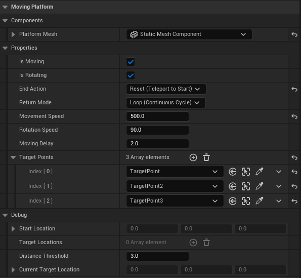

# 📅 2026-04-07 TIL

## 1. 오늘 학습 요약

* **학습 목표**: 
  * **코딩테스트** 문제 풀이
  * **C++와 Unreal Engine으로 3D 게임 개발** CH1 수강

* **학습 도구**: `Unreal Engine 5.5.4`, `Visual Studio 2022`

* **활동 내용**: 
  * 프로그래머스 **[타겟 넘버](https://school.programmers.co.kr/learn/courses/30/lessons/43165)**, **[광고 삽입](https://school.programmers.co.kr/learn/courses/30/lessons/72414)**, **[부대복귀](https://school.programmers.co.kr/learn/courses/30/lessons/132266)** 풀이
  * **C++와 Unreal Engine으로 3D 게임 개발** CH1 수강
  * **CH3** 6번 과제 진행

---
## 2. 프로그래머스 문제 풀이

### [타겟 넘버](https://school.programmers.co.kr/learn/courses/30/lessons/43165)

```cpp
#include <string>
#include <vector>
#include <algorithm>
using namespace std;

// 0, 1 순열
vector<vector<int>> permatuation(int size){
    vector<vector<int>> result;
    for(int i=0; i<=size; i++){
        vector<int> temp(size-i, 0), temp2(i, 1);;
        temp.insert(temp.end(), temp2.begin(), temp2.end());
        do{
            result.push_back(temp);
        }while(next_permutation(temp.begin(), temp.end()));
    }
    return result;
}

int solution(vector<int> numbers, int target) {
    int answer = 0;
    vector<vector<int>> permatuations = permatuation(numbers.size());
    
    for(const vector<int>& per : permatuations){
        int sum = 0;
        for(int i=0; i<numbers.size(); i++){
            if(per[i] == 1) sum += numbers[i];  // 순열이 1이면 해당 숫자를 더함
            else sum -= numbers[i];             // 0이면 뺌
        }
        if(sum == target) answer++;
    }
    return answer;
}
```

* **완전 탐색**, **순열**을 활용해 풀이
* `numbers`의 길이가 최대 20밖에 안 되므로 순열을 모두 구한 후 계산해도 충분함
* **DFS**로 +, - 선택하는 것이 더 효율적이긴 함

--- 

### [광고 삽입](https://school.programmers.co.kr/learn/courses/30/lessons/72414)

```cpp
#include <string>
#include <vector>
#include <sstream>
#include <algorithm>
using namespace std;

// 숫자 시간을 문자열로
string timeToStr(int time){
    string result;
    result += time / 3600 > 9 ? to_string(time / 3600) + ":" : "0" + to_string(time / 3600) + ":";
    time %= 3600;
    result +=  time / 60 > 9 ? to_string(time / 60) + ":" : "0" + to_string(time / 60) + ":";
    time %= 60;
    result += time > 9 ? to_string(time) : "0" + to_string(time);
    return result;
}

// 문자열을 숫자 시간으로
int getTime(const string& str){
    vector<string> times;
    string temp;
    stringstream ss(str);
    while(getline(ss, temp, ':')){
        times.push_back(temp);
    }
    return stoi(times[0]) * 3600 + stoi(times[1]) * 60 + stoi(times[2]);
}

string solution(string play_time, string adv_time, vector<string> logs) {
    int answer;
    int p_time = getTime(play_time);
    int a_time = getTime(adv_time);
    
    vector<long long> pref(p_time+2, 0);
    
    // 누적합 계산
    for(const string& log : logs){
        int start_time = getTime(log.substr(0, 8));
        int end_time = getTime(log.substr(9, 8));
        pref[start_time] += 1;
        pref[end_time] -= 1;
    }
    
    for(int i=1; i<pref.size(); i++) pref[i] += pref[i-1]; // 차분 배열 합
    for(int i=1; i<pref.size(); i++) pref[i] += pref[i-1]; // 누적합

    // 0초부터 끝까지 광고 시간 구간의 누적합이 가장 큰 구간 찾기
    long long max = pref[a_time] - pref[0];
    answer = 0;
    for(int i=1; i<=p_time - a_time; i++){
        long long viewer = pref[i + a_time - 1] - pref[i - 1];
        if(viewer > max){
            max = viewer;
            answer = i;
        }
    }
    
    return timeToStr(answer);
}
```

* **누적 합,** **슬라이딩 윈도우**를 활용해 해결
* 단순 슬라이딩 윈도우로만 해결하기에는 `logs` 크기가 30만, 시간의 최댓값이 약 36만이므로 무조건 시간 초과
* 누적 합을 활용해 모든 구간의 누적 재생 시간을 구한 후, 광고의 길이만큼 구간을 잘라 구간의 누적 재생 시간을 구함

---

### [부대복귀](https://school.programmers.co.kr/learn/courses/30/lessons/132266)

```cpp
#include <string>
#include <vector>
#include <queue>

using namespace std;

vector<int> BFS(const vector<vector<int>>& graph, int n, int start){
    vector<int> visit(n+1, -1);
    queue<int> q;
    q.push(start);
    visit[start] = 0;
    
    while(!q.empty()){
        int cur = q.front();
        q.pop();
        
        for(const int& next : graph[cur]){
            if(visit[next] == -1){
                q.push(next);
                visit[next] = visit[cur] + 1;
            }
        }
    }
    
    return visit;
}

vector<int> solution(int n, vector<vector<int>> roads, vector<int> sources, int destination) {
    vector<int> answer;
    vector<vector<int>> graph(n+1);
    
    for(const vector<int>& road : roads){
        graph[road[0]].push_back(road[1]);
        graph[road[1]].push_back(road[0]);
    }
    
    vector<int> visit = BFS(graph, n, destination);
    
    for(int& source : sources)
        answer.push_back(visit[source]);
    
    return answer;
}
```

* **BFS** 문제
* 그래프를 그린 후, BFS로 거리를 구하면 해결
* 이게 왜 레벨 3 문제인지 모르겠음

---

## 3. UE5 빌드 구성

* **`DebugGame:`** 게임 로직(프로젝트 코드)만 디버그 정보를 포함하고, 엔진은 최적화된 상태로 빌드
* **`DebugGame Editor:`** DebugGame과 동일하지만, 언리얼 에디터를 실행 가능
* **`Development:`** 엔진과 프로젝트 코드 모두에 적절한 수준의 최적화를 적용한 개발용 빌드
* **`Development Editor:`** 에디터를 실행할 수 있는 상태에서 코드 최적화를 적용한 언리얼 엔진의 기본 빌드 구성
* **`Shipping:`** 모든 디버깅과 로그를 제거하며, 최대한의 성능 최적화를 적용한 최종 배포용 빌드

---

## 4. 액터 라이프 사이클

* **`Constructor`**
    * **호출 시점:** 클래스의 인스턴스가 생성될 때 **가장 먼저** 호출
    * 게임 월드가 완전히 구성되기 전에 호출되므로, 다른 액터에 접근이 어려움
    * 주로 CreateDefaultSubobject 등을 사용해 컴포넌트 생성 및 초기 변수 세팅에 활용

* **`PostInitializeComponents()`**
    * **호출 시점:** 액터에 부착된 **모든 컴포넌트가 초기화**된 직후에 호출
    * 주로 컴포넌트간 상호작용이 필요한 초기화 로직을 작성

* **`BeginPlay()`**
    * **호출 시점:**  Play In Editor (PIE)나 런타임에서 게임이 시작될 때, 혹은 이미 실행 중인 게임에 SpawnActor 등으로 새 액터가 생성될 때 **한 번 호출**
    * 월드와 다른 액터들이 구성된 상태이므로, 접근이 가능

* **`Tick(float DeltaTime)`**
    * **호출 시점:** **매 프레임**마다 호출
    * 실시간 업데이트가 필요한 로직을 작성

* **`EndPlay(const EEndPlayReason::Type EndPlayReason)`**
    * **호출 시점:** 액터가 월드에서 제거되기 직전에 호출
    * **EndPlayReason**을 통해 액터가 왜 없어지는지(레벨 전환, Destroy 호출, 에디터 종료 등)를 판별 가능

* **`Destroyed()`**
    * **호출 시점:** Destroy() 함수를 호출하여 액터를 제거할 때 직전에 호출되는 가상 함수
    * 액터가 파괴되는 순간에 대한 알림 역할
    * **EndPlay**와 역할이 겹치지만, **EndPlay**가 상대적으로 호출 보장이 높아 중요한 정리 로직은 **EndPlay**에 작성하는 것을 권장

---

## 5. CH3 6번 과제 Moving Platform

* **[6번 과제] 회전발판과 움직이는 장애물**를 진행하며 회전 및 이동이 가능한 발판을 C++로 제작
* 언리얼 에디터의 Details를 통해 이동 및 회전 여부와 속도, 목적지, 이동 설정 등을 조작 가능
* **Outliner Details**

    
    
---

## 6. 내일 할 일
* 코딩테스트 문제 풀이
* CH3 개인과제 6번 마무리
* C++와 Unreal Engine으로 3D 게임 개발 챕터2 수강 및 과제
* 라이라 샘플 게임 분석