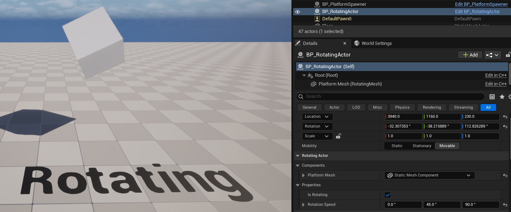
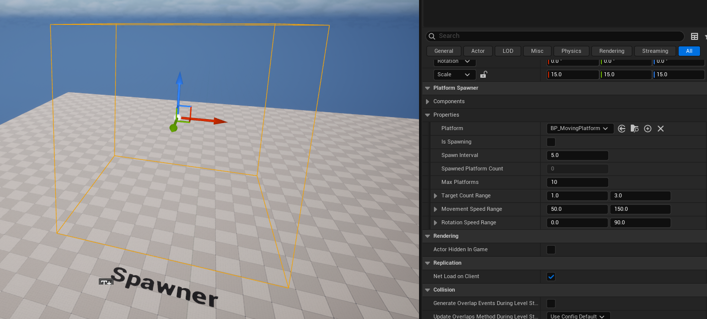

# 📅 2026-04-08 TIL

## 1. 오늘 학습 요약

* **학습 목표**: 
  * **코딩테스트** 문제 풀이
  * **CH3** 개인과제 6번 마무리
  * **C++와 Unreal Engine으로 3D 게임 개발** CH2 수강
  
* **학습 도구**: `Unreal Engine 5.5.4`, `Visual Studio 2022`

* **활동 내용**: 
  * 프로그래머스 **[피로도](https://school.programmers.co.kr/learn/courses/30/lessons/87946)**, **[행렬과 연산](https://school.programmers.co.kr/learn/courses/30/lessons/118670)**, **[등굣길](https://school.programmers.co.kr/learn/courses/30/lessons/42898)** 풀이
  * **C++와 Unreal Engine으로 3D 게임 개발** CH2 수강
  * **CH3** 개인과제 6번 회전 액터 및 랜덤 플랫폼 생성 액터 구현

---
## 2. 프로그래머스 문제 풀이

### [피로도](https://school.programmers.co.kr/learn/courses/30/lessons/87946)

```cpp
#include <string>
#include <vector>

using namespace std;

void DFS(const vector<vector<int>>& dungeons, vector<bool>& visit, int& k, int& answer, int count){
    answer = answer > count ? answer : count;
    
    for(int i=0; i<dungeons.size(); i++){
        if(!visit[i] && k >= dungeons[i][0]){
            visit[i] = true;
            k -= dungeons[i][1];
            
            DFS(dungeons, visit, k, answer, count+1);
            
            visit[i] = false;
            k += dungeons[i][1];
        }
    }
}

int solution(int k, vector<vector<int>> dungeons) {
    int answer = -1;
    vector<bool> visit(dungeons.size(), false);
    DFS(dungeons, visit, k, answer, 0);
    return answer;
}
```
* **완전 탐색** 문제, **DFS**를 활용해 풀이
* `dungeons`의 길이가 최대 `8` 밖에 안되므로 간단하게 해결 가능
* 어제 풀었던 [타겟 넘버](https://school.programmers.co.kr/learn/courses/30/lessons/43165)처럼 순열을 이용해도 되지만, 오늘은 DFS로 구현해봄

--- 

### [행렬과 연산](https://school.programmers.co.kr/learn/courses/30/lessons/118670)

```cpp
#include <string>
#include <vector>
#include <deque>
#include <algorithm>
using namespace std;

// 행열의 테두리를 시계방향으로 회전
void Rotate(deque<int>& left, deque<deque<int>>& mid, deque<int>& right){
    mid[0].push_front(left.front());
    left.pop_front();
    
    right.push_front(mid[0].back());
    mid[0].pop_back();
    
    mid[mid.size()-1].push_back(right.back());
    right.pop_back();
    
    left.push_back(mid[mid.size()-1].front());
    mid[mid.size()-1].pop_front();
}

// 가장 아래에 있는 행을 앞으로 옮김
void ShiftRow(deque<int>& left, deque<deque<int>>& mid, deque<int>& right){
    left.push_front(left.back());
    left.pop_back();
    
    mid.push_front(move(mid.back()));
    mid.pop_back();
    
    right.push_front(right.back());
    right.pop_back();
}

vector<vector<int>> solution(vector<vector<int>> rc, vector<string> operations) {
    vector<vector<int>> answer(rc.size());
    deque<deque<int>> mid;  // 1번 ~ n-2번 열 (양 끝을 뺀 행)
    deque<int> left, right; // 0번 열, n-1번 열
    
    for(int i=0; i<rc.size(); i++){
        left.push_back(rc[i][0]);
        right.push_back(rc[i][rc[i].size()-1]);
        mid.push_back(deque<int>(rc[i].begin()+1, rc[i].end()-1));
    }
   
    for(const string& op : operations){
        if(op[0] == 'R') Rotate(left, mid, right);
        else ShiftRow(left, mid, right);
    }
    
    for(int i=0; i<rc.size(); i++){
        mid[i].push_front(left.front()); left.pop_front();
        mid[i].push_back(right.front()); right.pop_front();
        answer[i] = vector<int>(mid[i].begin(), mid[i].end());
    }
    
    return answer;
}
```

* **Deque**를 활용한 **시뮬레이션** 문제
* 단순히 각 행을 Deque로 관리하면, 회전에서 각 Deque마다 연산을 해줘야 해서 시간초과가 발생함
* 양 끝 열을 따로 Deque로 관리하여, 회전 시 연산이 간단하게끔 구현해야 함
* 효율성 테스트 7, 8번을 통과하는 데 오래 걸렸는데, 벡터를 덱으로, 덱을 벡터로 파싱하는 시간의 영향이라고 생각해 해당 부분을 다양한 방법으로 수정했었음
* 해당 부분도 영향이 있긴 했지만, 주된 문제는 `ShiftRow()`의 `mid.push_front(mid.back());` 이었음
* 이전 코드는 mid의 행을 전부 복사한 후 `push_front()`를 실행했기 때문에 비용이 비쌌음
* 현재 코드처럼 `std::move()`를 넣어 주소 값을 전달하게 수정

---

### [등굣길](https://school.programmers.co.kr/learn/courses/30/lessons/42898)

```cpp
#include <string>
#include <vector>

using namespace std;

int solution(int m, int n, vector<vector<int>> puddles) {
    int answer = 0;
    vector<vector<int>> dp(n, vector<int>(m, 0));
    dp[0][0] = 1;
    for(const vector<int>& puddle : puddles)
        dp[puddle[1]-1][puddle[0]-1] = -1;
    
    for(int i=0; i<n; i++){
        for(int j=0; j<m; j++){
            if(dp[i][j] == -1) continue;
            if(i>0 && dp[i-1][j] != -1) dp[i][j] += dp[i-1][j];
            if(j>0 && dp[i][j-1] != -1) dp[i][j] += dp[i][j-1];
            dp[i][j] %= 1000000007;
        }
    }
    
    answer = dp[n-1][m-1];
    return answer;
}
```

* 간단한 **DP** 문제

---

## 3. CH3 개인과제 6번 마무리

### 회전 액터
* `Roll`, `Pitch`, `Yaw` 세 방향으로 회전할 수 있는 액터를 구현
* 언리얼 에디터의 `Details`를 통해 회전 여부와 각 방향별 속도를 설정할 수 있음



### 플랫폼 스폰 액터
* 어제 구현한 `MovingPlatform`을 랜덤하게 생성하는 스폰 액터를 구현
* 플랫폼은 최종 목표 지점에 도달하면 삭제되는 `Destroy` 모드로 설정
* 언리얼 에디터에서 `BoxComponent`를 조절하여 스폰 위치와 이동 범위를 조절할 수 있음
* 언리얼 에디터의 `Details`를 통해 스폰 지연시간, 최대 스폰 개수, 목표 지점의 개수 범위, 이동 및 회전 속도의 범위를 설정할 수 있음



---

## 4. 내일 할 일
* 코딩테스트 문제 풀이
* C++와 Unreal Engine으로 3D 게임 개발 챕터2 수강
* CH3 개인과제 7번 진행
* 라이라 샘플 게임 분석