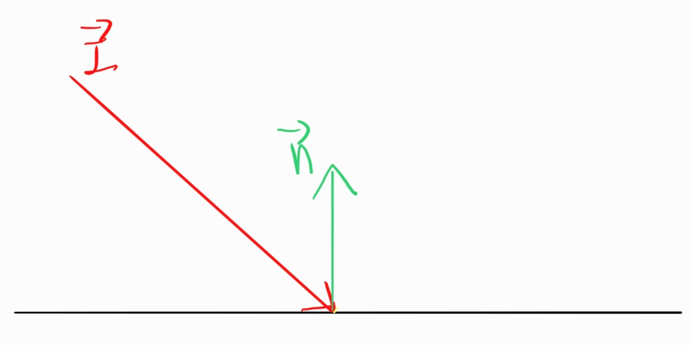
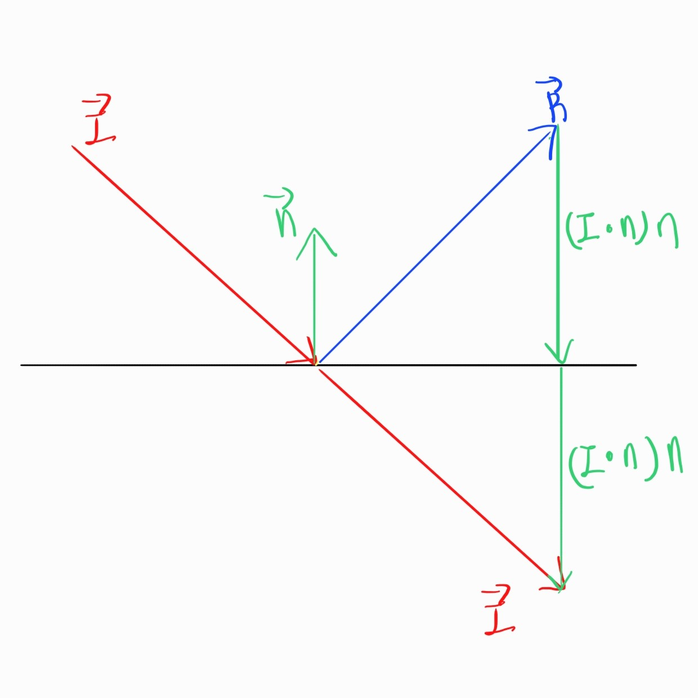

# 📅 2026-04-10 TIL

## 1. 오늘 학습 요약

* **학습 목표**: 
  * **코딩테스트** 문제 풀이
  * **심화반** 입과 시험
  * **CH3** 개인과제 7번 진행
  
* **학습 도구**: `Unreal Engine 5.5.4`, `Visual Studio 2022`

* **활동 내용**: 
  * 프로그래머스 **[할인 행사](https://school.programmers.co.kr/learn/courses/30/lessons/131127)**, **[코딩 테스트 공부](https://school.programmers.co.kr/learn/courses/30/lessons/118668)**, **[리틀 프렌즈 사천성](https://school.programmers.co.kr/learn/courses/30/lessons/1836)** 풀이
  * 심화반 입과 시험 복습
  * **CH3** 개인과제 7번 이동 로직 구현

---
## 2. 프로그래머스 문제 풀이

### [할인 행사](https://school.programmers.co.kr/learn/courses/30/lessons/131127)

```cpp
#include <string>
#include <vector>
#include <unordered_map>
using namespace std;

int solution(vector<string> want, vector<int> number, vector<string> discount) {
    int answer = 0;
    
    // 원하는 제품과 수량을 해시맵에 저장
    unordered_map<string, int> count;
    for(int i=0; i<want.size(); i++)
        count[want[i]] += number[i];

    // 하루마다 
    for(int i=0; i<discount.size()-9; i++){
        unordered_map<string, int> temp = count;
        int tempCount = 0;
        
        //10일간의 물건을 확인
        for(int j=0; j<10; j++){
            temp[discount[i+j]]--;
            if(temp[discount[i+j]] == 0) tempCount++;
        }
        if(tempCount == count.size()) answer++;  // 10일 안에 모든 물건을 구매할 수 있으면
    }
    
    return answer;
}
```

* **완전 탐색** 방식으로 풀이
* `discount`의 크기가 `100,000` 밖에 안 되므로 완전 탐색으로 해도 최대 `1,000,000`번 실행

--- 

### [코딩 테스트 공부](https://school.programmers.co.kr/learn/courses/30/lessons/118668)

```cpp
#include <string>
#include <vector>
#include <iostream>

using namespace std;

int solution(int alp, int cop, vector<vector<int>> problems) {
    int answer;
    int max_alp = 0, max_cop = 0;
    
    // 공부로 알고력, 코딩력 올리는 경우를 추가
    problems.push_back({0, 0, 1, 0, 1});
    problems.push_back({0, 0, 0, 1, 1});
    
    // 모든 문제를 풀기 위해 필요한 알고력, 코딩력 저장
    for(const vector<int>& prob: problems){
        max_alp = max(prob[0], max_alp);
        max_cop = max(prob[1], max_cop);
    }
    // 이미 필요한 알고력, 코딩력을 뛰어넘으면 문제의 최대값으로 맞춤
    alp = min(alp, max_alp);
    cop = min(cop, max_cop);
    
    // dp[알고력][코딩력] = 최단시간
    vector<vector<int>> dp(max_alp+1, vector<int>(max_cop+1, max_alp+max_cop));
    dp[alp][cop] = 0;
    
    for(int i=alp; i<dp.size(); i++){
        for(int j=cop; j<dp[i].size(); j++){
            // 모든 문제에 대해서
            for(const vector<int>& prob: problems){
                int alp_req = prob[0], cop_req = prob[1], 
                alp_rwd = prob[2], cop_rwd = prob[3], cost = prob[4];
                
                // 풀 수 있는 경우
                if(i >= alp_req && j >= cop_req){
                    int next_alp = min(i + alp_rwd, max_alp);
                    int next_cop = min(j + cop_rwd, max_cop);
                    int time = dp[i][j] + cost;
                        
                    // 최단시간 업데이트
                    dp[next_alp][next_cop] = min(dp[next_alp][next_cop], time); 
                }
            }
        }
    }
    
    answer = dp[max_alp][max_cop];
    return answer;
}
```

* `DP` 문제 
* 문제를 푼 후의 알고력, 코딩력이 벡터의 크기를 넘을 수 있으므로 최댓값으로 낮춰줘야 함
---

### [리틀 프렌즈 사천성](https://school.programmers.co.kr/learn/courses/30/lessons/1836)

```cpp
#include <string>
#include <vector>
#include <algorithm>
#include <map>

using namespace std;

// 전역 변수를 정의할 경우 함수 내에 초기화 코드를 꼭 작성해주세요.

bool check(const vector<pair<int, int>>& pos, const char& tile, const vector<string>& board){
    int m1 = pos[0].first, n1 = pos[0].second;
    int m2 = pos[1].first, n2 = pos[1].second;
    int left = min(n1, n2), right = max(n1, n2);
    int up = min(m1, m2), down = max(m1, m2);
    
    bool flags[4] = {true, true, true, true}; // 상 하 좌 우 테두리에 다른 타일이 있는지
    for(int i=left; i<=right; i++)
        if(board[up][i] != '.' && board[up][i] != tile) flags[0] = false;
    for(int i=left; i<=right; i++)
        if(board[down][i] != '.' && board[down][i] != tile) flags[1] = false;
    for(int i=up; i<=down; i++)
        if(board[i][left] != '.' && board[i][left] != tile) flags[2] = false;
    for(int i=up; i<=down; i++)
        if(board[i][right] != '.' && board[i][right] != tile) flags[3] = false;  
    
    // 같은 열에 있으면 
    if(left == right) return flags[2];  

    // 같은 행에 있으면
    else if(up == down) return flags[0];

    // 각 타일이 좌상단, 우하단에 있는 경우
    else if(n1 == left)  return (flags[0] && flags[3]) || (flags[1] && flags[2]);

    // 각 타일이 우상단, 좌하단에 있는 경우
    else return (flags[0] && flags[2]) || (flags[1] && flags[3]);
}

string solution(int m, int n, vector<string> board) {
    string answer = "";
    map<char, vector<pair<int, int>>> tiles;
    
    for(int i=0; i<board.size(); i++)
        for(int j=0; j<board[i].length(); j++)
            if(board[i][j] != '.' && board[i][j] != '*')
                tiles[board[i][j]].push_back({i, j});
    
    // 모든 타일을 삭제할 때 까지
    while(tiles.size() > 0){
        char target = '0';
        for(const auto& [tile, pos] : tiles){
            if(check(pos, tile, board)){
                target = tile;  // 삭제 가능한 타일 중 사전 순으로 가장 빠른 타일 선택
                break;
            }
        }
        if(target == '0') break;    // 삭제할 수 있는 타일이 없으면 멈춤
        
        // 타일 삭제
        vector<pair<int, int>>& pos = tiles[target];
        int m1 = pos[0].first, n1 = pos[0].second;
        int m2 = pos[1].first, n2 = pos[1].second;
        board[m1][n1] = '.';
        board[m2][n2] = '.';
        tiles.erase(target);

        answer += target;
    }
    
    // 삭제하지 못한 타일이 남아있으면
    if(!tiles.empty()) answer = "IMPOSSIBLE";

    return answer;
}
```

* **구현** 문제
* 제거 가능한 타일을 사전 순으로 선택해야 하므로 `map` 사용
* 한 번만 꺾을 수 있으므로 두 타일은 직각을 만드는 직선 두 개로 이어야 함

---

## 3. 심화반 입과 시험

### 반사 벡터 계산
* 입사 벡터와 법선 벡터가 주어졌을 때, 반사 벡터를 어떻게 구하는지를 계산해 보자

* 입사 벡터를 **$\vec{I}$** , 법선 벡터를 **$\vec{n}$** , 반사 벡터를 **$\vec{R}$**  이라 하고 그림으로 그리면 아래와 같음

    

* **$\vec{R}$** 을 구하기 위해서는 **$\vec{I}$** 와 **$\vec{n}$** 사이의 **$\cos\theta$** 값을 구해야 함

* **$\vec{I}$** 와 **$\vec{n}$** 사이의 **$\cos\theta$** 값은 **$\vec{n}$**  을 정규화한 후 두 벡터를 내적한 값과 같음 (**$\vec{I} \cdot \vec{n} = |\vec{I}| |\vec{n}| \cos\theta$** 이므로)

* $\vec{R}$ 을 구하는 과정을 그리면 다음과 같음 (**$\vec{n}$** 은 정규화 된 벡터라 하자)

    

* **$\vec{I}$** 와 **$\vec{n}$** 이 반대의 방향(둔각)을 가리키고 있으므로 내적값이 음수가 나옴

* 따라서 내적값에 - 를 곱해준 뒤 벡터를 합하면 반사 벡터를 구할 수 있음

* $\vec{R} = \vec{I} -2(\vec{I} \cdot \vec{n})\vec{n}$

### volatile

* 컴파일러는 동일한 결과를 갖는 중복된 코드를 하나로 압축하는 최적화를 함
* 이러한 **최적화를 비활성화**하고 **캐싱을 방지**하여 실제 메모리 주소에 접근하고, **연산 순서를 임의로 변경하지 않게 보장**하는 키워드
* 일반적으로 **임베디드 시스템**, **인터럽트 핸들러**에서 주로 사용함
* **원자성(Atomicity)** 을 보장하지 못하고, **CPU 명령어 재정렬(reordering)** 을 막지 못함

---

## 4. 내일 할 일
* 코딩테스트 문제 풀이
* C++와 Unreal Engine으로 3D 게임 개발 챕터3 수강
* CH3 개인과제 7번 진행
* 시작해요 언리얼 2026 1주차 도전과제