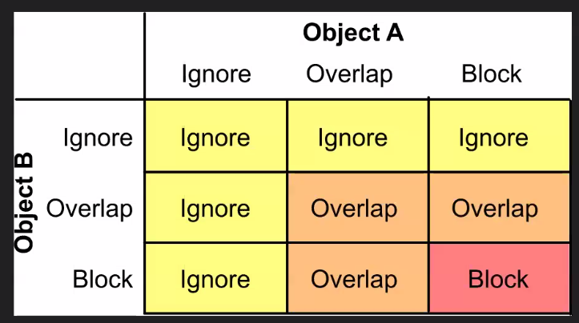
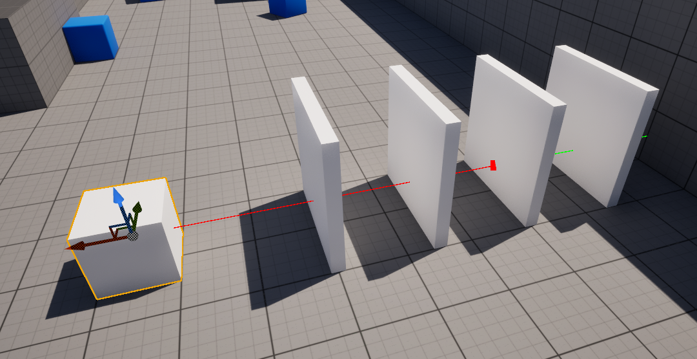
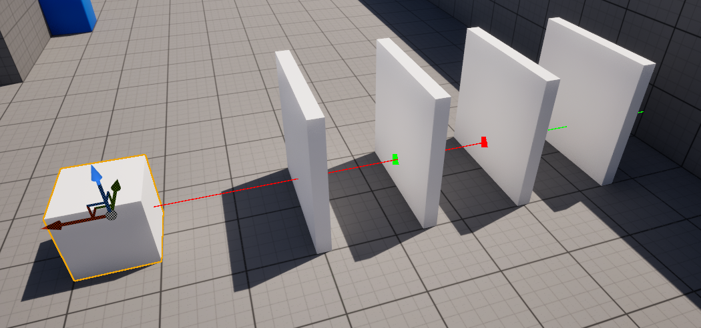

# 📅 2026-04-24 TIL

## 1. 오늘 학습 요약

* **학습 목표**: 
  * **코딩테스트** 문제풀이
  * **언리얼 심화 라이브 세션** 수강
  * **C++** 포인터와 레퍼런스의 차이 학습

* **학습 도구**: `Unreal Engine 5.5.4`, `Visual Studio 2022`

* **활동 내용**: 
  * 프로그래머스 **[귤 고르기](https://school.programmers.co.kr/learn/courses/30/lessons/138476)**, **[표 병합](https://school.programmers.co.kr/learn/courses/30/lessons/150366)**, **[호텔 방 배정](https://school.programmers.co.kr/learn/courses/30/lessons/64063)** 풀이
  * **라인 트레이스**의 종류 및 특징
  * **C++** 포인터와 레퍼런스

---

## 2. 프로그래머스 문제 풀이

### [귤 고르기](https://school.programmers.co.kr/learn/courses/30/lessons/138476)

```cpp
#include <string>
#include <vector>
#include <unordered_map>
#include <algorithm>

using namespace std;

int solution(int k, vector<int> tangerine) {
    int answer = 0;
    unordered_map<int, int> count;
    vector<pair<int, int>> orderedCount;
    
    // 각 크기의 귤 개수를 저장
    for(const int t : tangerine) count[t]++;
    
    // 귤 개수를 내림차 순으로 정렬
    for(const auto& [t, c] : count) orderedCount.push_back({c, t});
    sort(orderedCount.rbegin(), orderedCount.rend());
    
    // 가장 많은 수의 귤의 개수를 뺌
    for(const auto& [c, t] : orderedCount){
        k -= c;
        answer++;           // 귤의 종류 추가
        if(k <= 0) break;   // k가 0이 되면 종료
    }

    return answer;
}
```

* **그리디** 방식으로 해결
* 가장 많은 수의 귤의 개수만큼 빼는 것이 가장 효율적
* 개수의 **내림차순**으로 정렬한 후 `k`에서 개수를 뺄 때마다 종류의 개수를 1씩 추가
* `k`가 `0`보다 작아지면, 한 상자를 **모두 채운 것**이므로 반복을 멈춤

---

### [표 병합](https://school.programmers.co.kr/learn/courses/30/lessons/150366)

```cpp
#include <string>
#include <vector>
#include <sstream>

using namespace std;

// 문자열 나누기
vector<string> split(const string& str, const char c){
    vector<string> result;
    stringstream ss(str);
    string temp;
    while(getline(ss, temp, c)){
        result.push_back(temp);
    }
    return result;
}

// 병합된 셀의 루트를 찾음
pair<int, int> findRoot(const pair<int, int>& pos, vector<vector<pair<int, int>>>& root){
    int r = pos.first, c = pos.second;
    if(pos == root[r][c]) return pos;
    return root[r][c] = findRoot(root[r][c], root);
}

vector<string> solution(vector<string> commands) {
    vector<string> answer;
    vector<vector<string>> table(51, vector<string>(51, ""));               // 데이터를 저장
    vector<vector<pair<int, int>>> root(51, vector<pair<int, int>>(51));    // 병합 관계를 저장
    
    // 초기에는 모든 셀의 루트가 자신임
    for(int i=0; i<root.size(); i++)
        for(int j=0; j<root[i].size(); j++)
            root[i][j] = {i, j};
    
    for(const string& command : commands){
        vector<string> data = split(command, ' ');
        
        if(data[0] == "UPDATE"){
            if(data.size() == 4){
                int r1 = stoi(data[1]), c1 = stoi(data[2]);
                string value1 = data[3];
                
                // 병합된 경우, 루트의 데이터를 업데이트
                // 병합이 되지 않았으면, 자기 자신을 루트로 가리킴
                pair<int, int> target = findRoot({r1, c1}, root);
                table[target.first][target.second] = value1;
            }
            
            else{
                string value1 = data[1], value2 = data[2];
                for(int i=0; i<table.size(); i++)
                    for(int j=0; j<table[i].size(); j++)
                        if(table[i][j] == value1) table[i][j] = value2;
            }
        }
        
        else if(data[0] == "MERGE"){
            int r1 = stoi(data[1]), c1 = stoi(data[2]);
            int r2 = stoi(data[3]), c2 = stoi(data[4]);
            
            // 각각의 셀의 루트를 찾음
            pair<int, int> root1 = findRoot({r1, c1}, root);
            pair<int, int> root2 = findRoot({r2, c2}, root);
            if(root1 == root2) continue;
            
            string value1 = table[root1.first][root1.second];
            string value2 = table[root2.first][root2.second]; 
            
            // 앞의 셀의 데이터가 비어있는 경우, 뒤의 셀을 루트로 병합
            if(value1.empty() && !value2.empty()){
                root[root1.first][root1.second] = root2;
                table[root1.first][root1.second] = "";
            }

            // 위의 경우 외에는 모두 앞의 셀을 루트로 병합
            else{
                root[root2.first][root2.second]  = root1;
                table[root2.first][root2.second] = "";
            }
        }
            
        else if(data[0] == "UNMERGE"){
            int r1 = stoi(data[1]), c1 = stoi(data[2]);

            // 선택된 셀의 루트를 찾음
            pair<int, int> target = findRoot({r1, c1}, root);
            string temp = table[target.first][target.second];
            
            // 병합된 셀들을 찾아 childs에 저장
            vector<pair<int, int>> childs;
            for(int i=0; i<root.size(); i++){
                for(int j=0; j<root[i].size(); j++){
                    if(findRoot({i, j}, root) == target){
                        childs.push_back({i, j});
                    }
                }
            }
            
            // childs를 모두 병합을 해제
            for(const pair<int, int>& child : childs){
                int r2 = child.first, c2 = child.second;
                root[r2][c2] = {r2, c2};
                table[r2][c2] = "";
            }
            
            // 선택된 셀의 데이터를 업데이트
            table[r1][c1] = temp;
        }
        
        else if(data[0] == "PRINT"){
            int r1 = stoi(data[1]), c1 = stoi(data[2]);

            // 루트의 데이터를 출력
            pair<int, int> target = findRoot({r1, c1}, root);
            int tr = target.first, tc = target.second;
            
            if(table[tr][tc].empty()) answer.push_back("EMPTY");
            else answer.push_back(table[tr][tc]);
        }
    }
    return answer;
}
```

* **Union-Find** 알고리즘을 활용해 해결
* 두 셀을 합치는 것은 **Union** 연산이고 루트를 찾는 것은 **Find** 연산임
* 단순히 **Union-Find** 만 사용하는 문제가 아니라, **구현**이 상당히 어려운 문제

---

### [호텔 방 배정](https://school.programmers.co.kr/learn/courses/30/lessons/64063)

```cpp
#include <string>
#include <vector>
#include <unordered_map>

using namespace std;

long long findRoom(unordered_map<long long, long long>& roomMap, long long room){
    if(roomMap.find(room) == roomMap.end()){
        roomMap[room] += room + 1;
        return room;
    }
    
    return roomMap[room] = findRoom(roomMap, roomMap[room]);
}

vector<long long> solution(long long k, vector<long long> room_number) {
    vector<long long> answer;
    unordered_map<long long, long long> roomMap;
    
    for(const long long& room : room_number)
        answer.push_back(findRoom(roomMap, room));

    return answer;
}
```

* **Union-Find** 알고리즘을 활용해 해결
* `k`가 무려 `10^12`씩이나 되기에, `vector`를 생성하여 하는 것은 **불가능**함
* 그렇기에 `k`는 사실상 의미가 없고, `room_number`를 입력받을 때마다 방을 배정해 줘야 함
* `roomMap[index] = value`에서 `index`는 방 번호, `value`는 들어갈 수 있는 다음 방을 의미함
* 최악의 경우 `O(n^2)`의 시간 복잡도를 갖기 때문에(`room_number`가 **모두 같은 숫자**인 경우) find 도중에 들어갈 수 있는 다음 방을 업데이트해 줘야 함

---

## 3. Line Trace의 종류와 특징

* **UE5**에서 두 지점 사이에서 **어떤 물체가 존재하는지** 확인하는 방법 중 하나
* **Line Trace**는 크게 **Single Line Trace**와 **Multi Line Trace** 두 가지로 나눌 수 있음
* **Line Trace**는 **채널**을 기반으로 물체를 감지하는 `LineTraceByChannel`와 **오브젝트**를 기반으로 물체를 감지하는 `LineTraceForObjects`로 나뉨
* `LineTraceByChannel`은 액터의 채널과 **Response**를 기반으로 물체를 감지하며, `LineTraceForObjects`는 액터의 **Object Type** 설정을 기반으로 물체를 감지함
* 해당 글에서는 `LineTraceByChannel`에 대해서 작성

### Channel Response
* Trace Channel에 대한 Response는 총 3가지로 나누어짐
* `Ignore`: 해당 채널의 액터에 대해서는 어떠한 판정도 발생하지 않고 **통과**함
* `Overlap`: 충돌이 발생하지 않고 **트레이스가 통과**하지만, **HitResult가 배열에 저장**됨
* `Block`: 충돌이 발생해 **트레이스가 중단**되고, HitResult가 저장됨

    
* 위 표는 **두 오브젝트가 충돌**했을 때, 각각의 Response 설정에 따라서 **어떤 Response가 발생**하는 지의 표
* **Trace**는 `Block`의 Response를 가진 채로 진행됨

### Single Line Trace

* **Line Trace** 중 물체와 충돌할 경우 **즉시 트레이스를 멈추고** 충돌 결과를 반환함 
* 첫 번째로 만난 **Block** Response에 대해서 충돌 결과를 반환
* Response가 **Ignore**, **Overlap**인 경우 총돌 처리를 하지 않음

    

* 위 사진의 벽은 순서대로 Ignore, Overlap, Block, Overlap의 Response로 설정됨
* **Single Line Trace** Block Response로 설정된 세 번째 벽에 대해서만 충돌 판정이 발생

### Multi Line Trace

* **Single Line Trace** 와 동일하게 **Block** Response와 충돌하면 트레이스를 멈춤
* 하지만, 충돌 이전에 만난 **Overlap** Response 또한 **HitResult** 배열에 저장 됨

    

* **Multi Line Trace**의 경우 **Overlap** Response로 설정된 두 번째 벽 또한 감지 됨
* **Block** Response 이후에 있는 네 번째 벽은 감지되지 않음

--- 

### 4. 포인터와 레퍼런스

### 포인터
* 다른 변수나 객체의 **메모리 주소**를 저장하는 **타입**
* **Null**값을 가질 수 있으며, 언제든 **초기화** 및 **재할당**이 가능함
* `*` 연산자로 역참조 할 수 있으며, 메모리가 가리키는 **실제 객체에 접근**할 수 있음
* 역참조한 경우 `->` 연산자로 해당 **객체의 멤버에 접근**할 수 있음
* 포인터는 메모리 주소이기에 덧셈, 뺄셈 등의 **산술 연산**이 가능함

### 레퍼런스
* 새로운 메모리를 할당하는 것이 아닌, 이미 존재하는 변수나 객체에 대하여 **별칭(Alias)** 을 붙이는 것
* 레퍼런스는 선언 시, 어떤 객체를 참조하는지 **반드시 초기화** 해야 함
* 또한, 한번 초기화된 레퍼런스는 **재할당이 불가능** 함
* 문법적으로 **Null**값을 가질 수 없으며, 항상 유효한 객체만을 참조해야 함 (댕글링 포인터를 역참조하면 초기화 가능하지만, **미정의 동작**)
* 원본 객체와 동일하게 `.` 연산자로 **객체의 멤버에 접근** 가능
* 레퍼런스를 통해 객체의 값을 수정하면, **원본 객체의 값도 변경**됨

### 차이점

* **포인터**는 `nullptr`을 값으로 가질 수 있기 때문에, 사용하기 전 반드시 `if(ptr != nullptr)` 과 같이 체크를 해야하지만, **레퍼런스**는 문법적으로 Null값을 갖는 것을 방지하기에 보다 **안정성**이 높음

* **포인터**는 실행 도중 산술 연산, 재할당이 가능하기에 **연결 리스트** 같은 자료 구조나, **이터레이터**를 사용하는데 적합함

