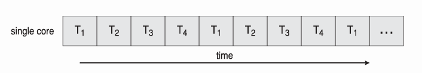
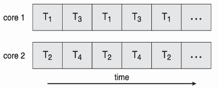
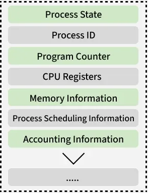
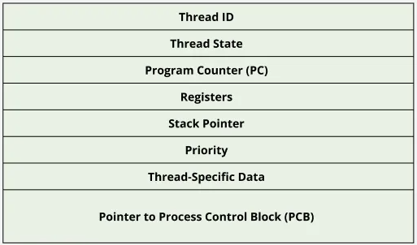
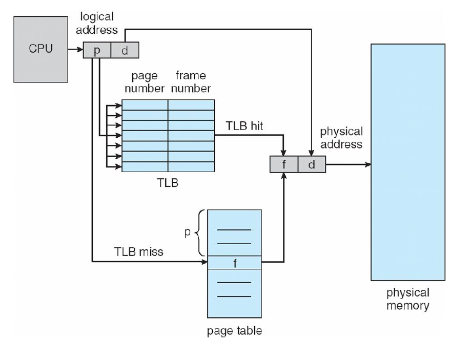
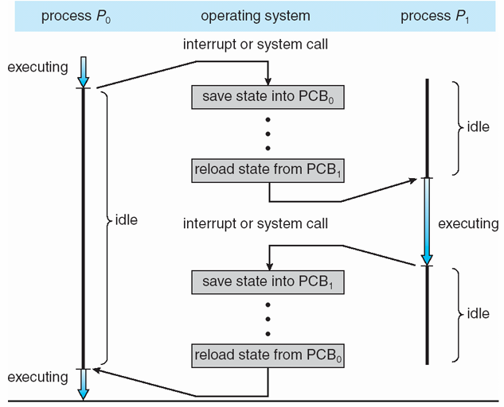

# 📅 2026-05-11 TIL

## 1. 오늘 학습 요약

* **학습 목표**: 
  * **코딩테스트** 문제풀이
  * **컨텍스트 스위칭 (Context Switching)**
* **학습 도구**: `Unreal Engine 5.5.4`, `Visual Studio 2022`

* **활동 내용**: 
  * 프로그래머스 **[K번째수](https://school.programmers.co.kr/learn/courses/30/lessons/42748)**, **[개인정보 수집 유효기간](https://school.programmers.co.kr/learn/courses/30/lessons/150370)** 풀이
  * **컨텍스트 스위칭 (Context Switching)** 의 정의
  * **동시성**과 **병렬성**의 정의
  * **PCB**와 **TCB**
  * **MMU**와 **TLB**
---

## 2. 프로그래머스 문제 풀이

### [K번째수](https://school.programmers.co.kr/learn/courses/30/lessons/42748)

```cpp
#include <string>
#include <vector>
#include <algorithm>
using namespace std;

vector<int> solution(vector<int> array, vector<vector<int>> commands) {
    vector<int> answer;
    for(const vector<int>& command : commands){
        vector<int> arr(array.begin()+command[0]-1, array.begin()+command[1]);
        sort(arr.begin(), arr.end());
        answer.push_back(arr[command[2]-1]);
    }
    return answer;
}
```

* **정렬** 문제
* 주어진 범위의 벡터를 이터레이터로 복사한 후 정렬
* 그 후 복사한 벡터의 k번째 수를 출력하면 됨

---

### [개인정보 수집 유효기간](https://school.programmers.co.kr/learn/courses/30/lessons/150370)

```cpp
#include <string>
#include <vector>
#include <sstream>
#include <unordered_map>
#include <algorithm>
using namespace std;
vector<string> split(const string& str, char c){
    string temp;
    vector<string> result;
    stringstream ss(str);
    while(getline(ss, temp, c))
        result.push_back(temp);
    return result;
}

int calcTime(const vector<string>& day){
    return stoi(day[0])*12*28 + stoi(day[1])*28 + stoi(day[2]);
}
vector<int> solution(string _today, vector<string> terms, vector<string> privacies) {
    vector<int> answer;
    int today = calcTime(split(_today, '.'));
    unordered_map<string, int> deadline;
    
    // 
    for(const string& term : terms){
        vector<string> temp = split(term, ' ');
        string alpha = temp[0];
        deadline[alpha] = stoi(temp[1]) * 28;
    }

    for(int i=0; i<privacies.size(); i++){
        vector<string> temp = split(privacies[i], ' ');
        string alpha = temp[1];
        int day = calcTime(split(temp[0], '.')) + deadline[alpha];
        if(day <= today) answer.push_back(i+1);
    }
        
    return answer;
}
```

* **문자열**, **해시맵**을 활용하는 문제
* 문자열의 날짜를 **int**형의 날짜로 변경한 후 연산 및 비교
* 문자열만으로는 **파기 날짜**를 계산하기 힘듦

---

### [[PCCP 기출문제] 2번 / 퍼즐 게임 챌린지](https://school.programmers.co.kr/learn/courses/30/lessons/340212)

```cpp
#include <string>
#include <vector>

using namespace std;
bool check(const vector<int>& diffs, const vector<int>& times, long long limit, int level){
    long long time = 0;
    for(int i=0; i<diffs.size(); i++){
        if(level < diffs[i]) time += (diffs[i] - level) * (times[i] + times[i-1]);
        time += times[i];
        if(time > limit) return false;
    }
    return true;
}
int solution(vector<int> diffs, vector<int> times, long long limit) {
    int answer = 0;
    int left = 1, right =  100000;
    while(left<=right){
        int mid = left + (right - left) / 2;
        
        if(check(diffs, times, limit, mid)){
            right = mid - 1;
            answer = mid;
        }
        else left = mid + 1;
    }
    return answer;
}
```

* **이분탐색** 문제
* `diffs[0] = 1`은 1이라는 조건이 있으므로, 첫 번째 문제부터 못 푸는 경우는 없음
* 현재 숙련도로 모든 문제를 시간 안에 푸는지를 기준으로 이분탐색을 돌리면 됨

--- 

## 3. 컨텍스트 스위칭 (Context Switching)

* **컨텍스트 스위칭(Context Switching)** 은 하나의 CPU가 현재 실행 중인 프로세스, 스레드를 전환하는 것

* **CPU**는 한 번에 하나의 작업만을 수행하므로 다른 작업을 실행하기 위해서는 **컨텍스트 스위칭**을 해야 함

### 동시성(Concurrency)과 병렬성(Parallelism)

* **동시성(Concurrency):** 실제로는 하나의 CPU가 **하나의 작업**을 수행하지만, 작업을 잘게 나누고 간격을 매우 좁게 해 마치 **동시에 실행되는 것처럼 보이게**하는 것

    

* **병렬성(Parallelism):** 실제로 **여러 개의 CPU**로 여러 작업을 **동시에 실행**하는 것

    

### 컨텍스트(Context)란?
* **CPU**가 프로세스를 실행하기 위해 필요한 **프로세스의 작업 상태**를 저장한 데이터

* **컨텍스트(Context)** 는 크게 하드웨어 컨텍스트, 주소 공간, 커널 컨텍스트로 나눌 수 있음

    * **하드웨어 컨텍스트 (Hardware Context):** 레지스터(Register)에 저장되어 있는 데이터
        * **PC(Program Counter):** 다음에 실행할 명령어의 주소
        * **SP(Stack Pointer):** 작업의 스택 최상단을 가리키는 포인터
        * **레지스터(Register):** CPU에서 작업 중인 데이터를 다양한 레지스터에 저장
    * **주소 공간 (Address Space):** 프로세스가 할당받은 주소 공간
        * **Code:** 실제로 작성한 코드가 기계어로 번역되어 저장
        * **Data:** 프로그램의 전역 변수, static 변수, const 변수의 데이터를 저장
        * **Heap:** 런타임 중 동적으로 할당되는 데이터를 저장
        * **Stack:** 함수 호출과 관련된 데이터를 임시로 저장
    * **커널 컨텍스트 (Kernel Context):** **OS**가 프로세스를 관리하기 위해 저장한 데이터
        * **PCB/TCB:** 프로세스, 스레드의 **메타데이터**를 저장하는 데이터 블록
        * **커널 스택(Kernel Stack):** **시스템 콜** 호출 시 사용하는 스택

### 컨텍스트 스위칭이 필요한 이유
* **동시성(Concurrency)** 을 통한 사용자 경험 증가
* 긴 작업이 CPU를 독점하는 것을 방지해 **반응성(Responsiveness)** 을 높임
* **I/O** 작업 중 다른 프로세스로 전환해 CPU의 **사용률(Utilization)** 을 높임 

### PCB (Process Control Block)
* OS가 **프로세스**를 관리하기 위해 필요한 데이터를 저장하는 **자료구조**
* 프로세스의 **상태 관리**와 **컨텍스트 스위칭**을 위해서 필요
* 프로세스가 생성될 때 **고유한 PCB**를 생성하며, 소멸할 때 같이 소멸
* **PCB**에 저장된 데이터는 OS마다 다르지만 일반적으로 아래와 같음

    
    
    * **프로세스 상태 (Process State):** 프로세스의 **실행 상태**
        * **생성(New):** 프로세스가 생성되는 상태
        * **준비(Ready):** 프로세스가 생성이 완료되어 실행을 기다리는 상태
        * **실행(Running):** 프로세스가 CPU에서 실행 중인 상태
        * **대기(Waiting):** CPU를 할당받아도 바로 실행할 수 없는 상태
        * **종료(Terminated):** 실행이 완료되어 제거되는 상태
    * **프로세스 식별자 (Process ID):** 프로세스의 **고유 ID**
    * **프로그램 계수기 (Program Counter):** 다음에 실행할 명령어의 주소
    * **CPU 레지스터 (CPU Register):** CPU 내부 레지스터들의 **백업본**을 저장
    * **메모리 관리 정보 (Memory Information):** 페이지 테이블 등의 메모리 정보
    * **CPU 스케줄링 정보 (Process Scheduling Information):** 프로세스의 우선순위와 스케쥴링 큐를 가리키는 포인터
    * **계정 정보 (Accounting Information)**: 프로세스가 CPU를 사용한 총 시간 등의 데이터
    * **입출력 상태 정보 (I/O Status Information)** 프로세스가 사용 중인 입출력 장치 등의 데이터

### TCB (Thread Control Block)
* OS가 **스레드**를 관리하기 위해 필요한 데이터를 저장하는 **자료구조**
* 스레드의 **상태 관리**와 **스레드 컨텍스트 스위칭**을 위해서 필요
* 스레드가 생성될 때 **고유한 TCB**를 생성하며, 소멸할 때 같이 소멸
* TCB는 PCB와 연결 리스트 방식으로 생성되며, **PCB의 데이터를 공유**해 사용

    

    * **스레드 식별자 (Thread ID):** 스레드의 **고유 ID**
    * **스레드 상태 (Thread State):** 스레드의 **실행 상태**
    * **프로그램 계수기 (Program Counter):** 다음에 실행할 명령어의 주소
    * **레지스터 (Registers):** CPU 내부 레지스터들의 **백업본**을 저장
    * **스택 포인터 (Stack Pointer):** 각 스레드의 스택 포인터
    * **우선순위 (Priority):** 스레드의 실행 우선순위
    * **스레드 전용 데이터 (Thread-Specific Data):** 해당 스레드만 사용하는 데이터
    * **PCB 포인터 (Pointer to Process Control Block):** 속한 프로세스의 PCB를 가리키는 포인터

### MMU (Memory Management Unit)
* **CPU**는 물리 주소에 접근할 때, 실제 물리 주소로 접근하는 것이 아닌 **가상 주소로 접근**함
* **MMU**는 CPU가 접근한 가상 주소를 **물리 주소로 변환**하는 역할을 함

### TLB (Translation Lookaside Buffer)
* OS는 가상 메모리를 효율적으로 관리하기 위해 **페이징(Paging)**, **멀티 레벨 페이지 테이블(Multi-Level Page Table)** 을 사용
* 가상 주소를 통해 실제 주소로 접근하기 위해서는 **각 레벨의 테이블을 검색**해야 함
* 이러한 과정을 효율적으로 처리하기 위하여 가상 주소와 실제 주소를 매핑한 **TLB 캐시**를 사용
* **TLB Hit:** CPU가 접근한 가상 주소가 TLB 캐시에 있는 경우, 물리 주소로 바로 접근
* **TLB Miss:** CPU가 접근한 가상 주소가 TLB 캐시에 없는 경우, 테이블을 직접 검색해야 하며 이는 큰 오버헤드를 가짐
* 대부분의 프로세스는 **공간 지역성(Spatial Locality)** 을 갖기에, 히트율이 매우 높은 편

    

### 컨텍스트 스위칭의 동작 과정
* **컨텍스트 스위칭**은 **멀티태스킹**, **인터럽트**, **시스템 콜**에 의하여 발생하며 **커널 모드**에서 **OS가 실행**함
* **실행(Running)** 상태인 프로세스 `P0`, **대기(Waiting)** 프로세스 `P1`간의 **컨텍스트 스위칭** 과정은 아래와 같음

    

    **1.** `P0` 실행 중 **인터럽트** 혹은 **시스템 콜**로 인하여 OS가 `P0`을 정지시킴

    **2.** `P0`의 PCB를 저장

    **3.** 유휴 상태인 `P1`의 PCB를 로드 후 실행

    **4.** 또 다른 **인터럽트** 혹은 **시스템 콜**이 발생해 OS가 `P1`을 정지시킴

    **5.** `P1`의 PCB를 저장

    **6.** 유휴 상태인 `P0`의 PCB를 로드 후 실행

### 컨텍스트 스위칭의 오버헤드
* **컨텍스트 스위칭**의 과정에는 오버헤드가 존재함

* 대표적인 **컨텍스트 스위칭의 오버헤드**는 아래의 3가지가 있음
    * **PCB/TCB 저장 및 로드:** PCB/TCB를 저장, 로드하는 중에는 어떠한 프로세스도 실행할 수 없음
    * **캐시 오염(Cache Pollution):** 프로세스가 변경되며 캐시에 저장된 데이터가 쓸모없어짐

    * **TLB 플러시 (TLB Flush):** 프로세스가 변경되면서 사용하는 메모리가 변경되었기에, **TLB 캐시를 모두 비워야 함** 이후 TLB 캐시를 채우는 과정이 모두 **TLB Miss**이므로 매우 큰 오버헤드를 가짐

* **스레드 컨텍스트 스위칭**은 TCB 저장 및 로드, 캐시 오염이 더 가벼우며 TLB 플러시가 발생하지 않기에 **프로세스 컨텍스트 스위칭**에 비하여 오버헤드가 매우 적음

---

## 4. 참고 자료
* [완전히 정복하는 프로세스 vs 스레드 개념](https://inpa.tistory.com/entry/%F0%9F%91%A9%E2%80%8D%F0%9F%92%BB-%ED%94%84%EB%A1%9C%EC%84%B8%EC%8A%A4-%E2%9A%94%EF%B8%8F-%EC%93%B0%EB%A0%88%EB%93%9C-%EC%B0%A8%EC%9D%B4#%ED%94%84%EB%A1%9C%EC%84%B8%EC%8A%A4_%EC%83%81%ED%83%9C)
* [BJ.6 컨텍스트 스위칭 뽀개기! 의미와 종류와 왜 스레드 컨텍스트 스위칭이 더 빠르다고 하는지까지..! 이 모든 것을 시원~~하게 설명합니다!!](https://www.youtube.com/watch?v=Xh9Nt7y07FE&list=PLcXyemr8ZeoQOtSUjwaer0VMJSMfa-9G-&index=5)
* [기술 면접 단골 질문 '동시성과 병렬성' 간편 정리](https://yozm.wishket.com/magazine/detail/2996/)
* [스레드 04. 컨텍스트 스위칭(Context Switching)](https://jinn-blog.tistory.com/208#google_vignette)
* [[OS] 프로세스 관리, 프로세스 문맥(context)](https://zangzangs.tistory.com/108)
* [Process control block](https://en.wikipedia.org/wiki/Process_control_block)
* [Process Control Block in OS](https://www.geeksforgeeks.org/operating-systems/process-control-block-in-os/)
* [Thread Control Block in Operating System](https://www.geeksforgeeks.org/operating-systems/thread-control-block-in-operating-system/)