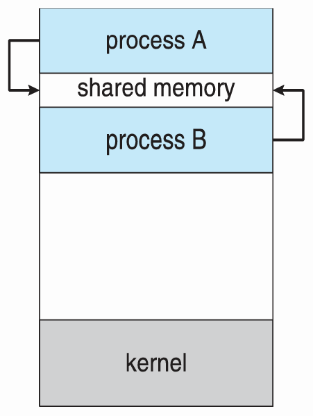
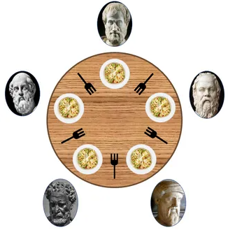
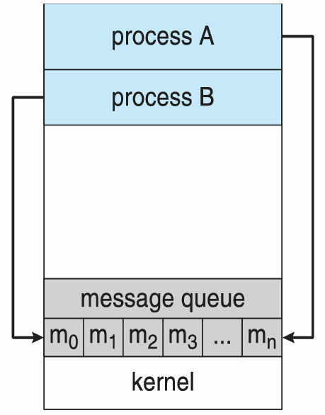

# 📅 2026-05-12 TIL

## 1. 오늘 학습 요약

* **학습 목표**: 
  * **코딩테스트** 문제풀이
  * **IPC**의 개념과 종류
* **학습 도구**: `Unreal Engine 5.5.4`, `Visual Studio 2022`

* **활동 내용**: 
  * 프로그래머스 **[두 개 뽑아서 더하기](https://school.programmers.co.kr/learn/courses/30/lessons/68644)**, **[성격 유형 검사하기](https://school.programmers.co.kr/learn/courses/30/lessons/118666)**, **[단어 퍼즐](https://school.programmers.co.kr/learn/courses/30/lessons/12983)** 풀이
  * **IPC**의 개념
  * **IPC**의 종류
---

## 2. 프로그래머스 문제 풀이

### [두 개 뽑아서 더하기](https://school.programmers.co.kr/learn/courses/30/lessons/68644)

```cpp
#include <string>
#include <vector>
#include <set>
using namespace std;

vector<int> solution(vector<int> numbers) {
    vector<int> answer;
    set<int> s;
    for(int i=0; i<numbers.size(); i++)
        for(int j=i+1; j<numbers.size(); j++)
            s.insert(numbers[i] + numbers[j]);
        
    for(const int sum : s)
        answer.push_back(sum);
    
    return answer;
}
```

* **완전 탐색** 문제
* 이중 반복문으로 가능한 모든 조합을 **set**에 저장
* 정렬된 상태이므로 set을 순서대로 출력

---

### [성격 유형 검사하기](https://school.programmers.co.kr/learn/courses/30/lessons/118666)

```cpp
#include <string>
#include <vector>
#include <unordered_map>
using namespace std;

string solution(vector<string> survey, vector<int> choices) {
    string answer = "";
    unordered_map<char, int> score;
    
    for(int i=0; i<survey.size(); i++){
        if(choices[i] > 4) score[survey[i][1]] += (choices[i] - 4);
        else if(choices[i] < 4) score[survey[i][0]] += choices[i] * 3 % 4;
    }
    answer += score['R'] >= score['T'] ? 'R': 'T';
    answer += score['C'] >= score['F'] ? 'C': 'F';
    answer += score['J'] >= score['M'] ? 'J': 'M';
    answer += score['A'] >= score['N'] ? 'A': 'N';
    return answer;
}
```

* **문자열**, **해시맵**을 활용하는 문제
* 각 질문과 점수의 상태에 따라 **해시맵**에 점수를 더함

---

### [단어 퍼즐](https://school.programmers.co.kr/learn/courses/30/lessons/12983)

* **정답 코드**
    ```cpp
    #include <iostream>
    #include <string>
    #include <vector>
    #include <unordered_set>
    using namespace std;

    int solution(vector<string> strs, string t)
    {
        vector<int> dp(t.size()+1, 20001);
        dp[0] = 0;

        // 각 길이 별 단어 조각을 저장하는 해시셋
        vector<unordered_set<string>> strSet(6);
        for(int i=0; i<strs.size(); i++)
            strSet[strs[i].length()].insert(strs[i]);
        
        for(int i=0; i<dp.size(); i++){
            if (dp[i] == 20001) continue;
            for(int j=1; j<6; j++){ 
                if(i + j > t.size()) break;
                if(strSet[j].count(t.substr(i, j))) // i번째 위치에서 j길이의 단어 조각을 붙일 수 있으면
                    dp[i + j] = min(dp[i + j], dp[i] + 1);  // i+j 번째 위치의 값을 업데이트
            }
        }
        
        return dp[t.size()] == 20001 ? -1 : dp[t.size()];
    }
    ```
* **오답 코드**
    ```cpp
    #include <iostream>
    #include <string>
    #include <vector>
    using namespace std;

    int solution(vector<string> strs, string t)
    {
        vector<int> dp(t.size()+1, 20001);
        dp[0] = 0;
        
        for(int i=0; i<dp.size(); i++){
            if (dp[i] == 20001) continue;
            for(int j=0; j<strs.size(); j++){ 
                if(i + strs[j].size() > t.size()) continue;
                if(t.compare(i, strs[j].size(), strs[j]) == 0) 
                    dp[i + strs[j].size()] = min(dp[i + strs[j].size()], dp[i] + 1);
            }
        }
        
        return dp[t.size()] == 20001 ? -1 : dp[t.size()];
    }
    ```
* **DP** 문제
* **시간 초과**를 해결하는 데 오래 걸림
* 오답 코드는 **모든 단어 퍼즐에 대하여 비교 연산**을 하기에 연산량이 많음
* **해시셋**을 이용해 비교 연산이 아닌 **단어 퍼즐의 유무만 확인**하여 **DP**를 업데이트
* `t <= 20,000`, `strs.size() <= 100`, `str[i].length() <= 5`이기에 최대 연산 횟수는 약 `1,000만`
* 충분히 시간 안에 통과될 코드인데 시간이 너무 빡빡한듯
* 과거의 다른 사람들의 풀이를 보면 오답 코드의 방식으로 푼 풀이가 많음

--- 

## 3. IPC (Inter-Process Communication)

### 독립 프로세스와 협력 프로세스

* **독립 프로세스 (Independent Processes):** 다른 프로세스의 **영향을 받지도, 영향을 주지도 않는** 프로세스
    * 자신의 작업에 필요한 모든 자원을 **독립적으로 관리** 함
    * 시스템 내에서 다른 프로세스의 상태, 실행에 의존성 없이 **독립적으로 실행**됨
    * 다른 프로세스들과 명시적인 **데이터 공유, 통신이 없음**

* **협력 프로세스 (Cooperating Processes):** 다른 프로세스와 데이터 공유 등의 **영향을 주고받는** 프로세스
    * 프로세스 간 **데이터의 공유나 통신**이 발생
    * 프로세스 사이의 **동기화**가 필요
    * **IPC**를 통해 서로 데이터를 주고받음

### IPC (Inter-Process Communication)란
* 협력 프로세스 사이에서 **다른 프로세스와 데이터의 공유, 통신**을 할 수 있게 하는 **운영체제에서 제공하는 메커니즘**
* 프로세스는 기본적으로 **독립된 메모리 공간**에서 실행되기에 서로 통신을 막음
* 이러한 제약을 해결하기 위해 OS에서 다양한 **통신 방법**을 제공
* IPC는 두 가지의 대표적 방식으로 **공유 메모리 (Shared Memory)** 와 **메시지 전달 (Message Passing)** 이 있음

### IPC가 필요한 이유

* **정보 공유 (Information Sharing):** 서로 다른 프로세스가 **동일한 데이터에 접근** 해야 하는 경우

* **모듈화 (Modularity):** 거대한 시스템을 기능별로 **모듈화** 하여 관리하는 것이 더 효율적

* **계산 속도 향상 (Computation Speedup):** 프로세스의 **병렬성**을 높여 성능을 향상

* **편의성 (Convenience):** 동시에 **여러 가지 작업을 수행**하여 편의성 향상

---

## 4. 공유 메모리 (Shared Memory)



* 다수의 프로세스가 **동일한 메모리 공간**을 공유하여 데이터를 주고받는 방식
* 초기 메모리 할당 시에는 비용이 크지만, 데이터 전송 중 **커널의 개입 없이** 바로 접근 가능하기에 데이터가 많다면 **매우 빠른 속도**를 가짐
* 여러 프로세스가 동일한 메모리 공간에 접근하기에 **레이스 컨디션**으로 인한 **동기화** 문제가 발생할 수 있음

### 생산자-소비자 문제 (Producer-Consumer Problem)
* 공유하는 버퍼에 데이터를 넣는 **생산자**와 데이터를 빼는 **소비자**가 동시에 버퍼에 접근할 때 발생하는 문제
* **상호 배제 (Mutual Exclusion):** 생산자와 소비자가 **동시에 버퍼에 접근** 을 막는 것
* **오버플로우 (Overflow):** 버퍼가 가득찼을 때, 생산자가 버퍼에 데이터를 넣는 것
* **언더플로우 (Underflow):** 버퍼가 비었을 때, 소비자가 버퍼에서 데이터를 꺼내는 것
* **Mutex**, **Full 세마포어**, **Empty 세마포어**를 두어 위 문제를 해결 가능

### 독자-저자 문제 (Readers-Writers Problem)
* 공유하는 데이터를 읽는 **독자**와 쓰는 **저자**가 동시에 접근할 때 발생하는 문제
* **독자**는 동시에 데이터를 읽을 수 있지만, **저자**는 **상호 배제**를 지켜야만 함
* **Readcount**, **Wrt 세마포어**, **Mutex**를 활용하여 해결
* 독자가 있는 경우 저자의 접근을 막고, 저자가 접근할 때 모든 접근을 막는 식으로 구현

### 식사하는 철학자 문제 (Dining-Philosophers Problem)


* 운영체제의 **교착 상태 (Deadlock)** 를 설명하는 문제

* 위 그림과 같이 원형 테이블에 5명의 철학자와 5개의 포크가 있는 상황에서 각 철학자가 아래의 순서로 식사한다고 하자

    ```
    1. 일정 시간 생각을 한다.
    2. 왼쪽 포크가 사용 가능해질 때까지 대기한다. 만약 사용 가능하다면 집어든다.
    3. 오른쪽 포크가 사용 가능해질 때까지 대기한다. 만약 사용 가능하다면 집어든다.
    4. 양쪽의 포크를 잡으면 일정 시간만큼 식사를 한다.
    5. 오른쪽 포크를 내려놓는다.
    6. 왼쪽 포크를 내려놓는다.
    7. 다시 1번으로 돌아간다.
    ```
    
* 위 순서로 식사할 경우 **모든 철학자가 왼쪽 포크**를 들게 되면, 아무도 식사를 할 수 없는 **교착 상태 (Deadlock)** 에 빠지게 됨

* 이러한 문제는 아래의 방법으로 해결할 수 있지만, 특정 철학자가 **무기한 대기**하는 **기아 (starvation)** 문제는 해결하지 못함
    * 한 번에 **최대 4명**의 철학자만 앉을 수 있게 함
    * 양쪽의 포크를 둘 다 들 수 있을 때만 포크를 **동시에** 들게 함
    * 철학자에게 **번호를 부여**하여 홀수는 왼쪽 포크를 먼저, 짝수는 오른쪽 포크를 먼저 들게 함

* 아래 3개의 자료구조를 활용하여 **교착 상태**를 완전히 해결할 수 있으며, **기아 상태**는 거의 해결되지만 이론적으로는 발생할 수 있음
* 기아 상태를 완전히 해결하기 위해서는 **큐**, **우선 순위**를 도입할 수 있음
    * `State[5]:` 각 철학자의 상태(THINKING, HUNGRY, EATING)를 기록 
    * `mutex:` 포크의 상호 배제를 만족시킴
    * `Self[5]:` 각 철학자가 양 옆의 포크를 사용할 수 있는지 여부를 표시하는 세마포어

---

## 5. 메시지 전달 (Message Passing)



* 시스템 콜 호출로 **커널**을 통해 **메시지를 전달**해 데이터를 주고받는 방식
* 커널이 데이터를 관리해 주므로 **구현이 쉽고 안전함**
* 두 번의 시스템 콜로 인한 **데이터 복사**, 메시지 전달 시 커널 모드로의 변환으로 인해 **오버헤드가 큼**
* **소량의 데이터**만 전달한다면, 공유 메모리보다 효율적
* **메시지 전달**은 아래 특징에 따라 분류할 수 있음
    
### 통신 방식
* **직접 통신 (Direct Communication)**
    * 통신하는 프로세스의 **이름을 명시적으로 지정**하는 통신 방법
    * `send(P, message)`, `receive(Q, message)`와 같이 프로세스의 이름 **P**, **Q**를 명시
    * **구현이 간단**하지만 **유연성**이 떨어짐
    
* **간접 통신 (Indirect Communication)**
    * 통신하는 프로세스 사이에 **메일 박스 (Mail Box)** 를 두고 통신하는 방법
    * `send(A, message)`, `receive(A, message)`와 같이 메일 박스의 이름 **A**를 명시
    * **다대다 통신**이 가능하며, **유연성이 상승**하지만 **구현이 복잡**할 수 있음

### 동기화 여부
* **동기식 (Synchronous)**
    * **Blocking Send:** 수신자가 메시지를 받을 때까지 송신자는 기다려야 함
    * **Blocking Receive:** 수신자는 메시지가 올 때까지 기다려야 함
    * 데이터의 **전달을 보장**하지만, **CPU 유효율(Utilization)** 이 떨어짐

* **비동기식 (Asynchronous)**
    * **Non-Blocking Send:** 송신자는 수신자의 수신 여부에 상관없이 메시지를 송신 후 자신의 작업을 실행함
    * **Non Blocking Receive:** 수신자는 메시지를 수신받기 전까지 자신의 작업을 실행하다가 수신받은 후 메시지를 처리함
    * **병렬성**이 상승하지만, 설계 및 구현이 **복잡함**

### 버퍼 크기
* **무용량 (Zero capacity)**
    * 버퍼가 **없음**
    * 송신자는 **반드시** 수신자를 기다려야 함 (랑데뷰 방식) 

* **유한 용량 (Bounded Capacity)**
    * **유한한 크기**의 버퍼가 정해져 있음
    * **버퍼가 가득 찼을 경우** 송신자는 버퍼가 빌 때까지 기다려야 함

* **무한 용량 (Unbounded Capacity)**
    * 버퍼 크기에 **제한이 없음**
    * 송신자는 **기다리지 않고** 계속 메시지를 보낼 수 있음

### 메시지 전달의 종류

* **익명 파이프 (Anonymous Pipe)**
    * 부모 프로세스에서 자식 프로세스로 데이터를 송신하는 데 주로 사용하는 **단방향 통신** 방식
    * **부모-자식**, **형제 관계**의 프로세스만 사용 가능
    * **구현이 단순**하지만 **유연성**이 떨어짐
    * 기본적으로 **직접 통신**, **동기식**, **유한 용량**의 버퍼의 특징 가짐

* **명명된 파이프 (Named Pipe)**
    * 파일 시스템에 **파일로 존재**하는 파이프 프로세스의 **관계에 무관하게 통신**이 가능
    * 익명 파이프와 동일하게 **단방향 통신** 방식
    * 파이프가 **메일 박스**의 역할을 하기에 **간접 통신**, **동기식**, **유한 용량**의 버퍼의 특징 가짐

* **메시지 큐 (Message Queue)**
    * **큐를 통해 통신**하는 것은 파이프와 동일하지만, 데이터를 **메시지 단위**로 통신
    * 메시지의 **타입**을 통해 선택적인 통신이나 우선순위를 둘 수 있으며, **양방향 통신**이 가능
    * 큐를 통한 **간접 통신**, **비동기식**, **유한 용량** 버퍼의 특징을 가짐

* **소켓 (Sockets)**
    * 네트워크로 연결된 **다른 컴퓨터**의 프로세스와 통신이 가능
    * **IP**와 **포트 번호**를 통하여 통신 대상을 구분
    * 소켓은 **TCP** 혹은 **UDP** 방식으로 데이터를 주고받음
    * 데이터가 동시에 양방향으로 흐르는 **전이중 통신**을 지원
    * 소켓은 **서버-클라이언트** 구조의 **직접 연결**, **동기식**의 특징을 가짐

* **원격 프로시저 호출 (Remote Procedure Call)**
    * 네트워크로 연결된 **원격 서버**에 존재하는 **함수를 로컬 컴퓨터에서 호출하는 것처럼** 호출하는 통신 방식
    * **RPC**는 **스텁 (Stub)** 을 통해 서버와 클라이언트를 연동
    * **마샬링 (Marshalling):** 클라이언트 스텁이 함수 호출의 **매개변수를 통신이 가능한 바이트 형태로 바꾸는** 것
    * **언마샬링(Unmarshalling):** 서버 스텁이 받은 바이트 형태의 **매개변수를 복원**하는 것

---

## 6. 참고 자료
* [리눅스로 공부하는 운영체제](https://wikidocs.net/231839)
* [운영체제 - IPC(InterProcess Communication)](https://milktea24.github.io/posts/os-IPC/)
* [IPC(Inter-Process Communication)란?](https://y-oni.tistory.com/77)
