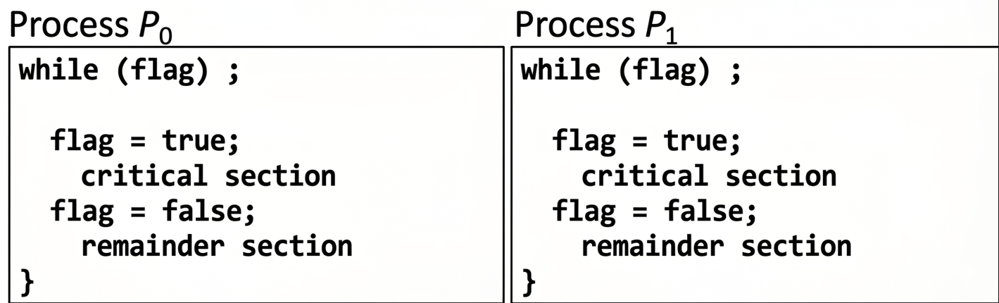
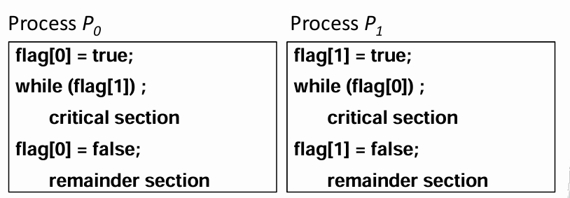
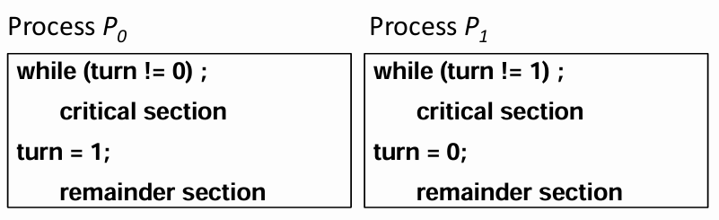
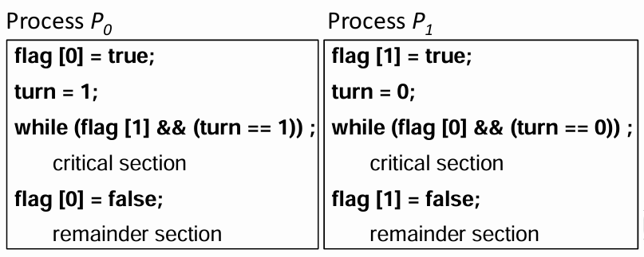

# 📅 2026-05-13 TIL

## 1. 오늘 학습 요약

* **학습 목표**: 
  * **코딩테스트** 문제풀이
  * **경쟁 상태 (Race Condition)** 의 개념
* **학습 도구**: `Unreal Engine 5.5.4`, `Visual Studio 2022`

* **활동 내용**: 
  * 프로그래머스 **[햄버거 만들기](https://school.programmers.co.kr/learn/courses/30/lessons/133502)**, **[주사위 고르기](https://school.programmers.co.kr/learn/courses/30/lessons/258709)** 풀이
  * **경쟁 상태 (Race Condition)** 의 개념
  * **임계 영역 (Critical Section)** 의 개념과 해결 방법
  * **경쟁 상태**로 발생하는 **문제**
  * **경쟁 상태** 해결 방법
---

## 2. 프로그래머스 문제 풀이

### [햄버거 만들기](https://school.programmers.co.kr/learn/courses/30/lessons/133502)

```cpp
#include <string>
#include <vector>

using namespace std;

int solution(vector<int> ingredient) {
    int answer = 0;
    vector<int> stack;
    stack.reserve(ingredient.size());
    
    for(int i=0; i<ingredient.size(); i++){
        stack.push_back(ingredient[i]);
        int s = stack.size();
        if(s > 3 && stack[s-1] == 1 && stack[s-2] == 3 && stack[s-3] == 2 && stack[s-4] == 1){
            answer++;
            for(int j=0; j<4; j++) stack.pop_back();
        }
    }
        

    return answer;
}
```

* **스택**의 개념을 활용
* 재료가 들어오면 스택에 삽입 후 상단 4개의 재료를 확인
* 확인하여 햄버거를 만들 수 있으면 4개의 재료를 뺌

---

### [주사위 고르기](https://school.programmers.co.kr/learn/courses/30/lessons/258709)

```cpp
#include <string>
#include <vector>
#include <algorithm>
#include <unordered_map>
using namespace std;

// 주사위를 선택하는 조합을 저장
void Combination(vector<string>& result, string& temp, int n, int index){
    if(temp.length() == n/2){
        result.push_back(temp);
        return;
    }
    for(int i=index; i<n; i++){
        temp += to_string(i);
        Combination(result, temp, n, i+1);
        temp.pop_back();
    }
}

// 해당 주사위의 조합으로 얻을 수 있는 번호의 모든 경우의 수 계산
void calcScore(const vector<vector<int>>& dice, const string& select, 
               vector<int>& result, int& sum, int index){
    if(index == select.size()){
        result.push_back(sum);
        return;
    }
    for(int i=0; i<6; i++){
        int score = dice[select[index]-'0'][i];
        sum += score;
        calcScore(dice, select, result, sum, index+1);
        sum -= score;
    }
}

// 주사위 조합이 만들 수 있는 점수의 모든 경우의 수를 반환
vector<int> getScore(vector<vector<int>>& dice, string& select){
    vector<int> result;
    int sum = 0;
    calcScore(dice, select, result, sum, 0);
    sort(result.begin(), result.end());
    return result;  
}

// 두 주사위의 조합이 모두 다른지 여부
bool isDiff(const string& A, const string& B){
    for(int i=0; i<A.length(); i++){
        for(int j=0; j<B.length(); j++)
            if(A[i] == B[j]) return false;
    }
    return true;
}

// 두 조합의 모든 점수를 받아 승리하는 경우의 수를 반환
pair<int, int> calcResult(const vector<int>& scoreA, const vector<int>& scoreB){
    pair<int, int> result = {0, 0};
    for(int i=0; i<scoreA.size(); i++){
        result.first += lower_bound(scoreB.begin(), scoreB.end(), scoreA[i]) - scoreB.begin();
        result.second += lower_bound(scoreA.begin(), scoreA.end(), scoreB[i]) - scoreA.begin();
    }
    return result;
}

vector<int> solution(vector<vector<int>> dice) {
    vector<int> answer(dice.size()/2, -1);
    int max = 0;
    vector<string> selects;
    unordered_map<string, vector<int>> scores;
    unordered_map<string, int> win;
    string temp;
    Combination(selects, temp, dice.size(), 0);
    
    // 각 조합의 모든 점수의 경우의 수 저장
    for(int i=0; i<selects.size(); i++)
        scores[selects[i]] = getScore(dice, selects[i]);
    
    for(int i=0; i<selects.size(); i++){
        if(win.count(selects[i])) continue; // 이미 계산 된 경우면 넘어감
        for(int j=i+1; j<selects.size(); j++){
            if(!isDiff(selects[i], selects[j])) continue;   // 동일한 주사위가 있으면 넘어감
            
            vector<int> scoreA = scores[selects[i]], scoreB = scores[selects[j]];
            pair<int, int> result = calcResult(scoreA, scoreB);
            win[selects[i]] = result.first;
            win[selects[j]] = result.second;
        }
    }
    
    // 승리 수가 가장 많은 조합을 찾음
    for(const auto& [select, count] : win){
        if(count > max){
            max = count;
            for(int i=0; i<select.length(); i++)
                answer[i] = select[i] - '0' + 1;
        }
    }
    return answer;
}
```

* **완전 탐색**, **조합**, **백트래킹**, **이진 탐색**의 다양한 유형을 합친 문제
* 주사위는 최대 10개 이므로 주사위를 선택하는 경우의 수는  $_{10}C_5 = 252$
* **각 조합의 최대 경우의 수**는 $6^5 = 7,776$
* 주사위를 5개 선택하면, 나머지 5개는 **자동으로 결정**되므로 두 조합을 선택하는 방법은 $126$가지
* 즉 $126 * 7,776^2$ 을 계산하면 풀 수 있지만 이는 **약** $76$**억** 이므로 시간 초과
* 두 조합 A, B의 점수를 **정렬**해둔다면 **A의 점수** 중 하나가 **B의 몇 번째 위치**에 존재하는지 알면 해당 점수가 이기는 경우의 수가 몇 개인지 알 수 있음
* 이를 **이진 탐색**으로 수행하면 $126 * 7,776 * \log_2 7,776 \approx 1,273$**만**의 연산으로 처리 가능

---

## 3. 경쟁 상태 (Race Condition)

### 경쟁 상태 (Race Condition)

* **경쟁 상태 (Race Condition)** 란 멀티 프로세스, 멀티 스레드 환경에서 **공유하는 자원을 동시에 접근**하는 상황을 의미함

* 이러한 접근은 프로세스, 스레드의 **접근 순서**에 따라 최종 결과가 달라질 수 있으며 이는 **데이터의 일관성을 해침**

### 임계 영역 (Critical Section)

* 두 개 이상의 프로세스, 스레드가 공유 자원에 접근, 변경해 **경쟁 상태**를 발생시킬 수 있는 **코드 블럭**

* **임계 영역** 문제를 해결하기 위해서는 아래의 **3가지 조건**을 만족해야 함

    * **상호 배제 (Mutual exclusion):** 한 시점에 **하나의 프로세스, 스레드**만 임계 영역에 접근해야함

    * **한정 대기 (Bounded wating):** 특정 프로세스, 스레드가 임계 구역 진입을 **무한 대기해서는 안됨**

    * **진행 (Progress):** 임계 구역에 프로세스, 스레드가 없다면 어떠한 프로세스, 스레드도 **임계 구역에 접근할 수 있어야 하며**, 임계 구역의 접근 순서는 **유한한 시간 안에 결정**되어야 함

### 상호 배제 (Mutual exclusion)



* 두 프로세스가 위와 같은 코드를 실행한다고 하자

* **P0**이 무한 반복을 탈출한 후 `flag = true;` 를 실행하지 못하고 **컨텍스트 스위칭**

* **P1**은 **flag가 아직 false 이므로 임계 영역에 접근 가능**

* 임계 영역에 **P0**, **P1**이 **동시에 접근**하므로 **상호 배제**를 보장하지 못함


### 한정 대기 (Bounded wating)



* 위의 예제에서 **상호 배제**를 보장하기 위해 **flag**를 두 개를 사용

* **P0**이 `flag[0] = true;`를 실행한 후 **컨텍스트 스위칭**

* **P1**이 `flag[1] = true;`를 실행한 후 **컨텍스트 스위칭**

* 두 프로세스 모두 **무한 반복**에 빠져 **임계 영역**에 도달하지 못하게 됨

### 진행 (Progress)



* `turn`이라는 공통 변수를 통해 **임계 영역** 접근을 관리

* 이 방식은 **상호 배제**와 **한정 대기**를 만족함

* 하지만 **P0**이 실행된 후, **P1**이 실행되지 않으면 **P0**은 무한히 기다려야 함

* 이처럼 **진행**을 만족하지 못하는 경우를 **경직된 동기화 (Lockstep Synchronization)** 라고 부름

### 피터슨의 알고리즘 (Peterson's Algorithm)



* 두 개의 `flag`, `turn`을 둘 다 사용하면 3가지 조건을 모두 만족할 수 있음

* 하지만 프로세스가 많아지면 **구현이 매우 복잡**해짐

* 3가지 조건을 모두 만족하는지 **수학적 증명**이 어려움

* 모든 명령어가 **원자적 (Atomic)** 일 때만 만족함

---

## 4. 경쟁 상태 해결 방법

### 세마포어 (Semaphore)

* 두 개의 **원자적 함수**를 통해 공유 자원에 **제한된 개수**의 프로세스, 스레드만 접근할 수 있게 함

* 세마포어의 값이 `1`보다 크면 해당 **자원에 접근할 수 있음**을 의미

* **wait() (P 연산):** **세마포어**의 값을 `1` **감소**시키고 프로세스를 실행, 만약 `0`이면 대기

* **signal() (V 연산):** **세마포어**의 값을 `1` 증가시키고, 대기 중인 프로세스가 있다면 그 프로세스를 깨움

### 뮤텍스 (Mutex)

* **세마포어**와 유사하지만 공유 자원에 **한 번에 하나**의 스레드만 접근할 수 있게 함

* **Lock:** 임계 영역에 진입할 때 호출, 이미 **Lock** 상태면 대기

* **Unlock:** 임계 영역에서의 작업을 마친 후 실행하여 뮤텍스의 **잠금을 해제**

* **뮤텍스**는 **소유권(Ownership)** 개념을 갖고 있어 **Lock**을 건 스레드만이 **Unlock** 할 수 있음

### 조건 변수 (Condition Variables)

* 스레드가 **특정 조건**이 발생할 때까지 대기하게 하거나, 조건이 발생함을 알리는 **동기화 도구**

* **조건 변수**는 **뮤텍스**와 함께 사용함

* 스레드는 조건 변수의 조건이 만족하지 않으면 뮤텍스를 자동으로 **Unlock**

* **다른 스레드**가 조건 변수의  조건을 만족시켜 **대기 스레드**에 **신호**를 보내 뮤텍스를 자동으로 **Lock**한 후 실행

### 모니터 (Monitor)

* 뮤텍스와 조건 변수를 포함하는 **추상 데이터 타입**

* 사용자가 직접 **세마포어**, **뮤텍스**를 사용하면 실수의 가능성이 있음

* 내부적으로 뮤텍스를 통해 **상호 배제**를 보장하며, 조건 변수를 통해 **바쁜 대기 (Busy Wating)** 을 방지

* 동기화의 **안정성** 및 **가독성**을 향상할 수 있음

---

## 5. 교착 상태 (Deadlock)

### 교착 상태 (Deadlock)

* 둘 이상의 프로세스, 스레드가 실행하기 위한 **자원을 나눠 갖고 있어** 실행되지 못하고 **무한 대기**하는 상태

* **교착 상태**가 발생하기 위해선 **네 가지의 조건**을 모두 만족해야 함

### 발생 조건

* **상호 배제 (Mutual Exclusion):** 최소한 하나 이상의 자원을 **비공유 자원**이어야 하며, 해당 자원에는 **한 번에 하나의 프로세스, 스레드만 접근**할 수 있어야 함

* **점유 대기 (Hold and Wait):** 프로세스, 스레드가 최소한 **하나 이상의 자원을 점유**한 상태로 **다른 자원을 기다려야 함**

* **비선점 (No Preemption):** 자원이 할당된 이후에는 그 **자원을 소유한 프로세스, 스레드만** 해당 자원을 해제할 수 있음

* **순환 대기 (Circular Wait):** 모든 프로세스가 대기 중일 때, **마지막 프로세스**는 **첫 번째 프로세스**의 자원을 기다려야 함

### 해결 방법

* **예방 (Prevention):** 위의 네가지 발생 조건 중 **하나를 부정**하여 발생하지 않도록 방지

* **회피 (Avoidance):** 자원을 **할당할 때**, 교착 상태가 발생할 수 있는지 **여부를 확인**

* **탐지와 회복 (Detection and Recovery):** 교착 상태가 **발생을 탐지**한 후 발생했다면 프로세스를 **종료**

* **무시 (Ignorance):** 교착 상태를 **방지하지 않고**, 발생한다면 사용자가 프로세스를 **직접 종료**

---

## 6. 기아 상태 (Starvation)

### 기아 상태 (Starvation)

* 특정 프로세스, 스레드가 자원을 할당받지 못하고 **무한히 대기**하는 상태

* **교착 상태**와 달리 다른 프로세스, 스레드는 **정상적으로 실행**됨

### 해결 방법

* 우선순위를 **수시로 변경**해 각 프로세스, 스레드가 **높은 우선순위**를 가질 수 있는 기회를 부여

* **FIFO** 방식으로 프로세스, 스레드를 실행

* **에이징 (Aging):** 오래 대기 중인 프로세스, 스레드의 우선순위를 **점진적으로 올림**

---

### 7. 참고 자료

* [리눅스로 공부하는 운영체제 - 프로세스 동기화](https://wikidocs.net/216834)
* [밝은별 개발 블로그 - [운영체제] 경쟁 조건(Race Condition)과 임계 구역(Critical Section)](https://brightstarit.tistory.com/10#%EC%9E%84%EA%B3%84%20%EA%B5%AC%EC%97%AD%20%ED%95%B4%EA%B2%B0%20%EB%B0%A9%EB%B2%95-1)
* [김누누 - 레이스 컨디션과 데드락](https://jinudmjournal.tistory.com/275)
* [Hoyeon - [OS] 교착상태 해결 방법 예방, 회피, 탐지](https://hoyeonkim795.github.io/posts/%EA%B5%90%EC%B0%A9%EC%83%81%ED%83%9C%ED%95%B4%EA%B2%B0%EB%B0%A9%EB%B2%95/)
