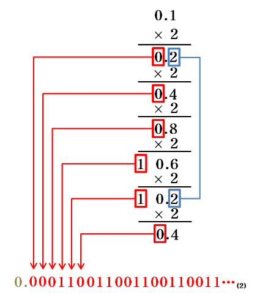
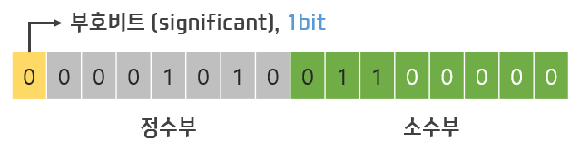
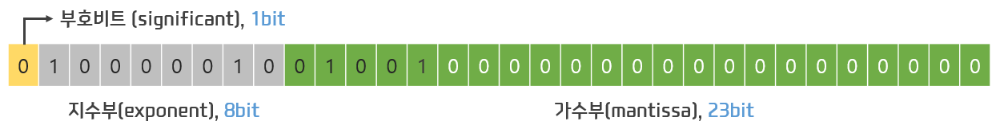
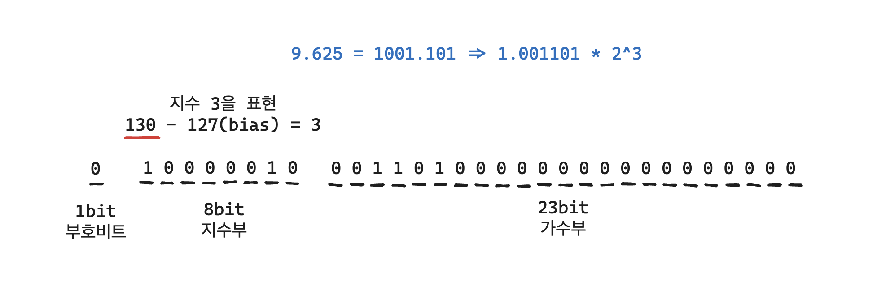

# 📅 2026-05-14 TIL

## 1. 오늘 학습 요약

* **학습 목표**: 
  * **코딩테스트** 문제풀이
  * 컴퓨터의 **실수 표현** 방법
* **학습 도구**: `Unreal Engine 5.5.4`, `Visual Studio 2022`

* **활동 내용**: 
  * 프로그래머스 **[둘만의 암호](https://school.programmers.co.kr/learn/courses/30/lessons/155652)** 풀이
  * 컴퓨터의 **실수 표현** 방법
  * **고정 소수점**과 **부동 소수점**
  * **부동 소수점 오차**
---

## 2. 프로그래머스 문제 풀이

### [둘만의 암호](https://school.programmers.co.kr/learn/courses/30/lessons/155652)

```cpp
#include <string>
#include <vector>
#include <unordered_set>
using namespace std;

string solution(string s, string skip, int index) {
    string answer = "";
    unordered_set<char> skips;
    for(int i=0; i<skip.length(); i++)
        skips.insert(skip[i]);
    
    for(int i=0; i<s.length(); i++){
        for(int j=0; j<index; j++){
            s[i]++;
            if(s[i] > 'z') s[i] = 'a';
            if(skips.count(s[i])) j--;
        }
    }
    return s;
}
```

* **완전 탐색** 문제
* 문제의 조건이 매우 여유롭기에 특별한 최적화 없어도 충분함

---

## 3. 컴퓨터의 실수 표현

* 컴퓨터는 모든 수를 **2진수**로 변환하여 저장하며 **소수** 또한 2진수로 변환하여 저장함

* 컴퓨터는 실수를 저장하는 방법은 **고정 소수점(Fixed Point)**, **부동 소수점(Floating Point)** 두 가지 방법이 존재

* 컴퓨터의 공간은 한정된 자원이기에 **무한 소수**를 표현할 수 없어 **오차가 발생**

* 아래 이미지처럼 10진수에선 무한 소수가 아니지만, **2진수에선 무한 소수**인 경우가 존재

    

### 고정 소수점

* 소수를 **정수부**와 **소수부**로 나누어 메모리에 저장하는 방식

* **소수점을 고정**하여 정수부와 소수부의 **크기를 고정**해 표현함

* 표현이 직관적이지만 **표현 범위가 매우 작으며**, **낭비되는 메모리** 공간이 많음

    

### 부동 소수점

* **IEEE**가 제정한 실수 저장 표준 **(IEEE 754)**

* 소수를 **지수부**와 **가수부**로 나누어 메모리에 저장하는 방식

* `float` 타입의 경우, 1개의 **부호 비트**, 8개의 **지수 비트**, 23개의 **가수 비트**로 수를 표현

* 부동 소수점 방식은 `최솟값: 1.175494351 E - 38`, `최댓값: 3.402823466 E + 38`의 매우 큰 범위를 가짐

    

### 부동 소수점 계산 방법

* 10진수의 소수를 부동 소수점 방식으로 변환하는 방법은 아래와 같음

    1. 음수 여부를 부호 비트에 저장

    2. 정수부와 소수부를 각각 2진수로 변환

    3. 소수점을 이동시켜 정수부를 1로 만듦 (정규화, 이 과정에서 **지수부**와 **가수부**가 생김)

    4. 가수부의 결과를 가수부 메모리에 저장

    5. 지수부의 결과에 127(bias)를 더한 후 지수부 메모리에 저장 (지수의 **양수**, **음수**를 구분)

    

---

## 4. 부동 소수점 오차

* **float** 타입의 경우 23비트의 한정된 메모리 공간에 **가수부**를 저장하기에 23비트 보다 큰 수는 저장할 수 없음

* 결국 24비트 이후의 비트는 **자른 후 반올림**하는 수밖에 없고 이로 인한 **오차**가 발생

* 이는 하드웨어의 한계이기 때문에 완벽한 해결법은 없지만 어느 정도 **완화**는 가능함

    * **정수로 치환:** 정확도가 매우 중요한 경우, 소수의 길이만큼 `10`을 곱해 정수로 치환 해 저장

    * **입실론(Epsilon):** 비교 시 등호가 아닌 입실론을 사용해 **약간의 오차는 무시**

    * **더 큰 자료형 사용:** **double (8비트)** 과 같은 타입을 사용하면 오차를 크게 줄일 수 있음

    * **라이브러리 사용:** `Python`의 **decimal**, C++의 **Boost.Multiprecision**과 같은 높은 정밀도의 라이브러리 사용
--- 

## 5. 참고 자료

* [Inpa Dev - 실수 표현(부동 소수점) 원리 한눈에 이해하기](https://inpa.tistory.com/entry/JAVA-%E2%98%95-%EC%8B%A4%EC%88%98-%ED%91%9C%ED%98%84%EB%B6%80%EB%8F%99-%EC%86%8C%EC%88%98%EC%A0%90-%EC%9B%90%EB%A6%AC-%ED%95%9C%EB%88%88%EC%97%90-%EC%9D%B4%ED%95%B4%ED%95%98%EA%B8%B0)

* [Break Out of Your Comfort Zone - [cs] 고정 소수점, 부동 소수점](https://sujinhope.github.io/2020/09/21/CS-%EA%B3%A0%EC%A0%95-%EC%86%8C%EC%88%98%EC%A0%90,-%EB%B6%80%EB%8F%99-%EC%86%8C%EC%88%98%EC%A0%90.html)

* [Microsoft Learn - float 형식](https://learn.microsoft.com/ko-kr/cpp/c-language/type-float?view=msvc-170)

* [benzy - 부동소수점 - 실수를 표현하는 방법](https://velog.io/@minzyaaaaaa/%EB%B6%80%EB%8F%99%EC%86%8C%EC%88%98%EC%A0%90-%EC%8B%A4%EC%88%98%EB%A5%BC-%ED%91%9C%ED%98%84%ED%95%98%EB%8A%94-%EB%B0%A9%EB%B2%95)