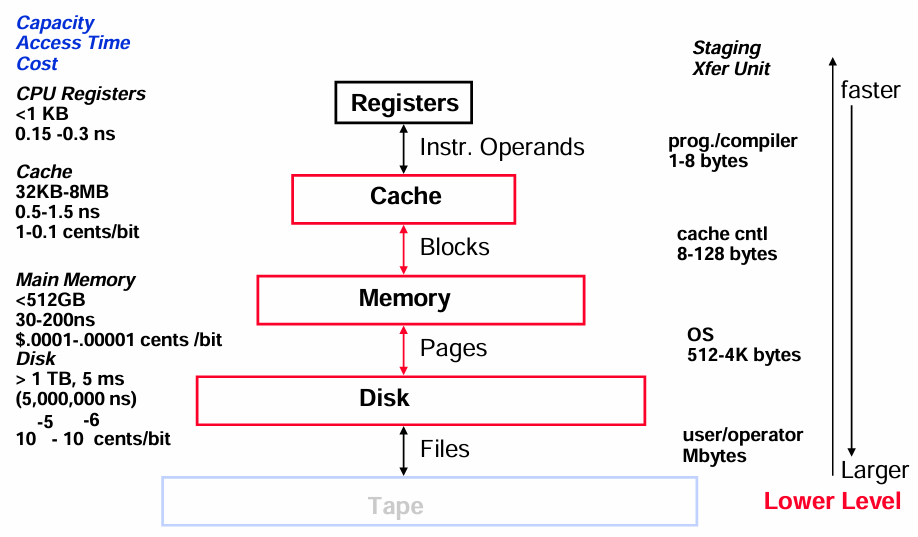
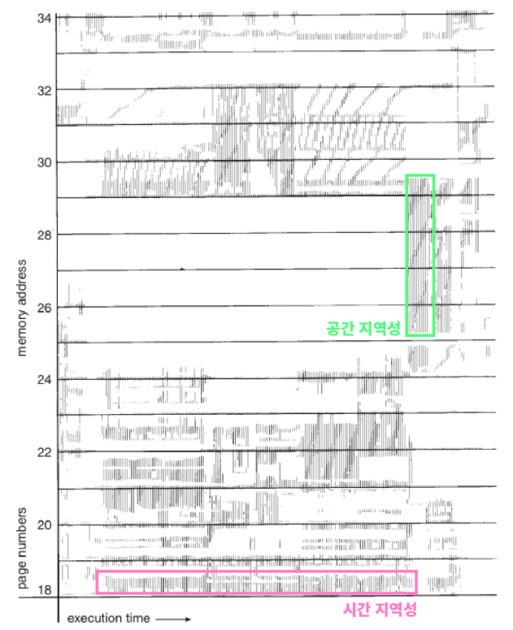
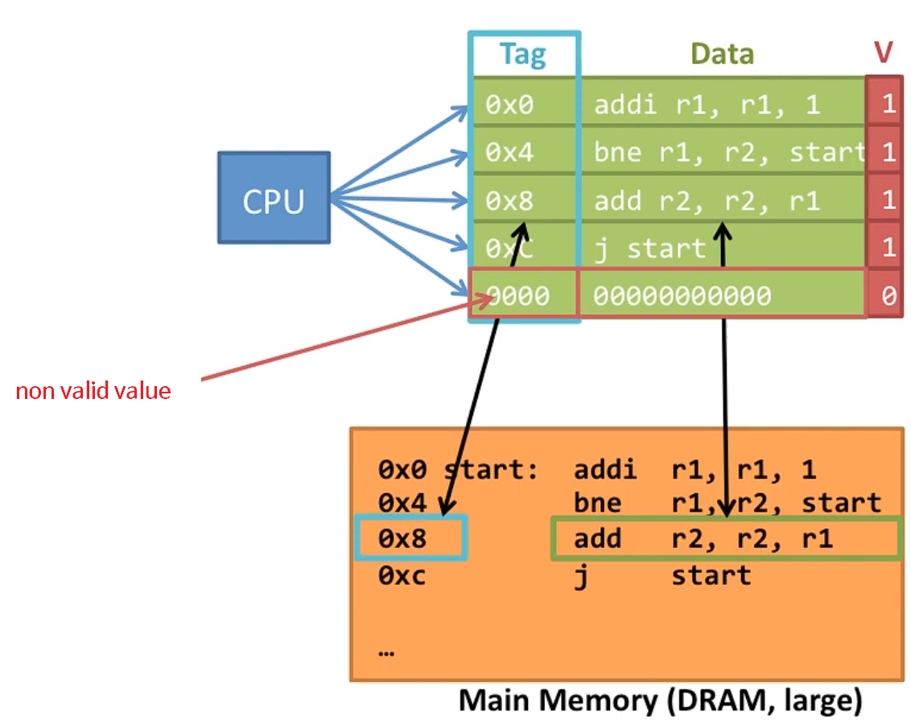
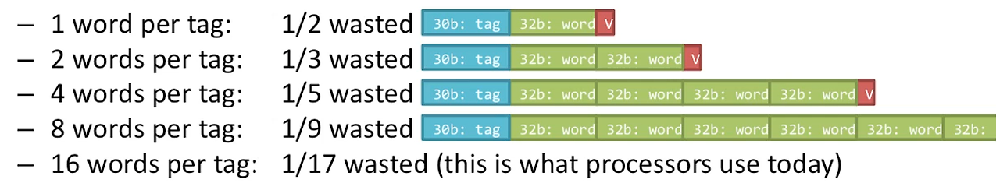

# 📅 2026-05-15 TIL

## 1. 오늘 학습 요약

* **학습 목표**: 
  * **코딩테스트** 문제풀이
  * **메모리 계층 구조**와 **지역성**
  * **캐시**의 특징
* **학습 도구**: `Unreal Engine 5.5.4`, `Visual Studio 2022`

* **활동 내용**: 
  * 프로그래머스 **[대충 만든 자판](https://school.programmers.co.kr/learn/courses/30/lessons/160586)**, **[당구 연습](https://school.programmers.co.kr/learn/courses/30/lessons/169198)** 풀이
  * **메모리** 계층 구조
  * **시간 지역성**과 **공간 지역성**
  * **캐시 (Cache)** 의 특징

---

## 2. 프로그래머스 문제 풀이

### [대충 만든 자판](https://school.programmers.co.kr/learn/courses/30/lessons/160586)

```cpp
#include <string>
#include <vector>
#include <unordered_map>

using namespace std;

vector<int> solution(vector<string> keymap, vector<string> targets) {
    vector<int> answer;
    unordered_map<char, int> count;
    for(int i=0; i<26; i++)
        count['A' + i] = 101;
    
    for(const string& map : keymap)
        for(int i=0; i<map.size(); i++)
            count[map[i]] = min(count[map[i]], i+1);
    
    for(const string& target : targets){
        int temp = 0;
        for(const char key : target){
            if(count[key] == 101){
                temp = -1; break;
            }
            temp += count[key];
        }
        answer.push_back(temp);
    }
    return answer;
}
```

* **해시맵**, **그리디**를 활용하는 문제
* 어떤 문자를 누르는 **최소 횟수는 결정**되어 있는 상태임
* 각 문자를 누르는 최소 횟수만 더하면 정답

---

### [당구 연습](https://school.programmers.co.kr/learn/courses/30/lessons/169198)

```cpp
#include <string>
#include <vector>

using namespace std;

vector<int> solution(int m, int n, int startX, int startY, vector<vector<int>> balls) {
    vector<int> answer(balls.size(), 2*(m*m+n*n));
    vector<pair<int, int>> pos = {{-startX, startY}, {2*m-startX, startY}, 
                                  {startX, -startY}, {startX, 2*n-startY}};
    for(int i=0; i<balls.size(); i++){
        int x = balls[i][0], y = balls[i][1];
        for(int j=0; j<4; j++){
            int posX = pos[j].first, posY = pos[j].second;
            
            if(j==0 && y==posY && startX > x) continue;
            if(j==1 && y==posY && startX < x) continue;
            if(j==2 && x==posX && startY > y) continue;
            if(j==3 && x==posX && startY < y) continue;
            
            int distX = abs(pos[j].first - x);
            int distY = abs(pos[j].second - y);
            answer[i] = min(answer[i], distX*distX + distY*distY);
        }
    }
    return answer;
}
```

* **수학** 문제
* 네 벽 중 한 벽을 기준으로 대칭시키면, **공의 경로는 직선**이 됨
* 목표 공이 **벽으로 가는 길을 막고 있는 경우**는 예외 처리

---

## 3. 메모리 계층 구조

* 메모리의 주요 특징인 **용량**, **접근 속도**, **비용** 간의 절충 관계를 파악하여 나눈 구조

* 위 계층에 있는 메모리일수록 속도가 빠르고 용량이 작으며, 아래 계층에 있는 메모리일수록 속도가 느리고 용량이 큼

    

* **레지스터 (Register):** **CPU 내부**에 있는 메모리, 매우 빠르지만 용량이 매우 작음

* **캐시 (Cache):** 자주 사용되는 데이터를 저장하는 **임시 저장소**

* **주기억장치 (Memory):** **실행 중인 프로그램**의 데이터를 저장하는 메모리

* **보조기억장치 (Disk):** 전원이 꺼져도 데이터가 유지되는 **비휘발성** 메모리

* **자기 테이프 (Tape):** 용량이 매우 크지만, **순차 접근**을 통해 접근해 매우 느린 저장장치

---

## 4. 지역성 (Locality)

* 프로그램이 실행되는 동안 특정 영역의 메모리에 더 **자주 접근하는 성질**

* 지역성은 크게 **시간 지역성**과 **공간 지역성**으로 나뉨

    

### 시간 지역성 (Temporal Locality)

* 한번 접근한 메모리는 가까운 시간 내에 **다시 접근**할 가능성이 높음

* **예시 코드**
    ```cpp
    int main() {
        int sum = 0;
        for(int i=0; i<1000; i++)
            sum += i;               // 동일한 위치에 있는 sum, i에 계속 접근
        return 0;
    }
    ```

### 공간 지역성 (Spatial Locality)

* 접근한 메모리의 **근처에 있는 데이터**에 연달아 접근할 가능성이 높음

* **예시 코드**
    ```cpp
    int main() {
        int arr[100][100];
        for(int i=0; i<100; i++)
            for(int j=0; j<100; j++)
                arr[i][j] = i*j;     // 연속된 위치에 있는 arr[i][j]에 접근
        return 0;
    }
    ```
--- 

## 5. 캐시 (Cache)

* **지역성**의 특징을 기반으로 **자주 사용하는 데이터**를 메인 메모리보다 더 빠른 공간인 **캐시 메모리에 저장**하는 것

* CPU와 메인 메모리 사이의 속도 차이로 인한 **병목 현상을 완화**하는 역할을 함

* **캐시**는 보통 L1 캐시, L2 캐시, L3 캐시로 나뉘며 **레벨이 낮을 수록 속도가 빠르지만, 용량이 작음**

### 캐시 히트 (Cache Hit)

* CPU가 요청한 데이터가 캐시에 있는 경우

* **캐시 히트율 (Hit Rate):** CPU가 요청한 데이터 중 **캐시에서 데이터를 가져온 비율**

### 캐시 미스 (Cache Miss)

* CPU가 요청한 데이터가 캐시에 없는 경우, 메인 메모리에서 데이터에 접근해야 함

* **캐시 미스율 (Miss Rate):** CPU가 요청한 데이터 중 **캐시에 데이터가 없는 비율**, `(1 - Hit Rate)`

* **강제 미스 (Compulsory Miss):** 해당 메모리 주소를 **처음 접근해** 생기는 미스, 보통 프로그램을 처음 켤 때 발생

* **충돌 미스 (Conflict Miss):** 두 데이터가 **동일한 캐시 메모리 주소에 저장**되어 발생하는 미스

* **용량 미스 (Capacity Miss):** **캐시 메모리가 부족**해 발생하는 미스

### 캐시의 구성 요소



* **태그 (Tags):** **메인 메모리 주소**의 일부분, 태그와 워드 비트를 통해 실제 주소에 접근함

* **데이터 (Data):** 캐시에 저장된 **실제 데이터**

* **유효 비트 (Valid Bits):** 캐시의 데이터가 **유효한지** 나타내는 비트

### 캐시 라인 (Cache Line)

* CPU가 요청한 데이터가 캐시에 존재하는지 찾기 위해서는 **모든 태그를 확인**해야 함

* 이는 **높은 연산량**을 갖기에 **캐시 라인 (Cache Line)** 의 크기를 변경하여 효율성을 높임

* 캐시는 태그(30비트), 데이터(32비트), 유효 비트(1비트)로 저장되며 **총 크기의 절반만 데이터**를 가지기에 **공간 효율성**이 낮음

* 태그가 사용하는 공간의 비율을 줄이기 위해 **하나의 캐시 라인에 워드를 여러 개** 저장

    

* 위 이미지처럼 **다수의 워드를 하나의 태그에 같이 저장**하면, 태그가 공간을 차지하는 비율이 낮아짐

* 이때 같이 저장되는 워드는 연속된 메모리 공간을 갖기에 **공간 지역성**의 특징을 이용함

---

## 6. 참고 자료

* [항상 끈기있게 - [운영체제] 메모리 계층 구조(Memory Hierachy)](https://nayoungs.tistory.com/entry/%EC%9A%B4%EC%98%81%EC%B2%B4%EC%A0%9C-%EB%A9%94%EB%AA%A8%EB%A6%AC-%EA%B3%84%EC%B8%B5-%EA%B5%AC%EC%A1%B0Memory-Hierachy)

* [윌리의 테크니컬 레퍼런스 - 캐시 메모리의 구조(Cache Structure)와 캐시히트(Cache Hit), 캐시 미스(Cache Miss)](https://blog.naver.com/techref/222290234374)

* [길은 가면, 뒤에 있다. - [엔지니어링] CPU와 캐시 (L1/L2/L3 캐시..)](https://12bme.tistory.com/402)

* [임베디드이야기 - 캐시 메모리의 원리와 캐시 블록(라인)](https://microelectronics.tistory.com/104)