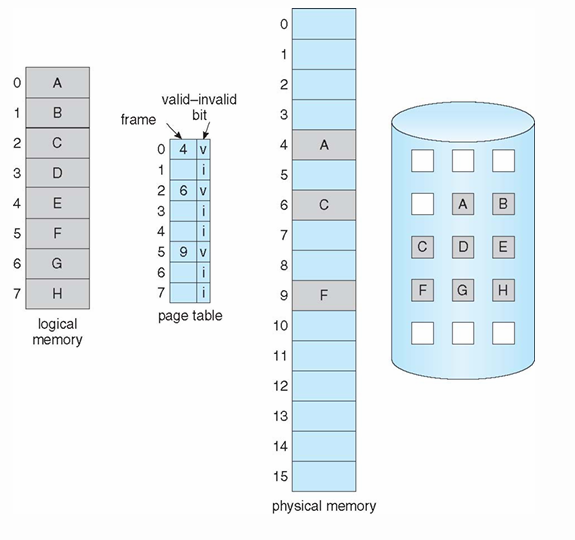
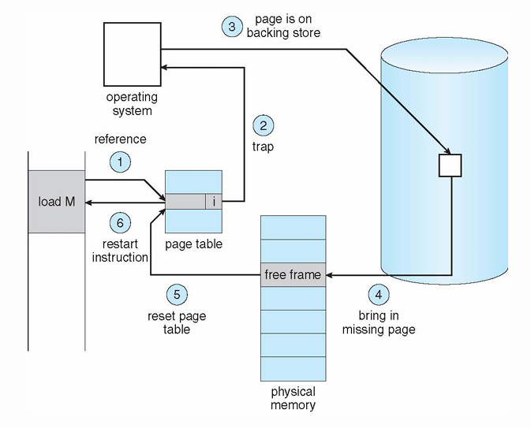
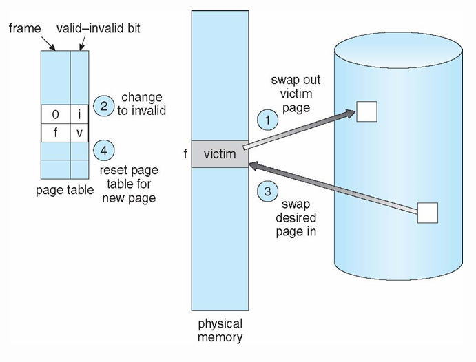
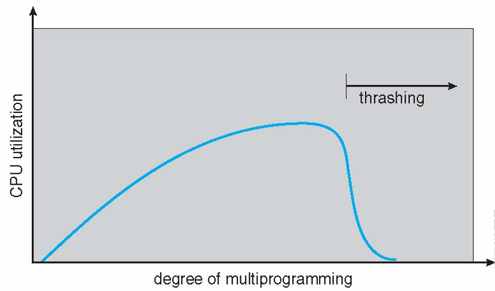

# 📅 2026-05-18 TIL

## 1. 오늘 학습 요약

* **학습 목표**: 
  * **코딩테스트** 문제풀이
  * **가상 메모리**와 **페이징**
  * **요구 페이징 (Demand Paging)**
* **학습 도구**: `Unreal Engine 5.5.4`, `Visual Studio 2022`

* **활동 내용**: 
  * 프로그래머스 **[문자열 나누기](https://school.programmers.co.kr/learn/courses/30/lessons/140108)** 풀이
  * **가상 메모리**의 개념
  * **페이징(Paging)** 의 개념과 **단편화(Fragmentation)**
  * **요구 페이징 (Demand Paging)** 과 **페이지 폴트 (Page Fault)**
  * **페이즈 교체 알고리즘(Page Replacement Algorithm)** 의 종류
  * **스레싱(Thrashing)** 이란

---

## 2. 프로그래머스 문제 풀이

### [문자열 나누기](https://school.programmers.co.kr/learn/courses/30/lessons/140108)

```cpp
#include <string>
#include <vector>

using namespace std;

int solution(string s) {
    int answer = 0;
    int length = 0;
    int count = 0;
    char curr;
    for(int i=0; i<s.length(); i++){
        length++;
        if(count == 0) curr = s[i];
        if(curr == s[i]) count++;   
        if(count * 2 == length){
            answer++;
            length = 0;
            count = 0;
        }
    }
    if(length != 0) answer++;
    return answer;
}
```

* **문자열** 문제
* 글자 `x`와 `x가 아닌 글자`의 합이 같은 경우는 `x`가 전체 길이의 **절반**일 때

---

## 3. 가상 메모리 (Virtual Memory)

* **가상 메모리(Virtual Memory)** 란 각 프로세스가 실제 메모리 주소가 아닌 **가상의 메모리 주소**를 할당하는 추상화 기법

* 일반적인 프로그램은 실행 중 **작은 크기의 메모리만을 필요**로 하므로 필요한 데이터 **전체를 메모리에 할당**하는 것은 매우 **비효율적**

* 따라서 **가상 메모리**는 프로그램이 실행되기 위한 **최소한의 데이터만 실제 메모리에 할당**하고, 나머지는 **디스크 영역**에 두는 것

* 이를 통해 프로세스는 자신이 시스템의 **전체 메모리**를 할당받은 것**처럼** 동작해 실제 물리 메모리보다 **더 큰 공간의 메모리**가 있는 것처럼 사용 가능

### 페이징 (Paging)

* **가상 메모리**를 관리하기 위해 프로그램의 메모리를 고정된 크기의 **페이지**, **프레임**의 단위로 나누어 관리하는 기법

* **페이지 (Page):** **가상 메모리**를 사용하는 최소 단위

* **프레임 (Frame):** **물리 메모리**를 사용하는 최소 단위

* 페이지와 프레임은 보통 같은 크기를 가지며 `4KB ~ 4MB`의 크기를 가짐

* **MMU (Memory Management Unit):** 가상 메모리 주소를 물리 메모리 주소로 **변환**해 주는 하드웨어 유닛

* **페이지 테이블 (Page Table):** 각 프로세스가 갖고 있는 **페이지의 정보**를 저장하고 있는 테이블

### 단편화 (Fragmentation)

* **외부 단편화 (External Fragmentation):** 여유 메모리 공간은 필요한 메모리 공간보다 크지만, **여유 공간이 조각**나 있어 할당하지 못하는 경우

* **내부 단편화 (Internal Fragmentation):** 필요한 메모리 공간보다 여유 메모리 공간이 커 할당할 수 있지만, **여분만큼의 낭비**가 생기는 경우

* **페이징**은 **외부 단편화를 완벽히 해결**할 수 있으며, **내부 단편화는 크게 완화** 함

---

## 4. 요구 페이징 (Demand Paging)

* CPU로부터 데이터 **요청이 발생**했을 때, 해당 데이터를 **메인 메모리에 적재**하는 페이징 방법

* 필요하지 않은 페이지는 디스크의 **스왑 영역 (Backing Store)** 에 저장

* 이를 통해 **불필요한 I/O 작업**을 없애고, **더 적은 메모리**를 사용해 **반응성**을 높임

* 실행 시 프로세스의 모든 페이지를 전부 올리는 **스와핑(Swapping)** 과 달리 필요한 일부만 적재하기에 **게으른 스와퍼(Lazy Swapper)** 라고도 불림

* **Pager (페이저):** 프로세스 전체가 아닌 **페이지 단위**로 스와핑을 하는 스와퍼

    

---

## 5. 페이지 폴트 (Page Fault)

* 프로그램이 어떤 페이지를 참조할 때, 해당 페이지에 대한 **첫 참조**일 경우 (물리 메모리에 올라오지 않은 경우)

* **트랩 (Trap):** 페이지 폴트 발생 시 OS에게 보내는 인터럽트

* **주요 페이지 폴트 (Major Page Fault):** 물리 메모리에 페이지가 올라오지 않은 경우, **I/O 작업**을 필요로 해 **높은 비용**을 가짐

* **마이너 페이지 폴트 (Minor Page Fault):** 물리 메모리에 페이지가 올라와 있지만, **MMU에 표시되어 있지 않은 경우**, I/O 작업이 필요 없어 **빠르게 처리** 가능

### 페이지 폴트 처리 과정



1. 페이지 참조 시 페이지 테이블의 **valid-invalid bit**를 확인

2. **valid-invalid bit**가 **Invalid**일 경우 OS에게 **트랩**을 보내고 **프로세스를 대기**

3. 해당 페이지를 **스왑 영역**에서 찾음

4. 찾은 페이지를 **물리 메모리의 빈 프레임(Free Frame)에 적재**

5. 적재한 페이지 정보를 업데이트해 **페이지 테이블을 초기화**

6. 중단된 **프로세스 재개**해 멈췄던 명령어부터 실행

---

## 6. 페이지 교체 알고리즘 (Page Replacement Algorithm)

* 물리 메모리는 한정된 자원이기에 **빈 프레임이 없는 경우**가 존재

* 이 경우 교체 알고리즘을 통해 **희생될 프레임(Victim Frame)** 을 선택

* 페이지 교체 시 희생될 프레임이 **수정된 상태(Dirty)** 라면 **2번**의 페이지 이동이 존재하기에 **비용이 매우 높음**

### 페이지 교체 과정



1. 희생될 프레임을 스왑 영역에 **기록 (Swap-out)**

2. 해당 페이지의 **valid-invalid bit**를 **invalid**로 설정

3. 원하는 페이지를 스왑 영역에서 **읽어 메인 메모리에 적재 (Swap-in)**

4. 새로운 페이지의 정보로 페이지 **테이블 초기화**

### 페이지 교체 알고리즘 (Page Replacement Algorithm)

* **OPT (Optimal):** 앞으로 사용하지 않을 페이지를 선택, 미래를 예측하는 것은 불가능하므로 **이론적인 최적값**

* **FIFO (First-In, First-Out):** **먼저 들어온** 페이지를 선택

* **LRU (Least Recently Used):** **가장 오래 참조되지 않은** 페이지를 선택

* **LFU (Least Frequently Used):** **가장 조금 참조된** 페이지를 선택

* **MFU (Most Frequently Used):** **가장 많이 참조된** 페이지를 선택

### LRU 근사 알고리즘 (LRU Approximation Algorithms)

* **LRU**는 OPT에 가장 가까운 알고리즘이지만, **구현이 복잡**하며 **비용이 높음**

* **참조 비트(Reference bit)** 를 두어 해당 비트의 값을 기반으로 LRU와 근사하게 동작

* **Clock Algorithm (Second Chance Algorithm)**
    * 포인터가 페이지를 **순회**하며 참조 비트를 검사
    * **참조 비트**가 1일 경우 0으로 **교체**
    * **참조 비트**가 0일 경우 희생될 페이지로 **선택**

* **Enhanced Second Chance Algorithm**
    * **Clock Algorithm**에 **수정 비트(modify bit)** 를 추가로 검사
    * 해당 페이지가 **수정**될 경우 **수정 비트를 1로 교체**
    * 수정되지 않은 페이지는 교체가 더 가벼우므로 **우선순위**가 더 높음

### 스레싱 (Thrashing)

* 프로세스가 실제 실행보다 **페이지 스왑**을 위한 시간에 **더 많은 자원을 사용**하는 것

* 프로세스가 **충분한 수의 페이지**를 할당받지 못하면, **페이지 폴트 발생률**이 높아짐

* 이로 인해 **I/O** 작업의 빈도가 높아지고, **CPU 유효율(CPU Utilization)** 이 떨어짐

* **OS**는 CPU 유효율을 높이기 위해 **다중 프로그래밍의 정도(degree of multiprogramming)** 를 높임

* 새로운 프로세스가 늘어나고 **페이지 폴트 발생률은 더욱 높아짐**

    

---

## 7. 참고 자료

* [Preamtree - [IT 기술면접 준비자료] 가상메모리의 동작과 페이지폴트(Page Fault)](https://preamtree.tistory.com/21)

* [계범 개발일지 - 가상 메모리(Virtual Memory)와 디맨드 페이징](https://cano721.tistory.com/17)

* [yein - [운영체제] 가상 메모리(Virtual Memory System)](https://ahnanne.tistory.com/15)