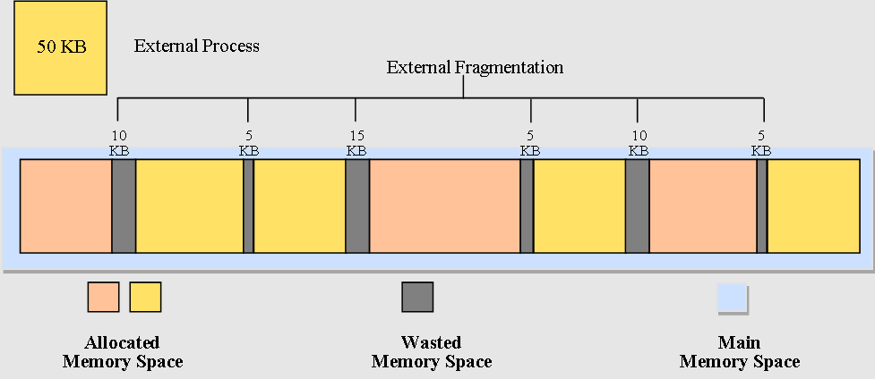
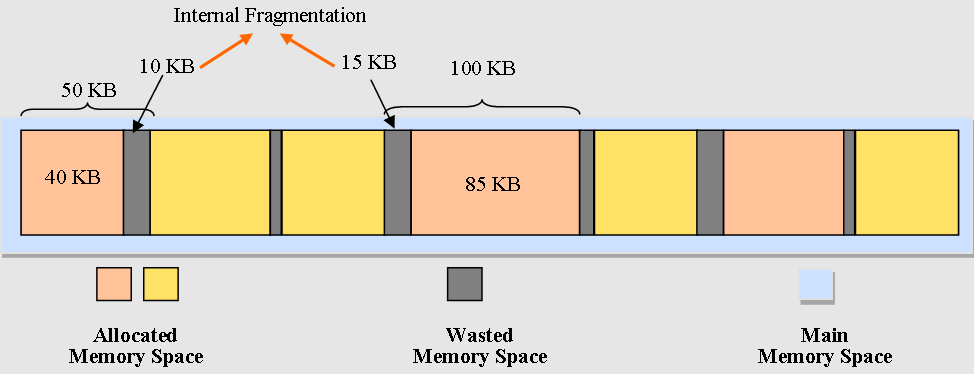
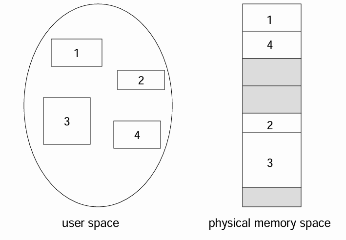
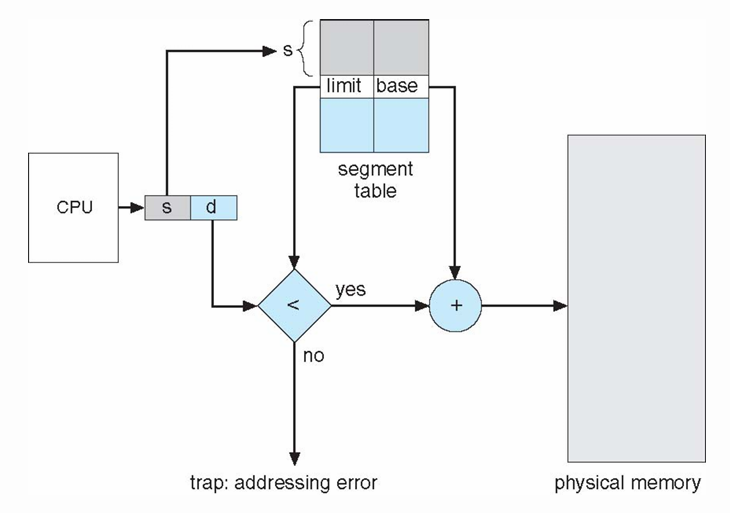
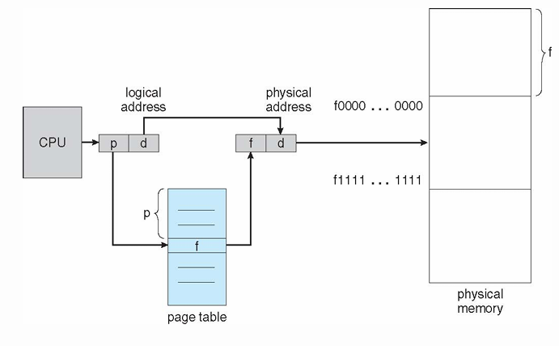

# 📅 2026-05-19 TIL

## 1. 오늘 학습 요약

* **학습 목표**: 
  * **코딩테스트** 문제풀이
  * **단편화**

* **학습 도구**: `Unreal Engine 5.5.4`, `Visual Studio 2022`

* **활동 내용**: 
  * 프로그래머스 **[체육복](https://school.programmers.co.kr/learn/courses/30/lessons/42862)** 풀이
  * **외부 단편화**와 **내부 단편화**
  * **세그먼테이션**의 개념
  * **페이징**의 개념
  
---

## 2. 프로그래머스 문제 풀이

### [체육복](https://school.programmers.co.kr/learn/courses/30/lessons/42862)

```cpp
#include <string>
#include <vector>
#include <algorithm>
#include <unordered_set>
using namespace std;

int solution(int n, vector<int> lost, vector<int> reserve) {
    int answer = 0;
    unordered_set<int> s;
    sort(reserve.begin(), reserve.end());    
    for(int i=1; i<=n; i++) s.insert(i);
    for(int i=0; i<lost.size(); i++) s.erase(lost[i]);
    for(int i=0; i<reserve.size(); i++){
        if(!s.count(reserve[i])) {
            s.insert(reserve[i]);
            reserve[i] = 0;
        }
    } 
    
    for(int i=0; i<reserve.size(); i++){
        if(reserve[i] == 0) continue;
        int student = reserve[i];
        if(student > 1 && !s.count(student-1)) s.insert(student-1);
        else if(student < n && !s.count(student+1)) s.insert(student+1);
    }
    return s.size();
}
```

* **그리디** 문제
* **해시셋**을 이용해 각 학생의 체육복 상태를 저장
* 여분의 체육복이 있고 양 옆의 학생이 체육복이 없을 경우, **앞 학생에게 체육복을 주는게 가장 좋은 방법**

---

## 3. 단편화 (Fragmentation)

* OS는 각 프로세스가 필요한 크기의 메모리를 할당 및 해제를 반복하며, 이로 인해 **메모리 공간이 작은 조각으로 분할** 됨

* 메모리가 매우 많은 작은 조각으로 분할되어 있으면 충분한 여유 공간이 있지만, **작은 조각들로 분할되어 있어 할당할 수 없는 경우**가 생김

* 이를 **단편화**라고 하며, 단편화에는 **외부 단편화**와 **내부 단편화**의 두 가지 유형이 존재함

* **단편화**를 해결하기 위해서는 **세그멘테이션**, **페이징** 등의 방법을 활용함

### 외부 단편화 (External Fragmentation)



* 사용하지 않는 메모리 공간이 **매우 작은 크기로 분할**되어 새로운 프로세스를 할당할 수 없는 경우

* 위 그림에서 실제 여유 공간은 `50KB`가 존재하지만, **분할** 되어 있어 `50KB`의 프로세스를 할당하지 못함

### 내부 단편화 (Internal Fragmentation)



* 프로세스가 메모리 공간을 할당받을 때, **실제 필요한 공간보다 더 많은 크기의 공간을 할당**받는 경우

* 위 그림에서 각각의 프로세스는 `40KB, 85KB`만 필요하지만 실제 할당은 `50KB`, `100KB`를 받음

* 이로인해 **사용되지 않으며, 접근할 수 없는 메모리 공간**이 `10KB`, `15KB`가 생김

---

## 4. 세그먼테이션 (Segmentation)



* 각 프로세스의 가상 메모리를 **서로 크기가 다른 세그먼트(Segment)** 단위로 분할하여 관리하는 방법

* 논리적 단위인 **세그먼트**를 활용하여 프로세스가 **실제 필요한 크기**만큼만 물리 메모리를 할당함

* CPU는 **세그먼트 번호**와 **오프셋**으로 가상 메모리에 접근을 요청하며, **MMU**가 접근 가능 여부 판단 및 실제 주소를 계산

* **세그먼트 테이블 (Segment table):** 각 세그먼트의 **물리 메모리 시작 주소(Base)** 와 **길이(Limit)** 를 저장하는 테이블

* 실제 필요한 크기인 세그먼트 단위로 메모리를 할당하기에 **내부 단편화는 완벽히 해결**

* 하지만, **내부 단편화 문제는 동일하게 존재**함

### 세그먼테이션의 과정



1. CPU가 **세그먼트 번호(s)**, **오프셋(d)** 으로 **가상 메모리**에 접근

2. 세그먼트 테이블의 **MMU**로 **limit** 값과 **d**를 비교해 **d**가 더 크면 트랩을 발생

3. **d**가 더 작으면 **MMU**로 물리 메모리값을 연산하여 `Base + d`의 메모리 주소에 접근

---

## 5. 페이징 (Paging)

* 프로세스가 필요한 메모리를 **고정된 크기**의 **페이지**, **프레임**의 단위로 나누어 관리하는 방법

* CPU는 **페이지 번호 p**와 **오프셋 d**로 가상 메모리에 접근을 요청함

* **MMU**가 접근 가능 여부 판단 및 실제 주소를 구하며, **세그먼테이션**과 달리 연산이 아닌 이어붙이는 식으로 실제 주소를 구하기에 **매우 가벼움**

* **페이지 테이블 (Page Table):** 각 **페이지 번호**와 **프레임 번호**를 매핑하여 저장하는 테이블

* 고정된 크기의 페이지 단위로 메모리를 할당하기에 **외부 단편화는 완벽히 해결**

* **내부 단편화는 여전히 남아있으며** 페이지의 크기를 **매우 작게 하면** 내부 단편화는 줄어들지만, 오히려 페이지 연산으로 인한 **성능 하락**이 생길 수 있음

### 페이징의 과정



1. CPU가 **페이지 번호 p**와 **오프셋 d**로 가상 메모리에 접근을 요청

2. **MMU**가 페이지 테이블을 조회해 해당 페이지 번호의 **물리 프레임 주소 f**를 찾음

3. **물리 프레임 주소 f**와 **오프셋 d**를 이어 붙여 실제 물리 메모리 주소로 접근


### 페이징 최적화

* **TLB Cache (Translation lookaside buffer Cache)** 

    * 매 페이지 접근마다 페이지 테이블을 확인하는 것은 **매우 비싼 연산**

    * 페이지 번호와 물리 주소를 매핑한 MMU내부의 **TLB 캐시**를 활용하여 이를 해결

* **멀티 레벨 페이지 테이블 (Multi-Level Page Table)**
    1. **1-Level Page Table**
        * **32비트** 시스템에서 **페이지의 크기**가 `4KB`면 **오프셋**은 12비트를 사용 `(2^12 = 4,096)`

        * **페이지 번호**는 20비트를 사용하므로 **약 100만개**의 페이지를 매핑할 수 있음

        * 즉, 4KB 중 **단 1바이트만 사용**해도 `4MB (4B * 2^20)`의 페이지 테이블이 생성됨

        * 이는 메모리를 매우 비효율적으로 사용하므로, **멀티 레벨 페이지 테이블**을 통해 해결

    2. **2-Level Page Table**
        * 위의 예시를 **2 레벨 페이지 테이블**로 변경하면 아래와 같음

        * 총 `1,024`개의 페이지 테이블을 매핑할 수 있는 **1단계 페이지 테이블** (4KB)을 생성함
        
        * **1바이트**만 사용하는 프레임이 할당되었을 때, 해당 메모리 범위를 포함하는 **2단계 페이지 테이블을 하나만 생성**

        * 총 **8KB** 크기의 페이지 테이블로 할당된 프레임을 관리할 수 있음

    * 멀티 레벨 페이지 테이블은 **불필요한 페이지 테이블 생성은 완화**

    * 하지만, 페이지 테이블을 참조하는 **페이지 워크 (Page Walk)** 는 증가하여 오버헤드가 발생

    * 이러한 페이지 워크를 줄이기 위해 위의 TLB 캐시를 활용함


---

## 6. 참고 자료

* [hanhs4544 - 메모리 단편화(Memory Fragmentation)](https://velog.io/@hanhs4544/%EB%A9%94%EB%AA%A8%EB%A6%AC-%EB%8B%A8%ED%8E%B8%ED%99%94Memory-Fragmentation#%E2%91%A3-%EC%84%B8%EA%B7%B8%EB%A8%BC%ED%85%8C%EC%9D%B4%EC%85%98segmentation)

* [Memory Fragmentation in operating system](https://er.yuvayana.org/memory-fragmentation-in-operating-system/)

* [88 - (운영체제) Multi-level Page Tables](https://m.blog.naver.com/babobigi/221469166508)