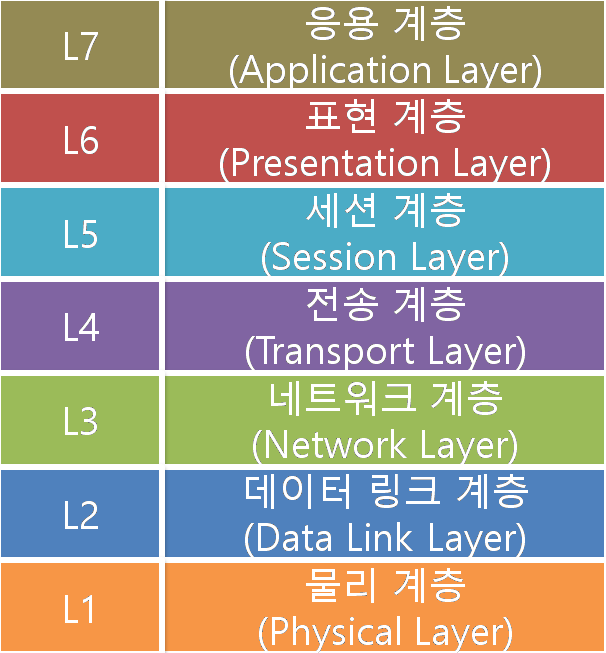
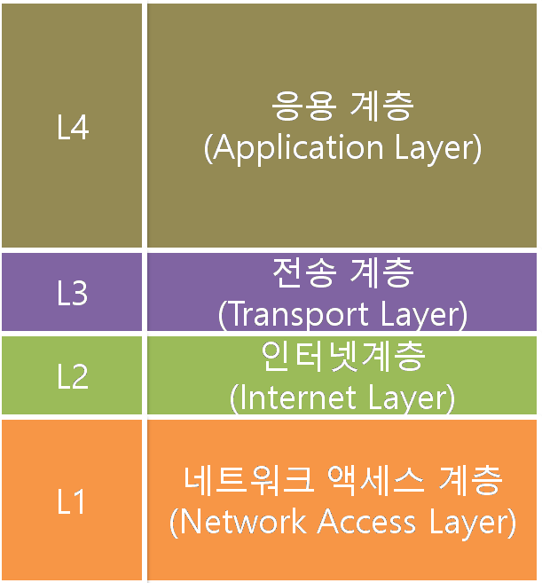
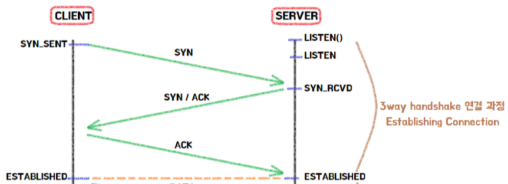
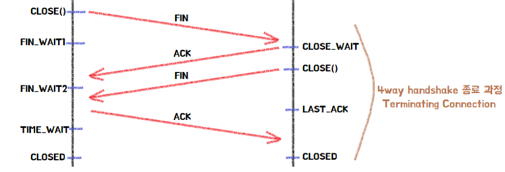

# 📅 2026-05-21 TIL

## 1. 오늘 학습 요약

* **학습 목표**: 
  * **코딩테스트** 문제풀이
  * **프로토콜**의 정의
  * **TCP/UDP** 프로토콜

* **학습 도구**: `Unreal Engine 5.5.4`, `Visual Studio 2022`

* **활동 내용**: 
  * 프로그래머스 **[과일 장수](https://school.programmers.co.kr/learn/courses/30/lessons/135808), [옹알이 (2)](https://school.programmers.co.kr/learn/courses/30/lessons/133499)** 풀이
  * **프로토콜**의 정의
  * **OSI 7 Layer**와 **TCP/IP 4 Layer**
  * **TCP**의 특징과 **Handshake**
  * **UDP**의 특징
  
---

## 2. 프로그래머스 문제 풀이

### [과일 장수](https://school.programmers.co.kr/learn/courses/30/lessons/135808)

```cpp
#include <vector>
#include <algorithm>

using namespace std;

int solution(int k, int m, vector<int> score) {
    int answer = 0;
    sort(score.rbegin(), score.rend());
    for (int i=m-1; i<score.size(); i+=m) 
        answer += score[i] * m;
    
    return answer;
}
```

* **정렬**, **그리디** 문제
* 사과를 역순으로 정렬하면, `n*m-1` 인덱스의 사과 가격이 그 상자에서 가장 싼 사과의 가격

---

### [옹알이 (2)](https://school.programmers.co.kr/learn/courses/30/lessons/133499)

```cpp
#include <string>
#include <vector>
using namespace std;

int solution(vector<string> babbling) {
    int answer = 0;
    for(const string& b : babbling){
        string prev = "";
        int cur = 0;
        while(cur < b.length()){
            string sub2 = b.substr(cur, 2);
            string sub3 = b.substr(cur, 3);
            if((sub2 == "ye" || sub2 == "ma") && sub2 != prev) {
                cur += 2;
                prev = sub2;
            }
            else if((sub3 == "aya" || sub3 == "woo") && sub3 != prev) {
                cur += 3;
                prev = sub3;
            }
            else break;
        }
        if(cur == b.length()) answer++;
    }
    return answer;
}
```

* **문자열**, **구현** 문제
* 문자열을 자르면서 현재 문자열이 옹알이할 수 있는 문자열인지 확인
* `prev`로 연속 여부를 확인

---

## 3. 프로토콜 (Protocol)

### 프로토콜

* 컴퓨터나 네트워크 장비간 데이터를 송수신하기 위해 메시지를 주고 받는 **규칙과 절차**

* 프로토콜은 통신의 **규칙**, **구문**, **의미**, **동기화** 등을 정의하며 하드웨어와 소프트웨어로 구현

### 프로토콜의 기능

* **분할 (Fragmentation):** 송신 시 긴 데이터를 **작은 단위(패킷, 블록)로 쪼개어** 보냄

* **재조립 (Reassembly):** 수신 시 작은 단위로 쪼개진 데이터를 **원래의 데이터로 합침**

* **캡슐화 (Encapsulation):** 데이터 전송 시 필요한 **제어 정보**를 덧붙여 보냄

* **연결 제어 (Connection Control):** 통신전 **통신로**를 개설, 유지, 해제 등의 관리

* **흐름 제어 (Flow Control):** 수신자의 처리 능력에 따라 **송신 속도, 송신량을 조절**함

* **순서 제어 (Sequence Control):** 작은 단위로 분할된 데이터에 **번호를 부여**해 순서를 관리

* **오류 제어 (Error Control):** 데이터 전송 중 **오류를 감지**하고, **재송신**을 요청

* **동기화 (Synchronization):** 송신자, 수신자 간의 **데이터를 일치**시킴

* **다중화 (Multiplexing):** 하나의 통신로를 **여러 기기, 사용자가 사용**할 수 있게 함

### OSI 7 계층 (Open Systems Interconnection 7 Layer)

* **국제표준화기구(ISO)** 에서 개발한 네트워크 통신 과정을 7단계로 나눈 모델

    

* **물리 계층 (Physical Layer):** 데이터를 **물리적인 전기 신호**로 전송하는 계층

* **데이터 링크 계층 (Data Link Layer):** **MAC 주소**를 통해 흐름 관리, 오류 검출, 재송신 등으로 **안전한 통신**을 보장

* **네트워크 계층 (Network Layer):** 목적지까지 데이터를 전송하기 위한 **안전하며 빠른 경로**를 찾음

* **전송 계층 (Transport Layer):** 오류 검출, 흐름 제어 등을 통해 두 사용자에게 **안전하고, 신뢰성 있는 통신**을 제공

* **세션 계층 (Session Layer):** 응용 프로세스가 통신을 유지하기 위한 **세션**을 관리

* **표현 계층 (Presentation Layer):** 응용 계층의 데이터를 **암호화, 복호화** 및 **압축** 등을 통해 **표현 방식**을 결정

* **응용 계층 (Application Layer):** 사용자가 **네트워크에 접속**할 수 있도록 제공

### TCP/IP 4 계층

* **실제로 사용**하는 인터넷의 표준 통신 계층

* 기존의 복잡한 **OSI 7 계층**을 4개의 계층으로 **압축**한 것

  

* **네트워크 액세스 계층 (Network Access Layer)** 
    * OSI 7 계층의 물리, 데이터 링크 계층의 역할을 담당
    * **전기 신호 전환** 및 MAC 주소를 통한 **안전한 통신**을 담당

* **인터넷 계층 (Internet Layer):**
    * OSI 7 계층의 네트워크 계층의 역할을 담당
    * **IP (Internet Protocol)** 를 통한 원천지, 목적지의 **최적의 경로**를 관리

* **전송 계층 (Transport Layer):**
    * OSI 7 계층의 전송 계층의 역할을 담당
    * 두 사용자에게 **안전하고 신뢰성** 있는 통신을 제공

* **응용 계층 (Application Layer):**
    * OSI 7 계층의 세션, 표현, 응용 계층의 역할을 담당
    * **세션** 관리, 데이터 **표현 방식** 결정, **네트워크 제공** 등을 이 계층에서 모두 담당

---

## 4. TCP (Transmission Control Protocol)

* **전송 계층 (Transport Layer)** 에서 사용하는 프로토콜

* 데이터를 **세그먼트(Segment)** 단위로 나누어 전달 함

* 각 세그먼트를 순서대로 전달하고, 오류가 발생하면 재전송을 통해 **높은 신뢰성**을 가짐

* 통신 전 반드시 연결을 확인하는 **연결 지향 프로토콜**

* 전송 시 **3-Way Handshake**, 전송 종료 시 **4-Way Handshake**를 통해 신뢰성을 보장

### TCP Flag

* **세그먼트의 용도**를 알리기 위한 **TCP 헤더**에 포함되어 있는 플래그

* **SYN (Synchronization):** 통신 **시작 시 연결**을 위한 플래그

* **ACK (Acknowledgment):** 세그먼트를 받았다는 **응답**을 위판 플래그

* **FIN (Finish):** 모든 데이터를 전송하여, **연결 종료**를 표시하는 플래그

* **RST (Reset):** 연결에 문제가 발생해 **즉시 연결을 해제**하는 플래그

* **PSH (Push):** 버퍼가 차는 것을 기다리지 않고 **바로 전송** 해야 하는 데이터임을 알리는 플래그

* **URG (Urgent):** 긴급한 데이터임을 알려 **높은 우선순위**를 갖는 플래그

### 3-Way Handshake



1. 클라이언트가 서버에게 **SYN 플래그**를 보내 통신을 시도하며 **SYN_SENT** 상태로 변경

2. 서버는 요청을 수락하는 **ACK 플래그**와 함께 **SYN 플래그**를 보내 통신을 시도하고 **SYN_RCVD** 상태로 변경

3. 클라이언트는 다시 서버의 플래그를 받았다는 의미의 **ACK 플래그**를 보내 둘의 상태를 **ESTABLISHED**로 변경

### 4-Way Handshake



1. 클라이언트가 모든 데이터를 보내면 **CLOSE()** 함수를 호출해 서버에게 **FIN 플래그**를 보낸 후 **FIN_WAIT1** 상태로 변경

2. 서버는 클라이언트의 데이터를 받고 **ACK 플래그**를 전송한 뒤 남은 데이터 전송을 위해 **CLOSE_WAIT** 상태로 변경하고 ACK 플래그를 받은 클라이언트는 **FIN_WAIT2** 상태로 변경

3. 서버가 남은 데이터를 모두 전송한 후 **CLOSE()** 함수를 호출해 클라이언트에게 **FIN 플래그**를 전송

4. 클라이언트는 서버의 **FIN 플래그**를 받은 후 서버에게 **ACK 플래그**를 전송하고 서버는 해당 플래그를 받아 연결을 해제

---

## 5. UDP (User Datagram Protocol)

* **전송 계층 (Transport Layer)** 에서 사용하는 프로토콜

* 데이터를 **데이터그램** 단위로 관리하며, 각 데이터그램은 **독립적인 관계**를 가져 서로 다른 경로로 전송됨

* **연결 여부를 확인하지 않고** 바로 데이터를 전송하는 **비연결 지향 프로토콜**

* **체크섬(Checksum)** 을 통한 최소한의 검사만 수행함

* 신뢰성은 낮지만 TCP보다 **빠른 속도**를 가짐

## 6. 참고 자료

* [퉁퉁코딩 - 프로토콜이란 무엇일까?](https://brunch.co.kr/@ttungcoding/2)

* [컴공생의 다이어리 - 프로토콜(Protocol)이란? - 정의, 기본 요소, 종류, 기능](https://computer-science-student.tistory.com/377)

* [위키백과 - 통신 프로토콜](https://ko.wikipedia.org/wiki/%ED%86%B5%EC%8B%A0_%ED%94%84%EB%A1%9C%ED%86%A0%EC%BD%9C)

* [ONsystems - [네트워크 이론 칼럼-4장] 프로토콜(Protocol)과 OSI 7계층 초간단 이해하기](https://blog.naver.com/onsystems/223367862331)

* [PromleeBlog - 7계층과 TCP/IP 모델 - 코딩과 함께 배우는 네트워크 2일차](https://www.promleeblog.com/blog/post/278-2-osi-layer) 

* [Inpa Dev - OSI 7계층 모델 - 핵심 총정리](https://inpa.tistory.com/entry/WEB-%F0%9F%8C%90-OSI-7%EA%B3%84%EC%B8%B5-%EC%A0%95%EB%A6%AC)

* [뇌드 디스크 - [Network] 1. OSI 7계층, TCP/IP 4계층, 3way/4way hanshake](https://develaniper-devpage.tistory.com/81)

* [Inpa Dev - 아직도 모호한 TCP / UDP 개념 ❓ 쉽게 이해하자](https://inpa.tistory.com/entry/NW-%F0%9F%8C%90-%EC%95%84%EC%A7%81%EB%8F%84-%EB%AA%A8%ED%98%B8%ED%95%9C-TCP-UDP-%EA%B0%9C%EB%85%90-%E2%9D%93-%EC%89%BD%EA%B2%8C-%EC%9D%B4%ED%95%B4%ED%95%98%EC%9E%90)
