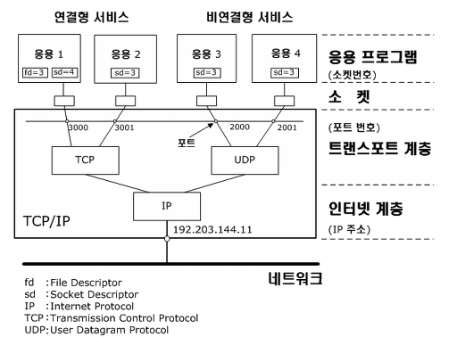
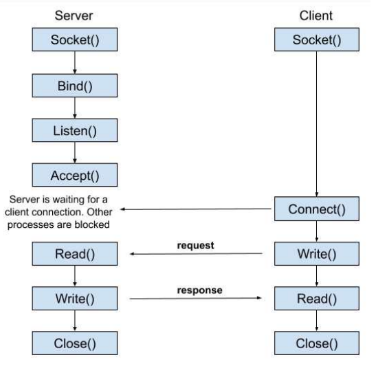
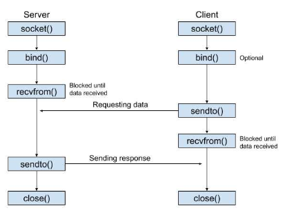

# 📅 2026-05-28 TIL

## 1. 오늘 학습 요약

* **학습 목표**: 
  * **코딩테스트** 문제풀이
  * **소켓** 학습

* **학습 도구**: `Unreal Engine 5.5.4`, `Visual Studio 2022`

* **활동 내용**: 
  * 프로그래머스 **[미로 탈출](https://school.programmers.co.kr/learn/courses/30/lessons/159993), [이모티콘 할인행사](https://school.programmers.co.kr/learn/courses/30/lessons/150368)** 풀이
  * **소켓**이란
  * **소켓 통신**의 흐름
  
---

## 2. 프로그래머스 문제 풀이

### [미로 탈출](https://school.programmers.co.kr/learn/courses/30/lessons/159993)

```cpp
#include <string>
#include <vector>
#include <queue>

using namespace std;

int BFS(const vector<string>& maps, pair<int, int> start, pair<int, int> end){
    queue<pair<int, int>> q;
    vector<vector<int>> visit(maps.size(), vector<int>(maps[0].length(), -1));
    int dx[4] = {-1, 1, 0, 0};
    int dy[4] = {0, 0, -1, 1};
    
    q.push(start);
    visit[start.first][start.second] = 0;
    
    while(!q.empty()){
        pair<int, int> current = q.front();
        int depth = visit[current.first][current.second];
        q.pop();
        
        for(int i=0; i<4; i++){
            int y = current.first + dy[i];
            int x = current.second + dx[i];
            if(y<0 || y>=maps.size() || x<0 || x>=maps[0].length() || 
               maps[y][x] == 'X' || visit[y][x] != -1) continue;
            q.push({y, x});
            visit[y][x] = depth + 1;
            if(end.first == y && end.second == x) return visit[y][x];
        }
    }
    
    return -1;
}

int solution(vector<string> maps) {
    int answer = 0;
    pair<int, int> start, lever, end;
    int path1, path2;
    for(int i=0; i<maps.size(); i++){
        for(int j=0; j<maps[0].length(); j++){
            if(maps[i][j] == 'S') start = {i, j};
            else if(maps[i][j] == 'L') lever = {i, j};
            else if(maps[i][j] == 'E') end = {i, j};
        }
    }
    path1 = BFS(maps, start, lever);
    path2 = BFS(maps, lever, end);
    if(path1 == -1 || path2 == -1) return -1;
    else return path1 + path2;
}
```

* **BFS** 문제
* 반드시 레버에 도달한 후 목적지로 이동해야 하므로 최단 거리는 `S -> L -> E`
* `S -> L` , `L -> E` 의 경로를 각각 **BFS**로 구해 최단 거리 계산
* 두 경로 중 하나라도 도달 불가능한 경우 미로에서 탈출할 수 없는 경우

---

### [이모티콘 할인행사](https://school.programmers.co.kr/learn/courses/30/lessons/150368)

```cpp
#include <string>
#include <vector>

using namespace std;

void calc(const vector<vector<int>>& users, const vector<int>& emoticons, 
          vector<int>& sales, vector<int>& answer){
    int plus = 0;
    int sum = 0;
    for(const vector<int>& user : users){
        int userSum = 0;
        for(int i=0; i<emoticons.size(); i++){
            if(sales[i] >= user[0]) userSum += emoticons[i] * (100 - sales[i]) / 100;
            if(userSum >= user[1]) {
                plus++;
                userSum = -1;
                break;
            }
        }
        if(userSum > 0) sum += userSum;
    }
    if(plus > answer[0]) answer = {plus, sum};
    else if(plus == answer[0] && sum > answer[1]) answer = {plus, sum};
}

void DFS(const vector<vector<int>>& users, const vector<int>& emoticons, vector<int>& sales, 
         int index, vector<int>& answer){
    if(index >= emoticons.size()) return;
    for(int i=1; i<5; i++){
        sales[index] = i * 10;
        calc(users, emoticons, sales, answer);
        DFS(users, emoticons, sales, index + 1, answer);
    }
}

vector<int> solution(vector<vector<int>> users, vector<int> emoticons) {
    vector<int> answer(2, 0);
    vector<int> sales(emoticons.size(), 0);
    DFS(users, emoticons, sales, 0, answer);
    return answer;
}
```

* **완전 탐색** 문제
* **가능한 할인율**은 `10, 20, 30, 40 총 4가지`
* **이모티콘의 최대 개수**가 `7개`이므로 가능한 모든 경우의 수는 `4^7 개`로 매우 적음

---

## 3. 소켓 (Socket)

### 소켓(Socket)이란



* 네트워크를 통해 통신하는 IPC(Inter-Process Communication)의 **종착점**

* 모든 프로세스는 소켓을 생성하고 해당 **소켓을 통해 데이터를 교환**

* 소켓은 **OSI 7계층**의 전송 계층과 응용 계층을 연결해 주는 역할을 함

* 소켓은 **IP**, **포트**, **프로토콜**의 3요소로 정의

### IP (Internet Protocol)

* 인터넷을 통해 통신할 때 사용되는 **국제 표준 규약**

* 인터넷에 연결되어 있는 기기를 **식별하기 위해 사용되는 고유 주소**

* **IPv4:** 주소를 **32비트** 방식으로 표현하는 방식 **8비트 숫자 그룹 4개**를 사용하며, 약 42억 개의 주소를 표현할 수 있음

* **IPv6:** 기기가 점차 늘어나며 **IPv4** 방식으로 모든 주소를 표현할 수 없다고 판단해 **새롭게 정의한 주소 표현 방식** **128비트** 방식으로 주소를 표현하며, **16비트 숫자 그룹 8개**를 사용

### 포트 (Port)

* IP 내에서 **프로세스를 구분**하기위해 사용하는 **식별자**

* **16비트** 크기를 가지므로 표현 가능한 포트의 범위는 `0 ~ 65535`

### 프로토콜 (Protocol)

* 컴퓨터나 네트워크 장비간 데이터를 송수신하기 위해 메시지를 주고 받는 **규칙과 절차**

* 인터넷 소켓은 크게 **TCP**를 사용하는 경우, **UDP**를 사용하는 경우 **두 개의 타입**으로 분류

### 스트림 소켓 (Stream Socket)

* **TCP**를 사용하는 **연결 지향** 소켓

* 순서 보장, 재전송 등으로 **신뢰성 높은** 통신을 보장

* 데이터의 경계가 존재하지 않는 **바이트 스트림**으로 전송됨

* **스트림 소켓** 연결 흐름

    

* **서버 초기화**
    1. **Socket():** 커널 공간에 **소켓을 생성**
    2. **Bind():** 생성된 소켓에 **IP**와 **포트**를 결합
    3. **Listen():** 소켓에 큐를 만들어 **동시에 몇 개의 클라이언트를 관리**할지 결정
    4. **Accept():** 큐를 확인해 클라이언트의 신호를 **대기**

* **클라이언트 연결**
    1. **Socket():** 커널 공간에 **소켓을 생성**
    2. **Connect():** 통신할 서버의 **IP와 포트 번호에 통신을 시도**

* **데이터 송수신 및 연결 해제**
    1. **Read()/Write():** 읽기, 쓰기를 반복하여 서버와 클라이언트 간 **통신**
    2. **Close():** 통신이 종료된 후 **연결 해제** 및 생성한 **소켓을 제거**

### 데이터그램 소켓 (Datagram Socket)

* **UDP**를 사용하는 **비연결 지향** 소켓

* 순서를 보장하지 않고, 재전송 또한 하지않기에 **낮은 신뢰성**을 가짐

* 데이터를 연속적인 바이트가 아닌 **독립적인 메시지** 단위로 읽음

* **데이터그램 소켓** 연결 흐름

    
    
* **서버 초기화**
    1. **Socket():** 커널 공간에 **소켓을 생성**
    2. **Bind():** 생성된 소켓에 **IP**와 **포트**를 결합
    3. **recvfrom():** 패킷이 올 때까지 **확인 및 대기**

* **클라이언트 연결**
    1. **Socket():** 커널 공간에 **소켓을 생성**
    2. **sendto():** 통신할 서버의 IP와 포트 번호에 데이터를 **즉시 전송**

* **데이터 송수신 및 소켓 소멸**
    1. **sendto() / recvfrom():** 상대방의 IP와 포트에 **메시지 전송을 반복**
    2. **Close():** 연결 해제의 과정 없이 소켓을 **즉시 제거**
---

## 4. 참고 자료

* [tngus - [네트워크] Socket 통신](https://study0304.tistory.com/92)

* [토스페이먼츠 개발자센터 - IP 주소](https://docs.tosspayments.com/resources/glossary/ip)

* [Inpa Dev - 포트(PORT) 란 무엇인가?](https://inpa.tistory.com/entry/WEB-%F0%9F%8C%90-%ED%8F%AC%ED%8A%B8-%EB%9E%80-%EB%AC%B4%EC%97%87%EC%9D%B8%EA%B0%80)

* [위키백과 - 네트워크 소켓](https://ko.wikipedia.org/wiki/%EB%84%A4%ED%8A%B8%EC%9B%8C%ED%81%AC_%EC%86%8C%EC%BC%93)

* [식혜드식혜 - 네트워크 통신의 기초](https://sikhye-de-sikhye-develop.tistory.com/13)

* [곰돌이 놀이터 - [기본] 소켓(SOCKET)통신 이란?](https://helloworld-88.tistory.com/215)


