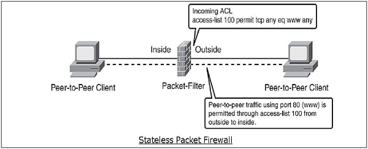
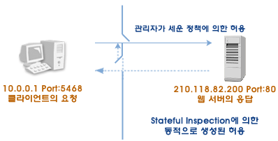
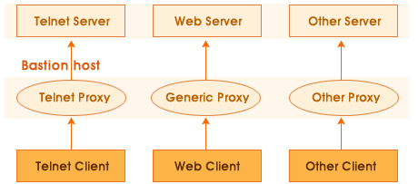
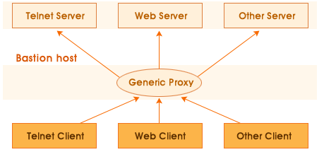

# 📅 2026-06-01 TIL

## 1. 오늘 학습 요약

* **학습 목표**: 
  * **코딩테스트** 문제풀이
  * **방화벽**

* **학습 도구**: `Unreal Engine 5.5.4`, `Visual Studio 2022`

* **활동 내용**: 
  * 프로그래머스 **[우박수열 정적분](https://school.programmers.co.kr/learn/courses/30/lessons/134239)**,
 **[단체사진 찍기](https://school.programmers.co.kr/learn/courses/30/lessons/1835)**,
 **[순위 검색](https://school.programmers.co.kr/learn/courses/30/lessons/72412)**,
 **[카카오프렌즈 컬러링북](https://school.programmers.co.kr/learn/courses/30/lessons/1829)** 풀이
   * 방화벽의 **특징**
   * 방화벽의 **종류**

---

## 2. 프로그래머스 문제 풀이

### [우박수열 정적분](https://school.programmers.co.kr/learn/courses/30/lessons/134239)

```cpp
#include <string>
#include <vector>
using namespace std;

vector<double> solution(int k, vector<vector<int>> ranges) {
    vector<double> answer;
    vector<double> integral;

    while(k != 1){
        int prev = k;
        if(k%2==0) k /= 2;
        else k = k*3 + 1;
        int MIN = min(k, prev);
        int MAX = max(k, prev);
        integral.push_back((MIN + MAX)/ 2.0);
    }
    for(const vector<int>& range : ranges){
        int left = range[0];
        int right = integral.size()+range[1];
        double sum = 0;
        if(left > right) sum = -1;
        for(left; left<right; left++) sum += integral[left];
        answer.push_back(sum);
    }
    return answer;
}
```

* **시뮬레이션** 문제
* 각 구간의 넓이는 **밑변의 길이**가 `n-1` 번째의 수, **윗변의 길이**가 `n`번째의 수고 **높이**가 `1`인 **사다리꼴의 넓이**와 같음
* 각 구간의 넓이를 계산한 후 원하는 구간의 합을 구하면 정답
* 누적합을 이용하면 더 빠르게 계산할 수 있지만, 범위가 좁으므로 반복으로 구해도 됨


---

### [단체사진 찍기](https://school.programmers.co.kr/learn/courses/30/lessons/1835)

```cpp
#include <string>
#include <vector>
#include <algorithm>
#include <cmath>

using namespace std;
vector<string> permutation(){
    vector<string> result;
    string members = "ACFJMNRT";
    do{
        result.push_back(members);
    }while(next_permutation(members.begin(), members.end()));
    return result;
}
// 전역 변수를 정의할 경우 함수 내에 초기화 코드를 꼭 작성해주세요.
int solution(int n, vector<string> data) {
    int answer = 0;
    vector<string> lines = permutation();
    for(const string& line : lines){
        bool flag = true;
        for(int i=0; i<data.size(); i++){
            int pos1 = find(line.begin(), line.end(), data[i][0]) - line.begin();
            int pos2 = find(line.begin(), line.end(), data[i][2]) - line.begin();
            char op = data[i][3];
            int dist = data[i][4] - '0';
            if((op == '=' && abs(pos1-pos2)-1 != dist) || 
              (op == '>' && abs(pos1-pos2)-1 <= dist) || 
              (op == '<' && abs(pos1-pos2)-1 >= dist)){
                flag = false;
                break;
            }
        }
        if(flag) answer++;
    }
    return answer;
}
```

* **완전 탐색** 문제
* 프렌즈가 설 수 있는 경우의 수는 `8! = 40,320`개 밖에 없음
* `next_permutation`으로 모든 경우의 수를 구한 다음 각 경우가 모든 조건을 만족하는지 확인

---

### [순위 검색](https://school.programmers.co.kr/learn/courses/30/lessons/72412)

```cpp
#include <string>
#include <vector>
#include <unordered_map>
#include <sstream>
#include <algorithm>
using namespace std;

vector<string> split(string& str, char c){
    vector<string> result;
    stringstream ss(str);
    string temp;
    while(getline(ss, temp, c)){
        result.push_back(temp);
    }
    return result;
}

void deleteTargets(const vector<int>& targets, vector<bool>& flag, int info, int digit){
    for(int i=0; i<targets.size(); i++){
        if((targets[i] / digit) % 10 != info)
            flag[i] = false;
    }
}

vector<int> solution(vector<string> info, vector<string> query) {
    vector<int> answer(query.size(), 0);
    unordered_map<int, vector<int>> map;
    
    for(int i=0; i<info.size(); i++){
        int id = 0;
        vector<string> words = split(info[i], ' ');
        
        if(words[0][0] == 'c') id += 1000;
        else if(words[0][0] == 'j') id += 2000;
        else if(words[0][0] == 'p') id += 3000;
        
        if(words[1][0] == 'b') id += 100;
        else if(words[1][0] == 'f') id += 200;
        
        if(words[2][0] == 'j') id += 10;
        else if(words[2][0] == 's') id += 20;
        
        if(words[3][0] == 'c') id += 1;
        else if(words[3][0] == 'p') id += 2;
        map[id].push_back(stoi(words[4]));
    }
    for(auto& [id, scores] : map) sort(scores.begin(), scores.end());
    
    vector<int> targets = {
        1111, 1112, 1121, 1122, 1211, 1212, 1221, 1222,
        2111, 2112, 2121, 2122, 2211, 2212, 2221, 2222,
        3111, 3112, 3121, 3122, 3211, 3212, 3221, 3222
    };
    
    for(int i=0; i<query.size(); i++){
        vector<string> words = split(query[i], ' ');
        vector<bool> flag(targets.size(), true);
        int score = stoi(words[7]);
        
        if(words[0][0] == 'c') deleteTargets(targets, flag, 1, 1000);
        else if(words[0][0] == 'j') deleteTargets(targets, flag, 2, 1000);
        else if(words[0][0] == 'p') deleteTargets(targets, flag, 3, 1000);
        
        if(words[2][0] == 'b') deleteTargets(targets, flag, 1, 100);
        else if(words[2][0] == 'f') deleteTargets(targets, flag, 2, 100);
        
        if(words[4][0] == 'j') deleteTargets(targets, flag, 1, 10);
        else if(words[4][0] == 's') deleteTargets(targets, flag, 2, 10);
        
        if(words[6][0] == 'c') deleteTargets(targets, flag, 1, 1);
        else if(words[6][0] == 'p') deleteTargets(targets, flag, 2, 1);
        
        for(int j=0; j<flag.size(); j++){
            if(flag[j]){
                const vector<int>& scores = map[targets[j]];
                answer[i] += scores.end() - lower_bound(scores.begin(), scores.end(), score);
            }
        }
    }
    return answer;
}
```

* **해시**, **이진 탐색**을 활용하는 문제
* 지원자의 유형을 **id**로 관리해 점수를 해시맵에 저장
* 각 **query**가 만족하는 **id**를 찾은 후 **이진 탐색**으로 점수 조건을 체크

---

### [카카오프렌즈 컬러링북](https://school.programmers.co.kr/learn/courses/30/lessons/1829)

```cpp
#include <vector>
#include <queue>
#include <algorithm>

using namespace std;
int BFS(const vector<vector<int>>& picture, vector<vector<bool>>& visit, int i, int j){
    if(picture[i][j] == 0 || visit[i][j]) return 0;
    
    queue<pair<int, int>> q;
    int dx[4] = {-1, 1, 0, 0};
    int dy[4] = {0, 0, -1, 1};
    q.push({i, j});
    visit[i][j] = true;
    int color = picture[i][j];
    int count = 1;
    
    while(!q.empty()){
        int y = q.front().first;
        int x = q.front().second;
        q.pop();
        for(int i=0; i<4; i++){
            int ny = y + dy[i];
            int nx = x + dx[i];
            if(ny<0 || ny>=picture.size() || nx<0 || nx >=picture[0].size() || 
               picture[ny][nx] != color || visit[ny][nx]) continue;
            q.push({ny, nx});
            visit[ny][nx] = true;
            count++;
        }
    }
    return count;
}

// 전역 변수를 정의할 경우 함수 내에 초기화 코드를 꼭 작성해주세요.
vector<int> solution(int m, int n, vector<vector<int>> picture) {
    vector<int> count;
    vector<vector<bool>> visit (m, vector<bool>(n, false));
    
    for(int i=0; i<m; i++){
        for(int j=0; j<n; j++){
            int c = BFS(picture, visit, i, j);
            if(c != 0) count.push_back(c);
        }           
    }
    sort(count.begin(), count.end());

    return {(int)count.size(), count.back()};
}
```

* **BFS**를 활용하는 문제
* 모든 좌표에서 BFS를 실행하고, 방문 체크를 하면 같은 색깔로 연결된 노드는 하나로 묶임
* 묶인 개수가 영역의 개수

---

## 3. 방화벽 (Firewall)

### 방화벽이란

* **미리 정의된 보안 규칙**에 기반한, 들어오고 나가는 네트워크 트래픽을 모니터링하고 제어하는 **네트워크 보안 시스템**

* 네트워크와 인터넷 사이에서 **승인되지 않은 트래픽의 출입을 차단**해 내부 네트워크와 외부 네트워크 간의 **장벽을 구성**

* 방화벽은 **기밀성(Confidentiality)**, **무결성(Integrity)**, **가용성(Availability)** 의 보안의 세 가지 기본 요소를 보호
    * **기밀성(Confidentiality):** **승인된 사용자**만 중요한 정보에 접근할 수 있도록 제한
    * **무결성(Integrity):** 정보가 **손상되거나 변조되지 않도록 보호**.
    * **가용성(Availability):** **승인된 사용자**는 필요한 자원에 **언제든지 접근**할 수 있도록 보장

### 방화벽의 기능
* **접근 통제(Access Control):** 미리 정의된 보안 규칙을 기반으로 **접근을 통제**하는 기능

* **인증(Authentication):** 네트워크에 접근하는 사용자의 **신원을 증명**하는 기능
    * 메시지 인증: **VPN**과 같이 신뢰할 수 있는 통신선으로 통신해 신뢰성 보장
    * 사용자 인증: **ID/PW**, **OTP** 등과 같이 사용자의 신원을 확인
    * 클라이언트 인증: 접속을 요청하는 단말기, 소프트웨어가 신뢰할 수 있는지 확인

* **감사 및 로그 기능(Auditing / Loggging):** 방화벽에 접근한 모든 트래픽, 정책 설정 및 변경을 **로그로 기록**

* **프라이버시 보호 (Privacy Protection):** 내부, 외부 네트워크 사이의 **중재자**를 두어 내부 네트워크를 보호
    * NAT(Network Address Translation): 내부의 **사설 IP**를 **공인 IP**로 변환해 통신해 **내부의 IP 구조를 보호**
    * 이중 DNS(Domain Name System): 내부망의 DNS 서버, 외부망의 DNS 서버를 **분리해** 내부의 DNS 망을 보호
    * 프록시(Proxy): 실제 서비스를 수행하는 **중재자 서버**를 두어 개인 정보를 보호

* **서비스 통제(Service Control):** 위험성이 존재하는 서비스를 **필터링**해 내부 네트워크의 취약점을 보호

* **데이터 암호화(Data Encryption):** 주로 VPN을 통해 방화벽 사이의 통신을 **암호화** 해 탈취, 위변조를 방지

---

## 4.방화벽의 종류

### 패킷 필터링(Packet Filtering)



* 가장 초기적인 방화벽 방식으로 **네트워크 계층**과 **전송 계층**에서 동작

* 통신 도중 **패킷을 가로채** 해당 패킷 안의 **주소와 포트**를 검색하여 사전에 정의된 **보안 규칙**으로 접근 허용 결정

* 처리 속도가 **빠르며** 낮은 레이어에서 동작하기에 기존 프로그램에 **연동이 쉬움**

* TCP/IP 프로토콜의 구조적 문제로 인하여 **패킷 헤더의 조작**으로 방화벽을 통과하는 위험성이 있음

* **패킷 내의 데이터**에 대한 공격을 차단하지 못함


### 상태추적(State Inspection)



* **네트워크 계층**에서 패킷을 처리하면서 프로토콜의 **상태 정보 테이블**을 유지 **프로토콜 특성에 따른 변화를 동적으로 대응**

* 기존 패킷 필터링 기능에 **session 추적 기능**을 추가하여 일련의 네트워크 서비스의 순서를 추적해 **순서에 어긋나는 패킷은 차단**

* **모든 통신채널**에 대해 추적 가능하며, **UDP** 와 **RPC** 패킷 또한 추적 가능

* 방화벽을 **재시작**할 경우 상태 정보가 초기화되어, **정당한 패킷도 차단**할 수 있음

### 애플리케이션 게이트웨이(Application Gateway)



* **응용 계층**에서 동작하며 서비스별로 **프록시(Proxy)** 를 구동해 각 서비스에 **방화벽 규칙 적용** 및 **연결**을 수행

* 프록시를 통해 패킷 헤더의 **Data 영역까지 확인**해 허용 여부를 관리

* **높은 보안 설정**이 가능하며, 내부 네트워크를 **안전하게 숨길 수 있음**

* 네트워크에 **많은 부하**를 주며, 하드웨어 성능에 의존적

* 프록시에 등록된 애플리케이션만 허용하므로, 새로운 애플리케이션에는 적용할 수 없음

### 서킷 게이트웨이(Circult Gateway)



* **세션 계층**과 **응용 계층**에서 동작하며 모든 서비스가 하나의 **대표 프록시**를 이용

* 클라이언트는 프록시를 통해 연결한 후 통신채널 **서킷(Circult)** 을 구성해 해당 서킷으로 통신

* 서킷을 구성한 이후에는 **별도의 검증 없이** 패킷을 전달

* 방화벽에 접속하기 위해 사용자는 **서킷 게이트웨이를 인식할 수 있는 클라이언트가 필요**하기에 번거로움

### 하이브리드(Hybrid)

* **패킷 필터링** 방식과 **어플리케이션** 방식을 혼합

* 두 방식의 장점을 섞어 **패킷 레벨의 접근 제어**와 **응용 프로그램의 사용자 제어**의 장점을 가짐

* **애플리케이션 게이트웨이** 방식의 최대 단점인 새로운 애플리케이션 수용은 **패킷 필터링 방식으로 제공**

* 내부 보안 정책, 애플리케이션에 맞추어 **선택적인 보안 설정**이 가능

* 하나의 방화벽에 다양한 보안 정책이 뒤섞여 있기에 **매우 복잡**하며 **유지보수가 어려움**

---

## 5. 참고 자료

* [방화벽정책관리 업무 백서 - 1. 방화벽이란?](https://wikidocs.net/141948)

* [코딩하는 주노 이야기 - [네트워크] 방화벽(Firewall) (1) - 개념, 기능, 동작방식](https://co-no.tistory.com/entry/%EB%84%A4%ED%8A%B8%EC%9B%8C%ED%81%AC-%EB%B0%A9%ED%99%94%EB%B2%BDFirewall)

* [별의수다 - 침입차단시스템(방화벽, Firewall)의 종류](https://m.blog.naver.com/wnrjsxo/221066364387)

* [웹하는빡통 - 침입차단시스템(Firewall) 개념 및 구성요소](https://webstone.tistory.com/136)

* [Inpa Dev - NAT(Network Address Translation) 이란 무엇인가?](https://inpa.tistory.com/entry/WEB-%F0%9F%8C%90-NAT-%EB%9E%80-%EB%AC%B4%EC%97%87%EC%9D%B8%EA%B0%80)