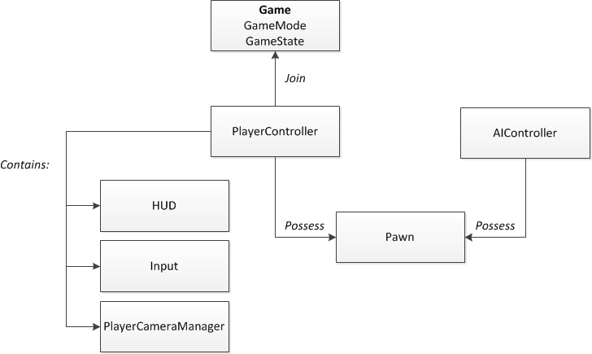

# 📅 2026-06-05 TIL

## 1. 오늘 학습 요약

* **학습 목표**: 
  * **코딩테스트** 문제풀이
  * 언리얼 엔진 **게임플레이 프레임워크**

* **학습 도구**: `Unreal Engine 5.5.4`, `Visual Studio 2022`

* **활동 내용**: 
  * 프로그래머스 **[빛의 경로 사이클](https://school.programmers.co.kr/learn/courses/30/lessons/86052)**, **[양과 늑대](https://school.programmers.co.kr/learn/courses/30/lessons/92343)** 풀이
  * 언리얼 엔진 **게임플레이 프레임워크**

---

## 2. 프로그래머스 문제 풀이

### [빛의 경로 사이클](https://school.programmers.co.kr/learn/courses/30/lessons/86052)

```cpp
#include <string>
#include <vector>
#include <queue>
#include <algorithm>

using namespace std;

// dir: 0=상 1=하 2=좌 3=우
int getDirection(int currentDir, char node){
    if(node == 'L'){
        if(currentDir == 0) return 2;
        if(currentDir == 1) return 3;
        if(currentDir == 2) return 1;
        if(currentDir == 3) return 0;
    }
    if(node == 'R'){
        if(currentDir == 0) return 3;
        if(currentDir == 1) return 2;
        if(currentDir == 2) return 0;
        if(currentDir == 3) return 1;
    }
    else return currentDir;
}

vector<int> getNext(const vector<string>& grid, const vector<int>& data){
    vector<int> next = data;
    int m = grid.size(), n = grid[0].size();
    
    if(data[2] == 0) next[0]--;
    else if(data[2] == 1) next[0]++; 
    else if(data[2] == 2) next[1]--; 
    else if(data[2] == 3) next[1]++;
    next[0] = next[0] < 0 ? m-1 : next[0];
    next[0] = next[0] >=  m ? 0 : next[0];
    next[1] = next[1] < 0 ? n-1 : next[1];
    next[1] = next[1] >=  n ? 0 : next[1];
    
    next[2] = getDirection(data[2], grid[next[0]][next[1]]);
    
    return next;
}

int BFS(const vector<string>& grid, vector<vector<vector<int>>>& visit, int i, int j, int dir){
    if(visit[i][j][dir] != 0) return 0;

    queue<vector<int>> q;
    q.push({i, j, dir});
    visit[i][j][dir] = 1;
    
    while(!q.empty()){
        vector<int> data = q.front();
        q.pop();
        int y = data[0], x = data[1], cd = data[2];
        
        vector<int> next = getNext(grid, data);
        int ny = next[0], nx = next[1], nd = next[2];
        
        if(visit[ny][nx][nd] != 0) return visit[y][x][cd];
        q.push({ny, nx, nd});
        visit[ny][nx][nd] = visit[y][x][cd] + 1;
    }
    
    return 0;
}

vector<int> solution(vector<string> grid) {
    vector<int> answer;
    vector<vector<vector<int>>> visit(grid.size(), vector<vector<int>>
                                      (grid[0].size(), vector<int>
                                       (4, 0)));

    for(int i=0; i<grid.size(); i++){
        for(int j=0; j<grid[0].size(); j++) {
            for(int k=0; k<4; k++){
                int result = BFS(grid, visit, i,j,k);
                if(result != 0) answer.push_back(result);
            }
        } 
    }
    
    sort(answer.begin(), answer.end());
    return answer;
}
```

* **시뮬레이션** 문제
* `getNext()`, `getDirection()` 함수로 현재 노드에서 다음 노드로 이동한 후, 방향을 계산
* 이미 방문한 노드와 방향일 경우 **사이클이 발생**한 것이므로 지금까지의 깊이를 반환
* 이동에 **BFS**를 사용했지만, 방향은 항상 하나로 고정되므로 단순 반복문으로 해도 됨

---

### [양과 늑대](https://school.programmers.co.kr/learn/courses/30/lessons/92343)

```cpp
#include <string>
#include <vector>

using namespace std;
void DFS(const vector<int>& info, const vector<vector<int>>& graph, 
         vector<int>& connected, vector<bool>& visit,
         int sheep, int wolf, int& answer){
    if(sheep > answer) answer = sheep;
    
    for(const int node : connected){
        if(visit[node] || (info[node] == 1 && sheep <= wolf+1)) continue; 
        
        vector<int> next = connected;
        for(int i=0; i<graph[node].size(); i++) next.push_back(graph[node][i]);
        visit[node] = true;
        
        if(info[node] == 0) DFS(info, graph, next, visit, sheep+1, wolf, answer);
        else DFS(info, graph, next, visit, sheep, wolf+1, answer);
        
        visit[node] = false;
    }
}
    
int solution(vector<int> info, vector<vector<int>> edges) {
    int answer = 0;
    vector<vector<int>> graph(info.size());
    vector<bool> visit(info.size(), false);
    
    for(const vector<int>& edge : edges)
        graph[edge[0]].push_back(edge[1]);
    
    vector<int> connected = graph[0];
    visit[0] = true;
    
    DFS(info, graph, connected, visit, 1, 0, answer);
    return answer;
}
```

* **백트래킹** 문제
* `connected`에는 현재 방문 가능한 노드들을 저장한 후, 특정 노드에 방문하면 `next`로 방문 가능한 노드를 업데이트
* `visit`으로 동일한 노드에 여러 번 방문하는 것을 방지
* 특정 노드에 방문했을 때, 늑대의 마릿수가 양의 마릿수보다 같거나 더 많으면 **가지치기**

---

## 3. 언리얼 엔진 게임플레이 프레임워크

### 게임플레이 프레임워크



* 게임플레이 경험을 구축할 수 있도록 **모듈화된 기반을 제공하는 클래스들의 집합과 플로우**

* 게임의 **규칙**, 게임과 플레이어의 **상태**, 플레이어의 **입력**, **캐릭터**, **네트워크**, **UI** 등을 역할별로 분리하여 관리할 수 있도록 설계

### Game Mode

* 레벨마다 존재하는 **서버** 기반 **매니저 액터**

* 레벨 로드 시 생성되며 **가장 먼저 인스턴스화** 되는 액터

* 게임의 전반적인 **규칙과 구조를 관리**하며, 프레임워크의 **다른 액터들을 인스턴스화** 함

* 서버에만 존재하기에 **레플리케이트되지 않음**

### Game State

* **게임의 상태**를 트래킹하는 매니저 액터

* 게임 모드가 **가장 먼저 만드는** 프레임워크 액터

* 접속된 **모든 클라이언트**가 알아야 하는, **게임 모드와 관련**된 데이터 및 로직 정보를 관리

* 게임에 존재하는 **모든 플레이어 스테이트를 저장하는** `PlayerArray`를 갖고 있음

* **서버가 데이터를 트래킹**하여 데이터를 모든 클라이언트에게 **레플리케이트**

### Player State

* **플레이어에 할당된 데이터**를 트래킹하는 매니저 액터

* 플레이어가 **게임에 참가하거나, 레벨에 로드**될 때 생성

* 플레이어가 조종하던 폰, 캐릭터가 파괴되어도 **플레이어 스테이트는 유지**

* 클라이언트는 **Server RPC**를 통해 데이터 수정을 요청하고, 서버가 해당 데이터를 모든 클라이언트에게 **레플리케이트**

### Pawn

* **플레이어나 AI가 제어**할 수 있는 모든 액터의 베이스 클래스

* 플레이어나 AI의 **시각적인 모습**, 콜리전이나 물리와 같은 **월드와의 상호작용 방식을 규정**

* 플레이어나 AI가 **빙의(Possess)** 할 수 있으며, 기본적으로 **컨트롤러와 1:1 대응 관계**를 가짐

* Pawn 자체는 형태가 없고 **충돌, 메쉬, 무브먼트 등의 다양한 컴포넌트를 부착**하여 사용

### Player Controller

* **Controller (컨트롤러)** 는 폰에서 파생된 클래스에 **빙의**하여 해당 **클래스를 제어하는 매니저 액터**

* 플레이어 컨트롤러는 **플레이어의 입력을 처리**하여 빙의된 폰을 제어

* 서버와 해당 컨트롤러을 소유한 클라이언트에만 존재하기에 **플레이어 스테이트에 데이터를 트래킹**해야 함

---

## 4. 참고 자료

* [게임플레이 프레임워크](https://dev.epicgames.com/documentation/unreal-engine/gameplay-framework-in-unreal-engine)

* [게임플레이 프레임워크 퀵 레퍼런스](https://dev.epicgames.com/documentation/unreal-engine/gameplay-framework-quick-reference-in-unreal-engine)

* [게임 모드와 게임 스테이트](https://dev.epicgames.com/documentation/unreal-engine/game-mode-and-game-state-in-unreal-engine)

* [폰](https://dev.epicgames.com/documentation/unreal-engine/pawn-in-unreal-engine)

* [컨트롤러](https://dev.epicgames.com/documentation/unreal-engine/controllers-in-unreal-engine)

* [플레이어 컨트롤러](https://dev.epicgames.com/documentation/unreal-engine/player-controllers-in-unreal-engine)

* [APlayerState](https://dev.epicgames.com/documentation/unreal-engine/API/Runtime/Engine/APlayerState)

* [구루카 - [UE5] 언리얼 엔진의 게임플레이 프레임워크](https://velog.io/@grukall/UE5-%EC%96%B8%EB%A6%AC%EC%96%BC-%EC%97%94%EC%A7%84%EC%9D%98-%EA%B2%8C%EC%9E%84%ED%94%8C%EB%A0%88%EC%9D%B4-%ED%94%84%EB%A0%88%EC%9E%84%EC%9B%8C%ED%81%AC)

* [Begin Play | Gameplay](https://dev.epicgames.com/community/learning/tutorials/l21z/unreal-engine-begin-play-gameplay?source=0w)