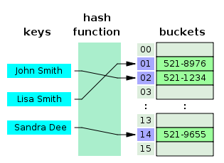
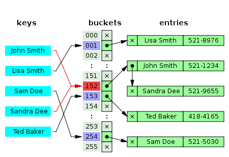

# 📅 2026-06-09 TIL

## 1. 오늘 학습 요약

* **학습 목표**: 
  * **코딩테스트** 문제풀이
  * 언리얼 엔진 **TMap**

* **학습 도구**: `Unreal Engine 5.5.4`, `Visual Studio 2022`

* **활동 내용**: 
  * 프로그래머스 **[숫자 블록](https://school.programmers.co.kr/learn/courses/30/lessons/12923)**, **[혼자서 하는 틱택토](https://school.programmers.co.kr/learn/courses/30/lessons/160585)** 풀이
  * 언리얼 엔진 **TMap**의 특징
  * 언리얼 엔진 **TSet**의 특징
  * **TMap**과 **std::map**의 차이

---

## 2. 프로그래머스 문제 풀이

### [숫자 블록](https://school.programmers.co.kr/learn/courses/30/lessons/12923)

```cpp
#include <string>
#include <vector>

using namespace std;
long long getDivisor(long long n) {
    if (n <= 1) return 0;
    long long result = 1; 
    
    for (long long i=2; i*i<=n; i++) {
        if (n % i == 0) {
            if (n/i <= 10000000) return n / i;
            if (i <= 10000000) result = max(result, i);
        }
    }
    
    return result;
}

vector<int> solution(long long begin, long long end) {
    vector<int> answer(end-begin+1, 0);
    for(long long i=0; i<end-begin+1; i++){
        long long pos = i+begin;
        answer[i] = getDivisor(pos);
    }
    return answer;
}
```

* **수학** 문제
* 각 블록에 적힌 번호는 **자신을 제외한 가장 큰 약수**
* 숫자의 제한이 `1,000만`이므로 조건을 추가

---

### [혼자서 하는 틱택토](https://school.programmers.co.kr/learn/courses/30/lessons/160585)

```cpp
#include <string>
#include <vector>

using namespace std;
int isEnd(const vector<string>& board){
    bool winO = false, winX = false;
    for(int i=0; i<3; i++){
        if(board[i][0] != '.' && board[i][0] == board[i][1] && board[i][1] == board[i][2]) 
            board[i][0] == 'O' ? winO = true : winX = true;
        if(board[0][i] != '.' && board[0][i] == board[1][i] && board[1][i] == board[2][i]) 
            board[0][i] == 'O' ? winO = true : winX = true;
    }
    if(board[0][0] != '.' && board[0][0] == board[1][1] && board[1][1] == board[2][2]) 
        board[0][0] == 'O' ? winO = true : winX = true;
    if(board[0][2] != '.' && board[0][2] == board[1][1] && board[1][1] == board[2][0]) 
        board[0][2] == 'O' ? winO = true : winX = true;
    
    if(winO && winX) return -1;
    if(winO) return 1;
    if(winX) return 2;
    else return 0;
}

int solution(vector<string> board) {
    int result = isEnd(board);
    int countO = 0, countX = 0;
    for(int i=0; i<3; i++){
        for(int j=0; j<3; j++){
            if(board[i][j] == 'O') countO++;
            else if(board[i][j] == 'X') countX++;
        }
    }
    
    if(result == -1) return 0;
    if(countO == countX && result != 1) return 1;
    if(countO - countX == 1  && result != 2) return 1;
    else return 0;
}
```

* **구현** 문제
* 게임이 **정상적으로 진행된 경**우는 아래의 두 가지 경우밖에 없음
    * O, X의 개수가 같으면서 O가 이기지 않은 경우
    * O의 개수가 X의 개수보다 1개 많고, X가 이기지 않은 경우

---

## 3. TMap

### 특징

* 언리얼에서 제공하는 **Key-Value Pair**로 데이터를 저장하는 **컨테이너**

* **키는 고유하며**, 모든 요소가 **동일한 타입**이어야 함

* 여러 개의 **동일한 키**를 저장하는 경우, `TMultiMap`을 사용할 수 있음

* **TMap**은 해싱 컨테이너이므로 **키 타입**이 `GetTypeHash()`를 지원해야 하며 `operator==`를 제공해야 함

* 기본적으로 정렬되지 않지만, **키 또는 값으로 정렬 함수를 사용할 수 있으며** 요소가 추가, 삭제되면 정렬이 보장되지 않음

### 구조

* **TMap**은 **TSet**과 유사하게 **키 해시 기반**으로 동작하며 내부적으로 **TSet으로 구성되어 있음**

* 각 쌍은 `TPair<KeyType, ElementType>`로 **개별 오브젝트**인 것처럼 취급하며 **각 오브젝트를 TSet으로 관리**

```cpp
class TMapBase
{
	// ...
public:
	// ...
	typedef TPair<KeyType, ValueType> ElementType;
    // ...
protected:
    typedef TSet<ElementType, KeyFuncs, SetAllocator> ElementSetType;
    // ...
    /** A set of the key-value pairs in the map. */
    ElementSetType Pairs;
    // ...
};
```

---

## 4. TSet

### 특징

* 언리얼에서 제공하는 **데이터값 자체를 키로 사용하는 컨테이너**

* **키 해시 기반**으로 동작하며 내부적으로 **해시 테이블**을 사용해 검색, 삽입, 삭제 등의 연산을 **O(1)의 평균 시간 복잡도**로 처리

### 해시 테이블





```cpp
template<typename InElementType, bool bTypeLayout>
class TSetElementBase
{
public:
	// ...

	/** The element's value. */
	ElementType Value;

	/** The id of the next element in the same hash bucket. */
	mutable FSetElementId HashNextId;

	/** The hash bucket that the element is currently linked to. */
	mutable int32 HashIndex;
};
```

* **해시 함수**를 통하여 버킷을 계산하며 충돌할 경우 **분리 연결법**을 사용함

* **TSet**은 내부적으로 `TSetElement`를 `TSparseArray`에 저장하며 각 요소는 아래의 역할을 가짐
    * **ElementType Value:** 실제 요소의 **데이터**
    * **FSetElementId HashNextId:** 충돌이 발생한 경우 체이닝으로 연결된 `TSparseArray`의 **다음 인덱스 주소**
    * **int32 HashIndex:** 요소를 저장한 **버킷 인덱스**

### TSparseArray

```cpp
// Set.h
class TSet
{
    // ...
private:
	// ...
	using ElementArrayType = TSparseArray<SetElementType, typename Allocator::SparseArrayAllocator>;
	using HashType         = typename Allocator::HashAllocator::template ForElementType<FSetElementId>;

	ElementArrayType Elements;

	HashType Hash;
	int32	 HashSize = 0;
    // ...
};

// SparseArray.h
class TSparseArray
{
    //...
protected:
    // ...
    typedef TArray<FElementOrFreeListLink,typename Allocator::ElementAllocator> DataType;
    DataType Data;
    // ...
};
```

* TSet은 내부적으로 요소를 저장할 때 `TSparseArray`를 사용

* `TSparseArray` 기존의 `TArray`를 기반으로 **빈 공간을 허용**해 빈번한 삽입, 삭제에 유리하게 만든 배열

* **비트마스킹**을 통해 각 공간의 활성화 여부를 저장함

* **사용되지 않는 공간도 할당**하기에 약간의 파편화가 있지만 **O(1)의 시간 복잡도로 삽입, 삭제**가 가능

* 삭제로 인해 파편화가 발생할 경우 `FreeListLink`를 통해 **해당 공간을 먼저 사용함**

---

## 5. TMap과 std::map의 차이

### 자료구조

* **TMap:** `TSparseArray`기반의 **해시 테이블**, 정렬을 보장하지 않으며 $O(1)$의 시간 복잡도를 가짐

* **std::map:** `Red–black tree`로 구현되어 있어 정렬을 보장하지만, $O(logn)$의 시간 복잡도를 가짐


### 메모리 구조

* **TMap:** `TArray` 기반의 일렬로 **연속된 물리 메모리를 사용**하며 **캐시 히트율**이 높음

* **std::map:** **노드** 기반의 컨테이너이므로 각 요소가 **연속적으로 위치하지 않으며**, 삽입 및 삭제 시 **매번 동적 할당 및 반환이 발생**

---

## 6. 참고 자료

* [TMap](https://dev.epicgames.com/documentation/unreal-engine/map-containers-in-unreal-engine)

* [TSet](https://dev.epicgames.com/documentation/unreal-engine/set-containers-in-unreal-engine)

* [민트맛치킨 - 언리얼 TSet, TSparseArray](https://velog.io/@hydisk77/%EC%96%B8%EB%A6%AC%EC%96%BC-TSet-TSparseArray)

* [돼지표 - [Unreal 5] 언리얼 엔진의 Map 컨테이너(TMap, TSet)](https://pig-tag.tistory.com/105)