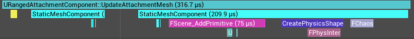
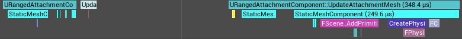
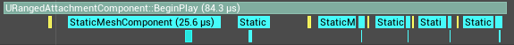

# 📅 2026-06-16 TIL

## 1. 오늘 학습 요약

* **학습 목표**: 
  * **코딩테스트** 문제풀이
  * 부착물 메쉬 업데이트 최적화

* **학습 도구**: `Unreal Engine 5.5.4`, `Visual Studio 2022`

* **활동 내용**: 
  * 프로그래머스 **[스킬트리](https://school.programmers.co.kr/learn/courses/30/lessons/49993)**, **[방문 길이](https://school.programmers.co.kr/learn/courses/30/lessons/49994)** 풀이
  * 부착물 메쉬 업데이트 최적화

---

## 2. 프로그래머스 문제 풀이

### [스킬트리](https://school.programmers.co.kr/learn/courses/30/lessons/49993)

```cpp
#include <string>
#include <vector>

using namespace std;

int solution(string skill, vector<string> skill_trees) {
    int answer = 0;
    for(const string& skill_tree : skill_trees){
        bool flag = true;
        int cur = 0;
        for(int i=0; i<skill_tree.length(); i++){
            if(skill.find(skill_tree[i]) != string::npos){
                if(skill_tree[i] == skill[cur]) cur++;
                else{
                    flag = false;
                    break;
                }
            }
        }          
        if(flag) answer++;
    }
    return answer;
}
```

* **문자열** 문제
* `skill`의 순서대로 스킬트리에 문자들이 정렬되어 있어야 함
* `skill`에 없는 문자는 넘어가고, `skill`에 존재하는 문자만 검사

---

### [방문 길이](https://school.programmers.co.kr/learn/courses/30/lessons/49994)

```cpp
#include <string>
#include <set>
#include <vector>
using namespace std;

int solution(string dirs) {
    int answer = 0;
    pair<int, int> pos;
    set<vector<int>> routes;

    for(int i=0; i<dirs.length(); i++){
        pair<int, int> prev = pos;
        if(dirs[i] == 'U') pos.first = min(5, pos.first+1);
        else if(dirs[i] == 'D') pos.first = max(-5, pos.first-1);
        else if(dirs[i] == 'R') pos.second = min(5, pos.second+1);
        else if(dirs[i] == 'L') pos.second = max(-5, pos.second-1);
        if(pos == prev) continue;
        routes.insert({pos.first, pos.second, prev.first, prev.second});
        routes.insert({prev.first, prev.second, pos.first, pos.second});
    }
    return routes.size()/2;
}
```

* **시뮬레이션** 문제
* 지나온 길의 개수는 그래프에서 **간선의 개수**라고 생각할 수 있음
* 각 위치를 노드로 치환하고, 간선을 `set`에 저장

---

## 3. 부착물 메쉬 업데이트 최적화

CH3 팀 프로젝트에서 총기 부착물 파트를 담당했고, 마감 시간이 얼마 남지 않은 채 작업을 시작함.

그로 인해 구조나 최적화를 위한 고민보다 우선 구현을 위주로 급하게 진행함.

프로젝트가 끝난 이후 기존 코드의 구조를 검토해 보았고, 성능상 비효율적인 부분이 발견되어 수정하고자 함.

### 1. 문제

부착물 코드 리뷰 중 부착물의 메쉬를 업데이트하는 코드에서 비효율적이라고 생각되었음.

이를 검증하기 위해 **언리얼 인사이트(Unreal Insights)** 를 활용해 프로파일링해 본 후, 최적화를 진행하고자 함.

#### 코드
```cpp
void URangedAttachmentComponent::UpdateAttachmentMesh(EAttachmentSlot AttachmentSlot)
{
	if (!OwnerWeapon || !WeaponMesh) return;

	// 이미 부착물 메시가 있던 경우, 먼저 기존 메시 컴포넌트를 제거
	if (AttachmentMeshComponents.Contains(AttachmentSlot))
	{
		if (UStaticMeshComponent* OldMeshComp = AttachmentMeshComponents[AttachmentSlot])
		{
			OldMeshComp->DestroyComponent();
		}
		AttachmentMeshComponents.Remove(AttachmentSlot);
	}

	// 현재 슬롯에 장착된 부착물이 없으면, 메시를 업데이트 하지 않음
	if (!CurrentAttachments.Contains(AttachmentSlot)) return;

	// 현재 슬롯에 장착된 부착물의 데이터를 가져옴
	UAttachmentDataAsset* AttachmentData = CurrentAttachments[AttachmentSlot];
	if (!AttachmentData || !AttachmentData->ItemMesh) return;

	// 새로운 메시를 무기의 소켓에 부착
	UStaticMeshComponent* NewMeshComp = NewObject<UStaticMeshComponent>(OwnerWeapon);
	if (NewMeshComp)
	{
		NewMeshComp->SetStaticMesh(AttachmentData->ItemMesh);
		NewMeshComp->SetupAttachment(WeaponMesh, AttachmentData->SocketName);
		NewMeshComp->RegisterComponent();
		AttachmentMeshComponents.Add(AttachmentSlot, NewMeshComp);
	}
}
```
기존 코드의 문제점은 3가지가 발견되었음.

1. 부착물을 해제/장착 시 매번 `DestroyComponent()`로 기존 컴포넌트를 부수고, `NewObject<UStaticMeshComponent>`와 `RegisterComponent()`로 새로운 컴포넌트를 동적으로 생성

2. 부착물 확인을 위해 `CurrentAttachments` TMap 컨테이너를 `Contains()`와 `operator[]` 연산자로 2회 반복하여 순회

3. 부착물 장착 시 생성자에서 사용해야 하는 `SetupAttachment()`를 사용

#### 장착



| 구분 | Incl (전체 포함 시간) | Excl (순수 내부 시간) |
| --- | --- | --- |
| **최댓값 (Max)** | **333.9 μs** | **49.6 μs** |
| **최솟값 (Min)** | **269.4 μs** | **40.1 μs** |
| **평균값 (Avg)** | **312.1 μs** | **44.7 μs** |
| **총합 (Total Sum)** | **1.56 ms** | **0.22 ms** |


부착물 장착을 총 5회 시도했고, 위 사진은 첫 번째 시도의 결과.

예상대로 **(Incl - Excl) / Incl** 의 비율이 **약 85%** 로 함수 호출의 대부분을 `UStaticMeshComponent`를 생성하는 `NewObject<>`와 `RegisterComponent()` 호출에 매우 많은 자원을 사용함.

#### 해제


| 구분 | Incl (전체 포함 시간) | Excl (순수 내부 시간) |
| --- | --- | --- |
| **최댓값 (Max)** | **117.3 μs** | **43.7 μs** |
| **최솟값 (Min)** | **85.3 μs** | **30.7 μs** |
| **평균값 (Avg)** | **98.7 μs** | **36.2 μs** |
| **총합 (Total Sum)** | **0.49 ms** | **0.18 ms** |

해제의 경우 무거운 장착 연산이 생략되어, 장착 실행 시간의 **약 31%** 정도밖에 되지 않음.

하지만, 해제 역시 **(Incl - Excl) / Incl** 의 비율이 **약 63%** 로 높은 비중을 `DestroyComponent()` 호출에 사용함.

#### 교체



| 구분 | Incl (전체 포함 시간) | Excl (순수 내부 시간) |
| --- | --- | --- |
| **최댓값 (Max)** | **463.5 μs** | **84.5 μs** |
| **최솟값 (Min)** | **321.4 μs** | **58.6 μs** |
| **평균값 (Avg)** | **384.2 μs** | **69.2 μs** |
| **총합 (Total Sum)** | **1.92 ms** | **0.35 ms** |

부착물의 교체는 해제 후 장착하는 구조로 작성되어 있기에, 각각 해제, 장착의 두 번의 함수가 호출됨.

교체의 결과 역시 앞선 두 결과를 합한 것과 유사한 결과가 도출되었음.

**(Incl - Excl) / Incl** 의 비율이 **약 81%** 로 현재의 컴포넌트 파괴, 생성 방식이 매우 무거운 연산을 반복함을 확인할 수 있음.

### 2. 수정

#### 코드
```cpp
void URangedAttachmentComponent::BeginPlay()
{
	// ...
	for (uint8 SlotIndex = 0; SlotIndex < static_cast<uint8>(EAttachmentSlot::None); ++SlotIndex)
	{
		EAttachmentSlot CurrentSlot = static_cast<EAttachmentSlot>(SlotIndex);

		UStaticMeshComponent* DynamicSlotComp = NewObject<UStaticMeshComponent>(OwnerWeapon);
		if (DynamicSlotComp)
		{
			DynamicSlotComp->SetCollisionEnabled(ECollisionEnabled::NoCollision);
			DynamicSlotComp->SetStaticMesh(nullptr); // 초기 상태는 외형 없음
			DynamicSlotComp->SetVisibility(false);   // 기본 숨김 처리

			DynamicSlotComp->RegisterComponent();
			AttachmentMeshComponents.Add(CurrentSlot, DynamicSlotComp);
		}
	}
}

void URangedAttachmentComponent::UpdateAttachmentMesh(EAttachmentSlot AttachmentSlot)
{
	if (!OwnerWeapon || !WeaponMesh) return;

    // 현재 장착된 부착물 메쉬 추출
	UStaticMeshComponent* TargetMeshComp = AttachmentMeshComponents.FindRef(AttachmentSlot);
	if (!TargetMeshComp) return;

	TargetMeshComp->SetStaticMesh(nullptr);
	TargetMeshComp->SetVisibility(false);
	
	// 현재 장착된 부착물 데이터 추출
	UAttachmentDataAsset* AttachmentData = CurrentAttachments.FindRef(AttachmentSlot);
	if (!AttachmentData || !AttachmentData->ItemMesh) return;
	
	// 부착물이 장착될 소켓이 무기에 존재하는지 확인
	if (!WeaponMesh->DoesSocketExist(AttachmentData->SocketName)) return;

	TargetMeshComp->SetStaticMesh(AttachmentData->ItemMesh);
	TargetMeshComp->AttachToComponent(
		WeaponMesh,
		FAttachmentTransformRules::KeepRelativeTransform,
		AttachmentData->SocketName
	);
	TargetMeshComp->SetVisibility(true);
}
```
기존 코드에서 발견된 문제점을 위 코드의 방식으로 수정하였음.

1. `UStaticMeshComponent` 생성/파괴 반복: 컴포넌트의 `BeginPlay()`에서 부착물의 `UStaticMeshComponent`를 미리 생성한 후 부착물 교체 이벤트 발생 시 메쉬의 데이터 교체 및 활성화하는 **오브젝트 풀링** 방식을 적용

2. `CurrentAttachments` 이중 해싱: 기존의 TMap 순회 시 `Contains()`, `operator[]`를 각각 호출하여 발생하는 이중 해싱을 `FindRef()`로 수정

3. `SetupAttachment()` 사용: 런타임 도중 부착 시스템에 적합한 `AttachToComponent()`로 변경

#### BeginPlay 비교




* (**상:** 수정 전 BeginPlay / **하:** 수정 후 BeginPlay)

| 구분 | Incl (전체 포함 시간) | Excl (순수 내부 시간) |
| --- | --- | --- |
| **기존 코드** | **14 μs** | **14 μs** |
| **수정 코드** | **84.3 μs** | **27.5 μs** |

오브젝트 풀링 구조를 추가해 BeginPlay의 오버헤드가 증가함.

수정한 코드 BeginPlay의 **(Incl - Excl) / Incl** 의 비율이 **약 67%** 로 높지만 이를 통해 런타임 도중 `UStaticMeshComponent` 생성/파괴를 방지할 수 있음.

#### 장착


| 구분 | Incl (전체 포함 시간) | Excl (순수 내부 시간) |
| --- | --- | --- |
| **최초 부착** | **52.0 μs** | **48.6 μs** |

| 구분 | Incl (전체 포함 시간) | Excl (순수 내부 시간) |
| --- | --- | --- |
| **최댓값 (Max)** | **42.0 μs** | **42.0 μs** |
| **최솟값 (Min)** | **36.1 μs** | **36.1 μs** |
| **평균값 (Avg)** | **39.4 μs** | **39.4 μs** |
| **총합 (Total Sum)** | **0.20 ms** | **0.20 ms** |

* (**상:** 최초로 슬롯에 부착물을 부착한 경우 / **하:** 이후에 동일한 슬롯에 부착물을 부착한 경우)

오브젝트 풀링을 적용한 결과 어떤 슬롯에 처음으로 부착물을 부착하는 경우만 `UStaticMeshComponent`의 초기화가 발생해 **(Incl - Excl) / Incl** 의 비율이 **약 6.5%** 존재함.

아래의 표는 최초 부착을 제외하고 5회 장착한 결과이며, 초기화 이후에는 **Incl**과 **Excl** 동일해 엔진 내부의 컴포넌트 관련 부하가 제거됨을 확인할 수 있음.


#### 해제


| 구분 | Incl (전체 포함 시간) | Excl (순수 내부 시간) |
| --- | --- | --- |
| **최댓값 (Max)** | **27.8 μs** | **27.8 μs** |
| **최솟값 (Min)** | **21.2 μs** | **21.2 μs** |
| **평균값 (Avg)** | **24.0 μs** | **24.0 μs** |
| **총합 (Total Sum)** | **0.12 ms** | **0.12 ms** |

해제의 경우 이미 `UStaticMeshComponent`가 초기화 된 이후이므로 장착과 동일하게 **Incl**과 **Excl** 같은 값을 가짐.

내부 분기로 함수가 조기 종료되기에 장착보다 빠른 실행 시간을 가짐.

#### 교체


| 구분 | Incl (전체 포함 시간) | Excl (순수 내부 시간) |
| --- | --- | --- |
| **최댓값 (Max)** | **53.6 μs** | **53.6 μs** |
| **최솟값 (Min)** | **42.4 μs** | **42.4 μs** |
| **평균값 (Avg)** | **47.5 μs** | **47.5 μs** |
| **총합 (Total Sum)** | **0.24 ms** | **0.24 ms** |

해제와 장착이 연달아 발생하는 교체 역시 **Incl**과 **Excl** 같은 값을 가지는 것을 확인할 수 있음.

특이한 점으로는 해제와 장착 시간의 평균값 합보다 **약 25%** 가량 낮다는 것인데, 이는 해제, 교체 로직이 한 프레임에서 발생해 높은 캐시 히트율과 엔진의 최적화 결과로 유추됨.

### 3. 결과

기존의 부착물 장착 시 `UStaticMeshComponent`를 매번 생성 및 파괴하는 과정을 **오브젝트 풀링**을 적용하고 

`Contains()`, `operator[]`를 각각 호출하여 발생하는 **이중 해싱**을 `FindRef()`로 수정해 장착, 해제, 교체의 실행시간을 감소시킴

* 장착: 312.1 μs -> 39.4 μs **(약 87.4%)**
 
* 해제: 98.7 μs -> 21.2 μs **(약 78.5%)**

* 교체: 384.2 μs -> 47.5 μs **(약 87.6%)**