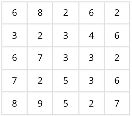
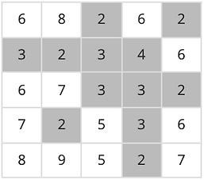
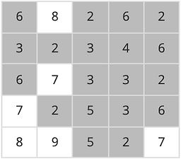
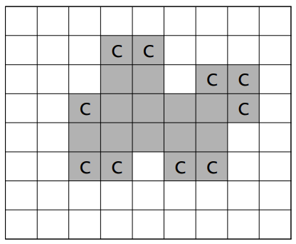
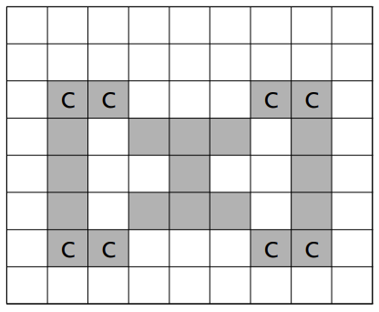
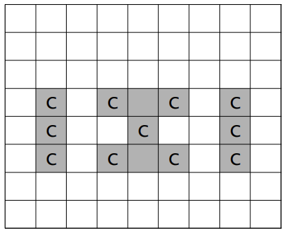

# 📅 2026-06-18 TIL

## 1. 오늘 학습 요약

* **학습 목표**: 
  * **코딩테스트** 문제풀이
  * 언리얼 엔진의 **컴포넌트**

* **학습 도구**: `Unreal Engine 5.5.4`, `Visual Studio 2022`

* **활동 내용**: 
  * 프로그래머스 **[카드 짝 맞추기](https://school.programmers.co.kr/learn/courses/30/lessons/72415)** 풀이
  * 백준 **음식물 피하기**, **유기농 배추**, **안전 영역**, **치즈** 풀이
  * 언리얼 엔진의 **컴포넌트**
---

## 2. 프로그래머스 문제 풀이

### [카드 짝 맞추기](https://school.programmers.co.kr/learn/courses/30/lessons/72415)

```cpp
#include <string>
#include <vector>
#include <queue>
#include <algorithm>

using namespace std;

int getDist(const vector<vector<int>>& board, pair<int, int> start, pair<int, int> dest){
    if(start == dest) return 0;
    int dx[4] = {-1, 1, 0, 0};
    int dy[4] = {0, 0, -1, 1};
    
    vector<vector<int>> visit(board.size(), vector<int>(board[0].size(), -1));
    queue<pair<int, int>> q;
    q.push(start);
    visit[start.first][start.second] = 0;
    
    while(!q.empty()){
        pair<int, int> curr = q.front();
        q.pop();
        int y = curr.first, x = curr.second;
        
        for(int i=0; i<4; i++){
            int ny = y + dy[i];
            int nx = x + dx[i];
            bool flag = false;
            if(ny>=0 && ny<4 && nx>=0 && nx<4 && visit[ny][nx] == -1){
                q.push({ny, nx});
                visit[ny][nx] = visit[y][x] + 1;
                if(board[ny][nx] != 0) continue;
            }
            
            while(ny>=0 && ny<4 && nx>=0 && nx<4 && board[ny][nx] == 0){
                ny += dy[i];
                nx += dx[i];
                if(ny < 0 || ny >= 4 || nx < 0 || nx >= 4){
                    ny -= dy[i];
                    nx -= dx[i];
                    break;
                }
            }
            
            if(ny>=0 && ny<4 && nx>=0 && nx<4 && visit[ny][nx] == -1){
                q.push({ny, nx});
                visit[ny][nx] = visit[y][x] + 1;
            }
        }
    }
    
    return visit[dest.first][dest.second];
}

int calc(vector<vector<int>>& board, const pair<int, int>& pos1, const pair<int, int>& pos2, 
         pair<int, int>& curr){
    int dist = getDist(board, curr, pos1) + getDist(board, pos1, pos2);
    board[pos1.first][pos1.second] = 0;
    board[pos2.first][pos2.second] = 0;
    curr = pos2;
    
    return dist + 2;
}

void addOrder(vector<vector<int>>& order, int n, int m){
    vector<int> temp(n, 1);
    fill(temp.begin(), temp.begin()+m, 0);
    do{
        order.push_back(temp);
    }while(next_permutation(temp.begin(), temp.end()));
}

int solution(vector<vector<int>> board, int r, int c) {
    int answer = INT32_MAX;
    vector<int> cards;
    vector<vector<pair<int, int>>> pos(7);
    for(int i=0; i<4; i++){
        for(int j=0; j<4; j++){
            if(board[i][j] != 0) {
                cards.push_back(board[i][j]);
                pos[board[i][j]].push_back({i, j});
            }
        }   
    }
    sort(cards.begin(), cards.end());
    cards.erase(unique(cards.begin(), cards.end()), cards.end());

    vector<vector<int>> order;
    for(int i=0; i<=cards.size(); i++) 
        addOrder(order, cards.size(), i);

    do{
        for(int i=0; i<order.size(); i++){
            vector<vector<int>> tempBoard = board;
            int sum = 0;
            pair<int, int> curr = {r, c};

            for(int j=0; j<cards.size(); j++){
                if(order[i][j] == 0) sum += calc(tempBoard, pos[cards[j]][0], pos[cards[j]][1], curr);
                else sum += calc(tempBoard, pos[cards[j]][1], pos[cards[j]][0], curr);
                if(sum >= answer) break;
            }
            answer = sum < answer ? sum : answer;
        }   
    }while(next_permutation(cards.begin(), cards.end()));

    return answer;
}
```

* **구현**, **BFS**, **순열**, **완전 탐색** 문제

* 구현이 상당히 복잡한 문제

* **Ctrl**을 누른 상태에서의 이동이 추가되므로 사실상 **이동 방향이 8개인 BFS와 동일**함

* 한 칸만 이동한 경우, Ctrl을 누른 상태로 이동한 경우의 **좌표를 각각 구한 후 큐에 추가**해 BFS를 실행하면 문제 조건에서 요구하는 **두 좌표 간 최단 거리**를 구할 수 있음

* 카드의 종류가 6개밖에 안 되므로 **카드를 지우는 순서의 경우의 수**는 `6! = 720`

* 동일한 종류의 카드가 두 장이므로 두 카드 중 **어떤 카드를 먼저 선택하는지에 따라 결과가 달라짐**

* **동일한 카드의 순서를 선택하는 모든 경우의 수**는 `2^6 = 64`

* 따라서 **모든 경우의 수**는 `720 * 64 = 46,080`개 이고 모든 경우에 대해 입력 수를 계산하면 시간 안에 처리 가능

---

## 2. 백준 문제풀이

### 1743번: 음식물 피하기

#### 문제 설명
코레스코 콘도미니엄 8층은 학생들이 3끼의 식사를 해결하는 공간이다. 
그러나 몇몇 비양심적인 학생들의 만행으로 음식물이 통로 중간 중간에 떨어져 있다. 
이러한 음식물들은 근처에 있는 것끼리 뭉치게 돼서 큰 음식물 쓰레기가 된다.

이 문제를 출제한 선생님은 개인적으로 이러한 음식물을 실내화에 묻히는 것을 정말 진정으로 싫어한다.
참고로 우리가 구해야 할 답은 이 문제를 낸 조교를 맞추는 것이 아니다.

통로에 떨어진 음식물을 피해가기란 쉬운 일이 아니다. 따라서 선생님은 떨어진 음식물 중에 제일 큰 음식물만은 피해 가려고 한다.
선생님을 도와 제일 큰 음식물의 크기를 구해서 “10ra"를 외치지 않게 도와주자.

#### 입력
첫째 줄에 통로의 세로 길이 N(1 ≤ N ≤ 100)과 가로 길이 M(1 ≤ M ≤ 100) 그리고 음식물 쓰레기의 개수 K(1 ≤ K ≤ N×M)이 주어진다.  그리고 다음 K개의 줄에 음식물이 떨어진 좌표 (r, c)가 주어진다.

좌표 (r, c)의 r은 위에서부터, c는 왼쪽에서부터가 기준이다. 입력으로 주어지는 좌표는 중복되지 않는다.

#### 출력
첫째 줄에 음식물 중 가장 큰 음식물의 크기를 출력하라.

#### 예제 입력 1
```
3 4 5
3 2
2 2
3 1
2 3
1 1
```
#### 예제 출력 1
```
4
```

#### 정답 코드
```cpp
#include <iostream>
#include <vector>

using namespace std;

int dy[4] = {-1, 1, 0, 0};
int dx[4] = {0, 0, -1, 1};

int DFS(const vector<vector<int>>& board, vector<vector<bool>>& visit, const pair<int, int>& start){
    int y = start.first, x = start.second;
    if(visit[y][x]) return 0;
    int count = 1;
    visit[y][x] = true;
    
    for(int i=0; i<4; i++){
        int ny = y + dy[i];
        int nx = x + dx[i];
        if(ny<0 || ny>=board.size() || nx<0 || nx>=board[ny].size() 
           || visit[ny][nx] || board[ny][nx] == 0) continue;
       
        count += DFS(board, visit, {ny, nx});
    }
    return count;
}

int main() {
    int n, m, k;
    cin >> n >> m >> k;
    vector<vector<int>> board(n, vector<int>(m, 0));
    vector<vector<bool>> visit(n, vector<bool>(m, false));
    vector<pair<int, int>> pos;
    int answer = 0;
    
    for(int i=0; i<k; i++){
        int y, x;
        cin >> y >> x;
        board[--y][--x] = 1;
        pos.push_back({y, x});
    }
        
    for(int i=0; i<pos.size(); i++){
        int count = DFS(board, visit, pos[i]);
        answer = count > answer ? count : answer; 
    }

    cout << answer;
    return 0;
}
```

* **탐색**, **연결 요소** 문제
* 모든 연결 요소에 대해 DFS를 실행해 가장 큰 연결요소를 찾는 문제
* 좌표의 시작이 `1, 1` 이므로 입력받을 때 1을 빼줌

---

### 1012번: 유기농 배추

#### 문제 설명
차세대 영농인 한나는 강원도 고랭지에서 유기농 배추를 재배하기로 하였다. 농약을 쓰지 않고 배추를 재배하려면 배추를 해충으로부터 보호하는 것이 중요하기 때문에, 한나는 해충 방지에 효과적인 배추흰지렁이를 구입하기로 결심한다. 이 지렁이는 배추근처에 서식하며 해충을 잡아 먹음으로써 배추를 보호한다.

 특히, 어떤 배추에 배추흰지렁이가 한 마리라도 살고 있으면 이 지렁이는 인접한 다른 배추로 이동할 수 있어, 그 배추들 역시 해충으로부터 보호받을 수 있다. 한 배추의 상하좌우 네 방향에 다른 배추가 위치한 경우에 서로 인접해있는 것이다.

한나가 배추를 재배하는 땅은 고르지 못해서 배추를 군데군데 심어 놓았다. 배추들이 모여있는 곳에는 배추흰지렁이가 한 마리만 있으면 되므로 서로 인접해있는 배추들이 몇 군데에 퍼져있는지 조사하면 총 몇 마리의 지렁이가 필요한지 알 수 있다. 

예를 들어 배추밭이 아래와 같이 구성되어 있으면 최소 5마리의 배추흰지렁이가 필요하다. 0은 배추가 심어져 있지 않은 땅이고, 1은 배추가 심어져 있는 땅을 나타낸다.

| 1 | 1 | 0 | 0 | 0 | 0 | 0 | 0 | 0 | 0 |
| --- | --- | --- | --- | --- | --- | --- | --- | --- | --- |
| 0 | 1 | 0 | 0 | 0 | 0 | 0 | 0 | 0 | 0 |
| 0 | 0 | 0 | 0 | 1 | 0 | 0 | 0 | 0 | 0 |
| 0 | 0 | 0 | 0 | 1 | 0 | 0 | 0 | 0 | 0 |
| 0 | 0 | 1 | 1 | 0 | 0 | 0 | 1 | 1 | 1 |
| 0 | 0 | 0 | 0 | 1 | 0 | 0 | 1 | 1 | 1 |

#### 입력
입력의 첫 줄에는 테스트 케이스의 개수 T가 주어진다. 

그 다음 줄부터 각각의 테스트 케이스에 대해 첫째 줄에는 배추를 심은 배추밭의 가로길이 M(1 ≤ M ≤ 50)과 세로길이 N(1 ≤ N ≤ 50), 그리고 배추가 심어져 있는 위치의 개수 K(1 ≤ K ≤ 2500)이 주어진다. 

그 다음 K줄에는 배추의 위치 X(0 ≤ X ≤ M-1), Y(0 ≤ Y ≤ N-1)가 주어진다. 두 배추의 위치가 같은 경우는 없다.

#### 출력
각 테스트 케이스에 대해 필요한 최소의 배추흰지렁이 마리 수를 출력한다.

#### 예제 입력 1
```
2
10 8 17
0 0
1 0
1 1
4 2
4 3
4 5
2 4
3 4
7 4
8 4
9 4
7 5
8 5
9 5
7 6
8 6
9 6
10 10 1
5 5
```
#### 예제 출력 1
```
5
1
```

#### 예제 입력 2
```
1
5 3 6
0 2
1 2
2 2
3 2
4 2
4 0
```
#### 예제 출력 2
```
2
```

#### 정답 코드
```cpp
#include <iostream>
#include <vector>

using namespace std;

int dy[4] = {-1, 1, 0, 0};
int dx[4] = {0, 0, -1, 1};

int DFS(const vector<vector<int>>& board, vector<vector<bool>>& visit, const pair<int, int>& start){
    int y = start.first, x = start.second;
    if(visit[y][x]) return 0;
    int count = 1;
    visit[y][x] = true;
    
    for(int i=0; i<4; i++){
        int ny = y + dy[i];
        int nx = x + dx[i];
        if(ny<0 || ny>=board.size() || nx<0 || nx>=board[ny].size() 
           || visit[ny][nx] || board[ny][nx] == 0) continue;
       
        count += DFS(board, visit, {ny, nx});
    }
    return count;
}

int main() {
    int t;
    cin >> t;

    for(int i=0; i<t; i++){
        int n, m, k;
        cin >> m >> n >> k;
        vector<vector<int>> board(n, vector<int>(m, 0));
        vector<vector<bool>> visit(n, vector<bool>(m, false));
        vector<pair<int, int>> pos;
        int answer = 0;
        
        for(int i=0; i<k; i++){
            int y, x;
            cin >> x >> y;
            board[y][x] = 1;
            pos.push_back({y, x});
        }
            
        for(int i=0; i<pos.size(); i++)
            if(DFS(board, visit, pos[i]) > 0) answer++;
        
        cout << answer << "\n";
    }
    
    return 0;
}
```

* **탐색, 연결 요소** 유형의 문제
* **연결 요소의 개수**를 구하는 문제
* 입력이 **가로 -> 세로 순**으로 들어옴에 유의해야 함

---

### 2468번: 안전 영역

#### 문제 설명
재난방재청에서는 많은 비가 내리는 장마철에 대비해서 다음과 같은 일을 계획하고 있다. 먼저 어떤 지역의 높이 정보를 파악한다. 그 다음에 그 지역에 많은 비가 내렸을 때 물에 잠기지 않는 안전한 영역이 최대로 몇 개가 만들어 지는 지를 조사하려고 한다. 

이때, 문제를 간단하게 하기 위하여, 장마철에 내리는 비의 양에 따라 일정한 높이 이하의 모든 지점은 물에 잠긴다고 가정한다.
어떤 지역의 높이 정보는 행과 열의 크기가 각각 N인 2차원 배열 형태로 주어지며 배열의 각 원소는 해당 지점의 높이를 표시하는 자연수이다. 예를 들어, 다음은 N=5인 지역의 높이 정보이다.



이제 위와 같은 지역에 많은 비가 내려서 높이가 4 이하인 모든 지점이 물에 잠겼다고 하자. 이 경우에 물에 잠기는 지점을 회색으로 표시하면 다음과 같다.




물에 잠기지 않는 안전한 영역이라 함은 물에 잠기지 않는 지점들이 위, 아래, 오른쪽 혹은 왼쪽으로 인접해 있으며 그 크기가 최대인 영역을 말한다. 위의 경우에서 물에 잠기지 않는 안전한 영역은 5개가 된다(꼭짓점으로만 붙어 있는 두 지점은 인접하지 않는다고 취급한다).

또한 위와 같은 지역에서 높이가 6이하인 지점을 모두 잠기게 만드는 많은 비가 내리면 물에 잠기지 않는 안전한 영역은 아래 그림에서와 같이 네 개가 됨을 확인할 수 있다.




이와 같이 장마철에 내리는 비의 양에 따라서 물에 잠기지 않는 안전한 영역의 개수는 다르게 된다. 위의 예와 같은 지역에서 내리는 비의 양에 따른 모든 경우를 다 조사해 보면 물에 잠기지 않는 안전한 영역의 개수 중에서 최대인 경우는 5임을 알 수 있다.

어떤 지역의 높이 정보가 주어졌을 때, 장마철에 물에 잠기지 않는 안전한 영역의 최대 개수를 계산하는 프로그램을 작성하시오.

#### 입력
첫째 줄에는 어떤 지역을 나타내는 2차원 배열의 행과 열의 개수를 나타내는 수 N이 입력된다. N은 2 이상 100 이하의 정수이다.

둘째 줄부터 N개의 각 줄에는 2차원 배열의 첫 번째 행부터 N번째 행까지 순서대로 한 행씩 높이 정보가 입력된다. 각 줄에는 각 행의 첫 번째 열부터 N번째 열까지 N개의 높이 정보를 나타내는 자연수가 빈 칸을 사이에 두고 입력된다. 높이는 1이상 100 이하의 정수이다.

#### 출력
첫째 줄에 장마철에 물에 잠기지 않는 안전한 영역의 최대 개수를 출력한다.

#### 예제 입력 1
```
5
6 8 2 6 2
3 2 3 4 6
6 7 3 3 2
7 2 5 3 6
8 9 5 2 7
```
#### 예제 출력 1
```
5
```

#### 예제 입력 2
```
7
9 9 9 9 9 9 9
9 2 1 2 1 2 9
9 1 8 7 8 1 9
9 2 7 9 7 2 9
9 1 8 7 8 1 9
9 2 1 2 1 2 9
9 9 9 9 9 9 9
```
#### 예제 출력 2
```
6
```

#### 정답 코드

```cpp
#include <iostream>
#include <vector>

using namespace std;

int dy[4] = {-1, 1, 0, 0};
int dx[4] = {0, 0, -1, 1};

int DFS(const vector<vector<int>>& board, vector<vector<bool>>& visit, const pair<int, int>& start, int n){
    int y = start.first, x = start.second;
    if(visit[y][x]) return 0;
    int count = 1;
    visit[y][x] = true;
    
    for(int i=0; i<4; i++){
        int ny = y + dy[i];
        int nx = x + dx[i];
        if(ny<0 || ny>=board.size() || nx<0 || nx>=board[ny].size() 
           || visit[ny][nx] || board[ny][nx] <= n) continue;
       
        count += DFS(board, visit, {ny, nx}, n);
    }
    return count;
}

int main() {
    int n;
    cin >> n;
    vector<vector<int>> board(n, vector<int>(n, 0));
    int answer = 0, max = 0;
    
   for(int i=0; i<board.size(); i++){
        for(int j=0; j<board[i].size(); j++){
            cin >> board[i][j];
            max = max > board[i][j] ? max : board[i][j];
        }
    }
        
    for(int i=0; i<max; i++){
        vector<vector<bool>> visit(n, vector<bool>(n, false));
        int count = 0;
        for(int j=0; j<board.size(); j++)
            for(int k=0; k<board[j].size(); k++)  
                if(board[j][k] > i && DFS(board, visit, {j, k}, i) > 0) count++;
        answer = count > answer ? count : answer; 
    }

    cout << answer;
    return 0;
}
```

* **연결 요소**, **완전 탐색** 문제
* **강수량에 따라서 달라지는 그래프**를 **DFS**로 탐색해 연결 요소를 확인
* **모든 강수량**에서 연결 요소의 개수를 구하면 정답

---

### 2638번: 치즈

#### 문제 설명
N×M의 모눈종이 위에 아주 얇은 치즈가 <그림 1>과 같이 표시되어 있다. 
단, N 은 세로 격자의 수이고, M 은 가로 격자의 수이다. 이 치즈는 냉동 보관을 해야만 하는데 실내온도에 내어놓으면 공기와 접촉하여 천천히 녹는다. 

그런데 이러한 모눈종이 모양의 치즈에서 각 치즈 격자(작은 정사각형 모양)의 4변 중에서 적어도 2변 이상이 실내온도의 공기와 접촉한 것은 정확히 한시간만에 녹아 없어져 버린다. 

따라서 아래 <그림 1> 모양과 같은 치즈(회색으로 표시된 부분)라면 C로 표시된 모든 치즈 격자는 한 시간 후에 사라진다.

<그림 1>



<그림 2>와 같이 치즈 내부에 있는 공간은 치즈 외부 공기와 접촉하지 않는 것으로 가정한다. 
그러므로 이 공간에 접촉한 치즈 격자는 녹지 않고 C로 표시된 치즈 격자만 사라진다. 

그러나 한 시간 후, 이 공간으로 외부공기가 유입되면 <그림 3>에서와 같이 C로 표시된 치즈 격자들이 사라지게 된다.

<그림 2>



<그림 3>



모눈종이의 맨 가장자리에는 치즈가 놓이지 않는 것으로 가정한다. 입력으로 주어진 치즈가 모두 녹아 없어지는데 걸리는 정확한 시간을 구하는 프로그램을 작성하시오.

#### 입력
첫째 줄에는 모눈종이의 크기를 나타내는 두 개의 정수 N, M (5 ≤ N, M ≤ 100)이 주어진다. 

그 다음 N개의 줄에는 모눈종이 위의 격자에 치즈가 있는 부분은 1로 표시되고, 치즈가 없는 부분은 0으로 표시된다. 또한, 각 0과 1은 하나의 공백으로 분리되어 있다.

#### 출력
출력으로는 주어진 치즈가 모두 녹아 없어지는데 걸리는 정확한 시간을 정수로 첫 줄에 출력한다.

#### 예제 입력 1
```
8 9
0 0 0 0 0 0 0 0 0
0 0 0 1 1 0 0 0 0
0 0 0 1 1 0 1 1 0
0 0 1 1 1 1 1 1 0
0 0 1 1 1 1 1 0 0
0 0 1 1 0 1 1 0 0
0 0 0 0 0 0 0 0 0
0 0 0 0 0 0 0 0 0
```
#### 예제 출력 1
```
4
```

#### 정답 코드

```cpp
#include <iostream>
#include <vector>

using namespace std;

int dy[4] = {-1, 1, 0, 0};
int dx[4] = {0, 0, -1, 1};

bool check(vector<vector<int>>& board, vector<vector<int>>& count){
    bool flag = false;
    for(int i=0; i<board.size(); i++)
        for(int j=0; j<board[i].size(); j++){
            if(board[i][j] == 1) flag = true;
            if(count[i][j] >= 2) board[i][j] = 0;
        }   
    return flag;
}

void DFS(vector<vector<int>>& board, vector<vector<bool>>& visit, vector<vector<int>>& count, const pair<int, int>& start){
    int y = start.first, x = start.second;
    if(visit[y][x]) return;
    visit[y][x] = true;
    
    for(int i=0; i<4; i++){
        int ny = y + dy[i];
        int nx = x + dx[i];
        if(ny<0 || ny>=board.size() || nx<0 || nx>=board[ny].size() || visit[ny][nx]) continue;
        if(board[ny][nx] == 1) {
            count[ny][nx]++;
            continue;
        }
        DFS(board, visit, count, {ny, nx});
    }
}

int main() {
    int n, m;
    cin >> n >> m;
    vector<vector<int>> board(n+2, vector<int>(m+2, 0));
    int answer = 0;
    
   for(int i=0; i<n; i++)
        for(int j=0; j<m; j++)
            cin >> board[i+1][j+1];

    while(true){
        vector<vector<bool>> visit(board.size(), vector<bool>(board[0].size(), false));
        vector<vector<int>> count(board.size(), vector<int>(board[0].size(), 0));
        DFS(board, visit, count, {0, 0});
        if(!check(board, count)) break;
        answer++;
    }
   
    cout << answer;
    return 0;
}
```

* **탐색** 유형의 문제

* **내부 공기는 치즈에 영향을 주지 않는다**는 점과 **테두리에 있는 치즈는 외부 공기에 닿는다**는 점을 유의해야 함

* **테두리에 있는 치즈는 외부 공기에 닿는다**는 점을 만족하기 위해 `board`의 **상하좌우에 패딩**을 줌

* 패딩을 주었으므로 `board[0][0]`은 **반드시 외부 공기**

* **내부 공기는 치즈에 영향을 주지 않는다**는 점을 만족하기 위해 외부에서 **0(공기) 을 기준**으로 **DFS**를 실행해 **1(치즈)** 을 만날 경우 해당 치즈의 `count`를 증가

* DFS가 종료되었을 때, `check()`를 실행해 **count가 2 이상**이면 녹는 치즈이므로 **0(공기)** 으로 바꿔줌

* 위 과정을 모든 치즈가 녹을 때까지 반복

--- 

## 4. 언리얼 엔진의 컴포넌트

* **컴포넌트(Components)** 는 **액터(Actors)** 가 자기 자신에 서브 오브젝트로 **어태치**할 수 있는 특수한 타입의 **오브젝트(Object)**

* 컴포넌트는 비주얼 표현 디스플레이 또는 사운드 재생 기능과 같은 **일반적인 동작을 공유**할 때 유용

* 즉, 컴포넌트는 액터에게 특정 기능, 속성을 갖도록 부착하는 **부품과 같은 개념**

* 컴포넌트는 **기존의 상속을 보완**하며, 복잡한 상속 관계 대신 **조합(Composition)** 을 통해 코드의 재사용성을 높임

* 언리얼 엔진에서의 주요 컴포넌트는 **액터 컴포넌트(Actor Components)**, **씬 컴포넌트(Scene Components)**, **프리미티브 컴포넌트(Primitive Components)** 가 있음

* 위의 세 컴포넌트는 **액터 컴포넌트(Actor Components) -> 씬 컴포넌트(Scene Components) -> 프리미티브 컴포넌트(Primitive Components)** 의 상속 관계를 가짐

### 액터 컴포넌트 (UActorComponent)

* 언리얼 엔진의 가장 기본적인 컴포넌트 클래스로 컴포넌트 계층의 **최상위 부모 클래스**

* **트랜스폼이 없으며**, 월드 내에서 물리적 위치를 갖거나 회전할 수 없음

* 트랜스폼이 없기에 컴포넌트 간 물리적 상속 관계를 맺는 **Attach를 할 수 없음**

* 움직임, 인벤토리, 어트리뷰트 관리 및 기타 비물리적 개념과 같은 **추상적인 동작** 대부분에 유용

* `UActorComponent`를 기반으로 만들어진 대표적인 언리얼의 컴포넌트는 `UMovementComponent`, `UInputComponent` 등이 있음

### 씬 컴포넌트 (USceneComponont)

* `UActorComponent`를 상속받아 **트랜스폼** 정보를 추가한 컴포넌트

* 씬 컴포넌트는 **월드 좌표(World Transform)** 와 **로컬 좌표(Relative Transform)** 를 모두 가짐

* 트랜스폼이 추가되어 컴포넌트 간 **Attach를 통해 트리를 형성할 수 있음**

* **좌표를 가지는 액터**는 `USceneComponent`기반의 **루트 컴포넌트**를 가져야하며, 해당 컴포넌트의 위치를 기준으로 사용함

* `USceneComponent`를 기반으로 만들어진 대표적인 언리얼의 컴포넌트는 `UCameraComponent`, `UAudioComponent` 등이 있음

### 프리미티브 컴포넌트 (UPrimitiveComponent)

* `USceneComponont`를 상속받아 **렌더링**과 **충돌**을 추가한 컴포넌트

* `UPrimitiveComponent`는 렌더링, 충돌, 물리와 같은 **게임의 시각적, 물리적 상호작용**을 담당

* `UPrimitiveComponent`를 기반으로 만들어진 대표적인 언리얼의 컴포넌트는 `UStaticMeshComponent`, `UBoxComponent` 등이 있음

---

## 5. 참고 자료

* [컴포넌트](https://dev.epicgames.com/documentation/unreal-engine/components-in-unreal-engine)