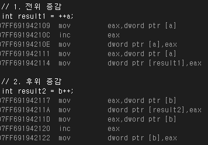
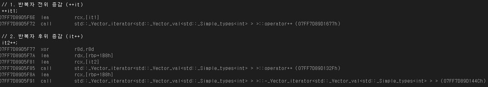

# 📅 2026-06-23 TIL

## 1. 오늘 학습 요약

* **학습 목표**: 
  * **코딩테스트** 문제풀이
  * **증감 연산자**

* **학습 도구**: `Unreal Engine 5.5.4`, `Visual Studio 2022`

* **활동 내용**: 
  * 프로그래머스 **[블록 게임](https://school.programmers.co.kr/learn/courses/30/lessons/42894)** 풀이
  * **전위, 후위 증감 연산자**의 차이

---

## 2. 프로그래머스 문제 풀이

### [블록 게임](https://school.programmers.co.kr/learn/courses/30/lessons/42894)

```cpp
#include <string>
#include <vector>
#include <set>

using namespace std;

int solution(vector<vector<int>> board) {
    int answer = 0, num = 0;
    vector<set<pair<int, int>>> blocks(201);
    vector<int> space(board.size(), board.size()-1);
    
    for(int i=0; i<board.size(); ++i){
        for(int j=0; j<board[i].size(); ++j){
            int block = board[i][j];
            if(block != 0) {
                if(space[j] > i) space[j] = i-1;
                blocks[block].insert({i, j});
            }
            if(num < block) num = block;
        }
    }
    
    vector<set<pair<int, int>>> emptys(num+1);
    vector<vector<int>> ranges(num+1);
    for(int i=1; i<=num; ++i){
        int xmin=51, xmax=-1, ymin=51, ymax=-1;
        
        for(const pair<int, int>& pos : blocks[i]){
            ymin = min(ymin, pos.first); ymax = max(ymax, pos.first);
            xmin = min(xmin, pos.second); xmax = max(xmax, pos.second);
        }
        ranges[i] = {ymin, ymax, xmin, xmax};
        for(int j=ymin; j<=ymax; ++j)
            for(int k=xmin; k<=xmax; ++k)
                if(blocks[i].count({j, k}) == 0)
                    emptys[i].insert({j, k});
    }
    
    int count = 0;
    do{
        count = 0;
        for(int i=1; i<=num; i++){
            bool flag = !emptys[i].empty();
            for(const pair<int, int>& pos : emptys[i]){
                int y = pos.first, x = pos.second;
                if(y > space[x]) flag = false;
            }
            if(flag){
                ++count;
                for(const pair<int, int>& pos : blocks[i])
                    board[pos.first][pos.second] = 0;
                for(int j=ranges[i][2]; j<=ranges[i][3]; ++j){
                    for(int k=0; k<board.size(); ++k){
                        if(board[k][j] != 0){
                            space[j] = k-1;
                            break;
                        }
                    }
                }  
                emptys[i].clear();
            }
        }
        answer += count;
    }while(count != 0);
    
    return answer;
}
```

* **구현**, **시뮬레이션** 문제
* 각 블록을 지우기 위해 검은 블록을 놓아야 하는 공간은 처음에 고정되며 이를 `emptys`에 저장
* `space[x]`는 각 열에서 블록을 놓을 수 있는 가장 낮은 위치를 의미함
* 모든 블록에 대해 해당 블록을 지우기 위해 검은 블록을 놓을 수 있는지 여부를 판단
* 더 이상 지울 수 있는 블록이 없을 때까지 반복

---

### [발전소 회로 복구](https://school.programmers.co.kr/learn/courses/30/lessons/468375)

```cpp
#include <string>
#include <vector>
#include <climits>
#include <queue>
#include <bitset>
#include <cmath>

using namespace std;

int solve(const vector<vector<int>>& dependency, vector<int>& count, const vector<vector<int>>& dists, bitset<15>& visit, vector<vector<int>>& dp, int start){
    if(visit.count() == count.size()) return 0;
    
    int result = INT_MAX/2; 
    int visited = visit.to_ulong();
    if(dp[visited][start] != -1) return dp[visited][start];
    
    for(int i=0; i<count.size(); i++){
        if(visit[i] == 1 || count[i] != 0) continue;
        visit[i] = 1;
    
        for(int j=0; j<dependency[i].size(); ++j)
            --count[dependency[i][j]];
            
        int dist = dists[start][i] + solve(dependency, count, dists, visit, dp, i);
        result = min(result, dist);
                     
        for(int j=0; j<dependency[i].size(); ++j)
            ++count[dependency[i][j]];
        
        visit[i] = 0;
    }
    
    dp[visited][start] = result;
    return result;
}

int BFS(const vector<string>& grid, const pair<int, int>& start, const pair<int, int>& dest){
    queue<pair<int,int>> q;
    vector<vector<int>> visit(grid.size(), vector<int>(grid[0].size(), -1));
    int dy[4] = {-1, 1, 0 ,0};
    int dx[4] = {0, 0, -1 ,1};
    q.push(start);
    visit[start.first][start.second] = 0;
     
    while(!q.empty()){
        pair<int, int> curr = q.front();
        q.pop();
        int y = curr.first, x = curr.second;
        for(int i=0; i<4; ++i){
            int ny = y + dy[i], nx = x + dx[i];
            if(ny<0 || ny>=grid.size() || nx<0 || nx>=grid[ny].size() ||
              grid[ny][nx] == '#' || visit[ny][nx] != -1) continue;
            q.push({ny, nx});
            visit[ny][nx] = visit[y][x] + 1;
        }
        if(visit[dest.first][dest.second] != -1) return visit[dest.first][dest.second];
    }
    return visit[dest.first][dest.second];
}

int getDist(const vector<string>& grid, const vector<int>& elevators,
            const vector<int>& start, const vector<int>& dest){
    int dist;
    int floor = start[0] - dest[0] > 0 ? start[0] - dest[0] : dest[0] - start[0];
    pair<int, int> startPos = {start[1], start[2]}, endPos = {dest[1], dest[2]};
    
    if(start[0] == dest[0]) dist = BFS(grid, startPos, endPos);
    else dist = elevators[0] + elevators[1] + floor;
    
    return dist;
}

int solution(int h, vector<string> grid, vector<vector<int>> panels, vector<vector<int>> seqs) {
    int answer = INT_MAX;
    pair<int, int> elevator;
    vector<int> elevatorDist(panels.size());
    for(int i=0; i<grid.size(); ++i)
        for(int j=0; j<grid[i].size(); ++j)
            if(grid[i][j] == '@') elevator = {i, j};
    
    for(int i=0; i<panels.size(); ++i)
        elevatorDist[i] = BFS(grid, {--panels[i][1], --panels[i][2]}, elevator);
    
    vector<vector<int>> dependency(panels.size());
    vector<int> count(panels.size(), 0);
    for(int i=0; i<seqs.size(); ++i){
        int start = seqs[i][0] - 1, dest = seqs[i][1] - 1;
        dependency[start].push_back(dest);
        ++count[dest];
    }
        
    vector<vector<int>> dists(panels.size(), vector<int>(panels.size(), 0));
    for(int i=0; i<panels.size(); ++i){
        for(int j=i+1; j<panels.size(); ++j){
            dists[i][j] = getDist(grid, {elevatorDist[i], elevatorDist[j]}, panels[i], panels[j]);
            dists[j][i] = dists[i][j];
        }
    }
    
    bitset<15> visit;
    vector<vector<int>> dp(pow(2, 15), vector<int>(15, -1));
    answer = solve(dependency, count, dists, visit, dp, 0);
    
    return answer;
}
```

* **BFS**, **위상 정렬**, **비트 마스크**, **DP**  개념을 활용해야하는 문제
* **BFS**로 패널 간의 거리를 미리 계산
* 패널을 방문하는 순서는 **위상 정렬**과 같음
* 위상 정렬의 결과는 최대 `k!`개가 있으므로 모든 결과를 계산하면 **시간초과**
* **비트 마스킹**으로 현재까지 활성화한 패널, 현재 위치 패널을 하나의 상태로 봄
* 해당 상태까지 도달하는 최소 비용을 **DP**에 저장
* 동일한 상태인 경우, **DP**에 저장되어 있는 최솟값을 반환

---


## 3. 증감 연산자

* 증감 연산자는 피연산자로부터 더하거나 빼는 등 **단항 연산을 위한 연산자**

* **증가 연산자 (++)** 와 **감소 연산자 (--)** 로 나누며, **전치**와 **후치** 연산 기능이 있음

### 전위 증감 연산자

* 증감 연산자의 **연산을 먼저 수행**한 후, 결과 값을 사용

* 예시 코드
    ```cpp
    #include <iostream>

    using namespace std;

    int main() {
        int a = 10;

        // 전위: 증가를 먼저 하고 출력
        // Output: 전위 (a++): 10 (현재 b: 11)
        cout << "전위 (++a): " << ++a << " (현재 a: " << a << ")"; 

        return 0;
    }
    ```
### 후위 증감 연산자

* 원본 값을 복사하고 연산을 수행한 뒤, **복사한 값을 반환**

* 예시 코드
    ```cpp
    #include <iostream>

    using namespace std;

    int main() {
        int b = 10;

        // 후위: 현재 값(10)을 먼저 출력하고 증가
        // Output: 후위 (b++): 10 (현재 b: 11)
        cout << "후위 (b++): " << b++ << " (현재 b: " << b << ")";

        return 0;
    }
    ```

### 성능 차이

**복사한 임시 객체**로 인하여 후위 증감 연산자가 전위 증감 연산자보다 더 느리다고 생각된다.

과연 정말 그런지 확인해보자, 증감 연산자는 따로 코드가 존재하지 않기에 어셈블리어를 통해 확인해보려고 한다.


```cpp
int main() {
    
    int a = 10;
    int b = 10;

    // 1. 전위 증감
    int result1 = ++a;

    // 2. 후위 증감
    int result2 = b++;
    
	return 0;
}
```



**전위 증가 연산자**의 경우, `a`의 값을 가져온 뒤 증가시킨 후 해당 값을 다시 `a`의 메모리 위치에 저장한다.

그 후 `a`의 값을 다시 가져와 `result1`의 위치에 저장하는 과정을 가진다.

**후위 증가 연산자**의 경우 `b`의 값을 가져온 뒤 바로 `result2`의 위치에 저장한다.

그 후 `b`의 값을 다시 가져와 증가시키고 다시 `b`의 메모리 위치에 저장한다.

어셈블리를 확인해 보니 총 명령어 수도 5개로 동일하며, 복사도 이루어지지 않아 완벽히 **동일한 성능**으로 동작함을 확인할 수 있다.

이는 `int`, `char` 등과 같은 **기본형**에만 국한되는 특징이다.

<br>

증감 연산자가 자주 사용되는 것은 **이터레이터**가 있다. 

**C++ 컨테이너** 이터레이터의 증감 연산자는 **연산자 오버로딩**을 통해 코드로 구현되어 있다.

```cpp
// STL/stl/inc/vector

    _CONSTEXPR20 _Vector_const_iterator& operator++() noexcept {
#if _ITERATOR_DEBUG_LEVEL != 0
        const auto _Mycont = static_cast<const _Myvec*>(this->_Getcont());
        _STL_VERIFY(_Ptr, "can't increment value-initialized vector iterator");
        _STL_VERIFY(_Mycont, "can't increment invalidated vector iterator");
        _STL_VERIFY(_Ptr < _Mycont->_Mylast, "can't increment vector iterator past end");
#endif // _ITERATOR_DEBUG_LEVEL != 0

        ++_Ptr;
        return *this;
    }

    _CONSTEXPR20 _Vector_const_iterator operator++(int) noexcept {
        _Vector_const_iterator _Tmp = *this;
        ++*this;
        return _Tmp;
    }
```

코드가 복잡하지만, 위가 `vector<T>` 이터레이터의 **전위 증가 연산자**, 아래가 **후위 증가 연산자**이다.

앞서 보았듯이 **전위 증감 연산자**는 포인터를 직접적으로 더한 뒤 바로 반환하며, **후위 증감 연산자**는 `_Tmp`로 복사한 뒤 원본을 증가시키고 **복사한 `_Tmp`를 반환**한다.

그렇다면, 어셈블리어로 어떻게 실행되는지 확인해보자.

```cpp
int main() {
    std::vector<int> v = { 10, 20, 30 };

    // 이터레이터 초기화
    auto it1 = v.begin();
    auto it2 = v.begin();

    // 1. 이터레이터 전위 증감 (++it)
    ++it1;

    // 2. 이터레이터 후위 증감 (it++)
    it2++;

    return 0;
}
```



**전위 증가 연산자**의 경우 `it1`에 접근한 뒤 오버로딩된 연산자 함수를 호출하고 바로 종료되었다.

**후위 증가 연산자**의 경우 `rbp+1B8h`라는 **임시 객체를 생성**하고 `it2`에 접근한 뒤 오버로딩된 연산자 함수를 호출한다. 이후 다시 `rbp+1B8h` 임시 객체에 접근하여 **소멸자까지 호출**한다.

이처럼 기본형이 아닌 **객체** 혹은 **사용자 정의 클래스**의 경우 **후위 증감 연산자**를 사용하면 성능상의 이슈가 존재한다.

따라서 두 연산자를 사용했을 때 결과가 같을 경우, 후위 증감 연산자를 사용하는 것은 지양해야 한다.

---

## 4. 참고 자료

* [위키백과 - 증감 연산자](https://ko.wikipedia.org/wiki/%EC%A6%9D%EA%B0%90_%EC%97%B0%EC%82%B0%EC%9E%90)

* [Microsoft - STL](https://github.com/microsoft/STL/blob/main/stl/inc/vector)

* [PenguinGod - 어셈블리어를 배워야 하는 이유 (증감 연산자 최적화의 진실)](https://velog.io/@gkswh4860/%EC%96%B4%EC%85%88%EB%B8%94%EB%A6%AC%EC%96%B4%EB%A5%BC-%EB%B0%B0%EC%9B%8C%EC%95%BC-%ED%95%98%EB%8A%94-%EC%9D%B4%EC%9C%A0-%EC%A6%9D%EA%B0%90-%EC%97%B0%EC%82%B0%EC%9E%90-%EC%B5%9C%EC%A0%81%ED%99%94%EC%9D%98-%EC%A7%84%EC%8B%A4)