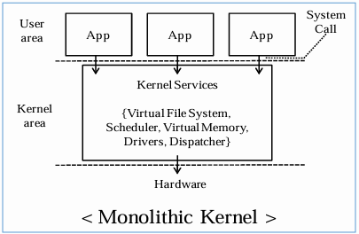
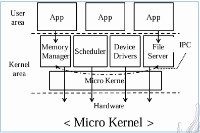

# 📅 2026-06-29 TIL

## 1. 오늘 학습 요약

* **학습 목표**: 
  * **코딩테스트** 문제풀이

* **학습 도구**: `Unreal Engine 5.5.4`, `Visual Studio 2022`

* **활동 내용**: 
  * 프로그래머스 **[선인장 숨기기](https://school.programmers.co.kr/learn/courses/30/lessons/468379)** 풀이

---

## 2. 프로그래머스 문제 풀이

### [선인장 숨기기](https://school.programmers.co.kr/learn/courses/30/lessons/468379)

```cpp
#include <string>
#include <vector>
#include <algorithm>
#include <set>

using namespace std;

vector<int> solution(int m, int n, int h, int w, vector<vector<int>> drops) {
    vector<int> answer;
    vector<vector<int>> board(m, vector<int>(n, drops.size()+1));
    vector<vector<int>> temp(m-h+1, vector<int>(n, drops.size()+1));
    
    for(int i=0; i<drops.size(); i++)
        board[drops[i][0]][drops[i][1]] = i+1;
    
    for(int i=0; i<temp[0].size(); i++){
        multiset<int> ms;
        for(int j=0; j<h; j++) ms.insert(board[j][i]);
        temp[0][i] = *ms.begin();
        
        for(int j=1; j<temp.size(); j++){
            ms.erase(ms.find(board[j-1][i]));
            ms.insert(board[j+h-1][i]);
            temp[j][i] = *ms.begin();
        }
    }
    
    int max = 0;
    for(int i=0; i<m-h+1; i++){
        multiset<int> ms;
        for(int j=0; j<w; j++) ms.insert(temp[i][j]);
        if(*ms.begin() > max){
            max = *ms.begin();
            answer = {i, 0};
        }
        for(int j=1; j<n-w+1; j++){
            ms.erase(ms.find(temp[i][j-1]));
            ms.insert(temp[i][j+w-1]);
            if(*ms.begin() > max){
                max = *ms.begin();
                answer = {i, j};
            }
        }
    }
    
    return answer;
}
```

* **슬라이딩 윈도우** 유형의 문제
* **열 기준**으로 **슬라이딩 윈도우** 해 최솟값을 `temp`에 저장
* `temp`를 다시 **행 기준**으로 **슬라이딩 윈도우**했을 때, 최댓값을 갖는 위치가 정답
* 각 윈도우의 최솟값을 빠르게 찾기 위해 `multimap`을 사용
* `deque`를 사용하면, 더 빠른 시간복잡도를 갖지만 뭔가 직관적이지 않음

---

## 3. 커널(Kernel)이란?

### 커널(Kernel)

* **OS**의 핵심 구성 요소로 **하드웨어와 응용 프로그램의 통신을 위한 인터페이스** 역할을 수행하는 소프트웨어

* **커널의 주요 작업**

    * **프로세스 관리:** **CPU 스케줄링**을 통해 여러 프로세스의 **동시성/병렬성**을 지원하며, 프로세스의 **생성/소멸** 및 **컨텍스트 스위칭**을 관리

    * **메모리 관리:** **물리 메모리** 관리 및 **가상 메모리** 추상화 및 관리

    * **파일 시스템 관리:** 디스크에 저장된 데이터를 추상적으로 관리하여 **파일로 제공**

    * **장치 관리:** 장치 드라이버를 통해 **하드웨어를 추상적으로 제어**

    * **입출력 관리:** 하드웨어와의 데이터 전달을 관리하여 **입출력 통신**을 관리

### 유저 모드와 커널 모드

* **유저 모드(User Mode):** **응용 프로그램이 실행**되는 모드, 하드웨어에 직접 접근할 수 없음

* **커널 모드(Kernel Mode):** 운영체제의 **커널 코드를 실행**하는 모드, 하드웨어에 접근해 명령어를 수행할 수 있음

### 시스템 콜(System Call)

* **유저 모드에서 커널 모드**로 진입할 때 사용하는 **인터페이스**

* 응용 프로그램이 커널 모드의 권한을 필요로 할때 **직접 실행하는 것이 아닌, 커널 모드로 전환하여 작업을 요청**

* 시스템 콜의 예시

    * **프로세스 관리:** `fork()` (새 프로세스 생성), `exec()` (프로세스 실행), `exit()` (종료)

    * **파일 입출력:** `open()` (파일 열기), `read()` (읽기), `write()` (쓰기), `close()` (닫기)


### 커널의 유형

* **Monolithic kernel**

    

    * 커널의 모든 주요 서비스가 **하나의 주소 공간**에 존재
    * **장점:** 시스템 콜 및 커널 서비스 간의 데이터 전달 시에 **오버헤드가 적음**
    * **단점:** 일부분의 수정이 전체에 영향을 미침, 커널의 크기가 커질수록 **유지보수가 어려움**, 한 모듈의 크래시로 **시스템 전체가 다운**될 수 있음

* **Micro Kernel**

    

    * 각 모듈을 **독립된 주소 공간**에 분배
    * 각 모듈을 **서버(Server)** 라 하며 이들은 독립된 **유저 영역의 프로세스**로 구현
    * **커널**에는 IPC, 메모리 관리 등의 **최소한의 기능**만 남김
    * **장점:** 각 서비스의 **의존성이 낮아** 안정성, 보안성, 이식성이 큼
    * **단점:** 서버 간의 **IPC**와 커널 모드, 유저 모드 간의 **컨텍스트 스위칭이 잦아 성능이 떨어짐**

* **Hybrid Structures**
    * 대다수의 현대 OS는 **두 구조를 섞은** Hybrid Structures를 사용
---

## 4. 참고 자료

* [Rebro - [운영체제(OS)] 2. 시스템 구조(System Structures)](https://rebro.kr/171)

* [IT 기술 노트 - 1.4. 운영 체제의 핵심, 커널](https://wikidocs.net/22368)

* [프로그래민 - [OS] 커널(Kernel)이란](https://minkwon4.tistory.com/295)

* [DH_0518 - [OS] 1. 커널(kernel) (feat. 혼자 공부하는 컴퓨터구조 + 운영체제)](https://kdh0518.tistory.com/76#google_vignette)