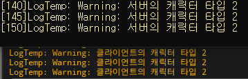
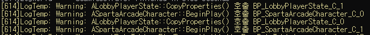
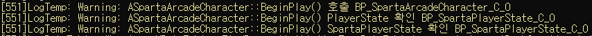
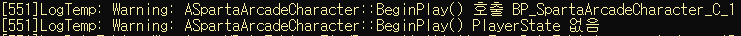
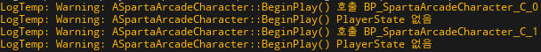

# 📅 2026-07-07 TIL

## 1. 오늘 학습 요약

* **학습 목표**: 
  * **코딩테스트** 문제풀이
  * **PlayerState** 동기화 트러블 슈팅
* **학습 도구**: `Unreal Engine 5.5.4`, `Visual Studio 2022`

* **활동 내용**: 
  * 프로그래머스 **[괄호 변환](https://school.programmers.co.kr/learn/courses/30/lessons/60058)**, **[수식 최대화](https://school.programmers.co.kr/learn/courses/30/lessons/67257)** 풀이
  * **PlayerState** 동기화 트러블 슈팅
---

## 2. 프로그래머스 문제 풀이

### [괄호 변환](https://school.programmers.co.kr/learn/courses/30/lessons/60058)

```cpp
#include <string>
#include <vector>

using namespace std;

bool check(const string& str){
    int stack = 0;
    for(int i=0; i<str.length(); i++){
        if(str[i] == '(') stack++;
        else stack--;
        if(stack < 0) return false;
    }
    return stack == 0;
}

int split(const string& str){
    int open = 0, close = 0;
    for(int i=0; i<str.length(); i++){
        if(str[i] == '(') open++;
        else close++;
        if(open == close) return i+1;
    }
    return str.length();
}

string convert(const string& str){
    if(check(str)) return str;
    int cur = split(str);
    string u = str.substr(0, cur), v = str.substr(cur, str.length()-cur);
    
    v = convert(v);
    if(check(u)) return u + v;
    
    string temp = '(' + v + ')';
    u = u.substr(1, u.length()-2);
    for(int i=0; i<u.length(); i++)
        u[i] = u[i] == '(' ? ')' : '(';
    
    return temp + u;
}

string solution(string p) {
    string answer = convert(p);
    return answer;
}
```

* **구현** 문제
* **스택**으로 올바른 괄호 문자열인지 확인
* 이후 문제 조건에 따라 **재귀 함수**를 구현

---

### [수식 최대화](https://school.programmers.co.kr/learn/courses/30/lessons/67257)

```cpp
#include <string>
#include <vector>
#include <stack>
#include <algorithm>
#include <cmath>

using namespace std;

void split(const string& expression, vector<string>& nums, vector<char>& ops){
    string num = "";
    for(int i=0; i<expression.length(); i++){
        if(isdigit(expression[i])) num += expression[i];
        else{
            nums.push_back(num);
            ops.push_back(expression[i]);
            num = "";
        }
    }
    nums.push_back(num);
}

void calc(vector<string>& nums, vector<char>& ops, char op){
    vector<string> newNums;
    vector<char> newOps;
    stack<string> s;
    s.push(nums[0]);
    
    for(int i=0; i<ops.size(); i++){
        if(ops[i] == op){
            long long left = stoll(s.top()), right = stoll(nums[i+1]), result;
            s.pop();
            if(op == '+') result = left + right;
            else if(op == '-') result = left - right;
            else if(op == '*') result = left * right;
            s.push(to_string(result));
        }
        else{
            s.push(nums[i+1]);
            newOps.push_back(ops[i]);
        }
    }
    while(!s.empty()){
        newNums.push_back(s.top());
        s.pop();
    }
    reverse(newNums.begin(), newNums.end());
    nums = newNums;
    ops = newOps;
}

long long permutation(const vector<string>& nums, const vector<char>& ops, vector<char>& op){
    long long max = 0;
    
    do{
        vector<string> tempNums = nums;
        vector<char> tempOps = ops;
        for(int i=0; i<3; i++) calc(tempNums, tempOps, op[i]);
        long long result = abs(stoll(tempNums[0]));
        max = max > result ? max : result;
    }while(next_permutation(op.begin(), op.end()));  
    
    return max;
}

long long solution(string expression) {
    long long answer = 0;
    vector<string> nums;
    vector<char> ops, op = {'*', '+', '-'};
    split(expression, nums, ops);
    answer = permutation(nums, ops, op);
    return answer;
}
```

* **순열**, **스택**을 활용해 풀이
* 연산자 우선순위의 **모든 경우의 수는 6가지** 몇 가지 안 되기에 직접 써도 되지만 순열로 구함
* 이후 **스택**으로 연산하면 방정식의 **위치를 유지**하며 계산할 수 있음
* 모든 경우 중 절댓값이 가장 큰 경우를 반환

---

## 3. PlayerState 데이터 이동

멀티플레이어 게임의 구조를 구현하던 중, `LobbyMap`에서 `TestMap`으로 이동하면서 로비에서 설정한 캐릭터 타입 정보를 인게임 맵으로 옮겨야 했음.

해당 데이터는 로비의 `LobbyPlayerState`에 저장되어 있고, 이를 `TestMap`의 `SpartaPlayerState`로 옮기고자 함.

이를 위해서 `GameInstance`와 `CopyProperties` 중 고민을 했으며 최종적으로 `CopyProperties`를 선택하여 구현함. 

선택의 근거는 아래와 같음.

1. 기존의 레벨 이동을 `ServerTravel`으로 구현해 이미 **Seamless Travel**이 적용된 상태

2. `CopyProperties`는 서버에서 동작하기에 별도의 검증이 필요로 하지 않음

3. 기존의 `LobbyPlayerState`에 가상 함수 오버라이딩만으로 구현이 가능함

4. `GameInstance`와 `PlayerState`에 동일한 데이터를 저장하는 것은 **결합도가 상승**해 유지보수나 확장이 어려워짐


### CopyProperties

```cpp
void ALobbyPlayerState::CopyProperties(APlayerState* PlayerState)
{
	Super::CopyProperties(PlayerState);
	if (ASpartaPlayerState* SpartaPlayerState = Cast<ASpartaPlayerState>(PlayerState))
	{
		SpartaPlayerState->SetCharacterType(SelectedCharacterType);
		SpartaPlayerState->SetTeamID(TeamID);
	}
}
```

`ALobbyPlayerState::CopyProperties`를 통해 맵이 변경된 후 `ASpartaPlayerState`로 이전해 주었다.

이후 해당 레벨의 **Default Pawn Class**의 `ASpartaArcadeCharacter::BeginPlay`에서 `ASpartaPlayerState`의 데이터를 읽어 캐릭터의 타입을 설정해 주었다.

캐릭터 타입을 설정한 후, 해당 타입에 맞는 능력치를 갖게끔 초기화하는 로직을 포함해 두었다.

```cpp
void ASpartaArcadeCharacter::BeginPlay()
{
	Super::BeginPlay();
	
	FName RowName = FName(TEXT("Default"));
    SpartaPlayerState = GetPlayerState<ASpartaPlayerState>();
    if (IsValid(SpartaPlayerState))
    {
        switch (SpartaPlayerState->GetCharacterType())
        {
        case ESpartaArcadeCharacterType::Explosive:
            RowName = FName(TEXT("Explosive"));
            break;
        case ESpartaArcadeCharacterType::Speed:
            RowName = FName(TEXT("Speed"));
            break;
        case ESpartaArcadeCharacterType::BombCount:
            RowName = FName(TEXT("BombCount"));
            break;
        }
    }

    // 캐릭터 스탯 초기화 로직...
}
```

하지만 캐릭터의 스탯은 **설정한 타입으로 초기화되지 않고** 기본값으로만 초기화되었다.

### 원인 분석

위 문제를 해결하기 위하여 몇 가지 가설을 세우고 차례대로 검증해 보았다.

1. `ALobbyPlayerState::CopyProperties`가 정상적으로 동작하지 않아, 데이터가 전달되지 않는가?

2. `ALobbyPlayerState::CopyProperties`가 `ASpartaArcadeCharacter::BeginPlay` 보다 늦게 실행되는가?

3. `ASpartaPlayerState`로의 캐스팅이 실패하는가?

#### 1. ALobbyPlayerState::CopyProperties 동작 확인

1번 가설을 확인하기 위해 폭탄을 설치하는 시점에 캐릭터의 타입을 확인해보았다.



폭탄을 설치하는 시점에는 캐릭터의 타입이 정상적으로 전달되었으며, 레플리케이션 또한 성공하였다.

즉 캐릭터의 초기화 시점에만 캐릭터의 타입이 기본값으로 저장되어 있다는 것을 예상할 수 있었다.

#### 2. `ALobbyPlayerState::CopyProperties`, `ASpartaArcadeCharacter::BeginPlay` 호출 시점

위의 결과를 보고 두 함수의 호출 시점을 확인해 보았다.

`CopyProperties`는 서버에서만 호출되는 함수이므로 서버의 로그를 통해 확인하였다.



확인 결과 `ALobbyPlayerState::CopyProperties`가 `ASpartaArcadeCharacter::BeginPlay` 보다 먼저 호출됨을 알 수 있었다.

이후 `ASpartaArcadeCharacter::BeginPlay`가 호출될 때, `ASpartaPlayerState`에 저장되어 있는 캐릭터 타입을 확인해 보기 위해 로그를 출력해 보았지만 출력되지 않았음.

#### 3. `PlayerState` 상태

위 결과를 통해 `ASpartaPlayerState`로의 캐스팅이 실패하는지 의심을 갖게 되었고 로그를 통해 확인해 봄

```cpp
void ASpartaArcadeCharacter::BeginPlay()
{
	Super::BeginPlay();
	UE_LOG(LogTemp, Warning, TEXT("ASpartaArcadeCharacter::BeginPlay() 호출 %s"), *GetName());

	if(APlayerState* PS = GetPlayerState())
	{
		UE_LOG(LogTemp, Warning, TEXT("ASpartaArcadeCharacter::BeginPlay() PlayerState 확인 %s"), *PS->GetName());
		if(ASpartaPlayerState* SpartaPS = Cast<ASpartaPlayerState>(PS))
		{
			UE_LOG(LogTemp, Warning, TEXT("ASpartaArcadeCharacter::BeginPlay() SpartaPlayerState 확인 %s"), *SpartaPS->GetName());
		}
		else
		{
			UE_LOG(LogTemp, Warning, TEXT("ASpartaArcadeCharacter::BeginPlay() PlayerState를 SpartaPlayerState로 캐스팅 실패"));
		}
	}
	else
	{
		UE_LOG(LogTemp, Warning, TEXT("ASpartaArcadeCharacter::BeginPlay() PlayerState 없음"));
	}
}
```







하지만 전혀 예상하지 못한 결과를 확인할 수 있었는데, **서버**에서는 두 캐릭터가 동일한 틱에 `ASpartaArcadeCharacter::BeginPlay()`를 호출하였지만 **하나는 캐스팅 및 타입 초기화가 성공**하였고 다른 **하나는 `GetPlayerState()` 자체가 `nullptr`을 반환**하였다.

또한, **클라이언트**에서는 **두 캐릭터 모두 `GetPlayerState()`가 `nullptr`을 반환**하였다.

이후 테스트를 여러 번 반복해 보았지만, **대부분의 경우 서버에서도 `GetPlayerState()`가 `nullptr`을 반환**하였고 일부 경우에만 캐스팅까지 성공하였으며 **클라이언트는 항상 `GetPlayerState()` 자체가 `nullptr`을 반환**하였다.

즉, `SeamlessTravle` 시 **서버**에서의 `PlayerState` 참조와 `BeginPlay()` **호출 순서가 보장되지 않음**을 확인할 수 있고, **클라이언트** 또한 레플리케이션 등으로 **보장되지 않음**을 확인할 수 있다.

### SetTimerForNextTick

```cpp
void ASpartaArcadeCharacter::BeginPlay()
{
	Super::BeginPlay();
	InitializeCharacterComponents();
}

void ASpartaArcadeCharacter::InitializeCharacterComponents()
{
	if (!IsValid(GetPlayerState()) || !IsValid(StatComponent) || !IsValid(CombatComponent) || !IsValid(BombPlacerComponent))
	{
		if(InitializedComponentsCount >= MaxInitializedComponentsCount)
		{
			return;
		}

		++InitializedComponentsCount;
		FTimerDelegate TimerDel;
		TimerDel.BindUObject(this, &ASpartaArcadeCharacter::InitializeCharacterComponents);
		GetWorldTimerManager().SetTimerForNextTick(TimerDel);
		return;
	}

    // 캐릭터 스탯 초기화 로직...
}
```

위의 결과로 확인해 보았을 때, 타입이 초기화되지 않는 문제는 `PlayerState`의 **참조 시점이 보장되지 않는다**는 이유에서 발생함.

이를 해결하기 위해 `SetTimerForNextTick`을 통해 `GetPlayerState()`가 `nullptr`을 반환하는 경우 **다음 틱으로 캐릭터 초기화를 연기**.

함수가 재귀적으로 호출되기에 오류로 인해 **무한 재귀 발생을 방지**하기 위해 호출 횟수에 제한을 둠.

해당 로직을 적용한 결과 `ASpartaPlayerState` 및 기타 컴포넌트의 데이터가 초기화됨을 확인할 수 있었음.

해당 방법은 무조건적인 성공을 보장하지는 않으며, 실패 시 틱마다 함수를 호출한다는 단점이 존재함.

이러한 단점을 보완하기 위해 **Pawn에 컨트롤러가 빙의 중**에 실행되는  `PossessedBy` 함수에서 초기화하는 것에 고민해 보았음.

`PossessedBy`는 Pawn에 컨트롤러가 설정된 이후 실행되기에 `GetPlayerState()`가 nullptr을 반환하지 않을 것이라 예상되지만, 이를 증명할 방법이 없어 우선은 현재 코드를 유지하는 것으로 결정.