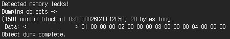
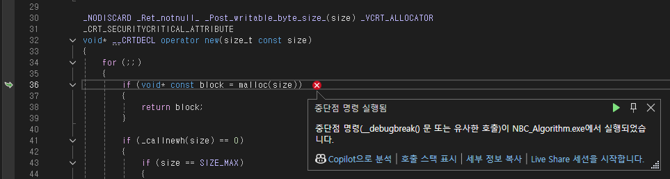
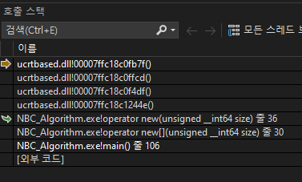

# 📅 2026-07-08 TIL

## 1. 오늘 학습 요약

* **학습 목표**: 
  * **코딩테스트** 문제풀이
  * **메모리 누수**
* **학습 도구**: `Unreal Engine 5.5.4`, `Visual Studio 2022`

* **활동 내용**: 
  * 프로그래머스 **[카운트 다운](https://school.programmers.co.kr/learn/courses/30/lessons/131129)** 풀이
  * LeetCode **[Find the Town Judge](https://leetcode.com/problems/find-the-town-judge/description/)**, **[Find if Path Exists in Graph](https://leetcode.com/problems/find-if-path-exists-in-graph/description/)** 풀이
  * **메모리 누수** 확인 방법

---

## 2. 프로그래머스 문제 풀이

### [카운트 다운](https://school.programmers.co.kr/learn/courses/30/lessons/131129)

```cpp
#include <string>
#include <vector>
#include <algorithm>

using namespace std;

vector<int> solution(int target) {
    vector<int> scores;
    vector<vector<int>> dp(target+1, {100001, 0});
    
    for(int i=1; i<=20; i++){
        scores.push_back(i);
        scores.push_back(i*2);
        scores.push_back(i*3);
    }
    scores.push_back(50);
    sort(scores.begin(), scores.end());
    scores.erase(unique(scores.begin(), scores.end()), scores.end());
    
    for(const int score : scores) {
        if(score > target) continue;
        else if(score <= 20 || score == 50) dp[score] = {1, 1};
        else dp[score] = {1, 0};
    }
    
    for(int i=1; i<=target; i++){
        for(const int score : scores) {
            int next = i + score;
            if(next > target || dp[next][0] < dp[i][0] + 1) continue;
            
            if(score <= 20 || score == 50){
                if(dp[next][0] == dp[i][0] + 1 && dp[next][1] > dp[i][1] + 1) continue;
                dp[next][0] = dp[i][0] + 1;
                dp[next][1] = dp[i][1] + 1;
            } 
            
            else{
                if(dp[next][0] == dp[i][0] + 1 && dp[next][1] > dp[i][1]) continue;
                dp[next][0] = dp[i][0] + 1;
                dp[next][1] = dp[i][1];
            }
        }
    }
    
    return dp[target];
}
```

* **DP** 문제
* 각 점수를 만드는 최선의 던지기 횟수 및 싱글/불의 개수를 저장
* 현재 점수에서 `i`점을 맞추었을 때, 더 좋은 상황이면 dp를 업데이트

---

## 3. LeetCode 문제 풀이

### [Find the Town Judge](https://leetcode.com/problems/find-the-town-judge/description/)

```cpp
class Solution {
public:
    int findJudge(int n, vector<vector<int>>& trust) {
        vector<pair<int, int>> count(n+1);
        for(const vector<int>& t : trust){
            count[t[0]].second++;
            count[t[1]].first++;
        }
        
        for(int i=1; i<=n; i++){
            if(count[i] == pair<int, int>({n-1, 0})) return i;
        }
        return -1;
    }
};
```

* **그래프** 문제
* 각 마을 사람을 **정점**, 신뢰 관계를 **단방향 간선**이라고 생각
* 문제에서 찾는 판사는 **나가는 간선이 0개**이며, **들어오는 간선이 n-1개**인 정점을 의미함

---

### [Find if Path Exists in Graph](https://leetcode.com/problems/find-if-path-exists-in-graph/description/)

```cpp
#include <queue>

class Solution {
public:
    bool validPath(int n, vector<vector<int>>& edges, int source, int destination) {
        if(source == destination) return true;
        
        vector<vector<int>> graph(n);
        for(const vector<int>& edge : edges){
            graph[edge[0]].push_back(edge[1]);
            graph[edge[1]].push_back(edge[0]);
        }

        vector<int> visit(graph.size(), -1);
        queue<int> q;
        q.push(source);
        visit[source] = 0;

        while(!q.empty()){
            int curr = q.front();
            q.pop();

            for(int i=0; i<graph[curr].size(); i++){
                int next = graph[curr][i];
                if(visit[next] != -1) continue;
                q.push(next);
                visit[next] = visit[curr] + 1;
                if(next == destination) return true;
            }
        }
        return false;
    }
};
```

* 그래프 탐색 문제, **BFS**를 이용해 풀이
* **BFS**로 **source**에서 **destination**까지 도달 가능한지 확인

---

## 4. 메모리 누수 (Memory Leak)

* **메모리 누수**란 프로그램이 메모리를 할당받은 후 더 이상 사용하지 않음에도 할당 받은 공간을 해제하지 않아 **불필요한 메모리 자원을 유지**하고 있는 상황을 의미함

* 메모리 누수가 지속될 경우 프로그램이 할당할 수 있는 메모리 공간이 부족해져 **속도가 저하되거나 크래시가 발생**할 수 있음

### 발생 원인

1. **C**, **C++** 에서의 **수동 메모리** 할당 및 해제

2. 이벤트 리스너, 콜백 **해제 누락**

3. **C++** 스마트 포인터 **순환 참조**

* 이외에도 다양한 언어에서 다양한 원인으로 메모리 누수가 발생할 수 있음

### 확인 방법

* C, C++ 에서는 **CRT 라이브러리**를 통해 메모리 누수를 찾을 수 있음

* 아래 예제를 통해 메모리 누수를 확인하는 방법을 정리해보자

### _CrtDumpMemoryLeaks(), _CrtSetDbgFlag()

* `_CrtDumpMemoryLeaks()`: 함수를 **호출한 지점**에서 메모리 누수를 검사

* `_CrtSetDbgFlag( _CRTDBG_ALLOC_MEM_DF | _CRTDBG_LEAK_CHECK_DF )`: 프로그램 종료 시점에 자동으로 `_CrtDumpMemoryLeaks()`를 호출

    ```cpp
    int main() {
        int* leakedPtr = new int[5] { 1, 2, 3, 4, 5 };

        _CrtDumpMemoryLeaks();

        return 0;
    }
    ```

    

* 해당 함수를 포함해 실행하면 위와 같은 형식으로 출력되며 각 항목이 의미하는 것은 아래와 같음
    * 메모리 할당 번호(이 예제의 경우 158)
    * 블록 형식(이 예제의 경우 normal)
    * 16진수 메모리 위치(이 예제의 경우 0x0000026C4EE12F50)
    * 블록 크기(이 예제의 경우 20 bytes)
    * 블록 내 데이터의 처음 16바이트(16진수 형식)

* 하지만 위 데이터만으로는 프로그램의 어떤 부분에서 누수가 발생했는지까지는 확인할 수 없음

### _CrtSetBreakAlloc()

* 메모리 할당 번호를 이용해 해당 메모리가 할당되었을 때 **중단점**을 걸어주는 함수

* 위 예제의 `158`을 인자로 넣으면 누수가 발생하는 라인에서 중단함

    ```cpp
    int main() {
        _CrtSetBreakAlloc(158); // 미리 예약

        int* leakedPtr = new int[5] { 1, 2, 3, 4, 5 };

        _CrtDumpMemoryLeaks();

        return 0;
    }
    ```

    

    

* 위 사진처럼 메모리 할당 시 **중단점**을 통해 실행이 중단됨

* **호출 스택**을 통해 어떤 라인에서 할당한 메모리인지 확인 가능

---

## 5. 참고 자료

* [MS Learn - CRT 라이브러리로 메모리 누수 찾기](https://learn.microsoft.com/ko-kr/cpp/c-runtime-library/find-memory-leaks-using-the-crt-library?view=msvc-170)

* [IN-COM - 프로그래밍에서의 메모리 누수: 원인, 탐지 및 예방 이해](https://www.in-com.com/ko/blog/understanding-memory-leaks-in-programming-causes-detection-and-prevention/#Static_and_Global_Variable_Accumulation)

* [LuckyGg - [디버깅] 메모리 누수를 점검하는 방법 - CRTDBG (예제 포함)](https://luckygg.tistory.com/226#google_vignette)