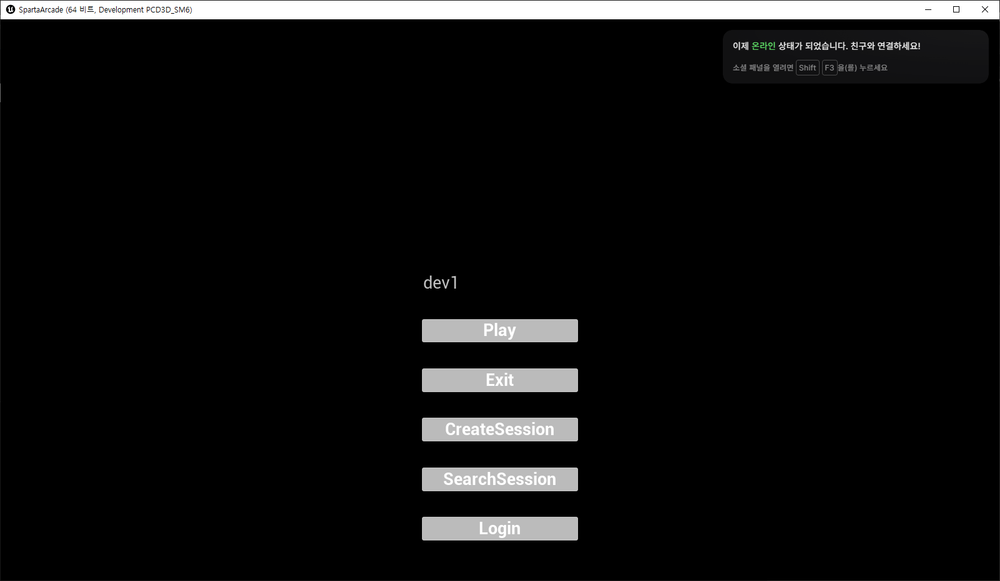
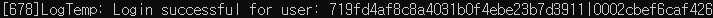
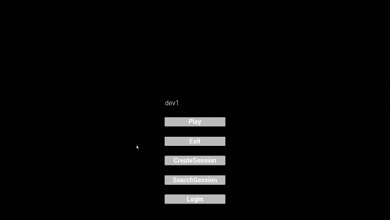
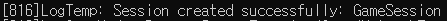
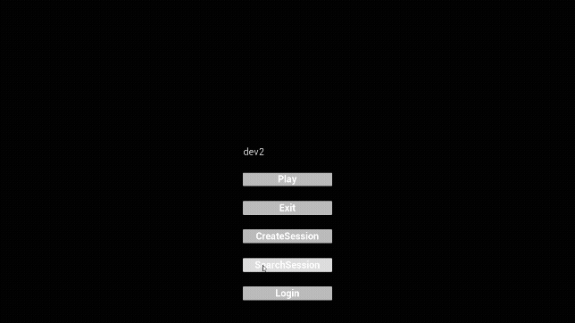
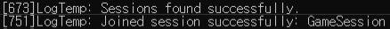

# 📅 2026-07-22 TIL

## 1. 오늘 학습 요약

* **학습 목표**: 
  * **코딩테스트** 문제풀이
  * **EOS** 연동
 
* **학습 도구**: `Unreal Engine 5.5.4`, `Visual Studio 2022`

* **활동 내용**: 
  * 프로그래머스 **[리프 노드 수 최대화](https://school.programmers.co.kr/learn/courses/30/lessons/468372)** 풀이
  * LeetCode **[Network Delay Time](https://leetcode.com/problems/network-delay-time/description/)**, [Cheapest Flights Within K Stops](https://leetcode.com/problems/cheapest-flights-within-k-stops/description/) 풀이
  * **EOS** 연동 과정
---

## 2. 프로그래머스 문제 풀이

### [리프 노드 수 최대화](https://school.programmers.co.kr/learn/courses/30/lessons/468372)

```cpp
#include <string>
#include <vector>
#include <cmath>

using namespace std;

int solution(int dist_limit, int split_limit) {
    int answer = 0;
    vector<pair<int, int>> com;
    for(int i=0; pow(3, i)<=split_limit; i++){
        int count2 = log2(split_limit/pow(3, i));
        com.push_back({i, count2});
    }
    
    for(const pair<int, int>& p : com){
        int dist = dist_limit;
        int count3 = min(dist, p.first);
        int count2 = min(dist - count3, p.second);
        
        int leaf = 1;
        for(int i=0; i<count3; i++){
            int num = min(leaf, dist);
            leaf += (num*2);
            dist -= num;
        }
        for(int i=0; i<count2; i++){
            int num = min(leaf, dist);
            leaf += num;
            dist -= num;
        }
        answer = max(leaf, answer);
        
        dist = dist_limit;
        leaf = 1;
        for(int i=0; i<count2; i++){
            int num = min(leaf, dist);
            leaf += num;
            dist -= num;
        }
        for(int i=0; i<count3; i++){
            int num = min(leaf, dist);
            leaf += (num*2);
            dist -= num;
        }
        answer = max(leaf, answer);
    }
    return answer;
}
```

* **완전 탐색**, **그리디**, **수학** 문제
* 어떤 노드의 분배도는 `2^a * 3^b`의 꼴을 가짐
* 따라서 트리의 최대 깊이는 `split_limit` 이하의 수를 `2, 3`의 조합으로 만들었을 때, `a, b`의 **합**과 같음
* 여기서 `2`의 개수는 트리를 표현할 때 만들 수 있는 **자식을 2개 갖는 분배 노드 레벨의 최대 수**를 의미하며, `3`의 개수는 **자식을 3개 갖는 분배 노드 레벨의 최대 수**를 의미함
* 트리를 만들 때 **자식을 3개 갖는 분배 노드로만 만들 수 있다**면 모두 해당 분배 노드로 만드는 것이 이득
* 만약 **자식을 2개 갖는 분배 노드가 반드시 필요**하다면, 트리의 **윗부분에서 사용**하는 것이 가장 효율적
* 따라서 **두 방법으로 트리를 생성**한 뒤 더 큰 값을 저장

---

## 3. LeetCode 문제 풀이

### [Network Delay Time](https://leetcode.com/problems/network-delay-time/description/)
```cpp
#include <queue>

class Solution {
public:
    int networkDelayTime(vector<vector<int>>& times, int n, int k) {
        priority_queue<pair<int, int>, vector<pair<int, int>>, greater<pair<int, int>>> pq;
        vector<int> dist(n, 10001);
        vector<vector<pair<int, int>>> graph(n);
        for(int i=0; i<times.size(); i++)
            graph[times[i][0]-1].push_back({times[i][1]-1, times[i][2]});
        
        pq.push({0, k-1});
        dist[k-1] = 0;

        while(!pq.empty()){
            pair<int, int> curr = pq.top();
            pq.pop();
            int node = curr.second;
            int weight = curr.first;
            if(dist[node] < weight) continue;
            
            for(int i=0; i<graph[node].size(); i++){
                int next = graph[node][i].first;
                int nextWeight = weight + graph[node][i].second;
                if(nextWeight < dist[next]) {
                    dist[next] = nextWeight;
                    pq.push({nextWeight, next});
                }
            }
        }

        int answer = 0;
        for(int i=0; i<n; i++){
            if(dist[i] == 10001) return -1;
            else answer = max(answer, dist[i]);
        }
            
        return answer;
    }
};
```

* **다익스트라** 문제

---

### [Cheapest Flights Within K Stops](https://leetcode.com/problems/cheapest-flights-within-k-stops/description/)

```cpp
#include <queue>

class Solution {
public:
    struct Data{
        int next;
        int weight;
        int step;

        Data(int _next, int _weight, int _step){
            next = _next;
            weight = _weight;
            step = _step;
        }
        bool operator<(const Data& d) const{
            return weight > d.weight;
        }
    };

    int findCheapestPrice(int n, vector<vector<int>>& flights, int src, int dst, int k) {
        vector<vector<pair<int, int>>> graph(n);
        vector<vector<int>> dist(k+2, vector<int>(n, 1000001));
        for(int i=0; i<flights.size(); i++)
            graph[flights[i][0]].push_back({flights[i][1], flights[i][2]});
        
        priority_queue<Data> pq;
        pq.push(Data(src, 0, 0));
        dist[0][src] = 0;

        while(!pq.empty()){
            Data data = pq.top();
            pq.pop();
            int curr = data.next;
            int weight = data.weight;
            int step = data.step;
            if(step > k+1 || dist[step][curr] < weight) continue;

            for(int i=0; i<graph[curr].size(); i++){
                int next = graph[curr][i].first;
                int nextWeight = weight + graph[curr][i].second;
                int nextStep = step + 1;
                if(nextStep > k+1 || nextWeight >= dist[nextStep][next]) continue;
                pq.push(Data(next, nextWeight, nextStep));
                dist[nextStep][next] = nextWeight;
            }
        }

        int answer = 1000001;
        for(int i=0; i<dist.size(); i++)
            answer = min(answer, dist[i][dst]);
        return answer == 1000001 ? -1 : answer;
    }
};
```

* **다익스트라** 문제
* 단순한 다익스트라와 달리 **경유 횟수**에 제한이 있음
* 따라서 `dist`를 저장할 때 경유 횟수를 같이 저장하도록 **2차원 배열**로 저장

---

## 4. Epic Online Services(EOS) 연동

### 1. EOS 플러그인 도입 및 프로젝트 엔진 설정

#### `.uproject` 플러그인 활성화

`.uproject` 파일에 `OnlineSubsystemEOS` 플러그인을 추가

```json
{
  "Plugins": [
    {
      "Name": "OnlineSubsystemEOS",
      "Enabled": true
    }
  ]
}
```

#### `Build.cs` C++ 모듈 의존성 등록

`.Build.cs` 파일의 `PublicDependencyModuleNames`에 온라인 서브시스템 필수 모듈(`"OnlineSubsystem"`, `"OnlineSubsystemEOS"`, `"OnlineSubsystemUtils"`) 3개를 추가

```csharp
public class SpartaArcade : ModuleRules
{
    public SpartaArcade(ReadOnlyTargetRules Target) : base(Target)
    {
        PCHUsage = PCHUsageMode.UseExplicitOrSharedPCHs;
        
        PublicDependencyModuleNames.AddRange(new string[] { 
            "Core", "CoreUObject", "Engine", "InputCore", 
            "NavigationSystem", "AIModule", "Niagara", 
            "EnhancedInput", "UMG", "Slate", "SlateCore",
            // EOS 온라인 서브시스템 모듈
            "OnlineSubsystem", "OnlineSubsystemEOS", "OnlineSubsystemUtils"
        });
    }
}
```

#### `DefaultEngine.ini` EOS 아티팩트 및 오버레이 설정

`Config/DefaultEngine.ini` 파일에 EOS SDK 통신을 위한 기본 설정을 세팅

```ini
[OnlineSubsystem]
DefaultPlatformService=EOS  ; 기본 플랫폼으로 EOS 사용

[OnlineSubsystemEOS]
bEnabled=true               ; OnlineSubsystemEOS 플러그인 활성화

[/Script/Engine.GameEngine]
+NetDriverDefinitions=(DefName="GameNetDriver",DriverClassName="OnlineSubsystemEOS.NetDriverEOS",DriverClassNameFallback="OnlineSubsystemUtils.IpNetDriver")

[/Script/OnlineSubsystemEOS.NetDriverEOS]
bIsUsingP2PSockets=True     ; 포트포워딩 없이 플레이어 간 직렬 연결을 돕는 EOS P2P 소켓 기능 사용

CacheDir=CacheDir           
DefaultArtifactName=Client  
RTCBackgroundMode=          
TickBudgetInMilliseconds=0  

bEnableOverlay=True         ; 게임 실행 중 EOS 오버레이 활성화
bEnableSocialOverlay=True   ; 오버레이 내 친구 목록 및 소셜 UI 활성화
bEnableEditorOverlay=True   ; 언리얼 에디터 PIE 테스트 중 오버레이 활성화

bPreferPersistentAuth=False
TitleStorageReadChunkLength=0 

; 에픽 개발자 포털(Developer Portal)에서 발급받은 식별자 및 키 세팅
+Artifacts=(ArtifactName="Client",ClientId="CLIENT_ID",ClientSecret="CLIENT_SECRET",ProductId="PRODUCT_ID",SandboxId="SANDBOX_ID",DeploymentId="DEPLOYMENT_ID",ClientEncryptionKey="KEY")
+AuthScopeFlags=BasicProfile    
+AuthScopeFlags=FriendsList     
+AuthScopeFlags=Presence        

bUseEAS=True                    ; 에픽 계정 서비스(Epic Account Services) 사용
bUseEOSConnect=True             ; 타 플랫폼(스팀 등) 계정과 EOS 식별자 연동(EOS Connect) 사용
bMirrorStatsToEOS=True          ; 게임 내 스탯을 EOS 서비스로 동기화
bMirrorAchievementsToEOS=True   ; 게임 내 업적을 EOS 서비스로 동기화
bUseEOSSessions=True            ; EOS 기반 멀티플레이 방 생성/검색/참여(Session) 기능 사용
bMirrorPresenceToEAS=False      ; EOS Presence를 에픽 계정 서비스(EAS)에 바로 반영할지 여부
bUseNewLoginFlow=False          ; 신규 로그인 플로우 UI 사용 여부
SteamTokenType=Session 
NintendoTokenType=NintendoServiceAccount
```

### 2. GameInstanceSubsystem 기반 EOS 서비스 모듈 구조 설계

현재 프로젝트는 **리슨 서버** 기반으로 동작하며, **방 만들기 기능**을 구현하기 위해 필요한 EOS 기능은 **인증**과 **세션** 두 가지가 있음

**EOS**는 게임 전반적으로 유지되어야 하기에 **게임 실행 동안 파괴되지 않는 `UGameInstanceSubsystem`** 을 상속받아 구현

EOS에는 인증, 세션 외에도 다양한 기능(친구, 업적, 보이스챗 등)이 포함되어 있기에 **기능을 관리하는 매니저**를 두고 **각 기능은 역할을 분리해** 설계

```
[ UEOSGameInstanceSubsystem ] (UGameInstanceSubsystem)
        │
        ├──► [ UAuthService ]     : Login / Logout (IOnlineIdentityPtr)
        └──► [ USessionService ]  : Create / Find / Join Session (IOnlineSessionPtr)
```

#### `EOSGameInstanceSubsystem` 구현

* **[EOSGameInstanceSubsystem.h]**

    ```cpp
    #pragma once

    #include "CoreMinimal.h"
    #include "Subsystems/GameInstanceSubsystem.h"
    #include "EOSGameInstanceSubsystem.generated.h"

    class UAuthService;
    class USessionService;
    class IOnlineSubsystem;

    UCLASS()
    class SPARTAARCADE_API UEOSGameInstanceSubsystem : public UGameInstanceSubsystem
    {
        GENERATED_BODY()

    public:
        virtual void Initialize(FSubsystemCollectionBase& Collection) override;
        virtual void Deinitialize() override;

        UAuthService* GetAuthService() const;
        USessionService* GetSessionService() const;

    private:
        IOnlineSubsystem* OnlineSubsystem;

        UPROPERTY()
        TObjectPtr<UAuthService> AuthService;

        UPROPERTY()
        TObjectPtr<USessionService> SessionService;
    };
    ```

* **[EOSGameInstanceSubsystem.cpp]**

    ```cpp
    #include "EOSGameInstanceSubsystem.h"
    #include "AuthService.h"
    #include "SessionService.h"
    #include "OnlineSubsystem.h"

    void UEOSGameInstanceSubsystem::Initialize(FSubsystemCollectionBase& Collection)
    {
        Super::Initialize(Collection);

        // 하위 서비스 객체 생성
        AuthService = NewObject<UAuthService>(this);
        SessionService = NewObject<USessionService>(this);
        
        // 언리얼 OnlineSubsystem 포인터 획득 후 서비스 초기화
        OnlineSubsystem = IOnlineSubsystem::Get();
        if (OnlineSubsystem)
        {
            AuthService->Initialize(OnlineSubsystem);
            SessionService->Initialize(OnlineSubsystem);
        }
    }

    void UEOSGameInstanceSubsystem::Deinitialize()
    {
        Super::Deinitialize();
        if (AuthService)
        {
            AuthService->Logout();
        }
        AuthService = nullptr;
        SessionService = nullptr;
    }

    UAuthService* UEOSGameInstanceSubsystem::GetAuthService() const { return AuthService; }
    USessionService* UEOSGameInstanceSubsystem::GetSessionService() const { return SessionService; }
    ```

### 3. 인증 서비스 (`AuthService`) 구현

**유저 로그인** 및 **Identity** 관리의 **인증 기능**을 담당하는 오브젝트

EOS 로그인은 개발 환경과 실제 출시 환경이 다름

**에디터 및 개발 환경**에서는 Epic의 **Developer Authentication Tool(DAT)** 을 사용하도록 
설정

**상용 빌드**에서는 각 플랫폼 별 **자동 로그인**(`AutoLogin`)을 수행하도록 구현

EOS의 로그인은 **비동기로 동작**하므로 각 함수가 실행 완료 되었을 때 **Delegate를 바인딩하여 성공/실패 여부를 수신**

* **핵심 인증 함수**

    * **`Initialize(IOnlineSubsystem*)`**: 엔진의 `IOnlineIdentity` 인터페이스를 가져와 세션 이벤트 콜백 델리게이트를 등록


    * **`Login(const FString& AuthToken)`**: `IOnlineIdentity`를 통해 로그인 요청을 비동기로 호출, 개발 환경에서는 DAT 상용 빌드에서는 플랫폼 자동 로그인

    * **`Logout()`**: 현재 로그인된 유저의 EOS 인증 토큰 및 세션 연결 해제

* **[AuthService.h]**
    ```cpp
    #pragma once

    #include "CoreMinimal.h"
    #include "UObject/NoExportTypes.h"
    #include "Interfaces/OnlineIdentityInterface.h"
    #include "AuthService.generated.h"

    class IOnlineSubsystem;

    UCLASS()
    class SPARTAARCADE_API UAuthService : public UObject
    {
        GENERATED_BODY()

    public:
        virtual void Initialize(IOnlineSubsystem* InOnlineSubsystem);
        void Login(const FString& AuthToken);
        void Logout();

    private:
        // 로그인 및 로그아웃 종료 시 실행되는 콜백 함수
        void OnLoginComplete(int32 LocalUserNum, bool bWasSuccessful, const FUniqueNetId& UserId, const FString& Error);
        void OnLogoutComplete(int32 LocalUserNum, bool bWasSuccessful);

        IOnlineIdentityPtr Identity;
    };
    ```

* **[AuthService.cpp]**

    ```cpp
    #include "AuthService.h"
    #include "OnlineSubsystem.h"
    #include "Interfaces/OnlineIdentityInterface.h"

    void UAuthService::Initialize(IOnlineSubsystem* InOnlineSubsystem)
    {
        Identity = InOnlineSubsystem->GetIdentityInterface();

        // 콜백 함수 바인딩
        if(Identity.IsValid())
        {
            Identity->AddOnLoginCompleteDelegate_Handle(0, FOnLoginCompleteDelegate::CreateUObject(this, &UAuthService::OnLoginComplete));
            Identity->AddOnLogoutCompleteDelegate_Handle(0, FOnLogoutCompleteDelegate::CreateUObject(this, &UAuthService::OnLogoutComplete));
        }
    }

    void UAuthService::Login(const FString& AuthToken)
    {
        if (!Identity.IsValid())
        {
            return;
        }

    #if WITH_EDITOR || UE_BUILD_DEVELOPMENT || UE_BUILD_DEBUG
        // 개발 환경: EOS Developer Auth Tool 이용
        FOnlineAccountCredentials Credentials;
        Credentials.Type = TEXT("developer");
        Credentials.Id = TEXT("localhost:6300");
        Credentials.Token = AuthToken;
        Identity->Login(0, Credentials);
        return;
    #else
        // 릴리즈 빌드: 플랫폼 자동 로그인
        Identity->AutoLogin(0);
    #endif;
    }

    void UAuthService::Logout()
    {
        if (!Identity.IsValid())
        {
            return;
        }
        Identity->Logout(0);
    }

    // --------------------------------------------------------------
    // 콜백 함수
    void UAuthService::OnLoginComplete(int32 LocalUserNum, bool bWasSuccessful, const FUniqueNetId& UserId, const FString& Error)
    {
        if (bWasSuccessful)
        {
            UE_LOG(LogTemp, Log, TEXT("Login successful for user: %s"), *UserId.ToString());
        }
        else
        {
            UE_LOG(LogTemp, Error, TEXT("Login failed: %s"), *Error);
        }
    }

    void UAuthService::OnLogoutComplete(int32 LocalUserNum, bool bWasSuccessful)
    {
        if (bWasSuccessful)
        {
            UE_LOG(LogTemp, Log, TEXT("Logout successful for user: %d"), LocalUserNum);
        }
        else
        {
            UE_LOG(LogTemp, Error, TEXT("Logout failed for user: %d"), LocalUserNum);
        }
    }
    ```

### 4. 세션 서비스 (`SessionService`) 구현

세션 생성, 파괴, 검색, 참가의 EOS **세션 관리 기능**을 담당하는 오브젝트

EOS의 세션 기능 또한 비동기로 처리되므로, 각 작업의 각 작업 완료 시점에 맞춰 **성공/실패 여부를 수신할 델리게이트를 바인딩**하여 레벨 이동 로직을 처리


* **핵심 세션 제어 함수**
    * **`Initialize(IOnlineSubsystem*)`**: 엔진의 `IOnlineSession` 인터페이스를 가져와 세션 이벤트 콜백 델리게이트를 등록

    * **`CreateSession()`**: EOS Lobbies 연동 및 검색용 키워드(`MyGame`), 최대 인원(4명) 등의 세팅값(`FOnlineSessionSettings`)을 구성한 뒤 비동기 세션 생성 요청

    * **`DestroySession()`**: 현재 진행 중인 세션(`NAME_GameSession`) 정리 및 파괴

    * **`FindSessions()`**: 동일한 키워드(`MyGame`)와 로비 검색 옵션(`SEARCH_LOBBIES`)을 조건으로 세팅하여 EOS 세션을 검색

    * **`JoinSession(...)`**: 검색 결과로 전달받은 세션 정보를 바탕으로 해당 방으로의 참가를 요청

* **비동기 델리게이트 콜백**

    * **세션 생성 완료 (`OnCreateSessionComplete`):** 세션 생성 성공 시 `GetWorld()->ServerTravel(...)`을 호출하여 리슨 서버(`?listen`) 형태의 로비 맵으로 이동

    * **세션 검색 완료 (`OnFindSessionsComplete`):** 검색 성공 시 획득한 세션 목록 중 첫 번째 방(`SearchResults[0]`)으로 `JoinSession` 호출합니다.

    * **세션 참가 완료 (`OnJoinSessionComplete`):** `Session->GetResolvedConnectString(...)`을 통해 호스트의 P2P 접속 문자열(`Connect`)을 해석 및 추출 및 `ClientTravel(Connect, TRAVEL_Absolute)`을 실행하여 해당 서버로 진입

* **[SessionService.h]**

    ```cpp
    #pragma once

    #include "CoreMinimal.h"
    #include "UObject/NoExportTypes.h"
    #include "Interfaces/OnlineSessionInterface.h"
    #include "SessionService.generated.h"

    class IOnlineSubsystem;

    UCLASS()
    class SPARTAARCADE_API USessionService : public UObject
    {
        GENERATED_BODY()

    public:
        virtual void Initialize(IOnlineSubsystem* InOnlineSubsystem);

        void CreateSession();
        void DestroySession();
        void FindSessions();
        void JoinSession(const FOnlineSessionSearchResult& Result);

        // 세션 생성, 파괴, 검색, 참가 종료 시 실행되는 콜백 함수
        void OnCreateSessionComplete(FName SessionName, bool bWasSuccessful);
        void OnDestroySessionComplete(FName SessionName, bool bWasSuccessful);
        void OnFindSessionsComplete(bool bWasSuccessful);
        void OnJoinSessionComplete(FName SessionName, EOnJoinSessionCompleteResult::Type Result);

    private:
        IOnlineSessionPtr Session;

        TSharedPtr<FOnlineSessionSearch> Search;
    };
    ```

* **[SessionService.cpp]**

    ```cpp
    #include "SessionService.h"
    #include "OnlineSubsystem.h"
    #include "Interfaces/OnlineSessionInterface.h"
    #include "OnlineSessionSettings.h"
    #include "Online/OnlineSessionNames.h"

    void USessionService::Initialize(IOnlineSubsystem* InOnlineSubsystem)
    {
        Session = InOnlineSubsystem->GetSessionInterface();

        // 콜백 함수 바인딩
        if(Session.IsValid())
        {
            Session->AddOnCreateSessionCompleteDelegate_Handle(FOnCreateSessionCompleteDelegate::CreateUObject(this, &USessionService::OnCreateSessionComplete));
            Session->AddOnDestroySessionCompleteDelegate_Handle(FOnDestroySessionCompleteDelegate::CreateUObject(this, &USessionService::OnDestroySessionComplete));
            Session->AddOnFindSessionsCompleteDelegate_Handle(FOnFindSessionsCompleteDelegate::CreateUObject(this, &USessionService::OnFindSessionsComplete));
            Session->AddOnJoinSessionCompleteDelegate_Handle(FOnJoinSessionCompleteDelegate::CreateUObject(this, &USessionService::OnJoinSessionComplete));
        }
    }

    void USessionService::CreateSession()
    {
        if (!Session.IsValid())
        {
            return;
        }
        FOnlineSessionSettings Settings;
        Settings.bIsLANMatch = false;                       // WAN(온라인 EOS) 매치 설정
        Settings.NumPublicConnections = 4;                  // 최대 참가 인원 4명
        Settings.bShouldAdvertise = true;                   // 세션을 검색 목록에 공개
        Settings.bUsesPresence = true;                      // 에픽 오버레이/친구 상태 공유 활성화
        Settings.bUseLobbiesIfAvailable = true;             // EOS 로비(Lobby) 서비스 연동
        Settings.Set(SEARCH_KEYWORDS, FString("MyGame"),    // 검색용 키워드 설정
        EOnlineDataAdvertisementType::ViaOnlineService);

        Session->CreateSession(0, NAME_GameSession, Settings);
    }

    void USessionService::DestroySession()
    {
        if (!Session.IsValid())
        {
            return;
        }
        Session->DestroySession(NAME_GameSession);
    }

    void USessionService::FindSessions()
    {
        Search = MakeShared<FOnlineSessionSearch>();
        Search->bIsLanQuery = false;
        Search->MaxSearchResults = 20;
        Search->QuerySettings.Set(SEARCH_LOBBIES, true, EOnlineComparisonOp::Equals);
        Search->QuerySettings.Set(SEARCH_KEYWORDS, FString(TEXT("MyGame")), EOnlineComparisonOp::Equals);

        Session->FindSessions(0, Search.ToSharedRef());
    }

    void USessionService::JoinSession(const FOnlineSessionSearchResult& Result)
    {
        Session->JoinSession(0, NAME_GameSession, Result);
    }

    // --------------------------------------------------------------
    // 콜백 함수
    void USessionService::OnCreateSessionComplete(FName SessionName, bool bWasSuccessful)
    {
        // 세션 생성 성공 시 리슨 서버 형태의 로비 맵으로 이동
        if (bWasSuccessful)
        {
            UE_LOG(LogTemp, Log, TEXT("Session created successfully: %s"), *SessionName.ToString());
            GetWorld()->ServerTravel(TEXT("/Game/NetworkTemp/Map/LobbyMap?listen"));
        }
        else
        {
            UE_LOG(LogTemp, Error, TEXT("Failed to create session: %s"), *SessionName.ToString());
        }
    }

    void USessionService::OnDestroySessionComplete(FName SessionName, bool bWasSuccessful)
    {
        if (bWasSuccessful)
        {
            UE_LOG(LogTemp, Log, TEXT("Session destroyed successfully: %s"), *SessionName.ToString());
        }
        else
        {
            UE_LOG(LogTemp, Error, TEXT("Failed to destroy session: %s"), *SessionName.ToString());
        }
    }

    void USessionService::OnFindSessionsComplete(bool bWasSuccessful)
    {
        if (bWasSuccessful)
        {
            UE_LOG(LogTemp, Log, TEXT("Sessions found successfully."));
            // 검색 된 첫 번째 세션에 바로 참가 요청
            JoinSession(Search->SearchResults[0]);
        }
        else
        {
            UE_LOG(LogTemp, Error, TEXT("Failed to find sessions."));
        }
    }

    void USessionService::OnJoinSessionComplete(FName SessionName, EOnJoinSessionCompleteResult::Type Result)
    {
        if (Result == EOnJoinSessionCompleteResult::Success)
        {
            UE_LOG(LogTemp, Log, TEXT("Joined session successfully: %s"), *SessionName.ToString());

            // 호스트의 P2P 접속 주소를 획득한 후 클라이언트 이동
            FString Connect;
            if (Session->GetResolvedConnectString(NAME_GameSession, Connect))
            {
                GetWorld()->GetFirstPlayerController()->ClientTravel(Connect, TRAVEL_Absolute);
            }
        }
        else
        {
            UE_LOG(LogTemp, Error, TEXT("Failed to join session: %s"), *SessionName.ToString());
        }
    }
    ```

### 5. UI 연동

타이틀 화면의 UI 위젯에서 플레이어가 입력한 닉네임과 버튼 클릭 이벤트를 서브시스템으로 전달

* [UW_TitleUserWidget.cpp]

    ```cpp
    #include "Title/UW_TitleUserWidget.h"
    #include "Components/Button.h"
    #include "Components/EditableText.h"
    #include "EOSGameInstanceSubsystem.h"
    #include "AuthService.h"
    #include "SessionService.h"

    void UUW_TitleUserWidget::NativeConstruct()
    {
        Super::NativeConstruct();

        if (IsValid(CreateSessionButton))
            CreateSessionButton->OnClicked.AddDynamic(this, &UUW_TitleUserWidget::OnCreateSessionButtonClicked);
        if (IsValid(SearchSessionButton))
            SearchSessionButton->OnClicked.AddDynamic(this, &UUW_TitleUserWidget::OnSearchSessionButtonClicked);
        if (IsValid(LoginButton))
            LoginButton->OnClicked.AddDynamic(this, &UUW_TitleUserWidget::OnLoginButtonClicked);

        // EOS Subsystem 획득
        if (UGameInstance* GameInstance = GetGameInstance())
        {
            EOSGameInstanceSubsystem = GameInstance->GetSubsystem<UEOSGameInstanceSubsystem>();
        }
    }

    void UUW_TitleUserWidget::OnLoginButtonClicked()
    {
        if (EOSGameInstanceSubsystem && IsValid(PlayerNameEditableText))
        {
            FString PlayerName = PlayerNameEditableText->GetText().ToString();
            if (PlayerName.IsEmpty()) PlayerName = TEXT("Player");

            // 입력받은 이름으로 Developer Auth 로그인 시도 (테스트 환경)
            EOSGameInstanceSubsystem->GetAuthService()->Login(PlayerName);
        }
    }

    void UUW_TitleUserWidget::OnCreateSessionButtonClicked()
    {
        if (EOSGameInstanceSubsystem)
        {
            EOSGameInstanceSubsystem->GetSessionService()->CreateSession();
        }
    }

    void UUW_TitleUserWidget::OnSearchSessionButtonClicked()
    {
        if (EOSGameInstanceSubsystem)
        {
            EOSGameInstanceSubsystem->GetSessionService()->FindSessions();
        }
    }
    ```

### 6. 실행 이미지

#### EOS 로그인 성공





#### 세션 생성 및 로비 레벨 진입 (Host)





#### 세션 검색 및 참가 접속 (Client)



