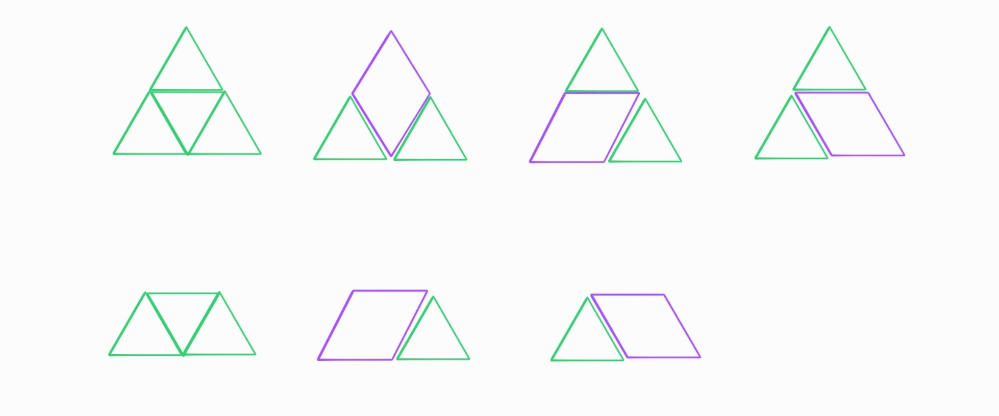
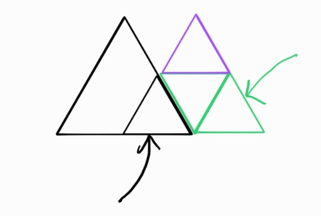
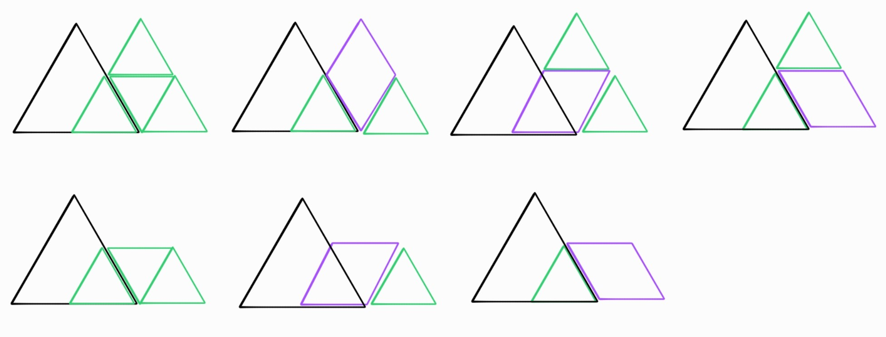
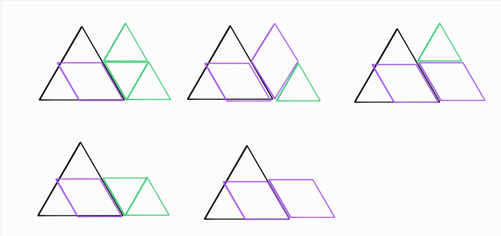
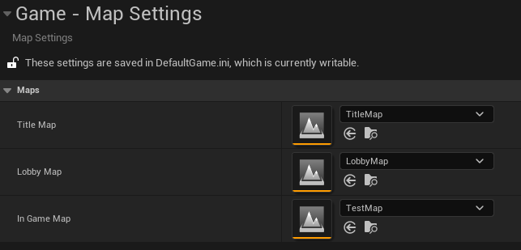
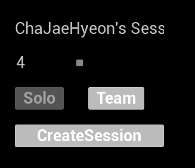
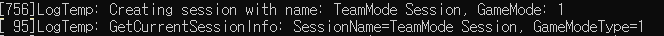
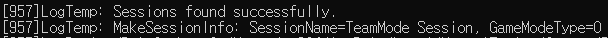
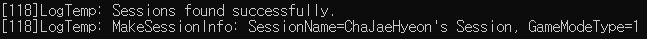

# 📅 2026-07-23 TIL

## 1. 오늘 학습 요약

* **학습 목표**: 
  * **코딩테스트** 문제풀이
  * **Travel Subsystem** 설계 
  * EOS **세션 설정** 기능 확장 
* **학습 도구**: `Unreal Engine 5.5.4`, `Visual Studio 2022`

* **활동 내용**: 
   * 프로그래머스 **[산 모양 타일링](https://school.programmers.co.kr/learn/courses/30/lessons/258705)** 풀이
  * **Travel Subsystem** 설계 과정
  * EOS **세션 설정** 기능 확장 
  * 세션 생성 시 게임 모드 타입 누락

---

## 2. 프로그래머스 문제 풀이

### [산 모양 타일링](https://school.programmers.co.kr/learn/courses/30/lessons/258705)

```cpp
#include <string>
#include <vector>

using namespace std;

int solution(int n, vector<int> tops) {
    vector<int> dpG(n, 0), dpP(n, 0);
    dpG[0] = 2 + tops[0];
    dpP[0] = 1;
    for(int i=1; i<n; i++){
        dpG[i] = (dpG[i-1] * (2+tops[i]) + dpP[i-1] * (1+tops[i])) % 10007;
        dpP[i] = (dpG[i-1] + dpP[i-1]) % 10007;
    }
    
    return (dpG[n-1] + dpP[n-1]) % 10007;
}
```

우선 `n = 1`인 경우를 생각해 보면 아래의 그림과 같이 **7개의 경우의 수**가 존재함



`n`이 `1` 증가하면 아래 그림과 같이 빈 타일이 추가 됨 (오른쪽의 초록색, 보라색 삼각형)



이 그림에서 **가운데에 있는 삼각형(검은색 화살표)** 이 초록색 타일인지, 보라색 타일인지에 따라서 **새 타일을 채우는 경우의 수가 달라짐**

또한, **가장 오른쪽에 있는 타일**(초록색 화살표)이 **다음 가운데 삼각형**이 됨

1. 가운데 타일이 **초록색**인 경우

	

	가운데 타일이 초록색인 경우 **7가지 모든 경우의 수**가 가능함 
	
	이중 다음 **오른쪽 끝 타일(다음 검은색 삼각형)** 이 초록색인 경우는 `3/2`가지, 보라색인 경우는 `1/1`가지 
	
	**(위에 삼각형이 있는 경우 / 위에 삼각형이 없는 경우)**

2. 가운데 타일이 **보라색**인 경우

	

	가운데 타일이 보라색인 경우 **5가지 경우의 수**가 가능함 
	
	이중 다음 **오른쪽 끝 타일(다음 검은색 삼각형)** 이 초록색인 경우는 `2/1`가지, 보라색인 경우는 `1/1`가지

따라서 점화식은 아래와 같음 (tops[i]는 위에 삼각형이 있는 경우 1이므로, 경우의 수를 하나 늘려줌)

```cpp
dpG[i] = dpG[i-1] * (2 + tops[i]) + dpP[i-1] * (1 + tops[i]) 
dpP[i] = dpG[i-1] + dpP[i-1]
```

---

## 3. Travel Subsystem 설계 및 EOS 세션 설정 기능 확장 

### 1. 맵 이동 관리 전담 서브시스템 (`TravelGameInstanceSubsystem`) 설계

#### 이전 코드의 문제점

기존 코드에서는 아래의 예시처럼 `ClientTravel` / `ServerTravel` 호출이 `SessionService`, `LobbyGameModeBase`와 같이 여러 클래스에 흩어진 구조를 갖고있었음

이러한 구조는 세션을 관리하는 `SessionService`가 **어느 맵으로 이동할지**까지 알고 있어야 했고, `LobbyGameModeBase`도 마찬가지로 **이동 로직과 맵을 포함**하고 있어야 함

각 클래스가 본연의 역할(세션 관리, 게임 진행 관리) 외에 맵 이동이라는 별개의 책임까지 떠안게 되면서 **단일 책임 원칙(SRP)이 깨짐**

이러한 구조는 코드의 분산 및 중복이 발생해 **테스트 및 디버깅이 어려워지며** 추후 다양한 맵 이동 로직이 추가되면 맵 이동 코드가 존재하는 모든 파일을 찾아 수정해야하기에 **확장성이 매우 떨어짐**

```cpp
// SessionService.cpp
void USessionService::OnJoinSessionComplete(FName SessionName, EOnJoinSessionCompleteResult::Type Result)
{
	if (Result == EOnJoinSessionCompleteResult::Success)
	{
		FString Connect;
		if (Session->GetResolvedConnectString(NAME_GameSession, Connect))
		{
			GetWorld()->GetFirstPlayerController()->ClientTravel(Connect, TRAVEL_Absolute);
		}
	}
}
```

```cpp
// LobbyGameModeBase.cpp
void ALobbyGameModeBase::UpdateMatchStartCountdown()
{
	// ...
			UWorld* World = GetWorld();
			if (IsValid(World))
			{
				if (InGameMap.IsNull() == false)
				{
					FString MapPath = InGameMap.GetLongPackageName();
					World->ServerTravel(MapPath + TEXT("?listen"));
				}
			}
    // ...
}
```

이러한 구조적 문제점을 해결하기 위해 **맵 이동만을 담당**하는 별도의 `UGameInstanceSubsystem`으로 분리

맵 이동은 레벨의 생명주기를 넘나드는 동작임 `GameInstanceSubsystem`은 게임 실행 중 단 하나의 인스턴스로 유지되므로 **레벨 이동 로직의 주체로 적합함**

#### 맵 경로 데이터 관리 (`UMapSettings`)

```cpp
// MapSettings.h


UCLASS(Config = Game, DefaultConfig, meta = (DisplayName = "Map Settings"))
class SPARTAARCADE_API UMapSettings : public UDeveloperSettings
{
	GENERATED_BODY()
	
public:
	UPROPERTY(Config, EditAnywhere, Category = "Maps")
	TSoftObjectPtr<UWorld> TitleMap;

	UPROPERTY(Config, EditAnywhere, Category = "Maps")
	TSoftObjectPtr<UWorld> LobbyMap;

	UPROPERTY(Config, EditAnywhere, Category = "Maps")
	TSoftObjectPtr<UWorld> InGameMap;
};

```



맵 경로를 `UMapSettings`라는 설정 데이터로 분리해 코드 수정 없이 **프로젝트 세팅에서 맵을 교체**할 수 있음

#### 레벨 이동 전담 서브시스템 (`UTravelGameInstanceSubsystem`)

```cpp
// TravelGameInstanceSubsystem.h

UCLASS()
class SPARTAARCADE_API UTravelGameInstanceSubsystem : public UGameInstanceSubsystem
{
	GENERATED_BODY()
	
public:
	virtual void Initialize(FSubsystemCollectionBase& Collection) override;
	void TravelToTitleMap();
	void TravelToLobbyMap();
	void TravelToSession(const FString& Connect);
	void TravelToInGameMap();

public:
	UPROPERTY(EditDefaultsOnly, Category = "Maps")
	TSoftObjectPtr<UWorld> TitleMap;

	UPROPERTY(EditDefaultsOnly, Category = "Maps")
	TSoftObjectPtr<UWorld> LobbyMap;

	UPROPERTY(EditDefaultsOnly, Category = "Maps")
	TSoftObjectPtr<UWorld> InGameMap;
};
```

```cpp
//TravelGameInstanceSubsystem.cpp

void UTravelGameInstanceSubsystem::Initialize(FSubsystemCollectionBase& Collection)
{
	Super::Initialize(Collection);

	const UMapSettings* MapSettings = GetDefault<UMapSettings>();
	if (IsValid(MapSettings))
	{
		TitleMap = MapSettings->TitleMap;
		LobbyMap = MapSettings->LobbyMap;
		InGameMap = MapSettings->InGameMap;
	}
}

void UTravelGameInstanceSubsystem::TravelToTitleMap()
{
	if (TitleMap.IsNull() == false)
	{
		FString MapPath = TitleMap.GetLongPackageName();
		APlayerController* PlayerController = GetGameInstance()->GetFirstLocalPlayerController();
		if (IsValid(PlayerController))
		{
			PlayerController->ClientTravel(MapPath, ETravelType::TRAVEL_Absolute);
		}
	}
}

void UTravelGameInstanceSubsystem::TravelToLobbyMap()
{
	UWorld* World = GetWorld();
	if (IsValid(World))
	{
		if (LobbyMap.IsNull() == false)
		{
			FString MapPath = LobbyMap.GetLongPackageName();
			World->ServerTravel(MapPath + TEXT("?listen"));
		}
	}
}

void UTravelGameInstanceSubsystem::TravelToSession(const FString& Connect)
{
	APlayerController* PlayerController = GetGameInstance()->GetFirstLocalPlayerController();
	if(IsValid(PlayerController))
	{
		PlayerController->ClientTravel(Connect, ETravelType::TRAVEL_Absolute);
	}
}

void UTravelGameInstanceSubsystem::TravelToInGameMap()
{
	UWorld* World = GetWorld();
	if (IsValid(World))
	{
		if (InGameMap.IsNull() == false)
		{
			FString MapPath = InGameMap.GetLongPackageName();
			World->ServerTravel(MapPath + TEXT("?listen"));
		}
	}
}
```

맵 이동이 필요한 지점에서는 맵 경로를 직접 다루지 않고, **서브시스템을 가져와 필요한 함수만 호출**하는 구조로 변경

```cpp
GetGameInstance()->GetSubsystem<UTravelGameInstanceSubsystem>()
```


이동 함수 실행 전 **유효성은 서브시스템 내부에서 검사**하므로, 호출하는 쪽은 유효성 검사를 신경 쓸 필요 없이 함수만 실행하면 됨

맵 이동 로직이 `UTravelGameInstanceSubsystem`에 모여 있어 **유지보수와 디버깅**이 쉬워짐 

이후 로딩 스크린 표시, 이동 실패 처리 등의 기능을 추가할 때 서브시스템 내부 한 곳만 수정하면 되므로 **확장성이 향상**됨


### 2. 이벤트 기반 레벨 전환 

#### 델리게이트 기반 비동기 콜백

```cpp
//SessionService.h

DECLARE_MULTICAST_DELEGATE_TwoParams(FOnCreateSessionCompleteEvent, FName, bool);
DECLARE_MULTICAST_DELEGATE_TwoParams(FOnSearchSessionCompleteEvent, bool, const TArray<FOnlineSessionSearchResult>&);
DECLARE_MULTICAST_DELEGATE_ThreeParams(FOnJoinSessionCompleteEvent, FName, EOnJoinSessionCompleteResult::Type, const FString&);
DECLARE_MULTICAST_DELEGATE_TwoParams(FOnDestroySessionCompleteEvent, FName, bool);

public:
	FOnCreateSessionCompleteEvent OnCreateSessionCompleteEvent;
	FOnSearchSessionCompleteEvent OnSearchSessionCompleteEvent;
	FOnJoinSessionCompleteEvent OnJoinSessionCompleteEvent;
	FOnDestroySessionCompleteEvent OnDestroySessionCompleteEvent;
```

세션 생성/검색/참가/파괴는 모두 EOS와의 비동기로 이루어지는 작업

이전에는 `SessionService`가 콜백 안에서 `ClientTravel` / `ServerTravel`까지 호출해려, **세션 관리 코드와 이동 코드가 한 함수에 존재**했었음

이를 개선하기 위해 SessionService는 성공/실패 여부와 결과 데이터만 **멀티캐스트 델리게이트로 브로드캐스트**

**어디로 이동할지** 판단하는 책임은 이 이벤트를 구독하는 `PlayerController`에게 위임 

`SessionService`는 **세션 통신 계층으로의 역할만 담당**하고, 이동 여부에 대한 결정과 실행은 `PlayerController`와 `TravelSubsystem`이 나눠서 맡는 구조

#### 세션 생성 완료 및 리슨 서버 전환

```cpp
// SessionService.cpp
void USessionService::OnCreateSessionComplete(FName SessionName, bool bWasSuccessful)
{
	if (bWasSuccessful)
	{
		OnCreateSessionCompleteEvent.Broadcast(SessionName, bWasSuccessful);
	}
}
```

```cpp
// TitlePlayerController.cpp
void ATitlePlayerController::HandleCreateSessionComplete(FName SessionName, bool bWasSuccessful)
{
	if (bWasSuccessful)
	{
		UTravelGameInstanceSubsystem* TravelSubsystem = GetGameInstance()->GetSubsystem<UTravelGameInstanceSubsystem>();
		if (IsValid(TravelSubsystem))
		{
			TravelSubsystem->TravelToLobbyMap();
		}
	}
}
```

#### 세션 검색 완료 및 세션 목록 출력

```cpp
// SessionService.cpp
void USessionService::OnFindSessionsComplete(bool bWasSuccessful)
{
	if (bWasSuccessful)
	{
		OnSearchSessionCompleteEvent.Broadcast(bWasSuccessful, Search->SearchResults);
	}
}
```

```cpp
// TitlePlayerController.cpp
void ATitlePlayerController::HandleJoinSessionComplete(FName SessionName, EOnJoinSessionCompleteResult::Type Result, const FString& Connect)
{
	UTravelGameInstanceSubsystem* TravelSubsystem = GetGameInstance()->GetSubsystem<UTravelGameInstanceSubsystem>();
	if(IsValid(TravelSubsystem))
	{
		TravelSubsystem->TravelToSession(Connect);
	}
}
```

#### 세션 참가 완료 및 클라이언트 접속

```cpp
// SessionService.cpp
void USessionService::OnJoinSessionComplete(FName SessionName, EOnJoinSessionCompleteResult::Type Result)
{
	if (Result == EOnJoinSessionCompleteResult::Success)
	{
		FString Connect;
		if(Session->GetResolvedConnectString(SessionName, Connect))
		{
			OnJoinSessionCompleteEvent.Broadcast(SessionName, Result, Connect);
		}
	}
}
```

```cpp
// TitlePlayerController.cpp
void ATitlePlayerController::HandleJoinSessionComplete(FName SessionName, EOnJoinSessionCompleteResult::Type Result, const FString& Connect)
{
	UTravelGameInstanceSubsystem* TravelSubsystem = GetGameInstance()->GetSubsystem<UTravelGameInstanceSubsystem>();
	if(IsValid(TravelSubsystem))
	{
		TravelSubsystem->TravelToSession(Connect);
	}
}
```

#### 세션 파괴 완료 및 타이틀 이동

```cpp
// SessionService.cpp
void USessionService::OnDestroySessionComplete(FName SessionName, bool bWasSuccessful)
{
	if (bWasSuccessful)
	{
		OnDestroySessionCompleteEvent.Broadcast(SessionName, bWasSuccessful);
	}
}
```

```cpp
// LobbyPlayerController.cpp
void ALobbyPlayerController::HandleDestroySessionComplete(FName SessionName, bool bWasSuccessful)
{
	if (bWasSuccessful)
	{
		UTravelGameInstanceSubsystem* TravelSubsystem = GetGameInstance()->GetSubsystem<UTravelGameInstanceSubsystem>();
		if (IsValid(TravelSubsystem))
		{
			TravelSubsystem->TravelToTitleMap();
		}
	}
}
```

이 구조의 핵심은 **각 계층이 하나의 역할만을 담당**한다는 것

통신 결과 통지(SessionService) → 정책 판단(PlayerController) → 실행(TravelSubsystem)

각 계층이 서로의 세부 구현을 몰라도 되고 나중에 맵 이동의 정책 변경이 있어도 `PlayerController`의 핸들러 함수만 수정하면 되며, `SessionService`나 `TravelSubsystem`은 수정을 필요로 하지 않음

### 3. EOS 세션 생성/검색 세부 옵션 기능 확장 (`SessionService`)

#### UI 바인딩용 세션 정보 구조체 (`FSessionInfo`) 선언 및 생성 함수
```cpp
// SessionService.h
USTRUCT(BlueprintType)
struct FSessionInfo
{
	GENERATED_BODY()

	UPROPERTY(EditAnywhere, BlueprintReadWrite)
	FString SessionName;

	UPROPERTY(EditAnywhere, BlueprintReadWrite)
	int32 CurrentPlayers = 1;

	UPROPERTY(EditAnywhere, BlueprintReadWrite)
	int32 MaxPlayers = 4;

	UPROPERTY(EditAnywhere, BlueprintReadWrite)
	bool bIsPrivate = false;

	UPROPERTY(EditAnywhere, BlueprintReadWrite)
	int32 GameModeType = static_cast<int32>(EGameModeType::Solo);
};
```

```cpp
// SessionService.cpp
FSessionInfo USessionService::MakeSessionInfo(const FOnlineSessionSearchResult& Result)
{
	FSessionInfo SessionInfo; 
	FString GameModeString;
	Result.Session.SessionSettings.Get(SessionKeys::SessionName, SessionInfo.SessionName);
	Result.Session.SessionSettings.Get(SessionKeys::GameMode, GameModeString);
	SessionInfo.GameModeType = FCString::Atoi(*GameModeString);
	SessionInfo.MaxPlayers = Result.Session.SessionSettings.NumPublicConnections;
	SessionInfo.CurrentPlayers = SessionInfo.MaxPlayers - Result.Session.NumOpenPublicConnections;
	return SessionInfo;
}
```

EOS의 `FOnlineSessionSearchResult`는 세션 설정값을 **키-값** 형태로 담고 있어 UI가 직접 다루기엔 번거로움

`MakeSessionInfo`에서 필요한 값만 뽑아 UI 친화적인 구조체로 변환

UI 계층은 온라인 서브시스템의 세부 API`(FOnlineSessionSearchResult)`를 전혀 몰라도 됨

#### 세션 설정 네임스페이스

```cpp
// SessionService.h
namespace SessionKeys
{
	static const FName SessionName = TEXT("SESSION_NAME");
	static const FName GameMode = TEXT("GAME_MODE");
	static const FName Private = TEXT("PRIVATE");
}
```

`FOnlineSessionSettings::Set()` / `Get()`은 키를 `FName`으로 직접 넘겨도 동작

그렇게 하면 `"SESSION_NAME"`, `"GAME_MODE"` 같은 문자열이 `Set()` 호출부와 `Get()` 호출부에 각각 따로 타이핑되어, 오타로 인해 값을 못 읽어와도 **디버깅이 어려움**

`SessionKeys` 네임스페이스로 **키 이름을 상수화**해두면, 실제 문자열은 이 한 곳에서만 관리되고 나머지 코드는 `SessionKeys::GameMode`처럼 심볼로 참조하게 되어 **오타로 인한 런타임 버그를 컴파일 타임에 방지**

#### 세션 옵션 생성

```cpp
void USessionService::CreateSession(FSessionInfo CreationSettings)
{
	if (!Session.IsValid())
	{
		return;
	}
	FOnlineSessionSettings Settings;
	Settings.bIsLANMatch = false;
	Settings.NumPublicConnections = CreationSettings.MaxPlayers;
	Settings.bShouldAdvertise = !CreationSettings.bIsPrivate;
	Settings.bUsesPresence = true;
	Settings.bUseLobbiesIfAvailable = true;
	Settings.Set(SEARCH_KEYWORDS, FString("SpartaArcade"), EOnlineDataAdvertisementType::ViaOnlineService);
	Settings.Set(SessionKeys::SessionName, CreationSettings.SessionName, EOnlineDataAdvertisementType::ViaOnlineService);
	Settings.Set(SessionKeys::GameMode, FString::FromInt(CreationSettings.GameModeType), EOnlineDataAdvertisementType::ViaOnlineService);
	Settings.Set(SessionKeys::Private, CreationSettings.bIsPrivate, EOnlineDataAdvertisementType::ViaOnlineService);
	Session->CreateSession(0, NAME_GameSession, Settings);
}
```

`SEARCH_KEYWORDS`를 "**SpartaArcade**"라는 고정 키워드로 지정해 검색 시 동일한 키워드로 검색하는 같은 게임을 사용하는 세션만 검색되도록 함

클라이언트에게 세션 정보를 전달하기 위해 `Settings.Set()`을 통해 **세션 이름**, **게임 모드**, **비밀 방 여부**를 설정

#### 세션 옵션 검색

```cpp
void USessionService::FindSessions()
{
	Search = MakeShared<FOnlineSessionSearch>();
	Search->bIsLanQuery = false;
	Search->MaxSearchResults = 20;
	Search->QuerySettings.Set(SEARCH_LOBBIES, true, EOnlineComparisonOp::Equals);
	Search->QuerySettings.Set(SEARCH_KEYWORDS, FString(TEXT("SpartaArcade")), EOnlineComparisonOp::Equals);
	Search->QuerySettings.Set(SessionKeys::Private, false, EOnlineComparisonOp::Equals);

	Session->FindSessions(0, Search.ToSharedRef());
}
```

`FindSessions`에서 동일한 키워드로 필터링함으로써 **같은 게임을 사용하는 세션만 검색**

`SessionKeys::Private`이 `false`로 고정 검색해 공개 세션만 노출되도록 함

### 4. 실행 이미지

### 세션 설정



### 세션 검색


### 5. 트러블 슈팅: 세션 생성 시 게임 모드 타입이 누락되는 문제

#### 문제 상황

세션 생성 시 게임 모드 타입을 팀전으로 생성할 경우 **클라이언트의 UI 출력에 Solo로 표시**되는 문제가 발생

USessionService의 `CreateSession()`, `GetCurrentSessionInfo()`, `MakeSessionInfo()` 함수들에 로그를 추가해 확인한 결과 서버에게는 게임 모드가 정상적으로 `Team(1)`으로 저장되었지만 클라이언트에게는 `Solo(0)`로 전달됨

로컬(호스트)에서 값을 설정하는 시점까지 문제가 없었지만, 그 값을 세션 검색을 통해 다시 읽어오는 **클라이언트 쪽에서는 값이 유실**됨을 확인

* **서버**

	

* **클라이언트**

	

	

#### 원인

원인은 EOS가 `int32` 타입이 **지원하지 않는 세션 어트리뷰트 타입**이라는 것이었음

EOS 세션 어트리뷰트는 `bool`, `int64`, `double`, `string` 네 가지의 타입만 지원 [[1]](https://dev.epicgames.com/docs/epic-online-services/multiplayer/lobbies-and-sessions/sessions-interface/modify-a-session) [[2]](https://docs.redpoint.games/docs/ossv1/sessions/attributes/)

하지만 `FOnlineSessionSettings::Set()`은 `int32`도 템플릿, 오버로드를 제공하기에 **컴파일 에러가 발생하지 않음**

```cpp
// OnlineSessionSettings.cpp
template ONLINESUBSYSTEM_API void FOnlineSessionSettings::Set(FName Key, const int32& Value, EOnlineDataAdvertisementType::Type InType);

template ONLINESUBSYSTEM_API bool FOnlineSessionSettings::Get(FName Key, int32& Value) const;
```

결국 EOS가 지원하지 않는 `int32` 타입은 **광고되지 않고 기본값인 0이 채워진 것**

#### 해결 방법

`GameModeType`을 EOS가 확실하게 지원하는 `String` 타입으로 변환해 Set/Get을 통일

EOS는 `int64`를 지원하지만 해당 세션 데이터는 UI와 연동되는 데이터이므로 **WBP와 연동이 제한적인** `int64` 대신 `String` 타입을 사용

해당 방법을 적용하니 클라이언트에게도 게임 모드가 정상적으로 전달됨

```cpp
// USessionService::CreateSession(FSessionInfo CreationSettings)
Settings.Set(SessionKeys::GameMode, FString::FromInt(CreationSettings.GameModeType), EOnlineDataAdvertisementType::ViaOnlineService);
```

```cpp
// USessionService::MakeSessionInfo(const FOnlineSessionSearchResult& Result)
FString GameModeString;
Result.Session.SessionSettings.Get(SessionKeys::GameMode, GameModeString);
SessionInfo.GameModeType = FCString::Atoi(*GameModeString);
```

* **클라이언트**

	

	