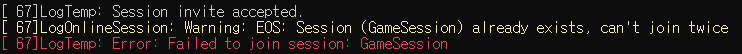
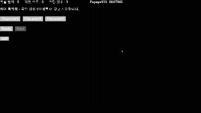
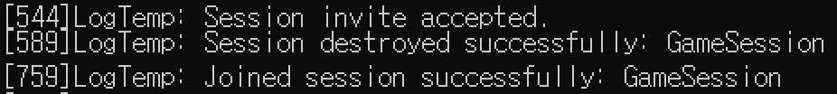

# 📅 2026-07-24 TIL

## 1. 오늘 학습 요약

* **학습 목표**: 
  * EOS **세션 초대** 기능 확장 

* **학습 도구**: `Unreal Engine 5.5.4`, `Visual Studio 2022`

* **활동 내용**: 
  * EOS **세션 초대** 기능 확장
  * 초대 수락 처리

---

## 2. Epic Online Services(EOS) 세션 초대 기능 구현

### 1. Epic 오버레이 초대를 위한 EOS 설정

```ini
# Config/DefaultEngine.ini
[/Script/OnlineSubsystemEOS.EOSSettings]
bEnableOverlay=True          # 오버레이 UI 자체 활성화
bEnableSocialOverlay=True    # 오버레이 내 친구 목록/초대 UI 활성화
AuthScopeFlags=BasicProfile
AuthScopeFlags=FriendsList   # 친구 목록 접근 권한
AuthScopeFlags=Presence      # Presence 정보 접근 권한
bUseEAS=True                 # Epic Account Services 연동
bUseEOSSessions=True         # EOS 세션 기능 활성화
bMirrorPresenceToEAS=True
```

`bMirrorPresenceToEAS`는 EOS의 Presence 상태를 Epic Account Services(EAS)로도 전달할지 결정하는 플래그

이 값이 꺼져있으면 게임 내부적으로는 세션에 들어가 있어도 Epic 오버레이(친구 목록 UI)에는 상태가 반영되지 않아 **초대 버튼 자체가 노출되지 않음**

### 2. 세션 옵션 확장: 초대 허용 (`SessionService`)

```cpp
// SessionService.cpp - CreateSession()
Settings.bUsesPresence = true;
Settings.bAllowJoinViaPresence = true;
Settings.bUseLobbiesIfAvailable = true;
Settings.bAllowInvites = true;
```

`bAllowJoinViaPresence`는 Presence 정보만으로 세션 참가를 허용하는 옵션으로, 별도의 세션 검색 없이도 **친구가 하는 게임에 바로 참가**할 수 있게 함

`bAllowInvites`는 이 세션에 초대를 보낼 수 있는지 여부를 결정하는 옵션으로, 두 옵션이 꺼져 있으면 오버레이의 초대 버튼이 비활성화됨

### 3. 트러블 슈팅: 초대 수락 처리 (`OnSessionInviteAccepted`)

#### 문제 상황

오버레이에서 초대를 수락하면 `OnSessionUserInviteAcceptedDelegate`가 호출되는데, 이 시점에 플레이어가 **이미 다른 세션에 참여 중일 수 있음**

Unreal의 온라인 세션은 동시에 두 개를 유지할 수 없기 때문에, 기존 세션을 정리하지 않고 곧바로 `JoinSession`을 호출하면 참가가 실패함




#### 해결 방법

```cpp
// SessionService.h
TSharedPtr<FOnlineSessionSearchResult> InviteSession;
bool bPendingJoinAfterDestroy;
```

먼저 두 개의 멤버 변수를 추가

* `InviteSession`: 초대로 받은 세션 검색 결과를 임시로 들고 있는 변수. `DestroySession`이 비동기라 그 결과가 돌아올 때까지 어딘가에 보관해둬야 함

* `bPendingJoinAfterDestroy`: 지금 진행 중인 세션 파괴가 **초대 참가를 위한 파괴인지 구분하는 플래그**

```cpp
// SessionService.cpp
void USessionService::OnSessionInviteAccepted(const bool bWasSuccessful, int32 ControllerId,
	TSharedPtr<const FUniqueNetId> UserId, const FOnlineSessionSearchResult& InviteResult)
{
	if (bWasSuccessful && InviteResult.IsValid())
	{
		InviteSession = MakeShared<FOnlineSessionSearchResult>(InviteResult);
		if (Session.IsValid())
		{
			if (Session->GetNamedSession(NAME_GameSession))
			{
				Session->DestroySession(NAME_GameSession);
				bPendingJoinAfterDestroy = true;
			}
			else
			{
				JoinSession(InviteResult);
			}
		}
	}
}
```

초대 수락 시 동작 순서는 다음과 같음

1. 초대 수락 델리게이트가 호출되면 `InviteResult`를 `InviteSession`에 보관

2. `GetNamedSession(NAME_GameSession)`으로 **현재 참여 중인 세션이 있는지** 확인

3. 세션이 있으면 `DestroySession`을 호출하고 `bPendingJoinAfterDestroy = true`로 표시만 해둔 채 함수를 종료. 이 시점에는 아직 참가 요청을 보내지 않음

4. 세션이 없으면 기존 세션과 충돌할 일이 없으므로 `JoinSession`을 바로 호출

```cpp
// SessionService.cpp
void USessionService::OnDestroySessionComplete(FName SessionName, bool bWasSuccessful)
{
	if (bWasSuccessful)
	{
		OnDestroySessionCompleteEvent.Broadcast(SessionName, bWasSuccessful);
		if (bPendingJoinAfterDestroy && InviteSession.IsValid())
		{
			JoinSession(*InviteSession);
			InviteSession = nullptr;
			bPendingJoinAfterDestroy = false;
		}
	}
}
```

`OnDestroySessionComplete` 콜백은 유저가 직접 나가기를 누른 경우 등 **초대와 무관한 상황에서도 호출**되므로, `bPendingJoinAfterDestroy` 플래그로 "지금 파괴가 초대 참가를 위한 것이었는지"를 구분

플래그가 켜져 있고 `InviteSession`도 유효하면, 보관해뒀던 `InviteSession`으로 `JoinSession`을 호출하고 두 변수를 모두 초기화해 다음 초대를 받을 준비를 마침


최종 흐름은 아래와 같음

```
초대 수락
   │
   ▼
InviteResult 보관
   │
   ▼
기존 세션 있음? ──아니오──▶ 곧바로 JoinSession
   │ 예
   ▼
DestroySession 요청 + bPendingJoinAfterDestroy = true
   │
   ▼
OnDestroySessionComplete 콜백
   │
   ▼
bPendingJoinAfterDestroy 확인 ──▶ 저장해둔 InviteResult로 JoinSession
```




