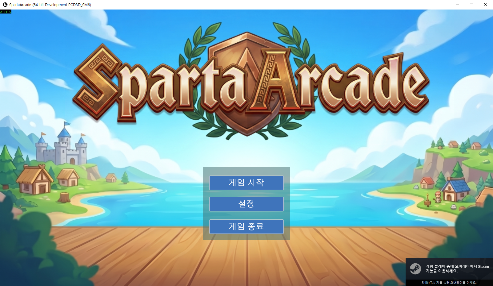
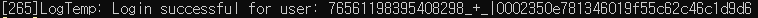
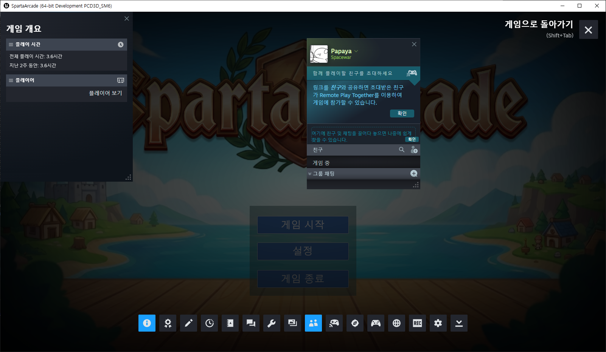
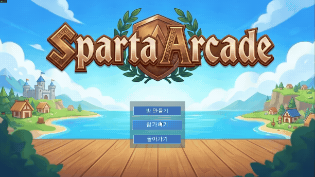
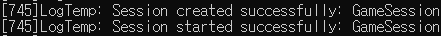
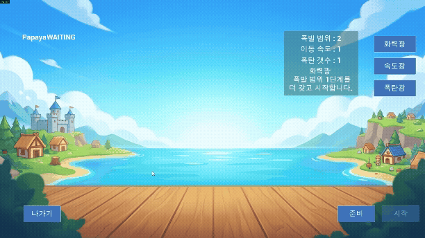
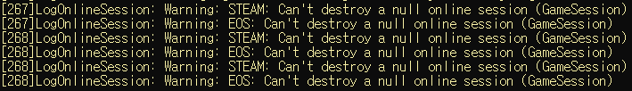
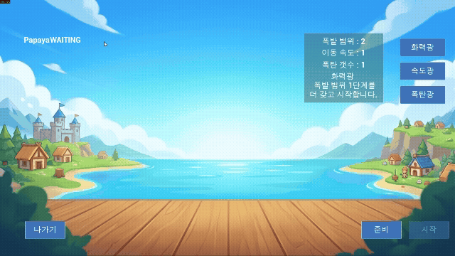
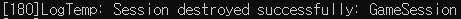

# 📅 2026-07-27 TIL

## 1. 오늘 학습 요약

* **학습 목표**: 
  * **코딩테스트** 문제풀이
  * **EOSPlus** 기반 Steam 계정 연동
  
* **학습 도구**: `Unreal Engine 5.5.4`, `Visual Studio 2022`

* **활동 내용**: 
  * 프로그래머스 **[[PCCE 기출문제] 9번 / 지폐 접기](https://school.programmers.co.kr/learn/courses/30/lessons/340199)**, **[[PCCP 기출문제] 1번 / 붕대 감기](https://school.programmers.co.kr/learn/courses/30/lessons/250137)** 풀이
  * **EOSPlus** 기반 Steam 계정 연동
  * **EOSPlus** DestroySession **콜백 미호출** 트러블 슈팅
---

## 2. 프로그래머스 문제 풀이

### [[PCCE 기출문제] 9번 / 지폐 접기](https://school.programmers.co.kr/learn/courses/30/lessons/340199)

```cpp
#include <string>
#include <vector>

using namespace std;

int solution(vector<int> wallet, vector<int> bill) {
    int answer = 0;
    while(!(bill[0] <= wallet[0] && bill[1] <= wallet[1]) && 
          !(bill[0] <= wallet[1] && bill[1] <= wallet[0])){
        answer++;
        if(bill[0] < bill[1]) bill[1] /= 2;
        else bill[0] /= 2;
    }
    return answer;
}
```

* **구현** 문제
* 매번 더 긴 변을 기준으로 접으면 됨

---

### [[PCCP 기출문제] 1번 / 붕대 감기](https://school.programmers.co.kr/learn/courses/30/lessons/250137)

```cpp
#include <string>
#include <vector>

using namespace std;

int solution(vector<int> bandage, int health, vector<vector<int>> attacks) {
    int answer = 0;
    int MaxHealth = health;
    int last = 0;
    for(int i=0; i<attacks.size(); i++){
        int time = attacks[i][0] - last - 1;
        last = attacks[i][0];
        health = min(health + (time*bandage[1]) + (time/bandage[0]*bandage[2]), MaxHealth);
        health -= attacks[i][1];
        if(health <= 0) return -1;
    }
    return health;
}
```

* **구현** 문제
* 게임의 최대 체력 로직을 적용해서 푸는 문제

---

## 3. EOSPlus 기반 Steam 계정 연동

### 1. EOS 단독 구성의 한계

기존 프로젝트는 `DefaultPlatformService=EOS` 구성으로, **Epic 계정(EAS)** 또는 **Developer Auth Tool(DAT)** 로만 로그인이 가능한 상태였음

이 구성에서는 다음과 같은 문제가 있었음

* 팀원이 테스트할 때마다 각자 DAT를 실행하고 Epic 계정을 연결해야 함

* 패키징한 빌드에서는 `AutoLogin`이 EAS의 **Account Portal** 방식으로 동작해, 실행할 때마다 오버레이로 뜨는 Epic 계정 로그인 창에 직접 로그인해야 함

즉 에디터에서는 DAT, 빌드에서는 Account Portal이라는 **별도의 인증 절차를 항상 거쳐야 하는 구조**

**아직 스토어에 등록되지 않은 게임을 별도의 로그인 절차 없이 간편하게 인증하기 위해** Steam을 도입

Steam 클라이언트는 이미 로그인된 상태로 실행되어 있으므로, 그 세션을 그대로 인증 수단으로 사용하면 **게임 실행만으로 로그인이 완료됨**

**Steam 계정으로 로그인하고 EOS의 세션 기능은 그대로 사용하는** 구조가 필요했음

이를 담당하는 것이 **EOSPlus**로, EOSPlus는 독립적인 온라인 서브시스템이 아니라 **EOS와 네이티브 플랫폼(Steam)을 하나로 묶어주는 래퍼 서브시스템**

```
[ EOSPlus ]  ← DefaultPlatformService
     │
     ├──► [ Steam ]  : 네이티브 플랫폼 인증 (NativePlatformService)
     └──► [ EOS ]    : EOS Connect / Sessions / P2P
```

로그인은 Steam이 담당하고, 그 인증 결과를 **EOS Connect**로 넘겨 EOS 식별자를 발급받는 흐름

### 2. 플러그인 및 모듈 등록

#### `.uproject` 플러그인 활성화

```json
{
  "Plugins": [
    {
      "Name": "OnlineSubsystemSteam",
      "Enabled": true
    },
    {
      "Name": "OnlineSubsystemEOS",
      "Enabled": true
    }
  ]
}
```

#### `Build.cs` 모듈 등록

```csharp
PublicDependencyModuleNames.AddRange(new string[] {
    // ...
    "OnlineSubsystem", "OnlineSubsystemEOS", "OnlineSubsystemUtils",
    // ...
});

// Steam은 런타임에 필요할 때 로드되므로 동적 로드 모듈로 등록
DynamicallyLoadedModuleNames.Add("OnlineSubsystemSteam");
```

`OnlineSubsystemSteam`은 `PublicDependencyModuleNames`가 아닌 **`DynamicallyLoadedModuleNames`** 에 등록

C++ 코드에서 Steam의 헤더를 직접 include하지 않고 `IOnlineSubsystem` 인터페이스로만 접근하기 때문에, **컴파일 타임 의존성 없이 런타임에만 로드**되면 충분함

### 3. `DefaultEngine.ini` EOSPlus / Steam 설정

```ini
[OnlineSubsystem]
;DefaultPlatformService=EOS
DefaultPlatformService=EOSPlus  ; 기본 플랫폼을 EOSPlus로 교체
NativePlatformService=Steam     ; EOSPlus가 인증에 사용할 네이티브 플랫폼

[OnlineSubsystemEOSPlus]
bEnabled=true

[OnlineSubsystemEOS]
bEnabled=true

[OnlineSubsystemSteam]
bEnabled=true
SteamDevAppId=480               ; Spacewar(테스트용 공개 AppId)
bInitServerOnClient=true        ; 리슨 서버 구조이므로 클라이언트에서도 서버 기능 초기화

[/Script/OnlineSubsystemEOS.NetDriverEOS]
bIsUsingP2PSockets=True

[/Script/OnlineSubsystemUtils.OnlineEngineInterfaceImpl]
+CompatibleUniqueNetIdTypes=EOS
+CompatibleUniqueNetIdTypes=EOSPlus
```

`SteamDevAppId=480`은 Valve가 테스트용으로 공개한 **Spacewar**의 AppId로, 자체 AppId를 발급받기 전까지 Steam 인증 흐름을 검증하는 용도

`bInitServerOnClient=true`는 클라이언트 프로세스에서도 Steam 서버 기능을 초기화하는 옵션으로, **리슨 서버는 클라이언트가 곧 서버**이기 때문에 필요함

#### EAS 비활성화

```ini
[/Script/OnlineSubsystemEOS.EOSSettings]
;bUseEAS=True
bUseEAS=False           ; Epic 계정 로그인 비활성화
bUseEOSConnect=True     ; Steam 계정 -> EOS 식별자 연동 사용
bUseEOSSessions=True
bMirrorPresenceToEAS=True
```

`bUseEAS=True`인 상태에서는 Steam으로 로그인하더라도 **Epic 계정 로그인을 추가로 요구**함

Steam 계정만으로 로그인을 완결시키기 위해 EAS를 끄고, **EOS Connect** 경로만 사용하도록 변경

### 4. 게임 실행 시점 자동 로그인

#### 로그인 시점 이동 (`EOSGameInstanceSubsystem`)

```cpp
// EOSGameInstanceSubsystem.cpp
void UEOSGameInstanceSubsystem::Initialize(FSubsystemCollectionBase& Collection)
{
    Super::Initialize(Collection);

    AuthService = NewObject<UAuthService>(this);
    SessionService = NewObject<USessionService>(this);
    OnlineSubsystem = IOnlineSubsystem::Get();

    if(!OnlineSubsystem)
    {
        return;
    }

    AuthService->Initialize(OnlineSubsystem);
    SessionService->Initialize(OnlineSubsystem);

    AuthService->Login("");   // 게임 인스턴스 생성 시점에 로그인 요청
}
```

```cpp
// TitlePlayerController.h
#if WITH_EDITOR || UE_BUILD_DEBUG
	UFUNCTION(Exec)
	void DevLogin(const FString& InAuthToken);
#endif
```

```cpp
// TitlePlayerController.cpp
#if WITH_EDITOR || UE_BUILD_DEBUG
void ATitlePlayerController::DevLogin(const FString& InAuthToken)
{
	UE_LOG(LogTemp, Log, TEXT("DevLogin called with AuthToken: %s"), *InAuthToken);
	UEOSGameInstanceSubsystem* EOSSubsystem = GetGameInstance()->GetSubsystem<UEOSGameInstanceSubsystem>();
	if (IsValid(EOSSubsystem))
	{
		EOSSubsystem->GetAuthService()->Login(InAuthToken);
	}
}
#endif
```

기존에는 `TitlePlayerController`에 개발용 Exec 함수를 두고, 콘솔에서 `DevLogin <토큰>`을 직접 입력해 로그인하는 구조였음

Steam 자동 로그인은 사용자 입력이 필요 없으므로, **게임 인스턴스 초기화 시점에 로그인을 시작**해 타이틀 UI가 뜨는 시점에는 이미 인증이 끝나 있도록 변경

이로써 별도의 로그인 입력 없이 곧바로 세션 생성/검색이 가능해짐

#### 빌드 구성별 인증 경로 분기 (`AuthService`)

```cpp
// AuthService.cpp
void UAuthService::Login(const FString& AuthToken)
{
    if (!Identity.IsValid())
    {
        return;
    }

#if WITH_EDITOR || UE_BUILD_DEBUG
    // 에디터 / Debug 빌드: EOS Developer Auth Tool 이용
    FOnlineAccountCredentials Credentials;
    Credentials.Type = TEXT("developer");
    Credentials.Id = TEXT("localhost:6300");
    Credentials.Token = AuthToken;

    Identity->Login(0, Credentials);
#else
    // 패키징 빌드: Steam 계정으로 자동 로그인
    Identity->AutoLogin(0);
#endif
}
```

에디터와 Debug 빌드에서만 개발자 인증을 사용하고 **패키징 빌드는 `AutoLogin(0)`으로 Steam 계정을 사용**

### 5. 실행 이미지

#### Steam 계정 자동 로그인

게임 실행과 동시에 Steam 계정으로 로그인이 완료되며, 별도의 로그인 입력 절차가 없음





#### Steam 오버레이

`SteamDevAppId=480`으로 Spacewar AppId를 사용해, 게임 내에서 Steam 오버레이가 정상적으로 표시됨



#### 세션 생성 및 로비 진입

Steam 계정으로 인증된 상태에서 EOS 세션이 생성되고, 리슨 서버 형태의 로비 맵으로 이동함





---

### 6. 트러블 슈팅: 로비 퇴장 시 세션 파괴 콜백 미호출

#### 문제 상황

EOSPlus로 전환한 직후부터, 로비에서 **나가기를 눌러도 아무 반응이 없는** 문제가 발생





* 화면이 로비에 그대로 멈춰 있고 타이틀 맵으로 복귀하지 않음

* `OnDestroySessionComplete()` 내부의 `UE_LOG`가 **성공/실패 어느 쪽도 출력되지 않음**

* 세션 자체는 정상적으로 파괴되어, 나가기 버튼을 다시 클릭하면 파괴할 세션이 없다는 로그가 출력됨

즉 **세션은 지워지지만 완료 콜백만 오지 않는** 상태

`OnDestroySessionCompleteEvent`가 브로드캐스트되지 않으므로 이 이벤트를 구독하는 `LobbyPlayerController`의 타이틀 이동 처리도 실행되지 않았음

EOS 단독 구성일 때는 정상 동작하던 코드이므로, 로그가 아예 출력되지 않는다는 점에서 **콜백 자체가 호출되지 않는다**고 판단

#### 원인

#### 1. 완료 통지의 두 가지 경로

`IOnlineSession::DestroySession()`의 완료 통지에는 두 가지 경로가 존재함

```cpp
// OnlineSessionInterface.h
// 1. 호출 시 인자로 전달하는 완료 델리게이트
virtual bool DestroySession(FName SessionName, const FOnDestroySessionCompleteDelegate& CompletionDelegate = FOnDestroySessionCompleteDelegate()) = 0;

// 2. 인터페이스에 등록해두는 델리게이트 리스트
DEFINE_ONLINE_DELEGATE_TWO_PARAM(OnDestroySessionComplete, FName, bool);
```

* **1.** `DestroySession(SessionName, CompletionDelegate)`로 전달 -> 구현체가 완료 시점에 `CompletionDelegate.ExecuteIfBound()`로 실행

* **2.** `AddOnDestroySessionCompleteDelegate_Handle()`로 등록 -> 구현체가 `TriggerOnDestroySessionCompleteDelegates()`를 호출해 실행


기존에는 2번 방법으로 `USessionService::OnDestroySessionComplete()` 함수를 호출함

여기서 중요한 점은 **2번 방법의 델리게이트가 전역이 아니라 인터페이스 인스턴스별 멤버**라는 것

`DEFINE_ONLINE_DELEGATE_TWO_PARAM` 매크로는 해당 클래스에 델리게이트 리스트 멤버와 `AddOnXXX_Handle()` / `TriggerOnXXXDelegates()`를 함께 생성함

따라서 **등록한 인터페이스 객체**와 **트리거 하는 인터페이스 객체**가 일치해야 콜백이 도달함

#### 2. EOS, EOSPlus의 `DestroySession` 구현

```cpp
// OnlineSessionEOS.cpp
bool FOnlineSessionEOS::DestroySession(FName SessionName, const FOnDestroySessionCompleteDelegate& CompletionDelegate)
{
    // ...

	CompletionDelegate.ExecuteIfBound(SessionName, false);
	TriggerOnDestroySessionCompleteDelegates(SessionName, false);

    // ...
}
```

```cpp
// OnlineSessionEOSPlus.cpp
FOnDestroySessionCompleteDelegate IgnoredDestroySessionDelegate;

bool FOnlineSessionEOSPlus::DestroySession(FName SessionName, const FOnDestroySessionCompleteDelegate& CompletionDelegate)
{
	if (bUseEOSSessions)
	{
		if (!EOSSessionInterface->DestroySession(SessionName, CompletionDelegate))
		{
			return false;
		}
	}

#if CREATE_MIRROR_PLATFORM_SESSION
	return BaseSessionInterface->DestroySession(SessionName, IgnoredDestroySessionDelegate);
#else
	return true;
#endif
}
```

`USessionService`의 `IOnlineSubsystem::Get()->GetSessionInterface()`가 반환하는 것은 `FOnlineSessionEOSPlus`

따라서 `USessionService` 등록한 델리게이트는 **EOSPlus 인스턴스의 리스트**에 들어가는데, 실제 완료 통지인 `TriggerOnDestroySessionCompleteDelegates` 함수는 그 아래 `FOnlineSessionEOS`에서만 호출

해당 신호는 `FOnlineSessionEOSPlus`까지만 도달하고 EOSPlus 리스트에 등록된 델리게이트는 **트리거되지 않아 `USessionService`까지 신호가 오지 않는 것**

#### 3. Create / Join은 되는데 Destroy만 안 되는 이유

`FOnlineSessionEOSPlus`는 하위 인터페이스인 `FOnlineSessionEOS`의 완료 델리게이트를 구독해 **자신의 함수를 호출**하도록 등록해 둠

```cpp
// OnlineSessionEOSPlus.h
void OnCreateSessionComplete(FName SessionName, bool bWasSuccessful);
void OnCreateSessionComplete(FName SessionName, bool bWasSuccessful);
void OnStartSessionComplete(FName SessionName, bool bWasSuccessful);
void OnUpdateSessionComplete(FName SessionName, bool bWasSuccessful);
void OnEndSessionComplete(FName SessionName, bool bWasSuccessful);
void OnFindSessionsComplete(bool bWasSuccessful);
void OnCancelFindSessionsComplete(bool bWasSuccessful);
void OnPingSearchResultsComplete(bool bWasSuccessful);
void OnJoinSessionComplete(FName SessionName, EOnJoinSessionCompleteResult::Type JoinResult);
void OnFindFriendSessionComplete(int32 LocalPlayerNum, bool bWasSuccessful, const TArray<FOnlineSessionSearchResult>& Results);
```

```cpp
// OnlineSessionEOSPlus.cpp
BaseSessionInterface->AddOnSessionUserInviteAcceptedDelegate_Handle(... &FOnlineSessionEOSPlus::OnSessionUserInviteAcceptedBase));
BaseSessionInterface->AddOnSessionInviteReceivedDelegate_Handle(... &FOnlineSessionEOSPlus::OnSessionInviteReceivedBase));
BaseSessionInterface->AddOnCreateSessionCompleteDelegate_Handle(... &FOnlineSessionEOSPlus::OnCreateSessionComplete));

IOnlineSessionPtr PrimaryInterface = BaseSessionInterface;
if (bUseEOSSessions)
{
	PrimaryInterface = EOSSessionInterface;

	EOSSessionInterface->AddOnSessionUserInviteAcceptedDelegate_Handle(..., &FOnlineSessionEOSPlus::OnSessionUserInviteAcceptedEOS));
	EOSSessionInterface->AddOnSessionInviteReceivedDelegate_Handle(... &FOnlineSessionEOSPlus::OnSessionInviteReceivedEOS));
}

PrimaryInterface->AddOnSessionFailureDelegate_Handle(... &FOnlineSessionEOSPlus::OnSessionFailure));
PrimaryInterface->AddOnStartSessionCompleteDelegate_Handle(... &FOnlineSessionEOSPlus::OnStartSessionComplete));
PrimaryInterface->AddOnUpdateSessionCompleteDelegate_Handle(... &FOnlineSessionEOSPlus::OnUpdateSessionComplete));
PrimaryInterface->AddOnEndSessionCompleteDelegate_Handle(... &FOnlineSessionEOSPlus::OnEndSessionComplete));
PrimaryInterface->AddOnFindSessionsCompleteDelegate_Handle(... &FOnlineSessionEOSPlus::OnFindSessionsComplete));
PrimaryInterface->AddOnCancelFindSessionsCompleteDelegate_Handle(... &FOnlineSessionEOSPlus::OnCancelFindSessionsComplete));
PrimaryInterface->AddOnPingSearchResultsCompleteDelegate_Handle(... &FOnlineSessionEOSPlus::OnPingSearchResultsComplete));
PrimaryInterface->AddOnJoinSessionCompleteDelegate_Handle(... &FOnlineSessionEOSPlus::OnJoinSessionComplete));
```

```cpp
// OnlineSessionEOSPlus.cpp
void FOnlineSessionEOSPlus::OnCreateSessionComplete(FName SessionName, bool bWasSuccessful)
{
	// ...
	TriggerOnCreateSessionCompleteDelegates(SessionName, bWasSuccessful);
}
```

등록된 핸들러는 EOSPlus에서 델리게이트를 다시 트리거해 `USessionService`에게 신호를 보냄

하지만 **Destroy만 등록이 빠져 있어**, 다른 세션 이벤트는 기존 방식으로도 모두 정상 동작하는데 세션 파괴만 콜백이 오지 않았던 것

#### 4. 기존 코드가 동작하지 않은 이유

```cpp
// SessionService.cpp
// 2번 방법으로 등록 -> EOSPlus가 트리거하지 않아 신호가 오지 않음
Session->AddOnDestroySessionCompleteDelegate_Handle(
    FOnDestroySessionCompleteDelegate::CreateUObject(this, &USessionService::OnDestroySessionComplete));

// DestroySession() — 인자 없는 오버로드 -> 기본 인자인 빈 델리게이트가 전달되어
// CompletionDelegate.ExecuteIfBound(SessionName, false)의 콜백이 호출되지 않음
Session->DestroySession(NAME_GameSession);
```

양쪽 어느 경로로도 콜백이 도달하지 않아 `USessionService::OnDestroySessionComplete()`가 호출되지 않음

기존의 `FOnlineSessionEOS`는 2번 방법을 정상적으로 트리거하기 때문에 정상적으로 동작

#### 해결 방법

완료 델리게이트를 **`USessionService`의 멤버 변수로 보관**하고, `DestroySession()` 호출 시 인자로 함께 전달해 1번 방법으로 콜백을 수신하도록 수정

```cpp
// SessionService.h
private:
    FOnDestroySessionCompleteDelegate SessionDestroyComplete;
```

```cpp
// SessionService.cpp
void USessionService::Initialize(IOnlineSubsystem* InOnlineSubsystem)
{
    // ...
    //Session->AddOnDestroySessionCompleteDelegate_Handle(
    //    FOnDestroySessionCompleteDelegate::CreateUObject(this, &USessionService::OnDestroySessionComplete));
    SessionDestroyComplete.BindUObject(this, &USessionService::OnDestroySessionComplete);
    // ...
}

void USessionService::DestroySession()
{
    if (!Session.IsValid())
    {
        return;
    }

    //Session->DestroySession(NAME_GameSession);
    Session->DestroySession(NAME_GameSession, SessionDestroyComplete);
}
```

#### 인자로 넘기면 호출되는 이유

기존 방법은 EOSPlus 인스턴스의 리스트에서 트리거되지 않았지만, 1번 방법은 **인자를 타고 하위 EOS 인터페이스까지 내려가 `SessionDestroyComplete`를 직접적으로 실행하기 때문**

```
Session->DestroySession(NAME_GameSession, SessionDestroyComplete)
   │
   ▼
FOnlineSessionEOSPlus::DestroySession(SessionName, CompletionDelegate)
   │  트리거 없이 인자를 그대로 전달
   ▼
FOnlineSessionEOS::DestroySession(SessionName, CompletionDelegate)
   │  람다 캡처로 델리게이트를 보관한 채 비동기 요청
   ▼
EOS SDK 파괴 완료
   │
   ├──► CompletionDelegate.ExecuteIfBound()          -> SessionDestroyComplete 실행 
   └──► TriggerOnDestroySessionCompleteDelegates()   -> EOS 인터페이스의 리스트
```

`FOnlineSessionEOS`는 완료 시점에 두 경로를 **모두** 실행함

`CompletionDelegate`가 **람다에 값으로 캡처**되어 비동기 완료 시점에 `ExecuteIfBound()`로 실행됨

1번 방법은 EOSPlus뿐 아니라 **EOS 단독 / Steam 단독 구성에서도 동일하게 동작**하므로, 서브시스템 교체에 영향받지 않는 이식성 있는 해법

#### 최종 흐름

수정 후에는 나가기 -> `OnDestroySessionComplete()` 호출 -> `OnDestroySessionCompleteEvent` 브로드캐스트 -> `LobbyPlayerController`의 타이틀 맵 이동까지 정상적으로 이어짐

```
나가기 버튼
   │
   ▼
DestroySession(NAME_GameSession, SessionDestroyComplete)
   │
   ▼
EOSPlus -> 하위 EOS 인터페이스로 델리게이트 전달
   │
   ▼
세션 파괴 완료 -> CompletionDelegate.ExecuteIfBound()
   │
   ▼
USessionService::OnDestroySessionComplete()
   │
   ▼
OnDestroySessionCompleteEvent.Broadcast() -> TravelToTitleMap()
```

#### 해결 이미지



