# 📅 2026-07-28 TIL

## 1. 오늘 학습 요약

* **학습 목표**: 
  * **코딩테스트** 문제풀이
  * 리슨 서버 호스트에게만 이름표가 렌더링되지 않는 문제
  
* **학습 도구**: `Unreal Engine 5.5.4`, `Visual Studio 2022`

* **활동 내용**: 
  * HackerRank **[Forming a Magic Square](https://www.hackerrank.com/challenges/magic-square-forming/problem?isFullScreen=true)**, **[Climbing the Leaderboard](https://www.hackerrank.com/challenges/climbing-the-leaderboard/problem?isFullScreen=true)** 풀이
  * 리슨 서버 호스트에게만 이름표가 **렌더링되지 않는 문제**
  * **WidgetComponent** 렌더링 버그 및 해결
  * 렌더링 버그 **발생 원인** 파악

---

## 2. HackerRank 문제 풀이

### [Forming a Magic Square](https://www.hackerrank.com/challenges/magic-square-forming/problem?isFullScreen=true)

```cpp
bool isMagicSquare(const vector<int>& square){
    for(int i=0; i<3; i++){
        if(square[0 + i*3] + square[1 + i*3] + square[2 + i*3] != 15) return false;
        if(square[i+0] + square[i+3] + square[i+6] != 15) return false;
    }
    if(square[0] + square[4] + square[8] != 15) return false;
    if(square[2] + square[4] + square[6] != 15) return false;
    
    return true; 
}

vector<vector<int>> permutation(int n){
    vector<vector<int>> result;
    vector<int> numbers(n, 0);
    for(int i=0; i<numbers.size(); i++) numbers[i] = i+1;
    do{
        result.push_back(numbers);
    }while(next_permutation(numbers.begin(), numbers.end()));
    return result;
}

int diff(const vector<int>& magicSquare, const vector<int>& square){
    int answer = 0;
    for(int i=0; i<9; i++)
        answer += abs(magicSquare[i] - square[i]);
    return answer;
}

int formingMagicSquare(vector<vector<int>> s) {
    vector<vector<int>> permutations = permutation(9);
    vector<int> square(9);
    for(int i=0; i<square.size(); i++) square[i] = s[i/3][i%3];
    
    int answer = 82;
    for(int i=0; i<permutations.size(); i++){
        if(!isMagicSquare(permutations[i])) continue;
        answer = min(answer, diff(permutations[i], square));  
    }
    return answer;
}

```

* **완전 탐색**, **구현** 문제
* 수를 배치할 수 있는 모든 경우를 구한 뒤 마방진인 경우 전환 비용을 계산

---

### [Climbing the Leaderboard](https://www.hackerrank.com/challenges/climbing-the-leaderboard/problem?isFullScreen=true)

```cpp
vector<int> climbingLeaderboard(vector<int> ranked, vector<int> player) {
    vector<int> result(player.size());
    ranked.erase(unique(ranked.begin(), ranked.end()), ranked.end());
    int cur = ranked.size()-1;
    for(int i=0; i<player.size(); i++){
        while(cur >= 0 && player[i] >= ranked[cur]){
            cur--;
        }
        result[i] = cur + 2;
    }
    return result;
}
```

* **투 포인터** 유형의 문제
* ranked, player가 이미 **정렬된 상태**라는 것에 유의
* cur가 멈춘 시점에는 `player[i]`의 점수보다 높은 순위의 점수를 가리키고 있으므로 `2`를 더해줌

---

## 3. 리슨 서버 호스트에게만 이름표가 렌더링되지 않는 문제

### 1. 문제 상황

#### 기존 구현

캐릭터 머리 위에 닉네임을 띄우고 팀 ID에 따라 색을 다르게 표시하는 기능

기존 구현은 `UWidgetComponent`에 `EWidgetSpace::Screen`을 적용하고 있었음

```cpp
// SpartaArcadeCharacter.cpp
NicknameWidgetComponent = CreateDefaultSubobject<UWidgetComponent>(TEXT("NicknameWidgetComponent"));
NicknameWidgetComponent->SetupAttachment(RootComponent);
NicknameWidgetComponent->SetWidgetSpace(EWidgetSpace::Screen); // 항상 화면을 향하도록 Screen 스페이스 설정
NicknameWidgetComponent->SetDrawSize(FVector2D(200.f, 50.f));
NicknameWidgetComponent->SetRelativeLocation(FVector(0.f, 0.f, 130.f)); // 캐릭터 머리 위 높이로 적당히 배치
```

#### 증상

* 리슨 서버 **호스트 화면에서 다른 플레이어의 이름표가 렌더링되지 않음**
* 호스트 자신의 이름표는 정상적으로 보임
* 접속한 클라이언트 화면에서는 **두 플레이어의 이름표가 모두 정상 출력됨**

**호스트 시점 — 자신(`ChaJaeHyeon`)의 이름표만 보이고 상대(`Papaya910`)의 이름표가 보이지 않음**

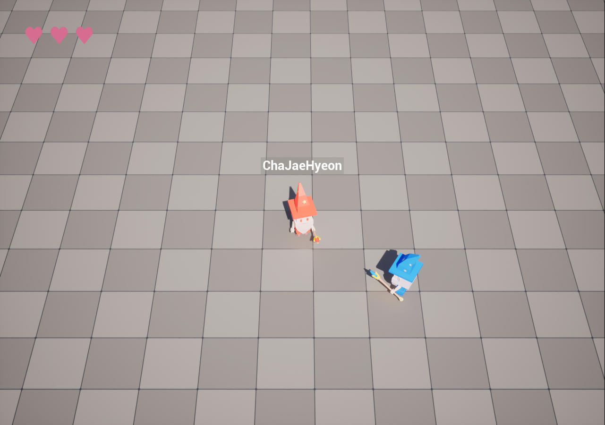

**클라이언트 시점 — 두 이름표 모두 정상 출력**

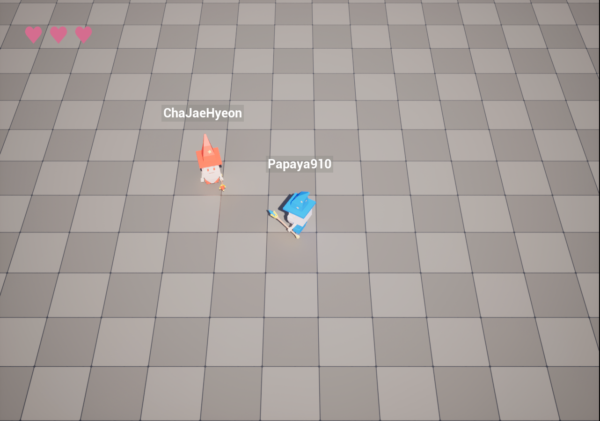

#### 로그 확인

기존 코드가 위젯이나 `PlayerState`가 준비되지 않으면 0.1초 뒤 재시도하는 구조 

이전에도 서버/클라이언트의 초기화 시점으로 인한 문제가 여럿 발생했고, 이번에도 동일한 원인일거라고 예상

이를 확인하기 위해 각 단계마다 서버/클라이언트를 구분해 로그를 추가

```cpp
// SpartaArcadeCharacter.cpp
void ASpartaArcadeCharacter::UpdateNickname()
{
    if (!IsValid(NicknameWidgetComponent))
    {
        UE_LOG(LogTemp, Warning, TEXT("[%s] %s 의 닉네임 위젯이 유효하지 않습니다."),
            HasAuthority() ? TEXT("Server") : TEXT("Client"), *GetName());
        return;
    }

    UUserWidget* UserWidget = NicknameWidgetComponent->GetUserWidgetObject();
    if (!UserWidget)
    {
        // 위젯 오브젝트가 아직 로드되지 않은 경우, 0.1초 뒤에 재시도
        FTimerHandle TempHandle;
        GetWorldTimerManager().SetTimer(TempHandle, this, &ASpartaArcadeCharacter::UpdateNickname, 0.1f, false);
        UE_LOG(LogTemp, Warning, TEXT("[%s] %s 의 닉네임 위젯이 아직 로드되지 않았습니다. 0.1초 후 재시도합니다."),
            HasAuthority() ? TEXT("Server") : TEXT("Client"), *GetName());
        return;
    }

    APlayerState* PS = GetPlayerState();
    if (IsValid(PS))
    {
        UE_LOG(LogTemp, Warning, TEXT("[%s] %s 의 닉네임 위젯이 로드되었습니다. 플레이어 닉네임을 적용합니다."),
            HasAuthority() ? TEXT("Server") : TEXT("Client"), *GetName());

        // ... TextBlock 탐색 및 닉네임 / 팀 색상 적용 ...

        UE_LOG(LogTemp, Warning, TEXT("[%s] %s 의 닉네임이 %s 로 업데이트되었습니다."),
            HasAuthority() ? TEXT("Server") : TEXT("Client"), *GetName(), *PlayerName);
    }
    else
    {
        UE_LOG(LogTemp, Warning, TEXT("[%s] %s 의 PlayerState가 아직 유효하지 않습니다. 0.1초 후 재시도합니다."),
            HasAuthority() ? TEXT("Server") : TEXT("Client"), *GetName());
        FTimerHandle TempHandle;
        GetWorldTimerManager().SetTimer(TempHandle, this, &ASpartaArcadeCharacter::UpdateNickname, 0.1f, false);
    }
}
```

**서버 로그 — 두 캐릭터 모두 위젯 로드 및 닉네임 적용 완료**

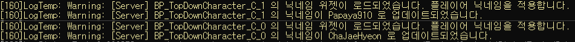

**클라이언트 로그 — 동일하게 정상**

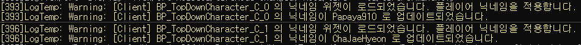

로그로 확인된 사실은 다음과 같음

* 위젯 인스턴스는 **정상적으로 존재함**
* 위젯의 텍스트도 **정상적으로 적용됨**
* 그런데 **화면에는 출력되지 않음**

즉 위젯을 **만들고 값을 채우는 데이터 경로가 아니라, 만들어진 위젯을 화면에 올리는 렌더링 경로**의 문제

---

### 2. 해결 방법 모색

렌더링 경로를 기준으로 검색한 결과, **UE 5.5에서 `WidgetComponent` + Screen space 조합이 리슨 서버 호스트에게 렌더링되지 않는 버그**가 실제로 존재한다는 것을 확인

* 프로젝트 코드의 문제가 아니라 엔진 이슈임을 확인
* 다만 **원인을 설명하는 자료는 찾지 못했고**, 대부분 우회 방법을 공유하는 내용이었음

여기서 두 가지 우회 방법을 찾을 수 있었음

* **방법 2**: [Widget Component set to Screen Space does not render for Listen Server, but renders for clients — Unreal Engine Forums](https://forums.unrealengine.com/t/widget-component-set-to-screen-space-does-not-render-for-listen-server-but-renders-for-clients/2156399/3)
* **방법 3**: [Unreal Engine — Alternative to Widget Component — Epic Dev Community](https://dev.epicgames.com/community/learning/tutorials/ywpl/unreal-engine-alternative-to-widget-component)

여기에 가장 단순한 **방법 1**을 더해 세 가지를 모두 적용해 보았음

---

### 3. 방법 1: Widget Space를 World로 변경

렌더링 경로가 문제라면 렌더링 경로 자체를 바꿔보는 가장 단순한 접근

해당 방법은 코드 수정이 아닌 BP로 확인이 가능했기에 BP를 통해 우선 적용해 봄

#### 적용

디테일 패널에서 Space를 `World`로 변경

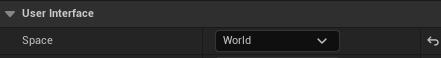

World space는 3D 오브젝트이므로 카메라를 향하지 않음

탑다운 카메라 각도에 맞춰 초기 회전을 지정하고, 캐릭터가 회전해도 이름표는 함께 돌지 않도록 회전값을 고정

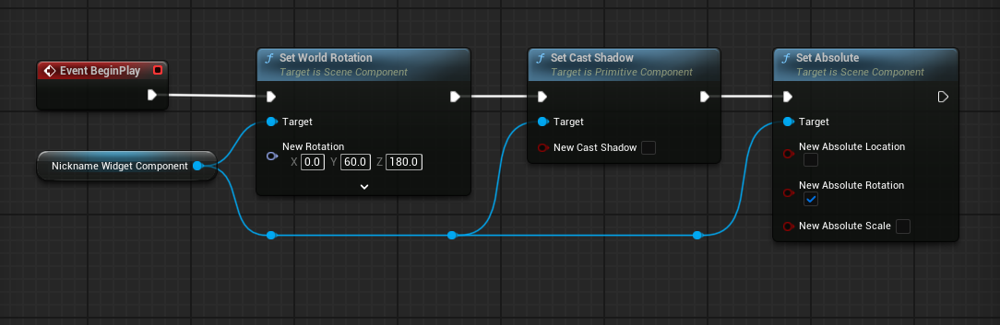

#### 결과

**호스트 화면에서도 다른 플레이어의 이름표가 정상적으로 출력**

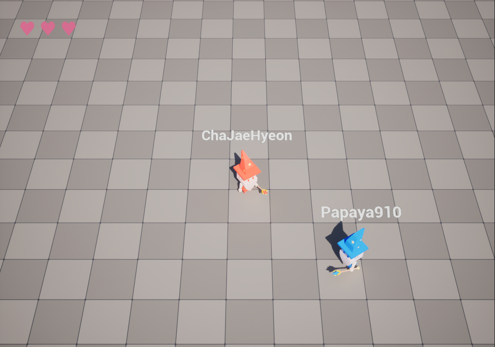

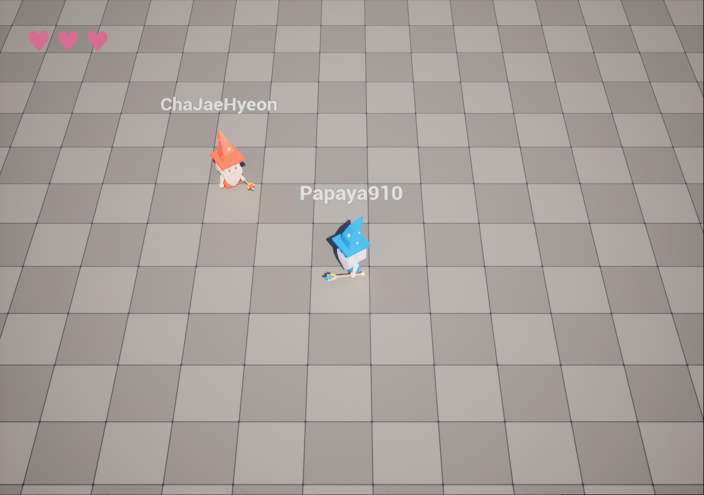

#### 폐기 사유

동작은 했지만 **기존과 스타일이 달라 폐기**

World space 위젯은 월드에 실재하는 오브젝트이기 때문

* 카메라와의 거리에 따라 **원근으로 크기가 변함**
* 각도를 고정해도 **화면 가장자리로 갈수록 기울어져 보임**
* 지형이나 다른 액터에 **가려질 수 있음**

---

### 4. 방법 2: Child Actor로 위젯 컴포넌트 부착

포럼 스레드에서 제시된 우회 방법

Screen space는 유지하되 위젯 컴포넌트를 **캐릭터가 아닌 별도 액터**에 부착

#### 적용

`UWidgetComponent` 하나만 가진 BP 액터를 생성

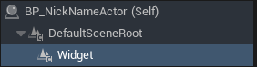

위젯 컴포넌트 설정은 기존과 동일하게 Screen / `WBP_NickName` / DrawSize 200×50으로 지정

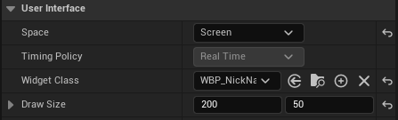

캐릭터에는 `ChildActorComponent`를 추가하고 해당 BP를 지정

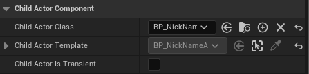

```cpp
// SpartaArcadeCharacter.cpp
ASpartaArcadeCharacter::ASpartaArcadeCharacter()
{
    //...

    NicknameChildActorComponent = CreateDefaultSubobject<UChildActorComponent>(TEXT("NicknameChildActorComponent"));
    NicknameChildActorComponent->SetupAttachment(RootComponent);
    NicknameChildActorComponent->SetRelativeLocation(FVector(0.f, 0.f, 130.f)); // 캐릭터 머리 위 높이로 적당히 배치
}

void ASpartaArcadeCharacter::UpdateNickname()
{
    if (!IsValid(NicknameChildActorComponent))
    {
        return;
    }

    UWidgetComponent* WidgetComp = NicknameChildActorComponent->GetChildActor()->FindComponentByClass<UWidgetComponent>();
    WidgetComp->SetWidgetSpace(EWidgetSpace::Screen); // 항상 화면을 향하도록 Screen 스페이스 설정
    WidgetComp->SetDrawSize(FVector2D(200.f, 50.f));

    if (!IsValid(WidgetComp))
    {
        return;
    }

    UUserWidget* UserWidget = WidgetComp->GetUserWidgetObject();

    // ... 이하 기존 닉네임 적용 로직과 동일 ...
}
```

#### 결과

**기존과 동일한 스타일을 유지하면서 호스트 화면에서도 정상 출력되었고** 기존 코드 수정량도 적었음

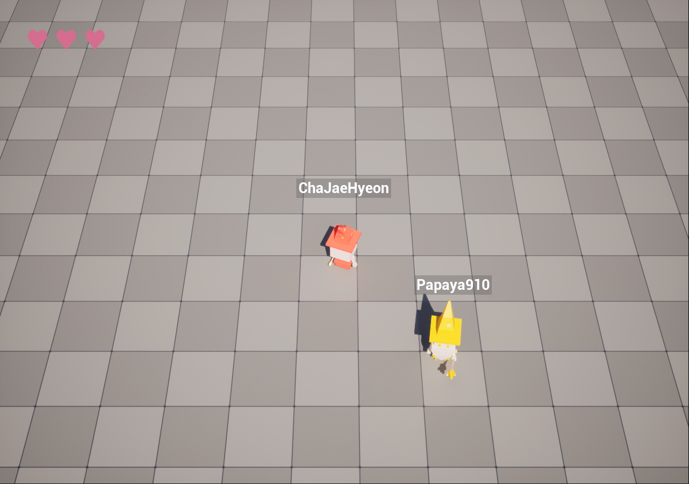

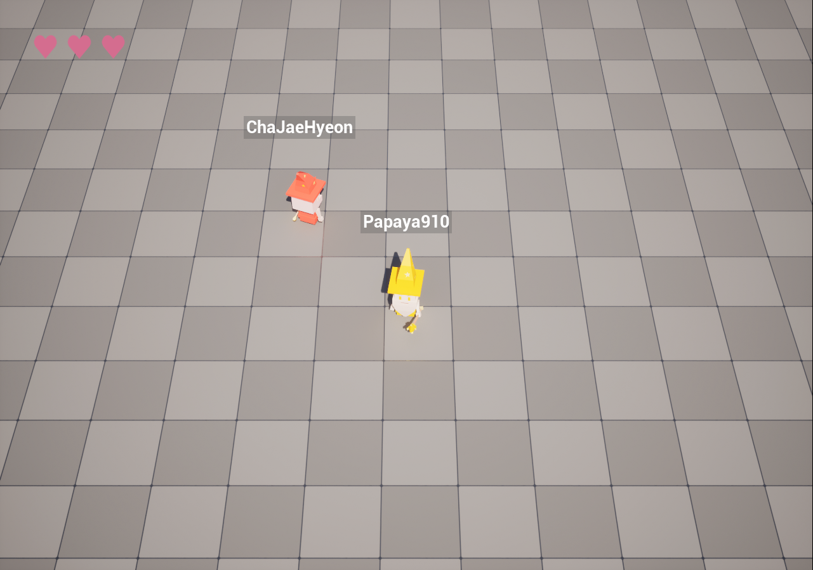

### 폐기 사유

해당 방법은 **캐릭터 1명당 컴포넌트 하나와 액터 하나가 추가로 생성되는 구조**

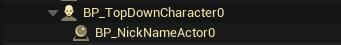

* 4인 매치 기준 이름표 표시용으로만 액터 4개가 월드에 추가됨
* 액터 등록/해제, 트랜스폼 전파, 틱 관리 비용이 컴포넌트보다 무거움
* `ChildActorComponent`는 부모 트랜스폼이 변경될 때마다 자식 액터를 이동시켜야 하므로, 매 프레임 이동하는 캐릭터에 부착하기에는 부담이 있음
* 캐릭터 수명과 별개인 액터가 생성되므로 정리 책임이 하나 늘어남
* 배틀로얄 게임인 만큼 추후 인원 확장을 고려하였기에, 인원이 많아지면 오버헤드가 클 수 있음

---

### 5. 방법 3: 화면 위젯 + 좌표 투영 (`UWorldToScreenWidget`)

Epic 커뮤니티 튜토리얼 [Alternative to Widget Component](https://dev.epicgames.com/community/learning/tutorials/ywpl/unreal-engine-alternative-to-widget-component)에서 소개하는 방식으로, `UWidgetComponent`를 사용하지 않음

핵심은 **소유권의 전환**

* 위젯을 표시 대상 캐릭터가 아니라 **보는 쪽(로컬 PlayerController)이 소유**함
* 캐릭터 생성 시 위젯을 화면에 띄우고, 매 틱 캐릭터의 월드 좌표를 스크린 좌표로 투영해 그 위치로 이동시킴
* 대상 액터는 소유자가 아니라 **좌표를 제공하는 참조**일 뿐임

#### 기본 클래스 선언

```cpp
// WorldToScreenWidget.h
UCLASS()
class SPARTAARCADE_API UWorldToScreenWidget : public UUserWidget
{
    GENERATED_BODY()

protected:
    virtual void NativeTick(const FGeometry& MyGeometry, float InDeltaTime) override;

public:
    /** Can be adjusted in the child WBP or set by caller. */
    UPROPERTY(EditAnywhere, BlueprintReadWrite, meta = (ExposeOnSpawn = true))
    float HeightOffset{ 130.f };

    /** Will normally be self during create widget. Is the Actor this widget will follow around. */
    UPROPERTY(EditAnywhere, BlueprintReadWrite, Transient, meta = (ExposeOnSpawn = true))
    TObjectPtr<AActor> AttachedActor;

    UFUNCTION(BlueprintCallable, Category = "UI")
    void SetNickname(const FString& Nickname, int32 TeamID, APlayerController* InPlayerController);

protected:
    UPROPERTY()
    TObjectPtr<APlayerController> PlayerController;

    UPROPERTY(meta = (BindWidget))
    TObjectPtr<UTextBlock> PlayerNameText;

    UPROPERTY(BlueprintReadOnly, Category = "UI")
    bool bIsInitialized{ false };
};
```

---

#### 5-1. 트러블 슈팅: 생성 직후 위젯이 스스로 파괴됨

**문제 상황**

* 튜토리얼 원본 코드는 **BP에서 `AttachedActor`를 미리 지정하는 것을 전제**로 작성되어 있음
* `NativeTick`에서 `AttachedActor`가 유효하지 않으면 위젯을 제거하는 로직이 존재함
* 현재 프로젝트는 **런타임에 캐릭터가 스폰될 때 동적으로 위젯을 생성해 부착**하는 구조임
* 생성 직후 `AttachedActor`가 세팅되기 전에 틱이 한 번 돌면서 곧바로 파괴 로직으로 진입함

**원인**

* 원본 코드에는 초기화 완료 여부를 구분하는 상태가 없음
* **아직 세팅되지 않은 상태**와 **대상이 사라진 상태**를 구분하지 못하고 동일하게 처리함

**해결 방법**

초기화 완료 플래그 `bIsInitialized`를 추가해, **초기화가 끝난 뒤에 대상이 무효해진 경우에만** 제거하도록 수정

```cpp
// WorldToScreenWidget.cpp
void UWorldToScreenWidget::NativeTick(const FGeometry& MyGeometry, float InDeltaTime)
{
    Super::NativeTick(MyGeometry, InDeltaTime);

    // 초기화 전에는 아무것도 하지 않음
    if (!bIsInitialized)
    {
        return;
    }

    // 초기화가 끝났는데 대상이 사라졌다면 그때 제거
    if (bIsInitialized && !IsValid(AttachedActor))
    {
        if (IsInViewport())
        {
            RemoveFromParent();
        }
        return;
    }

    // ...
}
```

플래그는 닉네임 세팅이 완료되는 시점에 활성화

```cpp
// WorldToScreenWidget.cpp
void UWorldToScreenWidget::SetNickname(const FString& Nickname, int32 TeamID, APlayerController* InPlayerController)
{
    if (!IsValid(PlayerNameText))
    {
        return;
    }

    PlayerController = InPlayerController;
    PlayerNameText->SetText(FText::FromString(Nickname));

    FLinearColor TeamColor = FLinearColor::White;
    if (TeamID == 1)
    {
        TeamColor = FLinearColor(1.0f, 0.25f, 0.25f);
    }
    else if (TeamID == 2)
    {
        TeamColor = FLinearColor(0.25f, 0.5f, 1.0f);
    }

    PlayerNameText->SetColorAndOpacity(FSlateColor(TeamColor));
    bIsInitialized = true;
}
```
---

#### 5-2. 트러블 슈팅: 클라이언트에서 위젯이 생성되지 않음

**문제 상황**

* 클라이언트에서만 위젯이 부착되지 않음
* 다음 로그가 출력됨

```
CreateWidget cannot be used on Player Controller with no attached player.
BP_LobbyPlayerController_C_0 has no Player attached.
```

**원인**

* `GetPlayerControllerIterator`로 컨트롤러를 순회할 때 **`ULocalPlayer` 부착 여부를 확인하지 않고** `CreateWidget`을 호출함
* `IsLocalController()`만으로는 부족하며, **"로컬 컨트롤러인가"와 "실제로 화면을 가진 플레이어가 붙어 있는가"는 다른 조건**

**해결 방법**

조건에 `PC->GetLocalPlayer()`를 추가

```cpp
// SpartaArcadeCharacter.cpp
APlayerController* LocalPlayerController = nullptr;
for (FConstPlayerControllerIterator It = GetWorld()->GetPlayerControllerIterator(); It; ++It)
{
    APlayerController* PC = It->Get();

    if (PC && PC->IsLocalController() && PC->GetLocalPlayer())   // GetLocalPlayer() 조건 추가
    {
        LocalPlayerController = PC;
        break;
    }
}
```

**개선 — 엔진 함수로 대체 가능**

이후에 확인한 내용이지만, 위 순회는 엔진이 제공하는 함수 한 줄로 대체 가능

```cpp
// SpartaArcadeCharacter.cpp
APlayerController* LocalPlayerController = GEngine->GetFirstLocalPlayerController(GetWorld());
```

```cpp
// Engine/Source/Runtime/Engine/Private/GameInstance.cpp
APlayerController* UGameInstance::GetFirstLocalPlayerController(const UWorld* World) const
{
    // Use the consistent local players order if possible
    if (World == nullptr || World == GetWorld())
    {
        for (ULocalPlayer* Player : LocalPlayers)
        {
            // Returns the first non-null UPlayer::PlayerController without filtering by UWorld.
            if (Player && Player->PlayerController)
            {
                return Player->PlayerController;
            }
        }
    }
    // ...
}
```

* **`LocalPlayers` 배열에서 출발**하므로 반환된 컨트롤러는 `ULocalPlayer`를 가진 것이 구조적으로 보장
* 반대로 `UWorld::GetFirstPlayerController()`나 `UGameplayStatics::GetPlayerController(World, 0)`은 **로컬 여부를 검사하지 않고** 월드의 PC 리스트 첫 번째를 반환하므로, 리슨 서버에서는 원격 컨트롤러가 잡힐 수 있음

---

#### 5-3. 트러블 슈팅: 이름표가 UI 입력을 가로챔

**문제 상황**

* 게임 종료 후 결과 UI가 출력되어도 **이름표가 그 위에 계속 표시됨**
* 결과창의 **버튼이 클릭되지 않음**

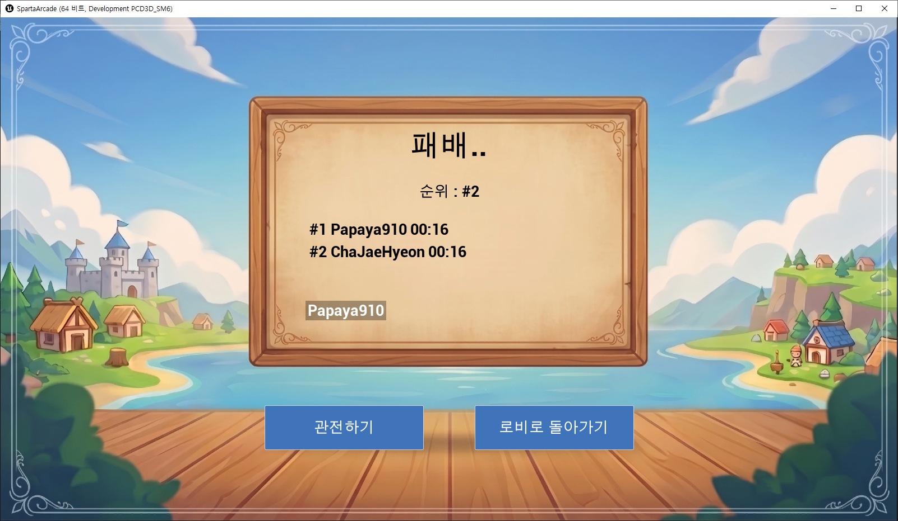

**원인**

* 뷰포트에 추가한 위젯이 히트 테스트 대상이 되어 마우스 입력을 소비함
* ZOrder를 지정하지 않아 다른 UI보다 앞에 그려짐

**해결 방법**

```cpp
// SpartaArcadeCharacter.cpp
NameWidget->SetVisibility(ESlateVisibility::HitTestInvisible); // 렌더링은 하되 입력은 통과시킴
NameWidget->AddToViewport(-1);                                 // ZOrder를 낮춰 다른 UI 뒤로 배치
```

* `HitTestInvisible` — 렌더링은 유지하되 마우스 이벤트를 받지 않음
* `AddToViewport(-1)` — ZOrder를 음수로 지정해 HUD 및 결과창보다 뒤에 배치됨

---

#### 5-4. 트러블 슈팅: 접속 초기에 이름표가 좌측 상단에 출력됨

**문제 상황**

* 접속 직후 다른 유저의 이름표가 **화면 좌측 상단에 붙어 있음**
* 캐릭터는 맵 끝에 있는데 이름표만 구석에 떨어져 있는 상태

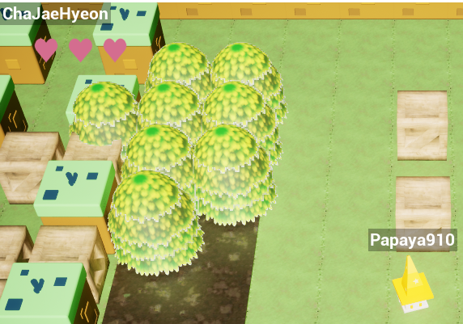

**원인**

* **액터 위치 복제가 아직 도착하지 않아, 기본 값의 좌표로 투영된 것으로 추정**
* `AttachedActor->GetActorLocation()`이 초기값을 반환하는 동안에도 투영과 배치가 그대로 수행됨

**해결 방법**

투영 이전에 **로컬 폰과의 거리를 먼저 검사**해, 유효 범위를 벗어나면 아예 표시하지 않도록 수정

```cpp
// WorldToScreenWidget.cpp
APawn* LocalPawn = PlayerController->GetPawn();
const float MaxDistance = 3000.f;
const float DistanceSquared = IsValid(LocalPawn) ? FVector::DistSquared(LocalPawn->GetActorLocation(), AttachedActor->GetActorLocation()) : 0.f;
if (DistanceSquared > FMath::Square(MaxDistance))
{
    SetRenderOpacity(0.f);
    return;
}
```

* 위치가 복제되기 전 맵의 끝에 있는 캐릭터는 로컬 폰과의 거리가 크므로 이 조건에 걸려 숨겨짐
* 거리 검사를 **투영보다 먼저** 배치해 초기 위치 튐을 막는 동시에 비용이 큰 `ProjectWorldLocationToWidgetPosition` 호출 자체를 건너뜀

---

#### 5-5. 트러블 슈팅: 관전 이동 시 이름표 잔상이 남음

**문제 상황**

* 탈락 후 관전 시점으로 전환되면, 화면에서 벗어난 캐릭터의 이름표가 **직전 좌표에 그대로 남아 있음**
* 카메라가 크게 이동할 때마다 화면에 이름표 잔상이 남음

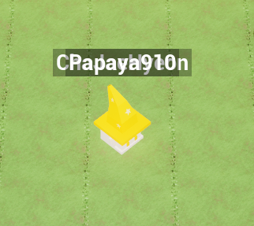

**원인**

```cpp
// WorldToScreenWidget.cpp
const bool bIsOnScreen = UWidgetLayoutLibrary::ProjectWorldLocationToWidgetPosition(
    PlayerController, WorldLocation, OutScreenPos, false);

if (bIsOnScreen)
{
    SetRenderTranslation(CenteredTranslation);
}
// bIsOnScreen이 false면 아무 처리 없이 종료됨
```

* `bIsOnScreen`이 false일 때 **`SetRenderTranslation`을 호출하지 않고 그대로 종료됨**
* 위젯 자체는 계속 뷰포트에 존재하며 렌더링되므로 **마지막으로 갱신된 좌표에 그대로 남음**
* 5-4의 거리 조건은 통과하는 상황이므로 거리 컬링만으로는 걸러지지 않음

**해결 방법**

`else` 분기를 추가해 **투영에 실패하면 숨기도록** 처리

```cpp
// WorldToScreenWidget.cpp
if (bIsOnScreen)
{
    // ...
}
else
{
    SetRenderOpacity(0.f);
}
```

---

#### 5-6. 최종 코드

**매 프레임 좌표 투영**

```cpp
// WorldToScreenWidget.cpp
void UWorldToScreenWidget::NativeTick(const FGeometry& MyGeometry, float InDeltaTime)
{
    Super::NativeTick(MyGeometry, InDeltaTime);

    if (!bIsInitialized)
    {
        return;
    }

    if (bIsInitialized && !IsValid(AttachedActor))
    {
        if (IsInViewport())
        {
            RemoveFromParent();
        }
        return;
    }

    if (!IsValid(AttachedActor) || !IsValid(PlayerController))
    {
        return;
    }

    APawn* LocalPawn = PlayerController->GetPawn();
    const float MaxDistance = 3000.f;
    const float DistanceSquared = IsValid(LocalPawn)
        ? FVector::DistSquared(LocalPawn->GetActorLocation(), AttachedActor->GetActorLocation())
        : 0.f;
    if (DistanceSquared > FMath::Square(MaxDistance))
    {
        SetRenderOpacity(0.f);
        return;
    }

    const FVector ActorLocation = AttachedActor->GetActorLocation();
    const FVector WorldLocation(ActorLocation.X, ActorLocation.Y, ActorLocation.Z + HeightOffset);

    FVector2D OutScreenPos;
    const bool bIsOnScreen = UWidgetLayoutLibrary::ProjectWorldLocationToWidgetPosition(
        PlayerController, WorldLocation, OutScreenPos, false);

    if (bIsOnScreen)
    {
        const FVector2D Size = GetDesiredSize();
        const FVector2D CenteredTranslation(OutScreenPos.X - Size.X * 0.5f, OutScreenPos.Y);
        SetRenderOpacity(1.f);
        SetRenderTranslation(CenteredTranslation);
    }
    else
    {
        SetRenderOpacity(0.f);
    }
}
```

* 투영 기준이 **보는 사람의 카메라**인 `PlayerController`이므로, 대상이 호스트의 캐릭터든 원격 클라이언트의 캐릭터든 계산식이 동일함
* 2D 위젯이므로 방법 1에서 문제였던 스타일의 차이가 존재하지 않음

**위젯 생성 및 부착**

```cpp
// SpartaArcadeCharacter.cpp
void ASpartaArcadeCharacter::UpdateNickname()
{
    // 데디케이티드 서버에서는 렌더링할 필요가 없으며, 중복 생성도 차단
    if (GetNetMode() == NM_DedicatedServer || !NicknameWidgetClass || IsValid(NicknameWidget))
    {
        return;
    }

    // 이 위젯을 보게 될 로컬 플레이어 컨트롤러 탐색
    if (UWorld* World = GetWorld())
    {
        APlayerController* LocalPlayerController = GEngine->GetFirstLocalPlayerController(World);
    }

    ASpartaPlayerState* SPS = GetPlayerState<ASpartaPlayerState>();
    if (!IsValid(SPS) || !IsValid(LocalPlayerController))
    {
        // 아직 준비되지 않았다면 다음 틱에 재시도
        FTimerDelegate TimerDel;
        TimerDel.BindUObject(this, &ASpartaArcadeCharacter::UpdateNickname);
        GetWorldTimerManager().SetTimerForNextTick(TimerDel);
        return;
    }

    UWorldToScreenWidget* NameWidget =
        CreateWidget<UWorldToScreenWidget>(LocalPlayerController, NicknameWidgetClass);
    if (NameWidget)
    {
        NameWidget->AttachedActor = this;   // 소유자가 아니라 따라갈 대상
        NameWidget->HeightOffset  = 130.f;
        NameWidget->SetVisibility(ESlateVisibility::HitTestInvisible); // 5-3
        NameWidget->AddToViewport(-1);                                 // 5-3
        NicknameWidget = NameWidget;

        NameWidget->SetNickname(SPS->GetPlayerName(), SPS->GetTeamID(), LocalPlayerController);
    }
}
```

호출 지점은 서버와 클라이언트를 모두 커버하도록 세 곳에 배치

* `PossessedBy()` — 서버 (리슨 서버 호스트 포함)
* `OnRep_PlayerState()` — 클라이언트
* `InitializeCharacterComponents()` — 컴포넌트 초기화 완료 시점

---

### 6. 실행 이미지

호스트와 클라이언트 양쪽 모두 정상 출력되며, 기존 Screen space와 동일한 스타일을 유지

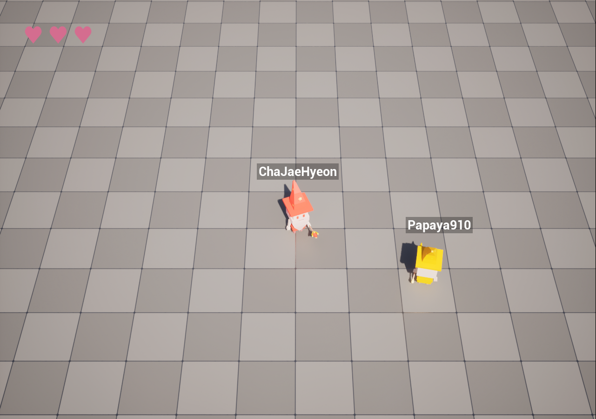

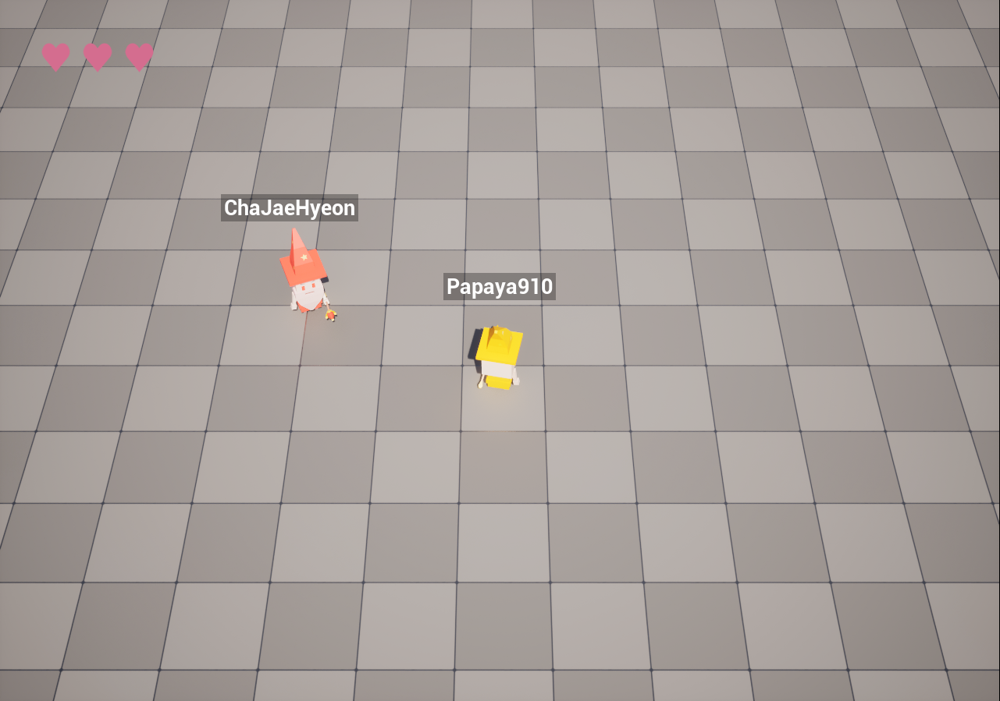

---

### 7. 엔진 코드 분석: 근본 원인

검색으로는 "**UE 5.5에 해당 버그가 존재한다**"까지만 확인할 수 있었음 

해당 오류를 수정할 때는 프로젝트 막바지였기에, 원인을 직접 확인해보지는 못하고 인터넷에서 찾은 해결 방법을 적용만 함

원인을 명확히 하기 위해 UE 5.5 엔진 소스를 확인

#### UWidgetComponent

Screen space `UWidgetComponent`는 위젯을 스스로 그리지 않고, **특정 `ULocalPlayer`의 뷰포트가 렌더링**하는 구조

따라서 컴포넌트는 반드시 **"이 위젯이 누구의 화면에 올라가야 하는가"** 가 지정되어 있어야 함

### `UWidgetComponent::UpdateWidgetOnScreen()`

`UWidgetComponent`는 매 틱 `UpdateWidgetOnScreen()`을 호출해 위젯을 등록함

```cpp
// WidgetComponent.cpp:1279
void UWidgetComponent::UpdateWidgetOnScreen()
{
    if ((GetUserWidgetObject() || GetSlateWidget().IsValid()) && Space == EWidgetSpace::Screen)
    {
        UWorld* ThisWorld = GetWorld();
        if (ThisWorld && ThisWorld->IsGameWorld())
        {
            ULocalPlayer* TargetPlayer = GetOwnerPlayer();
            APlayerController* PlayerController = TargetPlayer ? ToRawPtr(TargetPlayer->PlayerController) : nullptr;
            if (TargetPlayer && PlayerController && IsVisible() && !(GetOwner()->IsHidden()))
            {
                if (!bAddedToScreen)
                {
                    AddWidgetToScreen(TargetPlayer);
                }
                return;
            }
        }
    }

    if (bAddedToScreen)
    {
        RemoveWidgetFromScreen();   // TargetPlayer가 null이면 이 경로로 진입
    }
}
```

* `TargetPlayer`가 null이므로 **화면에 추가되지 않고** `RemoveWidgetFromScreen()`이 실행
* 위젯 인스턴스와 텍스트는 정상 상태를 유지함
* **로그가 전부 정상으로 출력됐던 이유**

#### `UWidgetComponent::GetOwnerPlayer()`

```cpp
// WidgetComponent.cpp:1721
ULocalPlayer* UWidgetComponent::GetOwnerPlayer() const
{
    if (OwnerPlayer)                                              // (1) 명시 지정
    {
        return OwnerPlayer;
    }

    if (APawn* OwningPawn = Cast<APawn>(GetOwner()))              // (2) 소유 폰의 컨트롤러
    {
        if (APlayerController* OwningController = Cast<APlayerController>(OwningPawn->GetController()))
        {
            return OwningController->GetLocalPlayer();            // nullptr이어도 즉시 반환
        }
    }

    if (const UWorld* LocalWorld = GetWorld())                    // (3) 폴백
    {
        if (const UGameInstance* GameInstance = LocalWorld->GetGameInstance())
        {
            return GameInstance->GetFirstGamePlayer();
        }
    }

    return nullptr;
}
```

* **(2)에서 `GetLocalPlayer()`가 nullptr을 반환해도 그대로 리턴하고 종료됨**
* 따라서 **(3) 폴백에 도달하지 못하고** `UpdateWidgetOnScreen()`의 **TargetPlayer**가 nullptr을 갖게 됨
* 이것이 버그의 직접적인 원인

#### 호스트에서만 발생한 이유

호스트(리슨 서버)는 클라이언트의 **원격 컨트롤러**를 모두 갖고 있음

호스트의 입장에서 다른 **클라이언트의 캐릭터는 각 원격 컨트롤러가 소유권을 가진 상태**

* **클라이언트에서 자기 캐릭터** — 컨트롤러가 로컬 PC이므로 (2)에서 유효한 `ULocalPlayer` 반환, 정상 출력
* **클라이언트에서 남의 캐릭터** — 컨트롤러 객체 자체가 복제되지 않아 nullptr, `Cast` 실패로 **(3) 폴백** 진입, `GetFirstGamePlayer()`가 자기 자신을 반환하므로 정상 출력
* **호스트에서 자기 캐릭터** — 컨트롤러가 로컬 PC이므로 정상 출력
* **호스트에서 남의 캐릭터** — 원격 PC가 **서버에는 실제로 존재**하므로 `Cast` 성공, 그러나 `GetLocalPlayer()`가 nullptr이므로 **즉시 반환되어 미출력**

**서버만 모든 PlayerController 객체를 보유하기 때문에, 서버에서만 (2)의 `Cast`가 성공하고 그 결과가 nullptr**을 반환하게 됨

클라이언트는 남의 컨트롤러가 존재하지 않아 (3) 폴백을 타고 정상 동작했던 것

#### 방법 1과 방법 2가 동작했던 이유

* **방법 1 (World space)** — `UpdateWidgetOnScreen()`의 첫 조건이 `Space == EWidgetSpace::Screen`임. World space는 이 함수를 통과하지 못하고 씬 프록시를 생성해 일반 렌더 파이프라인으로 그려지므로 `GetOwnerPlayer()`를 거치지 않음
* **방법 2 (ChildActorComponent)** — `GetOwner()`가 Pawn이 아닌 별도 Actor이므로 **(2)를 건너뛰고 (3) 폴백** 진입. `GetFirstGamePlayer()`가 호스트의 로컬 플레이어를 반환해 정상 동작

---

### 8. 엔진 코드 확인 후 알게 된 것

#### `UWidgetComponent::SetOwnerPlayer()`

`UWidgetComponent::GetOwnerPlayer()`의 (1) 분기를 채우는 세터가 존재

```cpp
// WidgetComponent.cpp:1707
void UWidgetComponent::SetOwnerPlayer(ULocalPlayer* LocalPlayer)
{
    if ( OwnerPlayer != LocalPlayer )
    {
        RemoveWidgetFromScreen();   // 기존 레이어에서 제거
        OwnerPlayer = LocalPlayer;  // 다음 틱에 새 소유자로 재등록
    }
}
```

기존 구조를 유지한 채 다음 한 줄로 해결할 수 있었음

```cpp
// SpartaArcadeCharacter.cpp
void ASpartaArcadeCharacter::BeginPlay()
{
    Super::BeginPlay();

    // 화면을 보는 로컬 플레이어를 위젯의 소유자로 지정
    if (GetNetMode() != NM_DedicatedServer && IsValid(NicknameWidgetComponent))
    {
        NicknameWidgetComponent->SetOwnerPlayer(GetWorld()->GetFirstLocalPlayerFromController());
    }
}
```

* `BeginPlay`는 각 머신에서 로컬로 실행되고 복제되지 않음
* 호스트에는 호스트의 로컬 플레이어가, 각 클라이언트에는 자기 로컬 플레이어가 지정됨
* (2)를 건너뛰므로 호스트에서도 정상 출력됨
