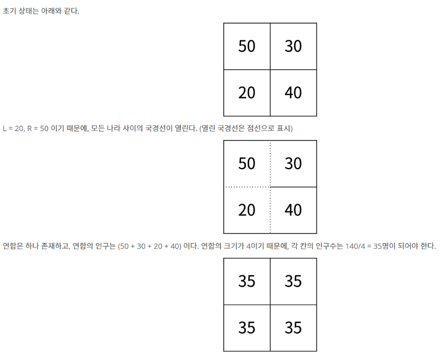
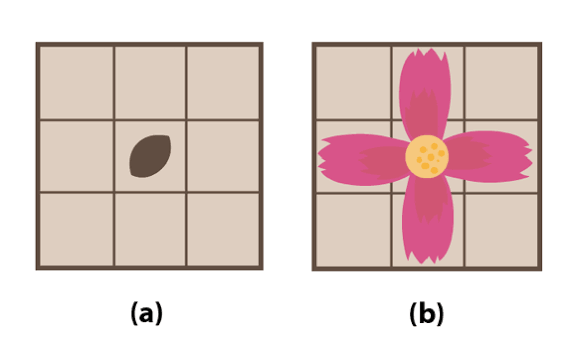
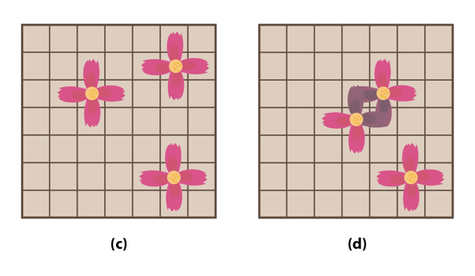

# 📅 2026-07-31 TIL

## 1. 오늘 학습 요약

* **학습 목표**: 
  * **코딩테스트** 문제풀이
  * 모의 코딩테스트 **오답 노트**

* **학습 도구**: `Unreal Engine 5.5.4`, `Visual Studio 2022`

* **활동 내용**: 
  * 프로그래머스 **[유사 칸토어 비트열](https://school.programmers.co.kr/learn/courses/30/lessons/148652)**, **[[PCCE 기출문제] 10번 / 데이터 분석](https://school.programmers.co.kr/learn/courses/30/lessons/250121)** 풀이
  * 모의 코딩테스트 **인구 이동**, **순회강연**, **용돈 관리**, **수학숙제**, **꽃길** 풀이 및 **오답 노트**
---

## 2. 프로그래머스 문제 풀이

### [유사 칸토어 비트열](https://school.programmers.co.kr/learn/courses/30/lessons/148652)

```cpp
#include <string>
#include <vector>

using namespace std;

int solution(int n, long long l, long long r) {
    int answer = r-l+1;
    
    for(long long i=l-1; i<=r-1; i++){
        long long temp = i;
        
        if(temp % 5 == 2){
            answer--;
            continue;
        }
        
        while(temp > 0){
            if(temp % 5 == 2){
                answer--;
                break;
            }
            temp /= 5;
        }
    }
    return answer;
}
```

* **진법 변환** 문제
* `5`로 나눈 **나머지**가 `2`인 경우 반드시 `0`, 또한 부모가 0인 경우 자식도 0이 됨
* `5`로 나누면서 **부모의 나머지**가 `2`인 경우를 추적
* 부모가 모두 1이면 자식도 1인 것

### [[PCCE 기출문제] 10번 / 데이터 분석](https://school.programmers.co.kr/learn/courses/30/lessons/250121)

```cpp
#include <string>
#include <vector>
#include <algorithm>

using namespace std;

vector<vector<int>> solution(vector<vector<int>> data, string ext, int val_ext, string sort_by) {
    vector<vector<int>> answer;
    vector<string> exts = {"code", "date", "maximum", "remain"};
    int index;
    for(int i=0; i<exts.size(); i++) 
        if(exts[i] == ext) index = i;
    
    for(int i=0; i<data.size(); i++)
        if(data[i][index] < val_ext)
            answer.push_back(data[i]);
    
    for(int i=0; i<exts.size(); i++) 
        if(exts[i] == sort_by) index = i;
    
    sort(answer.begin(), answer.end(), [&index](const vector<int>& A, const vector<int>& B){
        return A[index] < B[index];
    });

    return answer;
}
```

* **문자열 처리**, **정렬** 문제

---

## 3. 모의 코딩테스트 오답 노트

### 1. 인구 이동

#### 문제 설명

N x N 크기의 땅이 있고, 땅은 1 x 1 개의 칸으로 나누어져 있습니다. 각각의 땅에는 나라가 하나씩 존재하며, 각 칸에 해당하는 나라의 인구수가 2차원 배열 `population`으로 주어집니다. 인접한 나라 사이에는 국경선이 존재합니다.

오늘부터 인구 이동이 시작되는 날입니다. 인구 이동은 하루 동안 다음과 같이 진행되며, 더 이상 인구 이동이 없을 때까지 지속됩니다.

1. 국경선을 공유하는 두 나라의 인구 차이가 `L`명 이상, `R`명 이하라면, 두 나라가 공유하는 국경선을 오늘 하루 동안 엽니다.
2. 위의 조건에 의해 열어야 하는 국경선이 모두 열렸다면, 인구 이동을 시작합니다.
3. 국경선이 열려있어 인접한 칸만을 이용해 이동할 수 있으면, 그 나라들을 오늘 하루 동안은 **연합**이라고 합니다.
4. 연합을 이루고 있는 각 칸의 인구수는 `(연합의 인구수) / (연합을 이루고 있는 칸의 개수)`가 됩니다. 편의상 소수점은 버립니다(정수 나눗셈).
5. 연합을 해체하고, 모든 국경선을 닫습니다.

각 나라의 초기 인구수가 담긴 2차원 배열 `population`과 국경선을 여는 기준인 `L`, `R`이 매개변수로 주어집니다. 인구 이동이 총 며칠 동안 발생하는지 초기화된 일수를 return 하도록 `solution` 함수를 완성해주세요.



#### 제한사항

- `population`은 N x N 크기의 2차원 벡터입니다.
- N은 땅의 크기이며, **1 이상 50 이하**입니다.
- 각 나라의 인구수 `population[r][c]`는 **0 이상 100 이하**인 정수입니다.
- L과 R은 **1 이상 100 이하**이며, **L <= R** 관계를 만족하는 정수입니다.
- 인구 이동이 발생하는 일수가 2,000번 보다 작거나 같은 입력만 주어집니다.

#### 입출력 예

| **population** | **L** | **R** | **result** |
| --- | --- | --- | --- |
| `[[50, 30], [20, 40]]` | 20 | 50 | 1 |
| `[[50, 30], [20, 40]]` | 40 | 50 | 0 |
| `[[10, 15, 20], [20, 30, 25], [40, 22, 10]]` | 5 | 10 | 2 |

#### 입출력 예 설명

**입출력 예 #1**

- `population[0][0]` (50명)과 `population[0][1]` (30명)의 인구 차이는 20명이며, 이는 L 이상 R 이하(20 이상 50 이하) 조건을 만족하므로 국경선이 열립니다.
- 마찬가지로 모든 인접한 국가를 탐색하면 모든 국가가 하나의 연합(`[[50, 30], [20, 40]]`)을 이룹니다.
- 연합의 총 인구수는 50 + 30 + 20 + 40 = 140명이고, 연합을 이루는 칸의 개수는 4개이므로, 각 칸의 인구수는 140 / 4 = 35명이 됩니다.
- 하루 동안 인구 이동이 끝난 후 더 이상 인구 이동이 불가능하므로 1을 반환합니다.

#### 제출 코드

```cpp
#include <iostream>
#include <vector>
#include <cmath>
#include <queue>
#include <algorithm>

using namespace std;

bool BFS(vector<vector<int>>& population, vector<vector<int>>& visit, pair<int, int> start, int L, int R) {
    if (visit[start.first][start.second] != 0) return false;
    queue<pair<int, int>> q;
    vector<pair<int, int>> visited;
    q.push(start);
    visit[start.first][start.second] = 1;
    visited.push_back(start);
    int sum = population[start.first][start.second];
    int count = 1;

    int dy[4] = { -1, 1, 0, 0 };
    int dx[4] = { 0, 0, -1, 1 };

    while (!q.empty()) {
        pair<int, int> curr = q.front();
        q.pop();
        int y = curr.first, x = curr.second;
        int popul = population[y][x];
        for (int i = 0; i < 4; i++) {
            int ny = y + dy[i], nx = x + dx[i];
            if (ny < 0 || ny >= population.size() || nx < 0 || nx >= population[0].size() || visit[ny][nx] != 0) continue;
            int diff = abs(population[ny][nx] - popul);
            if (diff > R || diff < L) continue;
            q.push({ ny, nx });
            visit[ny][nx] = 1;
            visited.push_back({ ny, nx });
            sum += population[ny][nx];
            count++;
        }
    }

    for (int i = 0; i < visited.size(); i++) {
        int y = visited[i].first;
        int x = visited[i].second;
        population[y][x] = sum / count;
    }

    return count > 1 ? true : false;
}

int solution(vector<vector<int>> population, int L, int R)
{
    int answer = 0;

    // 여기에 코드를 작성하세요.
    while (true) {
        bool flag = false;
        vector<vector<int>> visit(population.size(), vector<int>(population[0].size(), 0));
        for (int i = 0; i < population.size(); i++) {
            for (int j = 0; j < population[0].size(); j++) {
                if (BFS(population, visit, { i, j }, L, R)) flag = true;
            }
        }
        if (flag) answer++;
        else break;
    }

    return answer;
}
```

* **BFS**, **Connected Components** 문제
* 이동 조건을 확인할 때, **두 좌표의 값을 비교**하는 로직을 추가
* 모든 방문을 완료한 후, 방문했던 좌표들의 값을 평균으로 바꿔줌
* 모든 국경이 닫혀있다면 즉, **모든 좌표에서 BFS가 실행되지 않았다**면 반복을 종료

---

### 2. 순회강연

#### 문제 설명

한 저명한 학자에게 `n`개의 대학에서 강연 요청을 해 왔습니다. 각 대학에서는 `d`일 안에 와서 강연을 해 주면 `p`만큼의 강연료를 지불하겠다고 알려왔습니다. 각 대학에서 제시하는 `d`와 `p`값은 서로 다를 수도 있습니다. 이 학자는 이를 바탕으로, 가장 많은 돈을 벌 수 있도록 순회강연을 하려 합니다. 강연의 특성상, 이 학자는 하루에 최대 한 곳에서만 강연을 할 수 있습니다.

예를 들어 네 대학에서 제시한 강연료 `p`가 각각 50, 10, 20, 30 이고, 기한 `d`가 차례로 2, 1, 2, 1 이라고 합시다. 이럴 때에는 첫째 날에 4번 대학(강연료 30, 기한 1)에서 강연을 하고, 둘째 날에 1번 대학(강연료 50, 기한 2)에서 강연을 하면 총 80만큼의 돈을 벌 수 있으며 이것이 최대입니다.

각 강연의 정보(강연료 `p`와 제한 기한 `d`)가 담긴 2차원 배열 `requests`가 매개변수로 주어집니다. 이 학자가 최대로 벌 수 있는 돈을 return 하도록 `solution` 함수를 완성해주세요.

#### 제한사항

- `requests`는 `[p, d]` 형태의 원소를 갖는 2차원 벡터입니다.
    - `p`는 해당 대학에서 제시한 강연료이며, **1 이상 10,000 이하**인 정수입니다.
    - `d`는 강연을 해야 하는 기한이며, **1 이상 10,000 이하**인 정수입니다.
- `requests`의 길이 `n`은 **0 이상 10,000 이하**입니다. (`n`이 0일 경우 벌 수 있는 최대 돈은 0입니다.)

#### 입출력 예
| **requests** | **result** |
| --- | --- |
| `[[20, 1], [2, 1], [10, 3], [100, 2], [8, 2], [5, 20], [50, 10]]` | 185 |

#### 입출력 예 설명

**입출력 예 #1**

- 기한이 20일인 강연(`[5, 20]`)과 10일인 강연(`[50, 10]`)은 여유 있게 선택할 수 있습니다.
- 기한이 3일인 강연은 `[10, 3]` 1개가 있습니다.
- 기한이 2일인 강연 중에서는 강연료가 가장 높은 `[100, 2]`를 선택합니다.
- 기한이 1일인 강연 중에서는 강연료가 가장 높은 `[20, 1]`을 선택합니다.
- 결과적으로 선택된 강연들의 강연료 총합은 $5 + 50 + 10 + 100 + 20 = 185$ 가 되며, 이것이 최대로 벌 수 있는 금액입니다.

#### 제출 코드
```cpp
#include <iostream>
#include <vector>
#include <queue>
#include <algorithm>

using namespace std;

int solution(vector<vector<int>> requests) {
    int answer = 0;

    // 여기에 코드를 작성하세요.
    sort(requests.begin(), requests.end(), [](const vector<int>& A, const vector<int>& B) {
        if (A[1] != B[1]) return A[1] < B[1];
        else return A[0] > B[0];
        });

    int day = 0;
    for (int i = 0; i < requests.size(); i++) {
        if (requests[i][1] > day) {
            answer += requests[i][0];
            day++;
        }
    }
    return answer;
}
```

* 강연을 기한 순, 기한이 같다면 강연료 순으로 정렬
* 이후 강연을 순회하며 기간 안에 소화할 수 있는 강연이면 강연료를 더함
* 이는 모든 경우에서 최댓값을 구하지 못하며, 반례가 존재
* 반례는 아래와 같음

#### 위 코드가 틀린 이유

| **requests** | **result** |
| --- | --- |
| `[[50, 2], [100, 2], [10, 1]]` | 150 |

위 반례는 정렬 시 `[[10, 1], [100, 2], [50, 2]]`로 정렬되며 제출 코드는 `[10, 1], [100, 2]`를 선택해 `110`을 출력

핵심은 모든 선택이 그리디하지 않다는 것, **과거에 결정한 선택이 현재 선택보다 안 좋은 선택일 수 있음**

즉, 현재 선택이 더 좋다면 **과거의 선택 중 최악을 취소하는 로직**이 필요함

**기한 안에 소화가 가능한 강연**이라면 **우선순위 큐**에 강연을 넣음

만약 **소화가 불가능하고** 현재 강연이 큐에 있는 강연 중 최악보다 더 높은 강연료를 준다면, **최악의 강연을 큐에서 뺀 뒤 현재 강연을 넣으면** 최선의 선택을 할 수 있음

#### 수정 코드

```cpp
#include <iostream>
#include <vector>
#include <queue>
#include <algorithm>

using namespace std;

int solution(vector<vector<int>> requests) {
    int answer = 0;

    // 여기에 코드를 작성하세요.
    sort(requests.begin(), requests.end(), [](const vector<int>& A, const vector<int>& B) {
        if (A[1] != B[1]) return A[1] < B[1];
        else return A[0] > B[0];
        });

    priority_queue<int, vector<int>, greater<int>> pq;

    int day = 0;
    for (int i = 0; i < requests.size(); i++) {
        day = requests[i][1];
        if (pq.size() < day) pq.push(requests[i][0]);
        else if (requests[i][0] > pq.top()) {
            pq.pop();
            pq.push(requests[i][0]);
        }
    }

    while (!pq.empty()) {
        answer += pq.top();
        pq.pop();
    }

    return answer;
}
```
---

### 3. 용돈 관리

#### 문제 설명

현우는 용돈을 효율적으로 활용하기 위해 계획을 짜기로 하였습니다. 현우는 앞으로 `N`일 동안 자신이 사용할 금액을 계산하였고, 돈을 펑펑 쓰지 않기 위해 정확히 `M`번만 통장에서 돈을 빼서 쓰기로 하였습니다.

현우는 통장에서 한 번에 `K`원을 인출합니다. 통장에서 뺀 돈으로 하루를 보낼 수 있으면 그대로 사용하고, 모자라게 되면 남은 금액은 통장에 집어넣고 다시 `K`원을 인출합니다. 다만 현우는 `M`이라는 숫자를 좋아하기 때문에, 정확히 `M`번을 맞추기 위해서 남은 금액이 그날 사용할 금액보다 많더라도 남은 금액은 통장에 집어넣고 다시 `K`원을 인출할 수 있습니다.

현우는 돈을 아끼기 위해 인출 금액 `K`를 최소화하기로 하였습니다. 현우가 필요한 최소 금액 `K`를 계산하도록 `solution` 함수를 완성해주세요.

만약 인출 금액 K로 계산한 총 인출 횟수가 M번보다 적다면, 남은 금액이 그날 사용할 금액보다 많더라도 임의로 돈을 통장에 넣고 다시 인출하는 과정을 반복하여 **정확히 M번을 맞출 수 있다고 가정**합니다.

#### 제한사항

- `money_list`는 현우가 매일 사용할 금액이 순서대로 담긴 1차원 벡터입니다.
- `N`은 `money_list`의 길이(일수)이며, **1 이상 100,000 이하**입니다.
- `M`은 통장에서 돈을 인출할 횟수이며, **1 이상 N 이하**인 정수입니다.
- `money_list`의 각 원소(그날 사용할 금액)는 **1 이상 10,000 이하**인 정수입니다.

#### 입출력 예

| **money_list** | **M** | **result** |
| --- | --- | --- |
| `[100, 400, 300, 100, 500, 101, 400]` | 5 | 500 |

#### 입출력 예 설명

**입출력 예 #1**

- `K`가 500일 때, 다음과 같이 총 5번 인출하여 7일 동안 생활할 수 있습니다.
    - **1일차 (100원 필요)**: 500원 인출 (**1번째 인출**), 100원 사용 후 400원 남음.
    - **2일차 (400원 필요)**: 남은 400원 사용 후 0원 남음.
    - **3일차 (300원 필요)**: 500원 인출 (**2번째 인출**), 300원 사용 후 200원 남음.
    - **4일차 (100원 필요)**: 남은 200원 중 100원 사용 후 100원 남음.
    - **5일차 (500원 필요)**: 남은 100원으로는 모자라므로 통장에 넣고 500원 인출 (**3번째 인출**), 500원 사용 후 0원 남음.
    - **6일차 (101원 필요)**: 500원 인출 (**4번째 인출**), 101원 사용 후 399원 남음.
    - **7일차 (400원 필요)**: 남은 399원으로는 모자라므로 통장에 넣고 500원 인출 (**5번째 인출**), 400원 사용 후 100원 남음.
- 인출 금액 `K`가 500보다 작아지면 5번 이하로 인출하여 모든 일수를 보낼 수 없거나, 특정 날의 요구 금액을 만족할 수 없게 됩니다. 따라서 최소 금액은 500입니다.

#### 제출 코드
```cpp
#include <iostream>
#include <vector>
#include <numeric>
#include <algorithm>

using namespace std;

bool check(const vector<int>& money_list, int M, int K) {
    int curr = 0;
    int count = 0;
    for (int i = 0; i < money_list.size(); i++) {
        if (curr < money_list[i]) {
            curr = K;
            count++;
            if (count > M) return false;
        }
        curr -= money_list[i];
    }

    return true;
}

int solution(vector<int> money_list, int M)
{
    int answer = 0;

    // 여기에 코드를 작성하세요.
    int left = 1, right = 10001;
    while (left <= right) {
        int mid = (right - left) / 2 + left;
        if (check(money_list, M, mid)) {
            answer = mid;
            right = mid - 1;
        }
        else left = mid + 1;
    }
    return answer;
}
```

* **Parametric Search** 유형의 문제
* 사실 문제는 굉장히 간단함, 인출 금액 `K` 원으로 지출 목록이 가능한지 검증 또한 간단한 편
* 해당 풀이가 틀린 이유는 **left, right의 범위**
* 하나뿐인 입출력 예시만 생각한 코드가 되어버림

#### 위 코드가 틀린 이유

첫 번째 이유는 지출하기 위해서는 `K`가 `money_list` 중 최댓값보다는 커야 한다는 것

만약 `K`가 이보다 낮다면, 지출이 불가능한 경우가 생김 

`예: (K = 10,000 / money_list[i]= 50,000) -> curr = -40,000`

현재 코드는 `curr`이 음수가 되는 경우에 대해 예외 처리가 없으므로, **`curr`가 음수가 되어도 다음 날로 넘어감**

따라서 **음수가 되었을 때 false를 반환**하거나, `left`의 값을 `money_list`의 **최댓값으로 초기화** 해야 함

두 번째 이유는 `right`의 **초기화 값이 너무 작다**는 것

만약, `M`이 `1`이라면 **한 번에 모든 금액을 인출**해야만 함

즉, `right`의 값은 `money_list`의 **총합**으로 초기화해야 함

#### 수정 코드
```cpp
#include <iostream>
#include <vector>
#include <numeric>
#include <algorithm>

using namespace std;

bool check(const vector<int>& money_list, int M, int K) {
    int curr = 0;
    int count = 0;
    for (int i = 0; i < money_list.size(); i++) {
        if (curr < money_list[i]) {
            curr = K;
            count++;
            if (count > M) return false;
        }
        curr -= money_list[i];
    }

    return true;
}

int solution(vector<int> money_list, int M)
{
    int answer = 0;

    // 여기에 코드를 작성하세요.

    // 수정한 부분, left/right를 안전하게 초기화
    int left = 0, right = 0;
    for (int i = 0; i < money_list.size(); i++) {
        left = max(left, money_list[i]);
        right += money_list[i];
    }
    
    while (left <= right) {
        int mid = (right - left) / 2 + left;
        if (check(money_list, M, mid)) {
            answer = mid;
            right = mid - 1;
        }
        else left = mid + 1;
    }
    return answer;
}
```

---

### 4. 수학숙제

#### 문제 설명

상근이는 수학시간에 딴짓을 하다가 선생님께 걸렸습니다. 선생님은 상근이에게 이번 주말 동안 반성하라며 엄청난 숙제를 내주었습니다.

선생님이 상근이에게 준 종이에는 숫자와 알파벳 소문자로 되어있는 글자가 담긴 문자열 배열 `papers`가 주어집니다. 상근이는 여기서 숫자를 모두 찾은 뒤, 이 숫자를 비내림차순(오름차순)으로 정리해야 합니다. 숫자의 앞에 0이 있는 경우에는 모두 생략해야 합니다. (예를 들어 `01`은 `1`, `00`은 `0`이 됩니다.)

글자를 살펴보다가 숫자가 나오는 경우에는, 가능한 가장 큰 숫자를 찾아야 합니다. 즉, 모든 숫자의 앞과 뒤에 문자가 있거나, 줄의 시작 또는 끝이어야 합니다.

예를 들어, `01a2b3456cde478`에서 숫자를 찾으면 `1`, `2`, `3456`, `478`입니다.

선생님이 준 종이의 내용이 담긴 문자열 배열 `papers`가 매개변수로 주어질 때, 종이에서 찾은 숫자들을 비내림차순으로 정렬하여 문자열 배열로 return 하도록 `solution` 함수를 완성해주세요.

#### 제한사항

- `papers`는 알파벳 소문자와 숫자로만 이루어진 문자열 배열입니다.
- `papers`의 길이(줄의 개수)는 **1 이상 100 이하**입니다.
- `papers`의 각 원소(각 줄의 내용)의 길이는 **1 이상 100 이하**입니다.
- 숫자의 자릿수가 매우 길어질 수 있으므로, 각 숫자는 숫자가 아닌 **문자열(string)** 형태로 배열에 담아 반환해야 합니다.

#### 입출력 예

| **papers** | **result** |
| --- | --- |
| `["lo3za4", "01"]` | `["1", "3", "4"]` |
| `["43silos0", "zita002", "le2sim", "231233"]` | `["0", "2", "2", "43", "231233"]` |
| `["01bond", "02james007", "03bond", "04austinpowers000"]` | `["0", "1", "2", "3", "4", "7"]` |

#### 입출력 예 설명

**입출력 예 #1**

- 첫 번째 줄 `lo3za4`에서 추출한 숫자는 `3`, `4`입니다.
- 두 번째 줄 `01`에서 추출한 숫자는 앞의 0이 생략되어 `1`이 됩니다.
- 모인 숫자 `3`, `4`, `1`을 크기 순서대로 비내림차순 정렬하면 `1`, `3`, `4`가 됩니다.

#### 제출 코드
```cpp
#include <iostream>
#include <vector>
#include <string>
#include <algorithm>

using namespace std;

vector<string> solution(vector<string> papers)
{
    vector<string> answer;

    // 여기에 코드를 작성하세요.
    for (const string& paper : papers) {
        string number = "";

        for (int i = 0; i < paper.length(); i++) {
            if (isdigit(paper[i])) {
                if (number.length() == 1 && number[0] == '0') number = "";
                number += paper[i];
            }
            else if (!number.empty()) {
                answer.push_back(number);
                number = "";
            }
        }
        if (!number.empty()) answer.push_back(number);
    }

    sort(answer.begin(), answer.end(), [](const string& A, const string& B) {
        if (A.length() != B.length()) return A.length() < B.length();
        else return A < B;
        });

    return answer;
}
```

* **문자열 파싱** 문제
* 숫자가 클 수 있으므로, 문자열로 저장하기에 **정렬 기준**을 잘 정의해야 함
* 두 문자열의 길이가 다르다면, **더 긴 문자열이 반드시 더 큰 수**
* 두 문자열의 길이가 같으면 **기본 문자열 정렬**을 사용
* `0`이 연속하는 경우도 고려해야 하는데, 현재 코드는 숫자를 추가할 때 **`0` 하나만 있다면 그 `0`을 제거**하는 식으로 구현

---

### 5. 꽃길

#### 문제 설명

식목일을 맞이한 진아는 화단에 꽃을 심어 등교할 때마다 꽃길을 걷고 싶어 합니다. 진아에게는 꽃의 씨앗이 세 개밖에 없으며, 세 개의 꽃이 하나도 죽지 않고 만개하길 원합니다.

꽃밭은 N x N 크기의 격자 모양입니다. 꽃의 씨앗을 격자의 한 지점에 심으면, 1년 뒤 꽃이 피면서 심어진 칸을 포함해 상, 하, 좌, 우 총 5칸을 차지하는 십자가 모양의 꽃이 됩니다.



꽃을 심을 때는 다음과 같은 주의점이 있습니다.

1. 어떤 꽃이 핀 뒤, 다른 꽃의 꽃잎이나 꽃술과 격자가 겹치게 될 경우 두 꽃 모두 죽어버립니다.
2. 화단 밖으로 꽃잎이 나가게 된다면 그 꽃은 죽어버리고 만다.



화단의 대여 가격은 격자의 한 점마다 다릅니다. 꽃을 심을 때는 꽃이 차지하는 모양을 기준으로 대여를 해야 하므로, 꽃 하나당 총 5칸의 땅을 대여해야 합니다. 각 칸의 대여 가격이 담긴 2차원 배열 `prices`가 매개변수로 주어질 때, 서로 다른 세 씨앗이 모두 정상적으로 피어나게 하면서 가장 싼 가격에 화단을 대여할 수 있는 최소비용을 return 하도록 `solution` 함수를 완성해주세요.

#### 제한사항

- `prices`는 N x N 크기의 2차원 벡터입니다.
- N은 화단의 한 변의 길이이며, **6 이상 10 이하**인 정수입니다.
- 화단의 지점당 대여 가격은 **0 이상 200 이하**인 정수입니다.

#### 입출력 예

| **prices** | **result** |
| --- | --- |
| `[[1, 0, 2, 3, 3, 4], [1, 1, 1, 1, 1, 1], [0, 0, 1, 1, 1, 1], [3, 9, 9, 0, 1, 99], [9, 11, 3, 1, 0, 3], [12, 3, 0, 0, 0, 1]]` | 12 |

#### 입출력 예 설명

**입출력 예 #1**

- `prices[2][1]`(가격 0), `prices[3][4]`(가격 1), `prices[4][4]`(가격 0)를 중심으로 세 개의 씨앗을 심으면 화단 밖으로 벗어나지 않고 서로 겹치지 않게 꽃을 피울 수 있습니다.
- 각각의 꽃이 차지하는 5칸의 땅 가격 총합을 모두 더하면 12가 되며, 이것이 세 꽃을 모두 피우기 위한 최소 비용입니다.

#### 제출 코드

```cpp
#include <iostream>
#include <vector>
#include <algorithm>
#include <set>

using namespace std;

int check(const vector<vector<int>>& prices, const vector<int>& pos) {
    int result = 0;
    set<pair<int, int>> s;
    int dy[4] = { -1, 1, 0, 0 };
    int dx[4] = { 0, 0, -1, 1 };

    for (int i = 0; i < pos.size(); i++) {
        int y = pos[i] / prices.size();
        int x = pos[i] % prices.size();
        s.insert({ y, x });

        for (int j = 0; j < 4; j++) {
            int ny = y + dy[j];
            int nx = x + dx[j];
            if (ny < 0 || ny >= prices.size() || nx < 0 || nx >= prices[0].size()) return -1;
            s.insert({ ny, nx });
        }
    }

    if (s.size() != 5 * pos.size()) return -1;

    for (const auto& position : s)
        result += prices[position.first][position.second];

    return result;
}

void combination(const vector<vector<int>>& prices, vector<int>& pos, int index, int& answer) {
    if (pos.size() == 3) {
        int result = check(prices, pos);
        if (result == -1) return;
        answer = min(answer, result);
        return;
    }

    for (int i = index; i < prices.size() * prices.size(); i++) {
        pos.push_back(i);
        combination(prices, pos, i + 1, answer);
        pos.pop_back();
    }
}

int solution(vector<vector<int>> prices)
{
    int answer = 3001;

    // 여기에 코드를 작성하세요.
    vector<int> pos;
    combination(prices, pos, 0, answer);
    return answer;
}
```

* **조합,** **완전 탐색** 문제
* 꽃의 중심이 되는 부분 3가지를 선택
* 이후 상하좌우, 중심의 좌표를 `set`에 저장
* 꽃술의 좌표가 화단 밖이면 바로 종료
* 만약 `set`의 `size`가 `15`가 아니라면, 꽃술이 겹치는 경우가 존재한다는 뜻
* **백트래킹** 방식이 더 빠르지만, `6 <= N <= 10`의 조건에서는 완전 탐색으로 풀어도 충분함